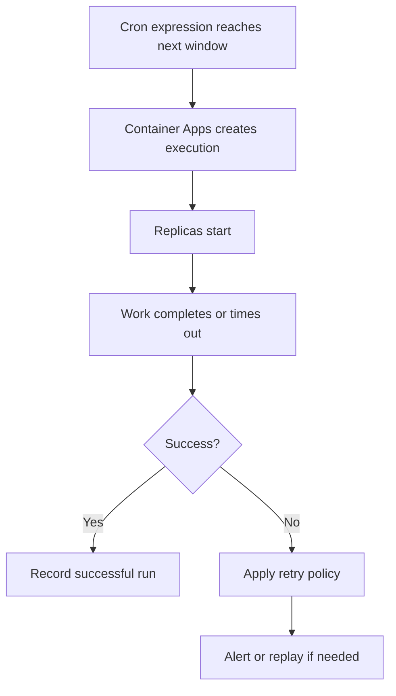

---
content_sources:
  diagrams:
    - id: scheduled-job-run-window
      type: flowchart
      source: self-generated
      justification: Synthesized from Microsoft Learn Jobs guidance and repository schedule examples while exact cron/TZ semantics were not re-quoted successfully.
      based_on:
        - https://learn.microsoft.com/azure/container-apps/jobs
        - https://learn.microsoft.com/azure/container-apps/scale-app#jobs
content_validation:
  status: pending_review
  last_reviewed: "2026-04-26"
  reviewer: ai-agent
  core_claims:
    - claim: "Azure Container Apps Jobs can run on a schedule."
      source: "https://learn.microsoft.com/azure/container-apps/jobs"
      verified: true
    - claim: "Scheduled job executions should use timeout and retry settings that fit the expected runtime."
      source: "https://learn.microsoft.com/azure/container-apps/jobs"
      verified: true
---

# Scheduled Jobs

Scheduled Jobs run at recurring times and are a good fit for nightly cleanup, hourly materialization, and business-window batch work.

## Main Content

### Creating a scheduled job

```bash
export RG="rg-aca-prod"
export ENVIRONMENT_NAME="aca-env-prod"
export JOB_NAME="job-nightly-reconcile"
export IMAGE_NAME="acrsharedprod.azurecr.io/jobs/nightly-reconcile:v1.0.0"

az containerapp job create \
  --name "$JOB_NAME" \
  --resource-group "$RG" \
  --environment "$ENVIRONMENT_NAME" \
  --trigger-type "Schedule" \
  --cron-expression "0 2 * * *" \
  --replica-timeout 3600 \
  --replica-retry-limit 1 \
  --image "$IMAGE_NAME"
```

### Cron expression examples

Use readable schedules and document them in the runbook:

| Intent | Example | Meaning |
|---|---|---|
| Hourly | `0 * * * *` | At minute 0 every hour |
| Nightly | `0 2 * * *` | 02:00 every day |
| Weekly | `0 6 * * 1` | 06:00 every Monday |
| Business-hours-only | `0 8-18 * * 1-5` | Top of the hour, weekdays, 08:00-18:00 |

!!! warning "Cron syntax needs current-source confirmation"
    Azure CLI examples for Container Apps Jobs use a five-field cron expression, and this guide follows that model.
    Confirm the latest Microsoft Learn syntax before depending on macros, seconds fields, or provider-specific extensions.

### Time zone handling

Schedule docs and operations runbooks should treat the job schedule as UTC unless you have explicitly verified another supported time-zone control in the current product documentation.

Recommended practice:

- Author cron in UTC.
- Document the equivalent local-business time.
- Re-check schedules before daylight-saving transitions and regional policy changes.

!!! warning "Time-zone configurability was not independently verified in this run"
    No authoritative quote was recovered for alternate time-zone configuration on Container Apps Jobs.
    Treat UTC as the safe default until you verify otherwise in current Microsoft Learn documentation.

### Overlap and missed runs

The platform schedule decides when a new execution is created, but your workload must still tolerate slow previous runs, manual replays, and retries.

Protect scheduled jobs with:

- Idempotent writes
- External locking when overlap would corrupt state
- Measured timeout values
- Alerting on missed windows and long-running executions

!!! warning "Overlap and skip behavior still needs a direct product quote"
    This page does not claim a guaranteed platform behavior for overlapping or skipped executions because the Microsoft Learn quote collection for that detail did not complete.
    Assume overlap is a design risk unless you have validated the current platform behavior in your environment.

### Scheduling checklist

Before production rollout, answer:

1. What is the allowed execution window?
2. Can a new run start while the previous run is still active?
3. What is the operational response if a window is missed?

### Scheduled execution flow

<!-- diagram-id: scheduled-job-run-window -->


## See Also

- [Container Apps Jobs Overview](index.md)
- [Execution Lifecycle](execution-lifecycle.md)
- [Job Design](../../best-practices/job-design.md)
- [Jobs Operations](../../operations/jobs/index.md)

## Sources

- [Jobs in Azure Container Apps (Microsoft Learn)](https://learn.microsoft.com/azure/container-apps/jobs)
- [Scale jobs in Azure Container Apps (Microsoft Learn)](https://learn.microsoft.com/azure/container-apps/scale-app#jobs)
