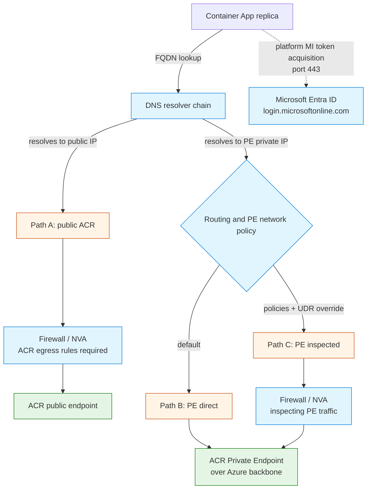

---
content_sources:
  diagrams:
  - id: acr-path-choice
    type: flowchart
    source: mslearn-adapted
    based_on:
    - https://learn.microsoft.com/azure/container-apps/firewall-integration
    - https://learn.microsoft.com/azure/container-registry/container-registry-private-endpoints
    - https://learn.microsoft.com/azure/private-link/private-endpoint-overview
content_validation:
  status: verified
  last_reviewed: '2026-06-05'
  reviewer: agent
  core_claims:
  - claim: When ACR is reached via a Private Endpoint, the AzureContainerRegistry service tag egress rule is not required for the image data path.
    source: https://learn.microsoft.com/azure/container-apps/firewall-integration
    verified: true
  - claim: Managed identity image pull still requires outbound access to Microsoft Entra ID even when ACR is reached via a Private Endpoint.
    source: https://learn.microsoft.com/azure/container-apps/use-azure-firewall
    verified: true
  - claim: An ACR Private Endpoint exposes one sub-resource (`registry`) whose NIC holds separate private IPs for the global/login endpoint and for each region's dedicated data endpoint, and all of those FQDNs must resolve to private IPs (as records inside `privatelink.azurecr.io`) for image pulls to traverse Private Link end to end.
    source: https://learn.microsoft.com/azure/container-registry/container-registry-private-endpoints
    verified: true
  - claim: A /32 Private Endpoint system route beats a 0.0.0.0/0 user-defined route, so Private Endpoint traffic bypasses a downstream firewall unless private endpoint network policies are enabled and an explicit UDR override is configured.
    source: https://learn.microsoft.com/azure/private-link/inspect-traffic-with-azure-firewall
    verified: true
---
# ACR Network Path Selection

Azure Container Apps can reach Azure Container Registry (ACR) through several different network paths. The path that traffic actually takes depends on DNS resolution, whether ACR exposes a Private Endpoint, and the routing and policy design in your VNet. Choosing — or accidentally landing on — the wrong path is one of the most common sources of image-pull failures and unexpected firewall cost.

## Why This Decision Matters

Container Apps replicas pull images on cold start, on scale-out to a node that does not already have the image cached, and on every new revision rollout. The path that pull traffic takes affects:

- Whether your firewall NVA (Azure Firewall or third-party) must be opened for ACR traffic at all.
- Whether your firewall sees and logs ACR pulls (relevant for compliance and forensics).
- Whether image-pull bandwidth is metered against the firewall throughput SKU.
- Which failures look like "ACR is down" but are actually DNS, routing, or identity issues.

This is not a one-time architecture decision. It is exercised every time a node has to fetch image layers from the registry, and it can silently change when someone links a Private DNS Zone, edits a route table, or rotates managed identity on the Container App.

!!! warning "The image path and the identity path are separate"
    Reaching ACR over a **Private Endpoint** removes the need for public egress on the ACR data path. **It does not remove the need for outbound access to Microsoft Entra ID** when the Container App uses managed identity for ACR pull. The platform must still acquire an Entra ID token before any image bytes are transferred. See the [`AzureActiveDirectory` requirement in Egress Control](egress-control.md#required-outbound-dependencies).

## Decision Table: Choose the CAE → ACR Path

| # | Scenario | DNS result (login / data) | Primary data path | Firewall rule needed for ACR? | Other outbound still required | When to choose | Main gotcha |
|---|---|---|---|---|---|---|---|
| A | Public ACR via firewall / NVA | Public IP / Public IP | Replica → Firewall → ACR public endpoint | Yes (ACR FQDNs or `AzureContainerRegistry` + `Storage.<region>` tags) | Entra ID for MI, `MicrosoftContainerRegistry`, platform DNS | Lift-and-shift, no Private Endpoint budget, short-lived environments | Firewall throughput becomes the image-pull bottleneck |
| B | ACR Private Endpoint, default routing | PE private IP / PE private IP | Replica → ACR Private Endpoint over Azure backbone | No (data path bypasses firewall by default) | Entra ID for MI, platform DNS | Production default; aligns with Microsoft baseline for ACR | Firewall logs will not show ACR pulls; treat that as expected, not as evidence of breakage |
| C | ACR Private Endpoint, forced inspection | PE private IP / PE private IP | Replica → Firewall (inspecting PE traffic) → ACR Private Endpoint | Yes (explicit allow for PE destination) | Entra ID for MI, platform DNS, SNAT planning for return symmetry | Regulated environments that mandate inspection of all egress, including Private Link | Requires private endpoint network policies and a deliberate UDR override; default routing does not give you this |
| D | Record-level zone authority misconfiguration | PE private IP / **NXDOMAIN or public IP** | Login over Private Link; data endpoint is unaddressable or silently flips public depending on resolver topology | Yes for data when it flips public; not applicable when it returns NXDOMAIN | Entra ID for MI | Never intentional — appears when the registry record (`<registry>`) exists in `privatelink.azurecr.io` but the per-region data record (`<registry>.<region>.data`) is missing | With default Azure DNS the missing record returns **NXDOMAIN** (zone is authoritative); with a custom DNS server that falls back to public on NXDOMAIN the data record silently flips to the public IP. See [the lab](../../troubleshooting/lab-guides/acr-network-path-record-split-brain.md). |
| E | Geo-replicated ACR missing regional data record | PE private IP for some regions, public IP for others | Mixed — depends on which region the client is pulling from | Yes if any data endpoint resolves public | Entra ID for MI | Never intentional — appears after adding a geo-replica without creating the matching `<registry>.<region>.data` record in `privatelink.azurecr.io` | Pulls work from one client region/environment and fail from another, depending on which data endpoint each client resolves |

Rows A, B, and C are intentional designs. Rows D and E are common misconfigurations that produce mixed behavior; this page documents them so they are recognizable, not so they are picked.

## Path Diagram

<!-- diagram-id: acr-path-choice -->

The solid arrows are the image-data paths. The dashed arrow is the identity path: it is the platform acquiring the registry pull token on behalf of the Container App's managed identity. It is present in every scenario where the Container App uses managed identity to pull from ACR, and it is **not** routed through the Private Endpoint, regardless of how the ACR data path is configured.

## Path A: Public ACR via Firewall / NVA

ACR is reached via its public FQDN (`<registry>.azurecr.io` and the regional data endpoint `<registry>.<region>.data.azurecr.io`), and replicas exit the VNet through a firewall NVA — typically Azure Firewall or a third-party NVA — that you have placed in the egress path. (NAT Gateway and default Azure-provided outbound are also valid public-egress designs, but they do not give you the rule-based control this section is about; see [Egress Control](egress-control.md) for those variants.)

What must be open on the firewall:

- ACR login server FQDN (or the `AzureContainerRegistry` service tag).
- Regional storage for image layers (`Storage.<Region>` service tag, or the dedicated data-endpoint FQDN if dedicated data endpoints are enabled on the registry).
- `MicrosoftContainerRegistry` and `AzureFrontDoor.FirstParty` for system images.
- `AzureActiveDirectory` on `443` for managed identity token acquisition.
- Platform DNS via `168.63.129.16:53` (or the `AzurePlatformDNS` service tag) where applicable to the DNS topology in use.

Use this path when the deployment cannot justify the cost or complexity of a Private Endpoint, when ACR is intentionally public for cross-tenant access, or when a non-production environment needs the simplest possible egress topology.

The main downside is that every image-pull byte traverses the firewall. For large images or rapid scale-out, this turns the firewall throughput SKU into the binding constraint on cold-start performance.

When ACR is locked down with a public-network firewall (`networkRuleSet.defaultAction = Deny` plus an `ipRules` allowlist), the value that must appear in the allowlist is the **firewall's SNAT public IP**, not the Container Apps environment's static outbound IP — the egress flow leaves through the firewall, so ACR sees the firewall PIP as the client. See [the lab](../../troubleshooting/lab-guides/acr-network-path-firewall-allowlist.md) for a falsification experiment that removes the firewall PIP from `ipRules` mid-deployment and captures the resulting `DENIED` message (with the firewall PIP echoed back in the error body) directly from Container Apps system logs.

## Path B: ACR Private Endpoint with Default Routing

ACR exposes a Private Endpoint in a subnet reachable from the Container Apps VNet (same VNet, peered VNet, or via VNet integration). The ACR Private DNS Zone is `privatelink.azurecr.io`, and it must contain a record for the registry login endpoint (`<registry>`) **and** a record for each region's dedicated data endpoint (`<registry>.<region>.data`). When both records resolve to the corresponding PE NIC private IPs, replicas reach ACR directly over the Azure backbone with default routing — the firewall is not on the path.

This is the recommended default for production Container Apps that pull from ACR. It removes the firewall from the image-pull data path, gives ACR pulls the lowest practical latency, and keeps the firewall SKU sized for application egress rather than image traffic.

What still has to work outside ACR:

- Managed identity outbound to Microsoft Entra ID on `443`.
- Platform system dependencies (`MicrosoftContainerRegistry`, platform DNS).
- The `privatelink.azurecr.io` zone must be linked to the VNet that performs the resolution, and it must hold **both** the `<registry>` record for the login endpoint and a `<registry>.<region>.data` record for every region whose data endpoint will be hit. If the data record is missing or stale, you slide into Scenario D.

Operationally, expect ACR pulls to **not** appear in firewall logs in this configuration. Absence in firewall logs is not evidence of a broken pull; it is evidence that the Private Endpoint path is working as designed.

## Path C: ACR Private Endpoint with Forced Inspection

Some regulated environments require all egress, including Private Link traffic, to traverse a firewall NVA for inspection and logging. This is not the default Private Endpoint behavior and must be designed deliberately.

Two conditions must both be true to inspect Private Endpoint traffic:

1. **Private endpoint network policies** must be enabled on the subnet that hosts the Private Endpoint, so that UDRs can apply to PE traffic.
2. **A user-defined route** must redirect the destination prefix that contains the PE private IP to the firewall NVA. A `0.0.0.0/0` default route is **not** sufficient on its own, because the system route for the Private Endpoint is more specific.

When this is in place, the firewall NVA must also be configured to allow the destination, and SNAT and return symmetry must be planned so that the response from ACR returns through the same firewall instance. Asymmetric routing of Private Link traffic through an NVA is a well-known source of partial-success failures.

Use this path only when an explicit compliance or governance requirement forces it. The cost is the same throughput overhead as Path A, plus the operational burden of keeping PE network policies, UDRs, and NVA rules in sync. The [ACR Network Path C lab](../../troubleshooting/lab-guides/acr-network-path-pe-forced-inspection.md) reproduces this exactly: it deploys a Container Apps environment, an Azure Firewall, and an ACR Private Endpoint with `privateEndpointNetworkPolicies=Enabled` and explicit `/32` UDR routes for both PE NIC IPs (login and data endpoints), then removes only the `/32` routes mid-deployment and shows that the pull still succeeds while `AZFWApplicationRule` records zero new rows for the ACR FQDN — falsifying the "default route catches PE traffic" assumption while proving that image-pull success is not a reliable signal of firewall inspection state.

## DNS Patterns That Decide the Path

The same Container Apps environment can land on Path A, Path B, Path C, Scenario D, or Scenario E depending entirely on how DNS resolution is wired up.

| DNS pattern | Behavior with ACR FQDNs | Risk |
|---|---|---|
| Azure-provided DNS (no custom DNS) | Uses Azure DNS; Private DNS Zones linked to the VNet are consulted automatically. | Lowest operational risk for Path B. |
| Custom DNS via Azure Private DNS Resolver | Replicas use the resolver inbound endpoint as recursive DNS; forwarder rules in the resolver decide whether queries hit Azure DNS or external DNS. | Forwarder ruleset that does not cover `privatelink.azurecr.io` = the entire ACR namespace resolves publicly even though a PE exists. This is Scenario E. |
| Custom DNS via a customer-managed DNS server on a VM (for example, Windows DNS or AD-integrated DNS) | Replicas use the VM as recursive DNS; the VM must conditionally forward `privatelink.azurecr.io` to Azure DNS at `168.63.129.16` so that both the registry record and the per-region data record resolve via the Azure Private DNS zone. | If the VM has no conditional forward for `privatelink.azurecr.io` at all, every ACR name resolves publicly — that is Scenario E (DNS-topology failure). If the conditional forward is in place but the underlying zone is missing the data-endpoint record, **Azure DNS returns NXDOMAIN** (the linked zone is authoritative for that namespace); whether that NXDOMAIN reaches the application as a DNS error or silently flips to a public IP depends on whether the custom DNS server is configured to fall back to public DNS on NXDOMAIN — that is Scenario D (record-level zone-authority failure). Single-VM DNS is also a reliability single point of failure. |
| Public resolvers (`8.8.8.8`, `1.1.1.1`, on-prem caching) | Returns ACR public IPs even when a Private Endpoint exists. | Forces Path A and silently bypasses the Private Endpoint. This is a special case of Scenario E where the "forwarder" is simply the public internet. |

For Container Apps that integrate into an existing customer network, the Azure-native recommendation is **Azure Private DNS Resolver** in the hub VNet with the Container Apps VNet linked to `privatelink.azurecr.io` (and any other relevant `privatelink.*` Private DNS Zones). A customer-managed DNS server on a VM is a supported pattern but should forward `privatelink.*` queries to Azure DNS rather than attempt to host those zones locally.

## ACR-Specific Gotchas

- **One sub-resource, multiple endpoints.** ACR's Private Endpoint exposes a single `registry` sub-resource, but the PE NIC holds separate private IPs for the global/login endpoint and for each region's dedicated data endpoint. The corresponding records (`<registry>` and `<registry>.<region>.data`) must both exist in `privatelink.azurecr.io` for Path B to actually be Path B end to end. Resolving only the login record privately is **Scenario D** (record-level zone-authority failure), not Path B. The [ACR Network Path D lab](../../troubleshooting/lab-guides/acr-network-path-record-split-brain.md) reproduces this exactly: it deletes only the `<registry>.<region>.data` A record from `privatelink.azurecr.io` and shows the 4-layer (DNS → TCP → TLS → HTTP) probe flip from `topology_class=both_private` (registry private/HTTP 401, data private/HTTP 403) to `topology_class=data_nxdomain` (registry stays private/HTTP 401, data returns NXDOMAIN as `socket.gaierror: [Errno -2] Name or service not known`). The lab also documents that true "registry private, data public" split-brain only appears in a different topology — a custom DNS server (BIND with views, systemd-resolved with multi-domain fallback, etc.) configured to fall back to public DNS on NXDOMAIN. In the default Azure DNS topology that most production environments run, the linked Private DNS Zone is **authoritative** for that namespace and a missing record returns NXDOMAIN, not a public IP.
- **Scenario E is the DNS-topology failure class.** When a custom DNS server (Private DNS Resolver, dnsmasq on a VM, Windows DNS, on-prem cache, etc.) sits between Container Apps and Azure DNS but does **not** forward `privatelink.azurecr.io` to Azure DNS at `168.63.129.16`, the entire ACR namespace resolves publicly even though the Private Endpoint and Private DNS Zone are correctly provisioned. The PE plumbing is healthy; the resolver path simply never asks Azure DNS about the private zone. Geo-replication missing one region's `<registry>.<region>.data` record is a **special case of Scenario E** scoped to a single regional endpoint rather than the whole namespace.
- **In Azure Container Apps, Scenarios D and E may surface at the workload layer first.** Both record-level (Scenario D) and resolver-topology (Scenario E) DNS failures can surface as workload-path failures rather than as `ImagePullBackOff`, because the platform-managed image puller can continue to succeed on an already-pulled image while application and runtime DNS follow the broken path. The reproduction in the [ACR Network Path E lab](../../troubleshooting/lab-guides/acr-network-path-dns-forwarder-bypass.md) shows the revision staying `Healthy` while `socket.getaddrinfo("<acr>.azurecr.io")` from inside the replica returns the public registry IP after the dnsmasq upstream is swapped from Azure DNS to `8.8.8.8`. The reproduction in the [ACR Network Path D lab](../../troubleshooting/lab-guides/acr-network-path-record-split-brain.md) shows the same operator-facing silence after deleting only the `<registry>.<region>.data` record: revision stays `Healthy`, no platform pull events, but the 4-layer in-replica probe flips to `topology_class=data_nxdomain` with `socket.gaierror` on the data endpoint. Treat pull-path health as **not** a reliable early-warning signal for DNS failures (record-level or topology-level) in Container Apps; instrument workload-side DNS resolution explicitly.
- **Successful app startup is not proof of a working ACR path.** Container Apps caches image layers on the underlying nodes. An app that started yesterday on a cached image will keep running even if the current ACR path is broken. The next cold start, scale-out to an uncached node, or revision rollout is when the real path is exercised.
- **The Private Endpoint NIC has a private IP from its own subnet.** When you read `100.x.x.x`-style addresses inside a replica's network trace, those are platform-internal observed addresses, not the authoritative IP of the ACR Private Endpoint itself. Design discussions should anchor on the PE NIC's private IP, not on overlay-NAT addresses seen from inside the replica.
- **A `0.0.0.0/0` default route does not catch Private Endpoint traffic.** This is the single most common reason "my firewall rule didn't fire for ACR." The system route for the Private Endpoint is `/32` and wins by longest prefix match. Forcing inspection (Path C) requires the explicit UDR plus PE network policies combination described above.
- **Managed identity is the recommended ACR pull authentication.** It is also the reason `AzureActiveDirectory` outbound is still required even with a Private Endpoint. There is no way to keep MI pull working while blocking Entra ID egress.

## What This Page Does Not Cover

- Step-by-step CLI commands to create an ACR Private Endpoint, Private DNS Zone, or VNet link. See the runbook in [Image Pull and Registry](../../operations/image-pull-and-registry/index.md) and the Microsoft Learn sources below.
- Firewall rule cookbooks for specific third-party NVAs. The Azure Firewall integration page on Microsoft Learn covers Azure Firewall directly; third-party NVAs follow the same destination and SNAT model but vary in rule syntax.
- Inbound Private Endpoints on the Container Apps environment itself. That is a different topic; see [Private Endpoints](private-endpoints.md).
- DNS forwarder design for Private DNS Resolver in detail. See [On-Premises DNS to Internal ACA](../../operations/deployment/internal-ingress-on-prem-dns.md) for a validated hub-spoke pattern.

## See Also

- [Private Endpoints](private-endpoints.md)
- [Egress Control](egress-control.md)
- [VNet Integration](vnet-integration.md)
- [Image Pull and Registry](../../operations/image-pull-and-registry/index.md)
- [On-Premises DNS to Internal ACA](../../operations/deployment/internal-ingress-on-prem-dns.md)
- [UDR and NSG Egress Blocked](../../troubleshooting/playbooks/networking-advanced/udr-nsg-egress-blocked.md)
- [Private Endpoint DNS Failure](../../troubleshooting/playbooks/networking-advanced/private-endpoint-dns-failure.md)
- [ACR Pull Failure Lab](../../troubleshooting/lab-guides/acr-pull-failure.md)
- [ACR Network Path B Lab — PE Direct](../../troubleshooting/lab-guides/acr-network-path-pe-direct.md)
- [ACR Network Path D Lab — Record-Level Split-Brain](../../troubleshooting/lab-guides/acr-network-path-record-split-brain.md)
- [ACR Network Path A Lab — Firewall Allowlist](../../troubleshooting/lab-guides/acr-network-path-firewall-allowlist.md)
- [ACR Network Path E Lab — DNS Forwarder Bypass](../../troubleshooting/lab-guides/acr-network-path-dns-forwarder-bypass.md)
- [ACR Network Path C Lab — PE Forced Inspection](../../troubleshooting/lab-guides/acr-network-path-pe-forced-inspection.md)

## Sources

- [Use Azure Firewall with Azure Container Apps (Microsoft Learn)](https://learn.microsoft.com/azure/container-apps/use-azure-firewall)
- [Firewall integration in Azure Container Apps (Microsoft Learn)](https://learn.microsoft.com/azure/container-apps/firewall-integration)
- [Configure a private link for an Azure Container Registry (Microsoft Learn)](https://learn.microsoft.com/azure/container-registry/container-registry-private-endpoints)
- [Configure dedicated data endpoints for Azure Container Registry (Microsoft Learn)](https://learn.microsoft.com/azure/container-registry/container-registry-dedicated-data-endpoints)
- [Configure rules to access an Azure Container Registry behind a firewall (Microsoft Learn)](https://learn.microsoft.com/azure/container-registry/container-registry-firewall-rules)
- [Use Azure Firewall to inspect Private Endpoint traffic (Microsoft Learn)](https://learn.microsoft.com/azure/private-link/inspect-traffic-with-azure-firewall)
- [Manage network policies for Private Endpoints (Microsoft Learn)](https://learn.microsoft.com/azure/private-link/disable-private-endpoint-network-policy)
- [What is a private endpoint? (Microsoft Learn)](https://learn.microsoft.com/azure/private-link/private-endpoint-overview)
