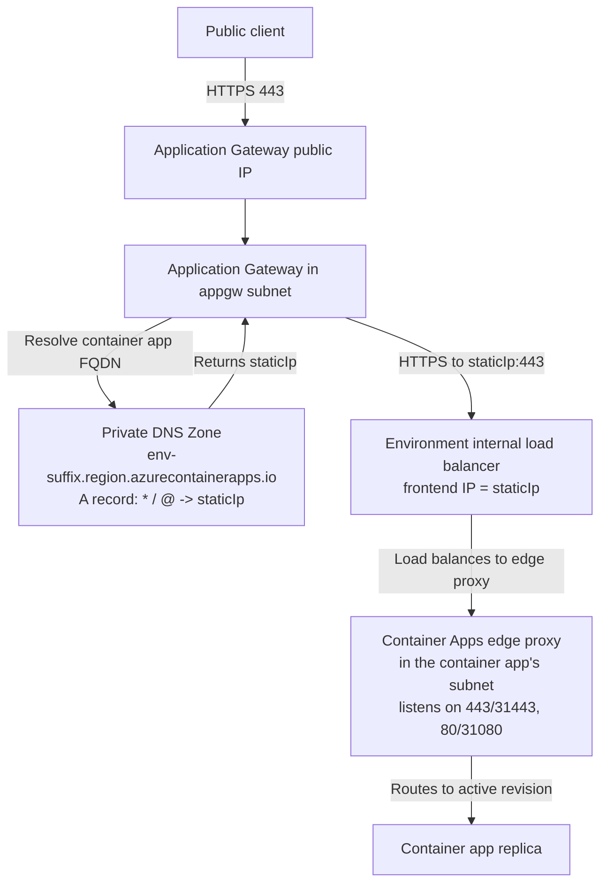
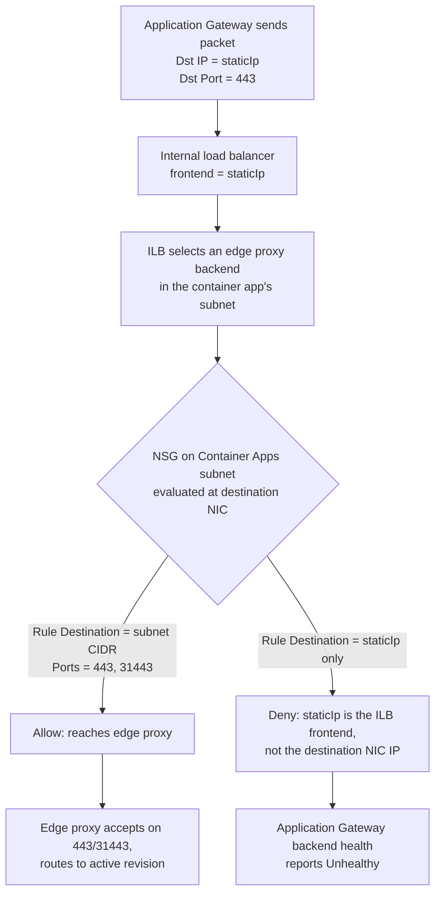

# Application Gateway Integration with an Internal Container Apps Environment

Fronting an internal Container Apps environment with Azure Application Gateway is a common enterprise pattern: Application Gateway (with or without WAF) provides the public edge, DNS, TLS, and header rewrites; the Container Apps environment stays internal to the virtual network. Getting this pattern to work end-to-end forces two decisions that regularly get answered incorrectly:

1. What role does the environment `staticIp` actually play?
2. What does the inbound NSG on the Container Apps subnet need to allow, and against which destination?

This page answers both. If you already have Application Gateway configured and the health probe is failing with the backend showing `Unhealthy`, jump to the [AppGW to Internal ACA NSG Destination playbook](../../troubleshooting/playbooks/ingress-and-networking/appgw-to-internal-aca-nsg-destination.md).

## Overview

The reference topology is documented in [Protect Azure Container Apps with Application Gateway and Web Application Firewall (WAF)](https://learn.microsoft.com/en-us/azure/container-apps/waf-app-gateway). At a high level:

- Application Gateway lives in its own subnet inside the same virtual network as the Container Apps environment.
- The Container Apps environment is created as internal (`internal: true` / `--internal-only true`).
- A Private DNS Zone named after the environment `defaultDomain` (for example, `<env-suffix>.<region>.azurecontainerapps.io`) is created and linked to the virtual network.
- Wildcard (`*`) and apex (`@`) A records in that Private DNS Zone point to the environment `staticIp`.
- Application Gateway's backend pool targets the container app's FQDN, and Application Gateway resolves that FQDN to `staticIp` through the linked Private DNS Zone.

## Architecture

<!-- diagram-id: appgw-to-internal-aca-architecture -->


Two things in this diagram matter for NSG design:

- Application Gateway sends the packet with destination IP set to `staticIp` (the ILB frontend).
- The Container Apps subnet NSG evaluates the packet **at the edge proxy NIC**, not at the ILB. That distinction is the source of the most common misconfiguration in this topology.

## Environment `staticIp` in an internal environment

For an internal Container Apps environment, `properties.staticIp` is the environment's ingress virtual IP. Microsoft Learn documents it as the value you write into the wildcard A record in the Private DNS Zone that fronts the environment. Retrieve it as follows:

```bash
az containerapp env show \
  --name "$ACA_ENV_NAME" \
  --resource-group "$RG" \
  --query "properties.staticIp" \
  --output tsv
```

| Command | Why it is used |
|---|---|
| `az containerapp env show ...` | Retrieves the environment properties, including `staticIp`, `defaultDomain`, and `vnetConfiguration`. |

For the purpose of Application Gateway backend pool configuration, do not target `staticIp` directly — target the container app FQDN and let Application Gateway resolve it to `staticIp` through the linked Private DNS Zone. `staticIp` is what appears on the wire as the packet destination (after DNS resolution), and it is the value written into the Private DNS A record for the environment default domain, but it is **not** the address an NSG evaluates against on the Container Apps subnet. That distinction is covered next.

## How workload-profile NSG rules are evaluated

In a workload profiles environment, the Container Apps subnet is a delegated subnet whose network interfaces belong to the edge proxy fleet behind the environment's internal load balancer. When Application Gateway sends a packet to `staticIp:443`, the following happens:

1. The internal load balancer receives the packet on its frontend IP (`staticIp`).
2. The load balancer distributes the connection to one of the edge proxy backends in the container app's subnet.
3. The Azure platform NSG evaluation happens **at the destination NIC** — that is, at the selected edge proxy instance inside the Container Apps subnet, not at the ILB frontend.

The Azure Virtual Network documentation states this explicitly for any workload behind a load-balanced pool: for load-balanced pools, "Destination port and address are for the destination computer, not the load balancer." That is why the Microsoft Learn NSG guidance for a workload profiles Container Apps environment uses **the container app's subnet** — not `staticIp` — as the Destination.

<!-- diagram-id: nsg-evaluation-behind-ilb -->


The rule at the bottom-right of the diagram — Destination = `staticIp` only — is the classic misconfiguration. It appears logically correct because Application Gateway is sending traffic to `staticIp`, but the NSG never sees `staticIp` as the destination once the load balancer has selected a backend. This is by design and matches the platform behavior documented for any load-balanced Azure workload.

!!! warning "Consumption-only environments follow a different rule"
    In the legacy **Consumption-only** environment type, the Microsoft Learn NSG table lists both `Your container app's subnet` and `The staticIP value of your Container Apps environment` as valid Destination values for the client-IP HTTP/HTTPS rule. In a **workload profiles** environment, only `Your container app's subnet` appears in the Destination column. If you are migrating from Consumption-only to workload profiles and reusing your old NSG, expect this exact rule to break.

## Required inbound NSG rules on the Container Apps subnet (workload profiles)

The Microsoft Learn [firewall-integration reference for workload profiles](https://learn.microsoft.com/en-us/azure/container-apps/firewall-integration?tabs=workload-profiles) documents the following inbound rules. Every rule below uses **the container app's subnet** as the Destination.

| Rule | Protocol | Source | Source ports | Destination | Destination ports | Why |
|---|---|---|---|---|---|---|
| Client HTTPS | TCP | Client subnet or CIDR (for AppGW: the Application Gateway subnet) | `*` | Container app's subnet | `443`, `31443` | `31443` is the port on which the Container Apps environment edge proxy responds to HTTPS traffic behind the internal load balancer. |
| Client HTTP | TCP | Client subnet or CIDR | `*` | Container app's subnet | `80`, `31080` | `31080` is the port on which the Container Apps environment edge proxy responds to HTTP traffic behind the internal load balancer. |
| Load balancer health probes | TCP | `AzureLoadBalancer` service tag | `*` | Container app's subnet | `30000-32767` | Allows Azure Load Balancer to probe backend pools. Azure NSG has a default `AllowAzureLoadBalancerInBound` rule at priority 65001 that already permits this path, but a restrictive custom NSG can shadow it with higher-priority Deny rules; adding this rule at a lower priority (200-500) guarantees the probe path stays open regardless of custom rule ordering. |
| TCP apps (only if used) | TCP | Client subnet or CIDR | `*` | Container app's subnet | Exposed TCP ports and `30000-32767` | Applies only to TCP ingress apps. Not required for HTTP-only workloads. |

The workload-profile NSG table in Microsoft Learn explicitly notes: "You need the full range when creating your container apps as a port within the range is dynamically allocated. After you create the container apps, the required ports are two immutable, static values, and you can update your NSG rules." In practice, most operators keep the `30000-32767` range in place because the two static values are not documented as stable across every deployment path.

## Recommended AppGW-facing inbound NSG rule (concrete example)

The following example scopes Source to the Application Gateway subnet and Destination to the Container Apps subnet CIDR. Replace the CIDRs with your actual subnet ranges.

```bash
# Example values — replace with your subnets.
APPGW_SUBNET_CIDR="10.0.1.0/24"
ACA_SUBNET_CIDR="10.0.2.0/23"

az network nsg rule create \
  --name "allow-appgw-to-aca-https" \
  --nsg-name "$ACA_SUBNET_NSG_NAME" \
  --resource-group "$RG" \
  --priority 200 \
  --direction Inbound \
  --access Allow \
  --protocol Tcp \
  --source-address-prefixes "$APPGW_SUBNET_CIDR" \
  --source-port-ranges "*" \
  --destination-address-prefixes "$ACA_SUBNET_CIDR" \
  --destination-port-ranges "443" "31443"

az network nsg rule create \
  --name "allow-azure-lb-probes-to-aca" \
  --nsg-name "$ACA_SUBNET_NSG_NAME" \
  --resource-group "$RG" \
  --priority 210 \
  --direction Inbound \
  --access Allow \
  --protocol Tcp \
  --source-address-prefixes "AzureLoadBalancer" \
  --source-port-ranges "*" \
  --destination-address-prefixes "$ACA_SUBNET_CIDR" \
  --destination-port-ranges "30000-32767"
```

| Command | Why it is used |
|---|---|
| `az network nsg rule create ... allow-appgw-to-aca-https` | Allows HTTPS from the Application Gateway subnet to reach the edge proxy on the two ports the Container Apps platform documents (`443`, `31443`). |
| `az network nsg rule create ... allow-azure-lb-probes-to-aca` | Allows the environment's internal load balancer to probe edge-proxy backends. The default `AllowAzureLoadBalancerInBound` rule at priority 65001 already permits this path; this explicit low-priority rule is a defense-in-depth measure so the probe still succeeds even if a higher-priority custom Deny rule is later introduced. |

If you need the HTTP path as well (for redirects or health checks), add a third rule using `80` and `31080`. Do not use `staticIp` as the Destination.

## Private DNS Zone and Application Gateway backend

Application Gateway needs a way to resolve the container app FQDN to `staticIp`. The Microsoft Learn walkthrough uses a Private DNS Zone whose name matches the environment `defaultDomain`:

```bash
# Retrieve the two values you need.
STATIC_IP=$(az containerapp env show \
  --name "$ACA_ENV_NAME" \
  --resource-group "$RG" \
  --query "properties.staticIp" \
  --output tsv)

DEFAULT_DOMAIN=$(az containerapp env show \
  --name "$ACA_ENV_NAME" \
  --resource-group "$RG" \
  --query "properties.defaultDomain" \
  --output tsv)

# Create the Private DNS Zone using the environment default domain as the zone name.
az network private-dns zone create \
  --resource-group "$RG" \
  --name "$DEFAULT_DOMAIN"

# Wildcard A record so every app under the environment resolves to staticIp.
az network private-dns record-set a add-record \
  --resource-group "$RG" \
  --zone-name "$DEFAULT_DOMAIN" \
  --record-set-name "*" \
  --ipv4-address "$STATIC_IP"

# Apex A record for the environment default domain itself.
az network private-dns record-set a add-record \
  --resource-group "$RG" \
  --zone-name "$DEFAULT_DOMAIN" \
  --record-set-name "@" \
  --ipv4-address "$STATIC_IP"

# Link the zone to the VNet so Application Gateway's DNS resolves the record.
az network private-dns link vnet create \
  --resource-group "$RG" \
  --zone-name "$DEFAULT_DOMAIN" \
  --name "link-appgw-vnet" \
  --virtual-network "$VNET_ID" \
  --registration-enabled false
```

| Command | Why it is used |
|---|---|
| `az containerapp env show ... --query "properties.staticIp"` | Reads the environment ingress IP that the Private DNS Zone A record must point to. |
| `az containerapp env show ... --query "properties.defaultDomain"` | Reads the environment default domain, which is the required Private DNS Zone name. |
| `az network private-dns zone create ...` | Creates the Private DNS Zone using the environment default domain as the zone name. |
| `az network private-dns record-set a add-record ... --record-set-name "*"` | Wildcard record so every container app FQDN under the environment resolves to `staticIp`. |
| `az network private-dns record-set a add-record ... --record-set-name "@"` | Apex record for the environment default domain itself. |
| `az network private-dns link vnet create ...` | Links the zone to the VNet so Application Gateway resolves the record through Azure-provided DNS. |

## Application Gateway backend configuration essentials

Two backend-side settings frequently interact with the NSG behavior above and belong on the same review checklist:

| Setting | Recommended value | Why |
|---|---|---|
| Backend pool target | The container app FQDN (for example, `myapp.<default-domain>`) | Application Gateway resolves this to `staticIp` through the linked Private DNS Zone. Do not target `staticIp` directly with `IP address` target type — you lose the ability to use HTTPS SNI and host-header handling cleanly. |
| Backend protocol | HTTPS | Terminating TLS at Application Gateway and re-encrypting to the edge proxy on `443` keeps end-to-end encryption. |
| Backend port | `443` (or `80` for HTTP-only tests) | Application Gateway does not need to target `31443` directly; it targets `443` on `staticIp` and the environment ILB forwards to the edge proxy on `31443` internally. The Container Apps subnet NSG must still allow both `443` and `31443` because the edge proxy NIC receives on `31443`. |
| Override with new host name | `Pick host name from backend target` | The container app FQDN is required for the edge proxy to route to the correct revision. Without this, the edge proxy returns `404`. |
| Health probe protocol / path | HTTPS to a path that the app actually returns 2xx or 3xx on | If the app returns 404 on `/`, configure a probe path such as `/healthz`. Application Gateway defaults to marking a backend `Unhealthy` on any non-matching status. |
| Use custom probe | Recommended `Yes` for anything beyond a trivial demo | The default probe pings `/` and requires 200-399. Most real apps need an explicit custom probe. |

## Private Link path (alternative)

The Microsoft Learn walkthrough also documents an [Application Gateway Private Link](https://learn.microsoft.com/en-us/azure/container-apps/waf-app-gateway) option that establishes a private-link connection from Application Gateway to the internal environment. This is an additional layer, not a replacement for the NSG rules above: even with Application Gateway Private Link enabled, the packet still lands on the edge proxy NIC inside the Container Apps subnet, and the inbound NSG still evaluates against **the container app's subnet**, not `staticIp`.

## Common Pitfalls

| Pitfall | Symptom | Fix |
|---|---|---|
| NSG inbound rule uses Destination = `staticIp` only | Application Gateway backend shows `Unhealthy`, `curl` from Application Gateway subnet times out | Change Destination to the container app's subnet CIDR; keep Source scoped to the Application Gateway subnet. See the [playbook](../../troubleshooting/playbooks/ingress-and-networking/appgw-to-internal-aca-nsg-destination.md). |
| NSG allows `443` but not `31443` | Application Gateway health probes and client traffic through Application Gateway fail because the edge proxy behind the internal load balancer receives HTTPS on `31443` (or HTTP on `31080`), which the NSG must also allow. Symptom is consistent, not intermittent. | Add `31443` (and `31080` for HTTP) to the Destination ports list. |
| Restrictive custom NSG shadows the default `AllowAzureLoadBalancerInBound` rule (priority 65001) with higher-priority Deny rules, or the environment ILB probe path is otherwise blocked | Every backend is marked `Unhealthy` regardless of application state | Add an explicit Allow rule with Source = `AzureLoadBalancer`, Destination = the container app's subnet CIDR, Destination ports = `30000-32767`, at a priority lower than any custom Deny rule (typically 200-500). |
| Application Gateway backend targets an IP address rather than the FQDN | Edge proxy returns `404` (`Container App does not exist`) because the SNI / Host header does not match a bound app | Target the container app FQDN in the backend pool and enable `Pick host name from backend target`. |
| Private DNS Zone not linked to the VNet Application Gateway is in | Application Gateway resolves the FQDN to a public IP, or fails to resolve at all | Create a VNet link on the Private DNS Zone for the VNet that hosts Application Gateway. |
| Reusing a Consumption-only NSG on a new workload-profiles environment | Rules that named `staticIp` as Destination silently stop matching traffic | Rewrite the client-IP rules to use the container app's subnet as Destination; keep `staticIp` only in the Private DNS A record for the environment default domain (the Application Gateway backend pool should target the container app FQDN, and the backend HTTP setting or probe host header should be the FQDN — not `staticIp`). |

## See Also

- [Ingress in Azure Container Apps](ingress.md)
- [VNet Integration](vnet-integration.md)
- [Private Endpoints](private-endpoints.md)
- [Egress Control](egress-control.md)
- [Environment Networking and CIDR](../environments/networking-and-cidr.md)
- [On-Premises DNS to ACA Internal Environment via Custom Domain](../../operations/deployment/internal-ingress-on-prem-dns.md)
- [AppGW to Internal ACA: NSG Destination Pinned to staticIp Fails (Playbook)](../../troubleshooting/playbooks/ingress-and-networking/appgw-to-internal-aca-nsg-destination.md)
- [Networking Best Practices](../../best-practices/networking.md)

## Sources

- [Protect Azure Container Apps with Application Gateway and Web Application Firewall (WAF) (Microsoft Learn)](https://learn.microsoft.com/en-us/azure/container-apps/waf-app-gateway)
- [Securing a Virtual Network in Azure Container Apps (Microsoft Learn)](https://learn.microsoft.com/en-us/azure/container-apps/firewall-integration?tabs=workload-profiles)
- [Provide an internal environment for Azure Container Apps (Microsoft Learn)](https://learn.microsoft.com/en-us/azure/container-apps/vnet-custom-internal)
- [Networking in Azure Container Apps environment (Microsoft Learn)](https://learn.microsoft.com/en-us/azure/container-apps/networking)
- [Network security groups (Microsoft Learn)](https://learn.microsoft.com/en-us/azure/virtual-network/network-security-groups-overview)
- [What is Azure Application Gateway? (Microsoft Learn)](https://learn.microsoft.com/en-us/azure/application-gateway/overview)
