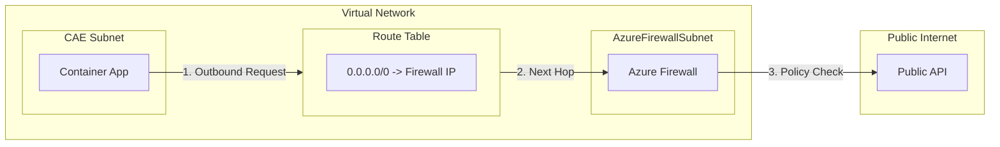
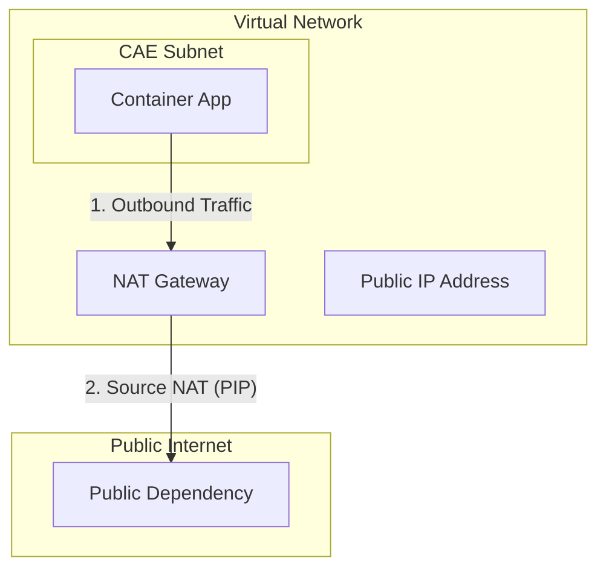

# Egress Control

Control outbound traffic from Container Apps.

## Default Behavior

By default, Container Apps can access:
- Public internet
- Azure services via public endpoints
- Resources in the same VNet (if VNet integrated)

## User-Defined Routes (UDR)

Route outbound traffic through Azure Firewall or NVA:



```bicep
resource routeTable 'Microsoft.Network/routeTables@2023-05-01' = {
  name: 'rt-containerapp'
  location: location
  properties: {
    routes: [
      {
        name: 'default-route'
        properties: {
          addressPrefix: '0.0.0.0/0'
          nextHopType: 'VirtualAppliance'
          nextHopIpAddress: firewallPrivateIp
        }
      }
    ]
  }
}
```

## Azure Firewall Rules

Allow required outbound traffic:

### NAT Gateway Architecture



```bicep
resource firewallPolicy 'Microsoft.Network/firewallPolicies@2023-05-01' = {
  name: 'fw-policy'
  properties: {
    sku: { tier: 'Standard' }
  }
}
```

## Azure Firewall Rules

Allow required outbound traffic:

```bicep
resource firewallPolicy 'Microsoft.Network/firewallPolicies@2023-05-01' = {
  name: 'fw-policy'
  properties: {
    sku: { tier: 'Standard' }
  }
}

resource appRuleCollection 'Microsoft.Network/firewallPolicies/ruleCollectionGroups@2023-05-01' = {
  parent: firewallPolicy
  name: 'container-apps-rules'
  properties: {
    priority: 100
    ruleCollections: [
      {
        ruleCollectionType: 'FirewallPolicyFilterRuleCollection'
        name: 'allow-external-apis'
        priority: 100
        action: { type: 'Allow' }
        rules: [
          {
            ruleType: 'ApplicationRule'
            name: 'allow-jsonplaceholder'
            protocols: [{ protocolType: 'Https', port: 443 }]
            targetFqdns: ['jsonplaceholder.typicode.com']
            sourceAddresses: ['10.0.0.0/23']
          }
        ]
      }
    ]
  }
}
```

## NAT Gateway for Static Outbound IP

Assign static IP for outbound traffic:

```bicep
resource natGateway 'Microsoft.Network/natGateways@2023-05-01' = {
  name: 'nat-containerapp'
  location: location
  sku: { name: 'Standard' }
  properties: {
    publicIpAddresses: [{ id: publicIp.id }]
  }
}

resource subnet 'Microsoft.Network/virtualNetworks/subnets@2023-05-01' = {
  name: 'snet-containerapp'
  properties: {
    addressPrefix: '10.0.0.0/23'
    natGateway: { id: natGateway.id }
  }
}
```

## Verify Outbound IP

```python
import requests

@app.route('/api/my-ip')
def my_ip():
    # Use standard service to verify public outbound IP
    response = requests.get('https://api.ipify.org?format=json')
    return response.json()  # Returns NAT Gateway's public IP
```

## See Also
- [VNet Integration](vnet-integration.md)
- [Private Endpoints](private-endpoints.md)
- [Service-to-Service Communication](service-to-service.md)

## References
- [Outbound FQDN requirements in Azure Container Apps (Microsoft Learn)](https://learn.microsoft.com/azure/container-apps/networking#outbound-fqdn-requirements)
- [User-defined routes in Azure Container Apps (Microsoft Learn)](https://learn.microsoft.com/azure/container-apps/user-defined-routes)
