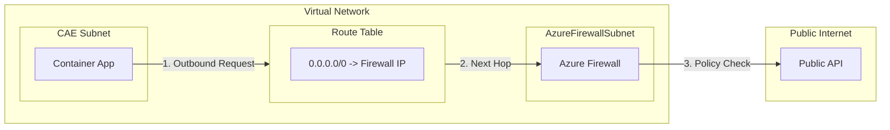
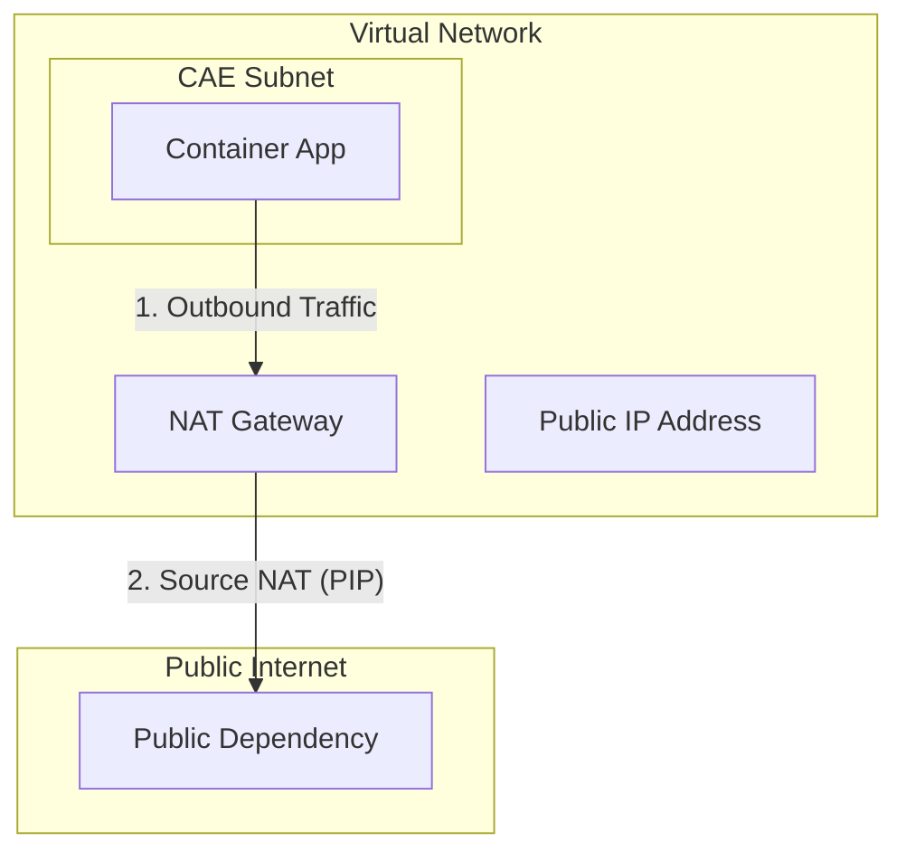
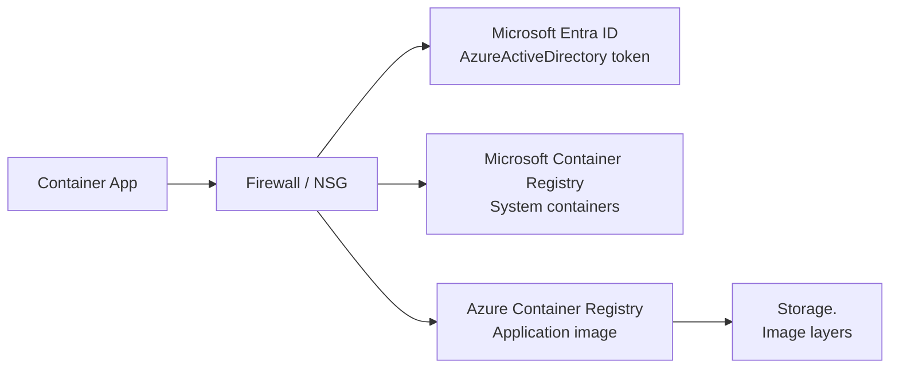

---
content_sources:
  diagrams:
    - id: route-outbound-traffic-through-azure-firewall
      type: flowchart
      source: mslearn-adapted
      based_on:
        - https://learn.microsoft.com/azure/container-apps/networking#outbound-fqdn-requirements
        - https://learn.microsoft.com/azure/container-apps/user-defined-routes
    - id: nat-gateway-architecture
      type: flowchart
      source: mslearn-adapted
      based_on:
        - https://learn.microsoft.com/azure/container-apps/networking#outbound-fqdn-requirements
        - https://learn.microsoft.com/azure/container-apps/user-defined-routes
    - id: managed-identity-acr-egress-dependencies
      type: flowchart
      source: mslearn-adapted
      based_on:
        - https://learn.microsoft.com/azure/container-apps/firewall-integration
        - https://learn.microsoft.com/azure/container-apps/user-defined-routes
content_validation:
  status: verified
  last_reviewed: "2026-04-12"
  reviewer: ai-agent
  core_claims:
    - claim: "Workload profiles environments support user-defined routes and egress through NAT Gateway."
      source: "https://learn.microsoft.com/azure/container-apps/networking"
      verified: true
    - claim: "Consumption only environments do not support user-defined routes or egress through NAT Gateway."
      source: "https://learn.microsoft.com/azure/container-apps/networking"
      verified: true
    - claim: "Using an existing virtual network enables Azure Firewall integration for Container Apps."
      source: "https://learn.microsoft.com/azure/container-apps/networking"
      verified: true
    - claim: "Using a NAT Gateway or other outbound proxy for outbound traffic from a Container Apps environment is supported only in a workload profiles environment."
      source: "https://learn.microsoft.com/azure/container-apps/networking"
      verified: true
    - claim: "Managed identity-based pulls from Azure Container Registry in restricted egress environments require outbound access to AzureActiveDirectory, and ACR image pulls also depend on registry and regional storage endpoints."
      source: "https://learn.microsoft.com/azure/container-apps/firewall-integration"
      verified: true
---

# Egress Control

Control outbound traffic from Container Apps.

## Default Behavior

By default, Container Apps can access:
- Public internet
- Azure services via public endpoints
- Resources in the same VNet (if VNet integrated)

!!! warning "Uncontrolled egress increases data exfiltration risk"
    Production workloads should define explicit outbound paths and approved destinations,
    especially when handling regulated or sensitive data.

## Egress Strategy Comparison

| Strategy | Primary Goal | Trade-off | Typical Fit |
|---|---|---|---|
| Default outbound | Fast setup | Minimal governance | Dev/test environments |
| UDR + Azure Firewall | Domain/IP filtering and inspection | Higher complexity and cost | Regulated production workloads |
| NAT Gateway | Static outbound IP for allow-lists | No L7 filtering by itself | SaaS allow-list integrations |

## User-Defined Routes (UDR)

Route outbound traffic through Azure Firewall or NVA:

<!-- diagram-id: route-outbound-traffic-through-azure-firewall -->


```bicep
resource routeTable 'Microsoft.Network/routeTables@2023-05-01' = {
  name: 'rt-containerapp'
  location: location
  properties: {
    routes: [
      {
        name: 'default-route'
        properties: {
          addressPrefix: '0.0.0.0/0'
          nextHopType: 'VirtualAppliance'
          nextHopIpAddress: firewallPrivateIp
        }
      }
    ]
  }
}
```

## Azure Firewall Rules

Allow required outbound traffic:

### NAT Gateway Architecture

<!-- diagram-id: nat-gateway-architecture -->


```bicep
resource firewallPolicy 'Microsoft.Network/firewallPolicies@2023-05-01' = {
  name: 'fw-policy'
  properties: {
    sku: { tier: 'Standard' }
  }
}
```

## Azure Firewall Rules

Allow required outbound traffic:

```bicep
resource firewallPolicy 'Microsoft.Network/firewallPolicies@2023-05-01' = {
  name: 'fw-policy'
  properties: {
    sku: { tier: 'Standard' }
  }
}

resource appRuleCollection 'Microsoft.Network/firewallPolicies/ruleCollectionGroups@2023-05-01' = {
  parent: firewallPolicy
  name: 'container-apps-rules'
  properties: {
    priority: 100
    ruleCollections: [
      {
        ruleCollectionType: 'FirewallPolicyFilterRuleCollection'
        name: 'allow-external-apis'
        priority: 100
        action: { type: 'Allow' }
        rules: [
          {
            ruleType: 'ApplicationRule'
            name: 'allow-jsonplaceholder'
            protocols: [{ protocolType: 'Https', port: 443 }]
            targetFqdns: ['jsonplaceholder.typicode.com']
            sourceAddresses: ['10.0.0.0/23']
          }
        ]
      }
    ]
  }
}
```

## NAT Gateway for Static Outbound IP

Assign static IP for outbound traffic:

```bicep
resource natGateway 'Microsoft.Network/natGateways@2023-05-01' = {
  name: 'nat-containerapp'
  location: location
  sku: { name: 'Standard' }
  properties: {
    publicIpAddresses: [{ id: publicIp.id }]
  }
}

resource subnet 'Microsoft.Network/virtualNetworks/subnets@2023-05-01' = {
  name: 'snet-containerapp'
  properties: {
    addressPrefix: '10.0.0.0/23'
    natGateway: { id: natGateway.id }
  }
}
```

!!! tip "Combine NAT and firewall when needed"
    Use NAT Gateway for predictable source IP and Azure Firewall for destination governance
    when both compliance and partner allow-list requirements exist.

## Verify Outbound IP

```python
import requests

@app.route('/api/my-ip')
def my_ip():
    # Use standard service to verify public outbound IP
    response = requests.get('https://api.ipify.org?format=json')
    return response.json()  # Returns NAT Gateway's public IP
```

## Required Outbound Dependencies

If you restrict egress and pull application images from Azure Container Registry (ACR) by using managed identity, allow the dependency categories that support both token acquisition and image download.

| Service Tag / Dependency | Port | When Required |
|---|---|---|
| `AzureActiveDirectory` | 443 | Required when the container app uses managed identity to obtain an access token for ACR. |
| `ACR login server` | 443 | Required for the registry endpoint (for example, `<registry-name>.azurecr.io`) unless you use a private endpoint for the registry. |
| `Storage.<Region>` | 443 | Required for ACR-backed image layer downloads from regional storage. |
| `MicrosoftContainerRegistry` | 443 | Required for Microsoft-managed system container dependencies in the environment. |
| `AzureContainerRegistry` | 443 | Required when pulling images from ACR without a private endpoint. When using a private endpoint for ACR, this tag is not required. |
| `AzureFrontDoor.FirstParty` | 443 | Required as a dependency of Microsoft Container Registry. |

When using Azure Firewall application rules instead of (or in addition to) NSG service tags, allow these FQDNs for managed identity token acquisition:

| FQDN | When Required |
|---|---|
| `login.microsoftonline.com` | Token issuance for managed identity |
| `*.login.microsoftonline.com` | Regional token endpoints |
| `login.microsoft.com` | Primary Microsoft login endpoint |
| `*.login.microsoft.com` | Alternative login endpoints |
| `*.identity.azure.net` | Managed identity metadata |

Use service tags where Azure provides them, and use private endpoints or FQDN-aware firewall rules for registry-specific destinations.

<!-- diagram-id: managed-identity-acr-egress-dependencies -->


!!! warning "Private ACR does not remove all outbound requirements"
    Even when ACR uses a private endpoint, managed identity image pulls still require outbound access to `AzureActiveDirectory` on port `443` so the platform can acquire a token.

Also keep DNS to `168.63.129.16:53` available; blocking platform DNS breaks name resolution for these dependencies.

For the failure symptoms and validation steps, see [Image Pull Failure](../../troubleshooting/playbooks/startup-and-provisioning/image-pull-failure.md).

## See Also
- [VNet Integration](vnet-integration.md)
- [Private Endpoints](private-endpoints.md)
- [Service-to-Service Communication](service-to-service.md)

## Sources
- [Outbound FQDN requirements in Azure Container Apps (Microsoft Learn)](https://learn.microsoft.com/azure/container-apps/networking#outbound-fqdn-requirements)
- [User-defined routes in Azure Container Apps (Microsoft Learn)](https://learn.microsoft.com/azure/container-apps/user-defined-routes)
- [Firewall integration in Azure Container Apps (Microsoft Learn)](https://learn.microsoft.com/azure/container-apps/firewall-integration)
- [Use Azure Firewall with Azure Container Apps — outbound FQDNs (Microsoft Learn)](https://learn.microsoft.com/azure/container-apps/use-azure-firewall)
