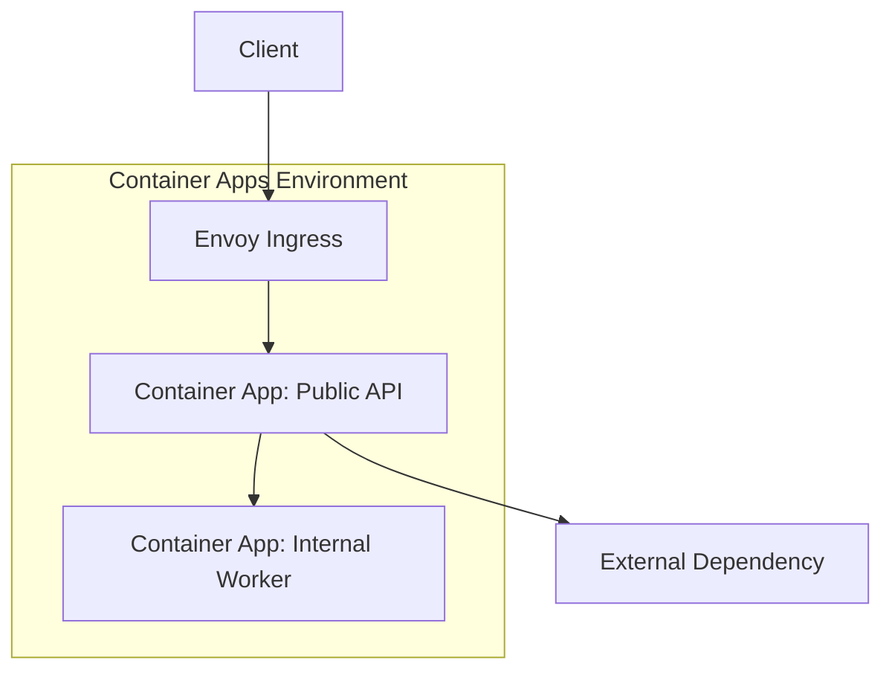
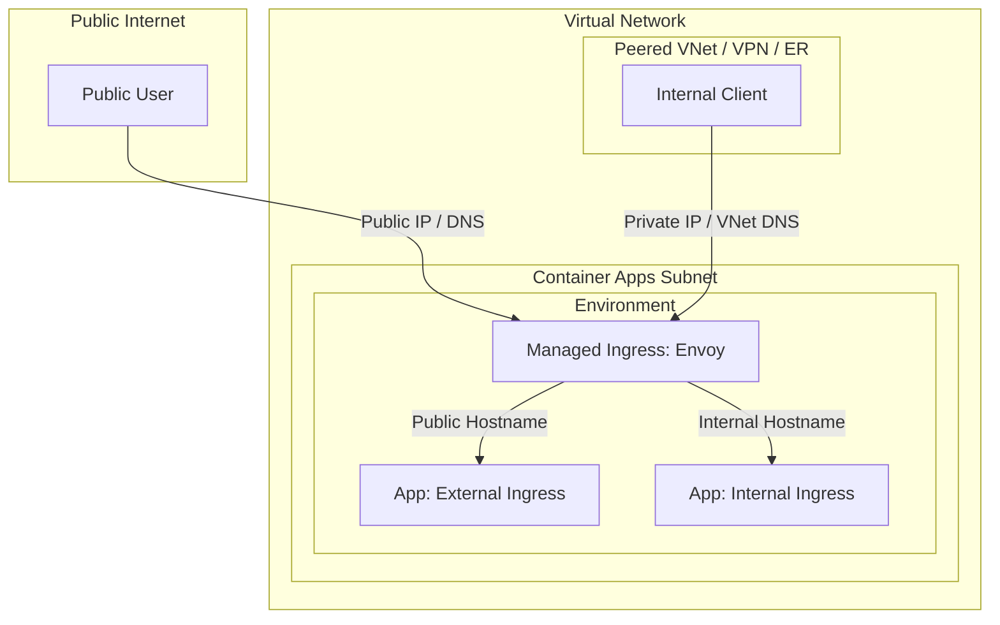
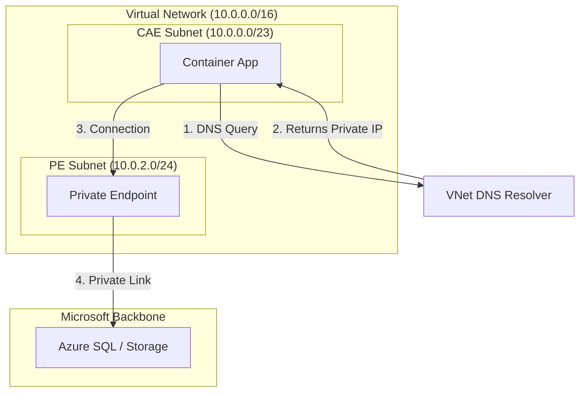
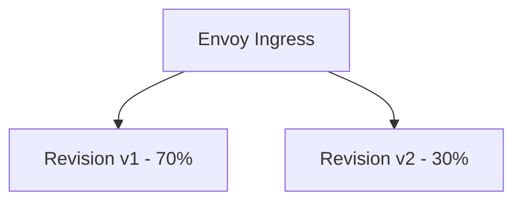

---
content_sources:
  diagrams:
    - id: high-level-network-flow
      type: flowchart
      source: mslearn-adapted
      based_on:
        - https://learn.microsoft.com/en-us/azure/container-apps/networking
        - https://learn.microsoft.com/en-us/azure/container-apps/ingress-overview
    - id: traffic-flow-external-vs-internal-ingress
      type: flowchart
      source: mslearn-adapted
      based_on:
        - https://learn.microsoft.com/en-us/azure/container-apps/networking
        - https://learn.microsoft.com/en-us/azure/container-apps/ingress-overview
    - id: vnet-integration-architecture
      type: flowchart
      source: mslearn-adapted
      based_on:
        - https://learn.microsoft.com/en-us/azure/container-apps/networking
        - https://learn.microsoft.com/en-us/azure/container-apps/ingress-overview
    - id: ingress-routes-traffic-to-active-revisions
      type: flowchart
      source: mslearn-adapted
      based_on:
        - https://learn.microsoft.com/en-us/azure/container-apps/networking
        - https://learn.microsoft.com/en-us/azure/container-apps/ingress-overview
---
# Networking in Azure Container Apps

Networking in Azure Container Apps combines managed ingress with optional private networking controls. Understanding ingress mode, service discovery, and environment boundaries is key to secure and reliable architectures.

Start with [Ingress in Azure Container Apps](ingress.md) when you need the canonical explanation of external vs internal exposure, transport modes, TCP ingress, headers, and ingress edge features. Use this page for the broader networking map.

## High-Level Network Flow

<!-- diagram-id: high-level-network-flow -->

Envoy acts as the managed ingress layer, handling routing into app revisions and enforcing transport behavior.

### Portal view: environment Networking blade

The **Networking** blade on a Container Apps environment is where the environment-wide network posture is configured. App-level ingress (the [Ingress](ingress.md) page) sits underneath whatever this environment-level blade exposes.

- **[Observed]** The blade shows a tab strip with **General**, **Ingress settings**, **Request Routing**, **Encryption**, and **Custom DNS Suffix**. The General tab displays **Public Network Access** with two radios — `Enable: Allows incoming traffic from the public internet.` (selected) and `Disable: Block all incoming traffic from the public internet.` — and a **Virtual network** section reporting `This environment isn't integrated`. The left navigation under **Settings** lists Dapr components, Certificates, Quota, Workload profiles, **Networking** (selected), Volume mounts, Identity, Planned Maintenance, and Locks.
- **[Inferred]** Two of the networking dimensions discussed on this page appear to map to controls on this blade. `Public Network Access` is consistent with the environment-level public entry point that the **Ingress Modes** table describes, and its `Disable` option is consistent with the description ("Block all incoming traffic from the public internet.") rendered next to that radio. The `Virtual network` row appears to reflect whether the environment is VNet-integrated as covered in **VNet Integration and Isolation**; this sample environment is not integrated, which is consistent with no subnet, peering, or DNS settings being shown.
- **[Not Proven]** Many networking features that this guide covers are not visible in this capture. App-level ingress (external/internal, transport, IP restrictions, CORS, client certificates) and the per-app revision traffic split are not shown here. Workload profile placement, private endpoint configuration, custom DNS suffix details, and request-routing rules are not visible in the General tab captured above; whether they are reached through the other tabs visible here or through separate resources is not proven by this PNG alone.

!!! warning "Ingress mode is a security boundary"
    Accidentally enabling external ingress for internal-only workloads exposes endpoints to the public internet.
    Validate ingress mode in deployment reviews and policy checks.

## Ingress Modes

| Mode | Reachability | Typical Use |
|---|---|---|
| External ingress | Public internet entry point | Public APIs and web backends |
| Internal ingress | Environment-internal access | Private microservice endpoints |
| No ingress | Not directly addressable by HTTP clients | Queue-driven/background workers |

### Traffic Flow: External vs Internal Ingress

<!-- diagram-id: traffic-flow-external-vs-internal-ingress -->

## VNet Integration and Isolation

Container Apps environments can integrate with virtual networks to control east-west and north-south traffic patterns.

### VNet Integration Architecture

<!-- diagram-id: vnet-integration-architecture -->

Use VNet integration when you need:

- Private access to internal services.
- Controlled egress paths to dependencies.
- Alignment with enterprise network governance.

## Service Discovery and East-West Calls

Apps in the same environment can use internal naming/service invocation patterns for service-to-service communication.

With optional Dapr integration, service invocation becomes more uniform across services while keeping networking concerns centralized.

!!! tip "Use internal ingress by default for backend services"
    Reserve external ingress for entry-point APIs. This reduces attack surface and simplifies network governance.

## Revisions and Traffic Routing

Ingress routes traffic to active revisions based on configured weights.

<!-- diagram-id: ingress-routes-traffic-to-active-revisions -->

This model supports canary testing without introducing an external traffic manager for basic progressive delivery.

## TLS and Managed Certificates

For custom domains, managed certificates simplify HTTPS lifecycle operations:

- Certificate issuance and renewal are platform-managed.
- Teams avoid manual certificate rotation overhead.
- HTTPS posture remains consistent as apps evolve.

## Practical Example: Public Edge + Private Backend

| Component | Network Posture |
|---|---|
| API app | External ingress with TLS |
| Orders/worker app | Internal ingress only |
| Data services | Private connectivity through VNet design |

This pattern reduces attack surface while keeping the public API straightforward.

## Advanced Topics

- Combining internal ingress with private endpoints for end-to-end private data paths.
- Zero-trust service segmentation across multiple environments.
- Egress governance and outbound allow-list strategies.

## See Also
- [How Container Apps Works](../../start-here/overview.md)
- [Ingress in Azure Container Apps](ingress.md)
- [Environments and Apps](../environments/index.md)
- [Scaling with KEDA](../scaling/index.md)
- [Container Apps vs Others](../../start-here/when-to-use-container-apps.md)
- [VNet Integration Recipe](vnet-integration.md)
- [Private Endpoint Recipe](private-endpoints.md)
- [Application Gateway Integration](application-gateway-integration.md)

## Sources
- [Networking in Azure Container Apps (Microsoft Learn)](https://learn.microsoft.com/en-us/azure/container-apps/networking)
- [Ingress in Azure Container Apps (Microsoft Learn)](https://learn.microsoft.com/en-us/azure/container-apps/ingress-overview)
