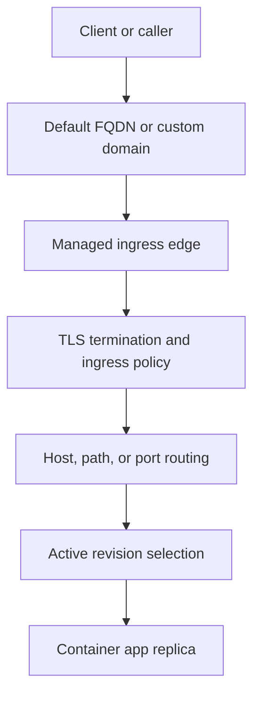
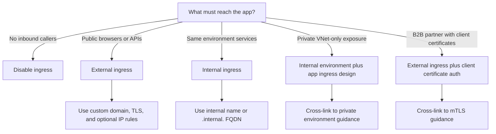

---
content_sources:
  diagrams:
    - id: ingress-request-lifecycle
      type: flowchart
      source: mslearn-adapted
      based_on:
        - https://learn.microsoft.com/en-us/azure/container-apps/ingress-overview
        - https://learn.microsoft.com/en-us/azure/container-apps/networking
    - id: ingress-decision-tree
      type: flowchart
      source: self-generated
      justification: "Synthesized decision flow from Microsoft Learn ingress, networking, connect-apps, client certificate, and rule-based routing guidance."
      based_on:
        - https://learn.microsoft.com/en-us/azure/container-apps/ingress-overview
        - https://learn.microsoft.com/en-us/azure/container-apps/networking
        - https://learn.microsoft.com/en-us/azure/container-apps/connect-apps
        - https://learn.microsoft.com/en-us/azure/container-apps/client-certificate-authorization
        - https://learn.microsoft.com/en-us/azure/container-apps/rule-based-routing
content_validation:
  status: verified
  last_reviewed: "2026-04-25"
  reviewer: ai-agent
  core_claims:
    - claim: "Azure Container Apps ingress supports external and internal exposure modes, where external accepts public internet traffic and internal limits reachability to the environment boundary described by Microsoft Learn."
      source: "https://learn.microsoft.com/en-us/azure/container-apps/ingress-overview"
      verified: true
    - claim: "Internal service discovery uses environment-scoped names, including an internal FQDN that contains the .internal segment."
      source: "https://learn.microsoft.com/en-us/azure/container-apps/connect-apps"
      verified: true
    - claim: "Azure Container Apps supports transport values auto, http, http2, and tcp for ingress configuration."
      source: "https://learn.microsoft.com/en-us/azure/container-apps/ingress-how-to"
      verified: true
    - claim: "Azure Container Apps supports additional port mappings with a maximum of five additional ports per app, and externally exposed extra TCP ports must be unique across the environment."
      source: "https://learn.microsoft.com/en-us/azure/container-apps/ingress-overview"
      verified: true
    - claim: "The default request timeout for HTTP ingress is 240 seconds."
      source: "https://learn.microsoft.com/en-us/azure/container-apps/ingress-overview"
      verified: true
---

# Ingress in Azure Container Apps

Azure Container Apps ingress controls how inbound traffic reaches a container app, whether that traffic comes from the public internet, callers in the same environment, or TCP clients. Use this page as the canonical ingress map, then follow the linked deep dives for VNet design, private exposure, service discovery, and revision traffic strategy.

## Overview

Azure Container Apps provides a managed ingress layer in front of your app. Microsoft Learn describes an HTTP edge proxy that terminates TLS at the edge, while the broader networking documentation also calls out Envoy for internal traffic routing inside the platform.

- Enable ingress when the app must accept inbound HTTP or TCP traffic.
- Disable ingress for event-driven workers, background processors, or jobs that should not accept inbound requests.
- Use the app's default FQDN or a custom domain when ingress is enabled.

!!! note "Document Envoy conservatively"
    Microsoft Learn explicitly documents the HTTP edge proxy and separately documents Envoy for internal routing inside Container Apps clusters. This page therefore refers to a managed ingress edge and avoids overstating that every ingress detail is directly documented as Envoy-based at the public edge.

<!-- diagram-id: ingress-request-lifecycle -->

The default FQDN uses the environment DNS suffix. For internal service-to-service calls, Microsoft Learn documents an internal FQDN pattern that includes `.internal.` and is scoped to the same Container Apps environment.

## Enabling ingress

At the app level, ingress is controlled through the ingress configuration, including the `external` property in ARM, Bicep, and YAML representations.

| Ingress state | Result | Typical use |
|---|---|---|
| Enabled + `external: true` | App accepts internet and environment-originated traffic | Public web app, public API, partner API |
| Enabled + `external: false` | App is internal-only at the app level | Internal microservice, internal API |
| Disabled | No inbound HTTP or TCP endpoint | Queue worker, event-driven processor, background component |

When ingress is disabled, the app does not expose an inbound endpoint. That is the safest posture for workloads that only react to events or outbound calls.

## External vs Internal ingress

The most important ingress decision is whether the app itself is public or internal.

| Setting | Reachability | Name behavior | Best fit |
|---|---|---|---|
| `external: true` | Public internet and internal callers | Uses the default public FQDN or custom domain | Public web front ends, public APIs |
| `external: false` | Internal callers only | Uses environment-scoped internal addressing, including `.internal.` FQDN patterns | Internal microservices |

For same-environment calls, Microsoft Learn documents two common internal patterns:

- `http://<app-name>`
- `<app-name>.internal.<environment-unique-id>.<region>.azurecontainerapps.io`

Requests sent to an internal-only app from outside the same environment are rejected by the environment proxy and return `404`.

### App-level vs environment-level internal exposure

Do not confuse **app-level internal ingress** with an **internal environment**:

| Scope | Setting | Effect |
|---|---|---|
| App | `external: false` | Restricts that app to callers in the same Container Apps environment |
| Environment | `internal: true` / `--internal-only true` | Removes the public environment entry point and uses internal load balancer behavior for the environment |

This distinction matters:

- An **external environment** can still host an app with `external: false`.
- That setting does **not** make the whole environment private.
- A truly private inbound design usually starts with an **internal environment** and then chooses app-level ingress per service.

For the full environment-level private networking deep dive, see [Private Endpoints](private-endpoints.md) and [VNet Integration](vnet-integration.md).

<!-- diagram-id: ingress-decision-tree -->

## Transport

Azure Container Apps supports these ingress transport values:

| Value | Use when | Notes |
|---|---|---|
| `auto` | Standard HTTP workloads | Automatically detects HTTP/1 or HTTP/2 |
| `http` | HTTP/1-only workload or conservative HTTP config | Explicit HTTP transport |
| `http2` | gRPC or end-to-end HTTP/2 requirement | Use for gRPC workloads |
| `tcp` | Non-HTTP TCP exposure | Required for TCP ingress |

Use `http2` for gRPC. Use `tcp` only when the app is exposing a raw TCP listener rather than HTTP semantics.

## TCP ingress

TCP ingress is for workloads that expose a TCP port instead of an HTTP endpoint.

Key Microsoft Learn–verified constraints:

- Azure Container Apps supports TCP ingress in addition to HTTP ingress.
- External TCP ingress is supported only for Container Apps environments that use a virtual network.
- The TCP `exposedPort` can't be `80` or `443`.
- If `exposedPort` is omitted, it defaults to `targetPort`.
- Port `36985` is reserved for internal health checks.
- Microsoft Learn does **not** document a blanket "only one TCP app per environment" rule. Instead, it documents that externally exposed extra TCP ports must be unique across the environment, while internal extra ports can reuse the same port across multiple apps.

TCP ingress does not use browser-oriented ingress features such as CORS, and it does not rely on HTTP request concepts such as headers, paths, or methods.

## Additional TCP and HTTP ports

Use `additionalPortMappings` when the app needs more than its main ingress port.

| Behavior | Microsoft Learn guidance |
|---|---|
| Maximum additional ports | Up to five additional ports per app |
| External extra ports | Must be unique across the Container Apps environment |
| Internal extra ports | Can be reused across multiple apps |
| HTTP features on extra ports | The main ingress port supports built-in HTTP features; extra TCP ports do not |

If you run HTTP on top of an extra TCP port, built-in ingress features such as CORS and session affinity are not supported on that extra port.

## IP restrictions

Use `ipSecurityRestrictions` to allow or deny inbound traffic by source IP or CIDR range.

| Behavior | Guidance |
|---|---|
| No IP rules configured | All inbound traffic is allowed |
| Allow rules | Permit only matching sources |
| Deny rules | Explicitly block matching sources |

Microsoft Learn documents that there is no mixed allow-and-deny precedence model to evaluate in a single rule set: **all rules must be the same type**. The IP restrictions article states, "All rules must be the same type. You cannot combine allow rules and deny rules," and the Azure CLI reference reiterates that all restrictions must use the same action. If no restrictions are configured, all inbound traffic is allowed.

Use platform IP restrictions when you want coarse-grained source filtering at ingress. Keep fine-grained authorization in the gateway or application layer.

## Client certificates (mTLS)

Container Apps supports ingress client certificate authentication through `clientCertificateMode` values such as `ignore`, `accept`, and `require`.

Use this for B2B or partner-facing APIs when the trust decision belongs at the ingress boundary.

!!! note "Repository cross-links pending separate merge"
    The current `main` branch in this repository does not yet contain the planned `docs/platform/security/ingress-client-certificates.md` and `docs/platform/security/mtls.md` pages referenced in the task context. This ingress overview therefore documents the feature briefly and cites Microsoft Learn directly instead of creating broken internal links.

## CORS policy

Use `corsPolicy` when browser-based callers need cross-origin access controlled at the ingress layer.

Microsoft Learn documents these fields:

- `allowedOrigins`
- `allowedMethods`
- `allowedHeaders`
- `exposeHeaders`
- `allowCredentials`
- `maxAge`

Use platform CORS when you want a consistent ingress policy across revisions. Use app-level CORS only when the application needs request-specific behavior that the platform policy cannot express.

## Sticky sessions and session affinity

Container Apps supports session affinity with `affinity: sticky` or `affinity: none`.

| Setting | Behavior |
|---|---|
| `none` | No session affinity |
| `sticky` | Uses cookies to keep a client on the same replica |

Prefer `sticky` only when the application cannot yet be made stateless. Sticky sessions can bias traffic split observations and reduce load distribution quality.

!!! note "Use session affinity conservatively"
    Microsoft Learn documents cookie-based session affinity for HTTP ingress. It is most meaningful when more than one replica can serve requests; otherwise there is nothing to pin a client to.

## Request timeout

The default HTTP ingress request timeout is **240 seconds**.

For long-running work:

- Prefer asynchronous patterns.
- Return quickly and continue processing with queues, jobs, or background workflows.
- Avoid treating ingress as a long-lived work executor.

## Maximum request body size

!!! warning "Maximum request body size is not directly documented"
    Microsoft Learn documents ingress timeout, header-count, and idle-request limits, but it does not publish a clear maximum request body size for Container Apps ingress on the cited ingress pages. Microsoft Learn does document `httpMaxRequestSize` for Dapr's HTTP server, but that is a Dapr sidecar setting rather than a documented Container Apps ingress limit. Keep body-size claims warned unless you validate them through updated Microsoft documentation or direct platform testing.

## Traffic split

Ingress routes requests to active revisions based on revision traffic configuration. Use this for canary or gradual rollout behavior, but keep the detailed revision strategy in the dedicated revision guide.

See [Revision Lifecycle in Azure Container Apps](../revisions/index.md) for the full traffic split and revision strategy guidance.

## Headers

Microsoft Learn explicitly documents these ingress-forwarded headers for HTTP ingress:

| Header | Purpose |
|---|---|
| `X-Forwarded-Proto` | Original request protocol |
| `X-Forwarded-For` | Client IP chain |
| `X-Forwarded-Client-Cert` | Client certificate metadata when client cert mode accepts or requires certificates |

!!! warning "Header coverage is documented only partially"
    The Microsoft Learn ingress overview says, "The following table lists the HTTP headers that are relevant to ingress in Container Apps," and that table lists only `X-Forwarded-Proto`, `X-Forwarded-For`, and `X-Forwarded-Client-Cert`. Because `X-Forwarded-Host` is not listed in the official ingress header table, this guide does not treat that header as verified platform behavior.

## Comparison: External vs Internal

| Dimension | External ingress | Internal ingress |
|---|---|---|
| Internet reachable | Yes | No |
| Same-environment reachable | Yes | Yes |
| Default naming | Public FQDN or custom domain | Internal addressing including `.internal.` pattern |
| Best fit | Public apps and partner APIs | Private microservices |
| Typical controls | TLS, custom domain, IP restrictions, optional mTLS | Service discovery, environment boundary, private network design |

## Common scenarios

| Scenario | Recommended ingress posture | Why |
|---|---|---|
| Public API | External ingress | Public clients must reach the service |
| Internal microservice | Internal ingress | Keeps east-west calls inside the environment |
| B2B partner API with client certificates | External ingress plus client certificate auth | Keeps the public contract while enforcing certificate-based caller identity |
| gRPC backend | `transport: http2` | gRPC requires HTTP/2 |
| TCP database proxy or custom TCP endpoint | `transport: tcp` with explicit exposed port rules | Raw TCP listener, not HTTP |
| Multi-region app behind Azure Front Door | External ingress behind a global edge | Front Door handles global routing while Container Apps ingress remains the regional app entry point |

## See Also

- [Networking in Azure Container Apps](index.md)
- [VNet Integration](vnet-integration.md)
- [Private Endpoints](private-endpoints.md)
- [Service-to-Service Communication](service-to-service.md)
- [Revision Lifecycle in Azure Container Apps](../revisions/index.md)
- [Azure Container Apps Networking Best Practices](../../best-practices/networking.md)

## Sources

- [Ingress in Azure Container Apps (Microsoft Learn)](https://learn.microsoft.com/en-us/azure/container-apps/ingress-overview)
- [Communicate between container apps in Azure Container Apps (Microsoft Learn)](https://learn.microsoft.com/en-us/azure/container-apps/connect-apps)
- [Networking in Azure Container Apps environment (Microsoft Learn)](https://learn.microsoft.com/en-us/azure/container-apps/networking)
- [Ingress for your app in Azure Container Apps (Microsoft Learn)](https://learn.microsoft.com/en-us/azure/container-apps/ingress-how-to)
- [Configure IP ingress restrictions in Azure Container Apps (Microsoft Learn)](https://learn.microsoft.com/en-us/azure/container-apps/ip-restrictions)
- [az containerapp ingress access-restriction (Microsoft Learn)](https://learn.microsoft.com/en-us/cli/azure/containerapp/ingress/access-restriction?view=azure-cli-latest)
- [Configure CORS in Azure Container Apps (Microsoft Learn)](https://learn.microsoft.com/en-us/azure/container-apps/cors)
- [Session affinity in Azure Container Apps (Microsoft Learn)](https://learn.microsoft.com/en-us/azure/container-apps/sticky-sessions)
- [Configure client certificate authentication in Azure Container Apps (Microsoft Learn)](https://learn.microsoft.com/en-us/azure/container-apps/client-certificate-authorization)
- [Configure rule-based routing in Azure Container Apps (Microsoft Learn)](https://learn.microsoft.com/en-us/azure/container-apps/rule-based-routing)
- [Use premium ingress in Azure Container Apps (Microsoft Learn)](https://learn.microsoft.com/en-us/azure/container-apps/premium-ingress)
