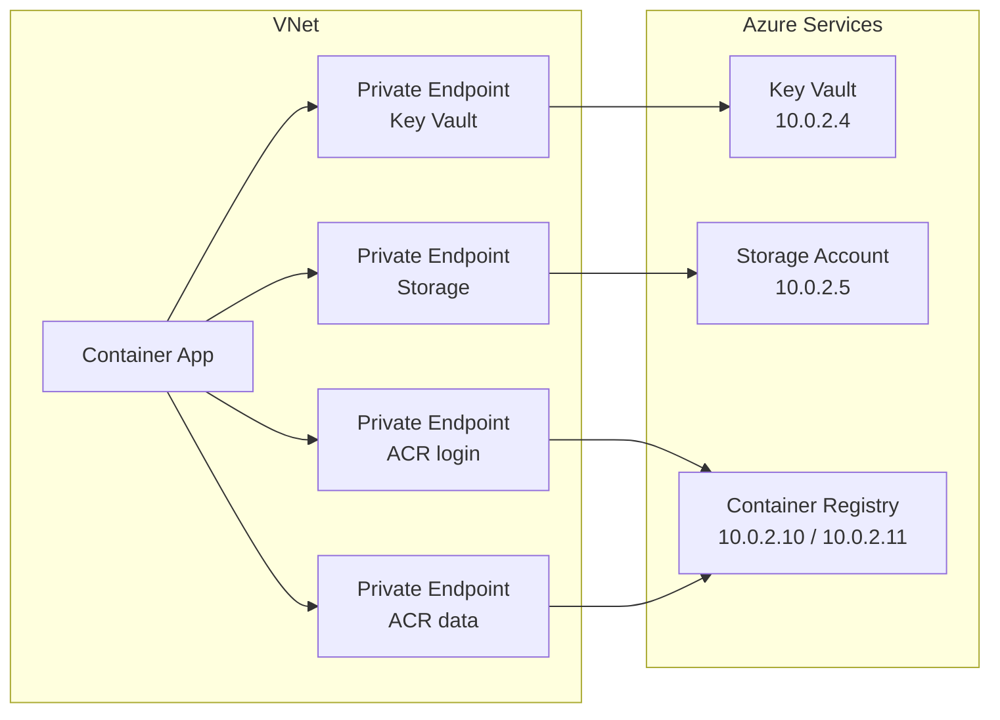
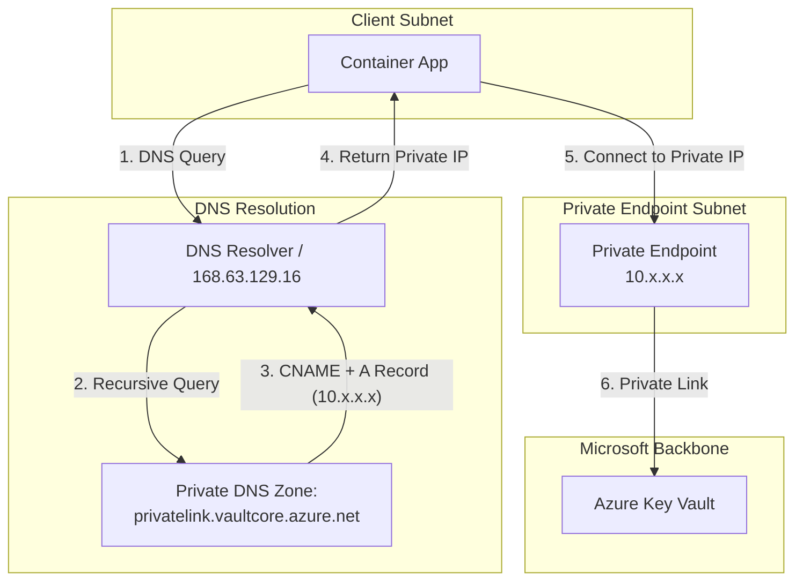
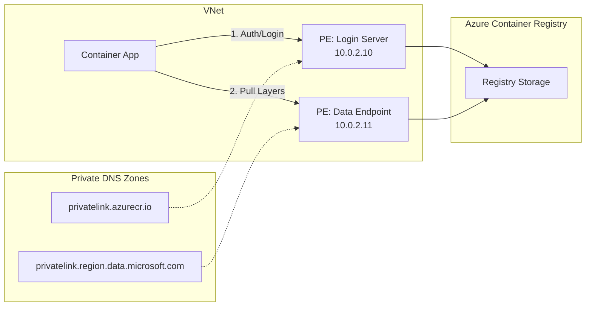

---
hide:
  - toc
---

# Private Endpoints

Connect Container Apps to Azure services using Private Endpoints.

## Overview



!!! info "What are Private Endpoints?"
    Private Endpoints provide private IP addresses for Azure PaaS services, ensuring traffic never leaves the Microsoft backbone network. Benefits include:

    - Private IP addresses for Azure services
    - Traffic stays on Microsoft backbone
    - No public internet exposure

## Quick Start: Deploy Test Environment

We provide a complete private endpoint test environment with Key Vault and Storage Account.

```bash
cd infra
./deploy-private.sh
```

This deploys:

| Resource | Purpose |
|----------|---------|
| VNet with 2 subnets | Network isolation |
| Key Vault + Private Endpoint | Secret management |
| Storage Account + Private Endpoint | Blob storage |
| ACR + Private Endpoints (registry + data) | Private container image pull |
| Private DNS Zones | Name resolution |
| Managed Identity | Passwordless authentication |

## Supported Services

| Service | Private DNS Zone | Group ID |
|---------|------------------|----------|
| Azure SQL | `privatelink.database.windows.net` | `sqlServer` |
| Blob Storage | `privatelink.blob.core.windows.net` | `blob` |
| Key Vault | `privatelink.vaultcore.azure.net` | `vault` |
| Cosmos DB | `privatelink.documents.azure.com` | `Sql` |
| Service Bus | `privatelink.servicebus.windows.net` | `namespace` |
| Redis Cache | `privatelink.redis.cache.windows.net` | `redisCache` |
| Container Registry | `privatelink.azurecr.io` | `registry` + `registry_data_<region>` |

!!! tip "Validate DNS before transport troubleshooting"
    Most private endpoint connectivity failures are DNS-related.
    Confirm private name resolution first, then inspect NSG and route behavior.

!!! note "ACR requires two private endpoints"
    Container Registry is unique — you need a private endpoint for the **login server** (`registry`) and a second one for the **data endpoint** (`registry_data_<region>`). Both must resolve to private IPs for image pulls to work. See [Private Container Registry](../../language-guides/python/recipes/container-registry.md) for the full setup.

## Architecture



### ACR Private Endpoint Flow

ACR is unique and requires two private DNS zones for full functionality within a VNet:

1.  `privatelink.azurecr.io`: For the login server (authentication and metadata)
2.  `privatelink.<region>.data.microsoft.com`: For the data endpoint (layer downloads)



## Infrastructure Components

### 1. Network Module

The network module creates a VNet with two subnets:

```bash
infra/modules/network.bicep
```

| Subnet | CIDR | Purpose |
|--------|------|---------|
| `snet-container-apps` | 10.0.0.0/23 | Container Apps Environment |
| `snet-private-endpoints` | 10.0.2.0/24 | Private Endpoints |

!!! warning "Subnet Size"
    Container Apps requires a minimum /23 subnet (512 IPs). Smaller subnets will cause deployment failures.

### 2. Key Vault with Private Endpoint

```bash
infra/modules/keyvault-private.bicep
```

Features:

- Public network access disabled
- RBAC authorization enabled
- Sample secrets for testing
- Automatic DNS registration

### 3. Storage Account with Private Endpoint

```bash
infra/modules/storage-private.bicep
```

Features:

- Blob endpoint with private endpoint
- Public access disabled
- Test container created
- Managed Identity access configured

## Using Private Endpoints in Code

### Key Vault Access

```python
import os
from azure.identity import DefaultAzureCredential
from azure.keyvault.secrets import SecretClient

vault_url = os.environ['KEY_VAULT_URL']
credential = DefaultAzureCredential()
client = SecretClient(vault_url=vault_url, credential=credential)

secret = client.get_secret("database-password")
print(f"Secret value: {secret.value}")
```

### Storage Account Access

```python
import os
from azure.identity import DefaultAzureCredential
from azure.storage.blob import BlobServiceClient

account_url = os.environ['STORAGE_BLOB_ENDPOINT']
credential = DefaultAzureCredential()
client = BlobServiceClient(account_url=account_url, credential=credential)

container = client.get_container_client("test-container")
for blob in container.list_blobs():
    print(f"Blob: {blob.name}")
```

!!! tip "Managed Identity"
    The deployment automatically configures the Managed Identity with appropriate RBAC roles:
    
    - **Key Vault**: `Key Vault Secrets User`
    - **Storage**: `Storage Blob Data Contributor`

## Verify Connectivity

### From Container Console

```bash
az containerapp exec -n <app-name> -g <resource-group> --command /bin/bash
```

### Check DNS Resolution

```bash
nslookup <keyvault-name>.vault.azure.net
```

Expected output (private IP):
```
Server:    168.63.129.16
Address:   168.63.129.16#53

Non-authoritative answer:
<keyvault-name>.vault.azure.net  canonical name = <keyvault-name>.privatelink.vaultcore.azure.net.
Name:   <keyvault-name>.privatelink.vaultcore.azure.net
Address: 10.0.2.4
```

!!! warning "Public IP Response"
    If you see a public IP address, the Private DNS Zone is not correctly linked to your VNet.

### Test Connectivity

```bash
nc -zv <keyvault-name>.vault.azure.net 443
```

## Troubleshooting

### DNS Resolution Returns Public IP

1. Verify Private DNS Zone exists
2. Check VNet link is configured
3. Ensure Private Endpoint is in `Succeeded` state

```bash
az network private-endpoint show \
  --name pe-kv-<basename> \
  --resource-group <resource-group> \
  --query 'provisioningState'
```

### Connection Timeout

1. Check NSG rules on the private endpoint subnet
2. Verify the service's firewall allows the private endpoint
3. Ensure the Container App is in the same VNet

### Authentication Errors

1. Verify Managed Identity is assigned to Container App
2. Check RBAC roles are correctly assigned
3. Ensure `AZURE_CLIENT_ID` environment variable is set

```bash
az containerapp show -n <app-name> -g <rg> --query 'identity'
```

## Clean Up

```bash
az group delete --name rg-container-apps-private --yes --no-wait
```

!!! note "Soft Delete"
    Key Vault uses soft delete by default. Deleted vaults are retained for 7 days before permanent deletion.

## See Also
- [VNet Integration](vnet-integration.md)
- [Egress Control](egress-control.md)
- [Key Vault](../identity-and-secrets/key-vault.md)
- [Blob Storage and File Mounts](../../language-guides/python/recipes/storage.md)
- [Private Container Registry](../../language-guides/python/recipes/container-registry.md)

## Sources
- [Internal ingress with VNet integration in Azure Container Apps (Microsoft Learn)](https://learn.microsoft.com/azure/container-apps/vnet-custom-internal)
- [What is a private endpoint? (Microsoft Learn)](https://learn.microsoft.com/azure/private-link/private-endpoint-overview)
