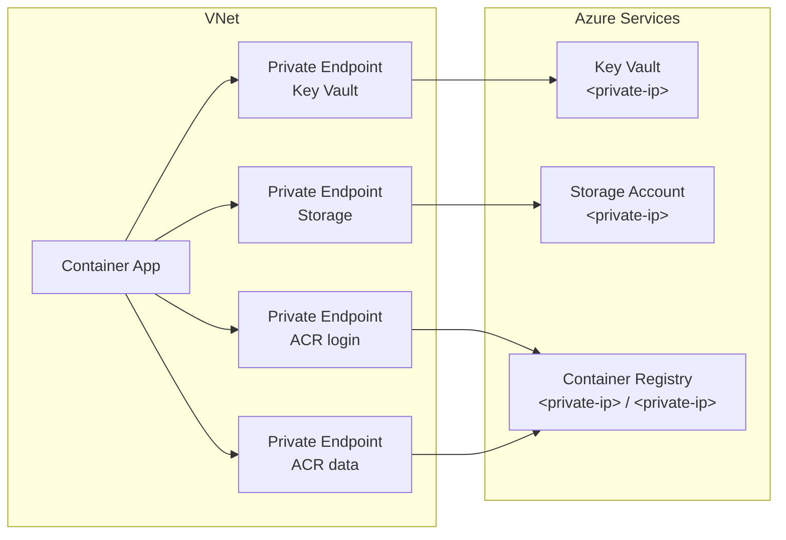

---
hide:
  - toc
content_sources:
  diagrams:
    - id: overview
      type: flowchart
      source: mslearn-adapted
      based_on:
        - https://learn.microsoft.com/azure/container-apps/vnet-custom-internal
        - https://learn.microsoft.com/azure/private-link/private-endpoint-overview
    - id: architecture
      type: flowchart
      source: mslearn-adapted
      based_on:
        - https://learn.microsoft.com/azure/container-apps/vnet-custom-internal
        - https://learn.microsoft.com/azure/private-link/private-endpoint-overview
    - id: privatelink-region-data-microsoft-com-for-the-data-endpoint-layer
      type: flowchart
      source: mslearn-adapted
      based_on:
        - https://learn.microsoft.com/azure/container-apps/vnet-custom-internal
        - https://learn.microsoft.com/azure/private-link/private-endpoint-overview
content_validation:
  status: verified
  last_reviewed: "2026-04-12"
  reviewer: ai-agent
  core_claims:
    - claim: "Workload profiles environments support creating private endpoints on the Container Apps environment."
      source: "https://learn.microsoft.com/azure/container-apps/networking"
      verified: true
    - claim: "Using an existing virtual network allows Container Apps to access resources behind private endpoints in the virtual network."
      source: "https://learn.microsoft.com/azure/container-apps/networking"
      verified: true
    - claim: "Internal environments have no public endpoints and are deployed with an internal load balancer IP from the virtual network's private address space."
      source: "https://learn.microsoft.com/azure/container-apps/networking"
      verified: true
    - claim: "Public network access must be disabled to create private endpoints on a Container Apps environment."
      source: "https://learn.microsoft.com/azure/container-apps/networking"
      verified: true
    - claim: "Container app ingress can be limited to traffic from within the same Container Apps environment."
      source: "https://learn.microsoft.com/azure/container-apps/networking"
      verified: true
---

# Private Endpoints

Connect Container Apps to Azure services using Private Endpoints.

## Overview

<!-- diagram-id: overview -->


!!! info "What are Private Endpoints?"
    Private Endpoints provide private IP addresses for Azure PaaS services, ensuring traffic never leaves the Microsoft backbone network. Benefits include:

    - Private IP addresses for Azure services
    - Traffic stays on Microsoft backbone
    - No public internet exposure

## Quick Start: Deploy Test Environment

We provide a complete private endpoint test environment with Key Vault and Storage Account.

```bash
cd infra
./deploy-private.sh
```

| Command | Purpose |
|---------|---------|
| `cd infra` | Moves to the infrastructure script directory. |
| `./deploy-private.sh` | Deploys the sample VNet, private endpoints, DNS, and identity resources. |

This deploys:

| Resource | Purpose |
|----------|---------|
| VNet with 2 subnets | Network isolation |
| Key Vault + Private Endpoint | Secret management |
| Storage Account + Private Endpoint | Blob storage |
| ACR + Private Endpoints (registry + data) | Private container image pull |
| Private DNS Zones | Name resolution |
| Managed Identity | Passwordless authentication |

## Supported Services

| Service | Private DNS Zone | Group ID |
|---------|------------------|----------|
| Azure SQL | `privatelink.database.windows.net` | `sqlServer` |
| Blob Storage | `privatelink.blob.core.windows.net` | `blob` |
| Key Vault | `privatelink.vaultcore.azure.net` | `vault` |
| Cosmos DB | `privatelink.documents.azure.com` | `Sql` |
| Service Bus | `privatelink.servicebus.windows.net` | `namespace` |
| Redis Cache | `privatelink.redis.cache.windows.net` | `redisCache` |
| Container Registry | `privatelink.azurecr.io` | `registry` + `registry_data_<region>` |

!!! tip "Validate DNS before transport troubleshooting"
    Most private endpoint connectivity failures are DNS-related.
    Confirm private name resolution first, then inspect NSG and route behavior.

!!! note "ACR requires two private endpoints"
    Container Registry is unique — you need a private endpoint for the **login server** (`registry`) and a second one for the **data endpoint** (`registry_data_<region>`). Both must resolve to private IPs for image pulls to work. See [Private Container Registry](../../language-guides/python/recipes/container-registry.md) for the full setup.

## Architecture

<!-- diagram-id: architecture -->


### ACR Private Endpoint Flow

ACR is unique and requires two private DNS zones for full functionality within a VNet:

1.  `privatelink.azurecr.io`: For the login server (authentication and metadata)
2.  `privatelink.<region>.data.microsoft.com`: For the data endpoint (layer downloads)

<!-- diagram-id: privatelink-region-data-microsoft-com-for-the-data-endpoint-layer -->


## Infrastructure Components

### 1. Network Module

The network module creates a VNet with two subnets:

Source template: `infra/modules/network.bicep`

| Subnet | CIDR | Purpose |
|--------|------|---------|
| `snet-container-apps` | `<container-apps-subnet-cidr>` | Container Apps Environment |
| `snet-private-endpoints` | `<private-endpoints-subnet-cidr>` | Private Endpoints |

!!! warning "Subnet Size"
    Container Apps requires a minimum /23 subnet (512 IPs). Smaller subnets will cause deployment failures.

### 2. Key Vault with Private Endpoint

Source template: `infra/modules/keyvault-private.bicep`

Features:

- Public network access disabled
- RBAC authorization enabled
- Sample secrets for testing
- Automatic DNS registration

### 3. Storage Account with Private Endpoint

Source template: `infra/modules/storage-private.bicep`

Features:

- Blob endpoint with private endpoint
- Public access disabled
- Test container created
- Managed Identity access configured

## Using Private Endpoints in Code

### Key Vault Access

```python
import os
from azure.identity import DefaultAzureCredential
from azure.keyvault.secrets import SecretClient

vault_url = os.environ['KEY_VAULT_URL']
credential = DefaultAzureCredential()
client = SecretClient(vault_url=vault_url, credential=credential)

secret = client.get_secret("database-password")
print(f"Secret value: {secret.value}")
```

### Storage Account Access

```python
import os
from azure.identity import DefaultAzureCredential
from azure.storage.blob import BlobServiceClient

account_url = os.environ['STORAGE_BLOB_ENDPOINT']
credential = DefaultAzureCredential()
client = BlobServiceClient(account_url=account_url, credential=credential)

container = client.get_container_client("test-container")
for blob in container.list_blobs():
    print(f"Blob: {blob.name}")
```

!!! tip "Managed Identity"
    The deployment automatically configures the Managed Identity with appropriate RBAC roles:
    
    - **Key Vault**: `Key Vault Secrets User`
    - **Storage**: `Storage Blob Data Contributor`

## Verify Connectivity

### Testing Internal Environments vs Internal App Ingress

Microsoft Learn separates **environment-level ingress scope** from **app-level ingress scope**:

- **Environment**: create the Container Apps environment with `internal: true` by using `az containerapp env create --internal-only true`.
- **App**: configure the individual app ingress as internal-only (`external: false` in ARM/Bicep/YAML).

Only an **internal environment** combined with **internal app ingress** gives you true VNet-scoped private inbound access. If the environment remains external, setting only `external: false` on the app does **not** make the environment private. Per Microsoft Learn, the `.internal.` FQDN is for calls from other apps in the **same Container Apps environment**; requests from outside that environment receive `404` from the environment proxy.

Reference this guidance in Microsoft Learn:

- [Integrate a virtual network with an Azure Container Apps environment](https://learn.microsoft.com/azure/container-apps/vnet-custom)
- [Ingress in Azure Container Apps](https://learn.microsoft.com/azure/container-apps/ingress-overview)
- [Communicate between container apps in Azure Container Apps](https://learn.microsoft.com/azure/container-apps/connect-apps)

!!! warning "Internal ingress validation requires an internal environment"
    VM, Bastion, VPN, or ExpressRoute tests validate **internal environments** because those environments are exposed through the VNet. They do **not** validate app-level `.internal.` ingress, which Microsoft Learn scopes to callers inside the same Container Apps environment. Use one of these paths to reach the VNet:

    - Jump box VM in the VNet + Azure Bastion
    - VPN or ExpressRoute connection
    - Container console (`az containerapp exec`) for outbound dependency tests only

#### Create the environment as internal

The following Microsoft Learn-based command creates a Container Apps environment without a public static IP.

```bash
az containerapp env create \
  --name "$CONTAINERAPPS_ENVIRONMENT" \
  --resource-group "$RESOURCE_GROUP" \
  --location "$LOCATION" \
  --infrastructure-subnet-resource-id "$INFRASTRUCTURE_SUBNET" \
  --internal-only true
```

| Command/Parameter | Purpose |
|-------------------|---------|
| `az containerapp env create` | Creates the Container Apps environment. |
| `--infrastructure-subnet-resource-id` | Places the environment into the delegated subnet in your VNet. |
| `--internal-only true` | Makes the environment internal so inbound traffic stays on the VNet-connected path. |

#### Environment scope vs app scope

| Scope | Setting | Result |
|-------|---------|--------|
| Environment | `--internal-only true` / `internal: true` | Removes the public environment entry point and makes the environment VNet-only. |
| App ingress | `external: false` | Restricts that app to callers in the same Container Apps environment; by itself it does not make the environment VNet-only. |

#### Case 1: Validate an internal environment from a VM or Bastion host

After the environment is internal, validate the **environment-scoped endpoint** from a host that can resolve the private DNS zone for the environment default domain.

#### Option A: Deploy Jump Box VM with Bastion

```bash
# Set variables (adjust CIDR if needed)
export BASTION_SUBNET_PREFIX="<bastion-subnet-cidr>"

# Create Bastion subnet (required: /26 or larger)
az network vnet subnet create \
  --resource-group $RG \
  --vnet-name $VNET_NAME \
  --name "AzureBastionSubnet" \
  --address-prefixes $BASTION_SUBNET_PREFIX

# Create public IP for Bastion
az network public-ip create \
  --resource-group $RG \
  --name "pip-bastion" \
  --sku "Standard" \
  --location $LOCATION

# Create Bastion host (takes 5-10 minutes)
az network bastion create \
  --resource-group $RG \
  --name "bastion-$BASENAME" \
  --vnet-name $VNET_NAME \
  --public-ip-address "pip-bastion" \
  --location $LOCATION \
  --sku "Basic"

# Create jump box VM in private endpoint subnet (no public IP)
az vm create \
  --resource-group $RG \
  --name "vm-jumpbox" \
  --image "Ubuntu2404" \
  --size "Standard_B1s" \
  --vnet-name $VNET_NAME \
  --subnet "snet-private-endpoints" \
  --admin-username "azureuser" \
  --generate-ssh-keys \
  --public-ip-address ""
```

| Command/Parameter | Purpose |
|-------------------|---------|
| `AzureBastionSubnet` | Required subnet name for Bastion (must be exactly this name) |
| `--address-prefixes "<bastion-subnet-cidr>"` | Supplies the Bastion subnet CIDR; use `/26` or larger. |
| `--sku "Basic"` | Basic Bastion SKU (~$0.19/hour) |
| `--public-ip-address ""` | VM has no public IP - only accessible via Bastion |

#### Connect to VM via Bastion

```bash
# Connect via Azure Portal: VM > Connect > Bastion
# Or use Azure CLI:
az network bastion ssh \
  --resource-group $RG \
  --name "bastion-$BASENAME" \
  --target-resource-id $(az vm show --resource-group $RG --name "vm-jumpbox" --query "id" --output tsv) \
  --auth-type "ssh-key" \
  --username "azureuser" \
  --ssh-key "~/.ssh/id_rsa"
```

| Command/Parameter | Purpose |
|-------------------|---------|
| `az network bastion ssh` | Opens an SSH session to the jump box through Azure Bastion. |
| `--target-resource-id` | Resolves the VM resource ID dynamically for the SSH target. |
| `--ssh-key` | Uses your local SSH private key for authentication. |

#### Test internal-environment reachability from Jump Box

Once connected to the VM, test the app FQDN that uses the environment default domain.

```bash
# Get the app FQDN in the internal environment
# Format: <app-name>.<environment-default-domain>

# Test DNS resolution - should return the environment private IP
nslookup <your-app>.<environment-default-domain>
```

| Command | Purpose |
|---------|---------|
| `nslookup <your-app>.<environment-default-domain>` | Confirms that the app FQDN in the internal environment resolves from inside the VNet-connected host. |

Expected output:
```
Server:         127.0.0.53
Address:        127.0.0.53#53

Non-authoritative answer:
Name:   myapp.<environment-default-domain>
Address: <private-ip>
```

```bash
# Test app endpoint
curl https://<your-app>.<environment-default-domain>/health
```

| Command | Purpose |
|---------|---------|
| `curl https://<your-app>.<environment-default-domain>/health` | Sends an HTTPS request to the app through the VNet-scoped endpoint of the internal environment. |

#### Option B: Minimal Test VM (No Bastion)

For quick testing, create a VM with public IP:

```bash
az vm create \
  --resource-group $RG \
  --name "vm-test" \
  --image "Ubuntu2404" \
  --size "Standard_B1s" \
  --vnet-name $VNET_NAME \
  --subnet "snet-private-endpoints" \
  --admin-username "azureuser" \
  --generate-ssh-keys

# SSH to VM (use the public IP from output)
ssh azureuser@<public-ip>

# Test from inside VM
nslookup <your-app>.<environment-default-domain>
curl https://<your-app>.<environment-default-domain>/health
```

| Command | Purpose |
|---------|---------|
| `az vm create ...` | Creates a temporary VM inside the VNet for validation. |
| `ssh azureuser@<public-ip>` | Connects to the temporary VM when you use the public-IP shortcut. |
| `nslookup ...` / `curl ...` | Verifies DNS resolution and HTTPS connectivity to the internal environment endpoint from the VM. |

#### Case 2: Validate app-level internal ingress from the same Container Apps environment

Use this test when the app is configured with `external: false`. Microsoft Learn states that the `.internal.` FQDN is reachable from **other apps in the same environment**, not from a VM in the VNet.

```bash
az containerapp exec --name <source-app> --resource-group <resource-group> --command /bin/bash

# Inside the source app container
curl https://<target-app>.internal.<unique-id>.<region>.azurecontainerapps.io/health
```

| Command | Purpose |
|---------|---------|
| `az containerapp exec --name <source-app> --resource-group <resource-group> --command /bin/bash` | Opens a shell in another app that runs in the same Container Apps environment. |
| `curl https://<target-app>.internal.<unique-id>.<region>.azurecontainerapps.io/health` | Validates app-level internal ingress from a supported same-environment caller. |

!!! tip "Cost Optimization"
    Delete test resources after verification:
    ```bash
    az vm delete --resource-group $RG --name "vm-jumpbox" --yes
    az network bastion delete --resource-group $RG --name "bastion-$BASENAME"
    az network public-ip delete --resource-group $RG --name "pip-bastion"
    ```

    | Command | Purpose |
    |---------|---------|
    | `az vm delete` | Removes the temporary jump box VM. |
    | `az network bastion delete` | Removes the Bastion host after testing. |
    | `az network public-ip delete` | Removes the Bastion public IP resource. |
    
    - VM (B1s): ~$0.01/hour
    - Bastion (Basic): ~$0.19/hour

### From Container Console (Outbound Tests)

```bash
az containerapp exec --name <app-name> --resource-group <resource-group> --command /bin/bash
```

| Command/Parameter | Purpose |
|-------------------|---------|
| `az containerapp exec` | Opens a shell into the running container for outbound-only validation. |
| `--name` | Specifies the Container App to connect to. |
| `--resource-group` | Specifies the resource group that contains the app. |
| `--command /bin/bash` | Starts a Bash shell when the image includes Bash. |

### Check DNS Resolution

```bash
nslookup <keyvault-name>.vault.azure.net
```

| Command | Purpose |
|---------|---------|
| `nslookup <keyvault-name>.vault.azure.net` | Verifies that the public service name resolves through the linked private DNS zone. |

Expected output (private IP):
```
Server:    168.63.129.16
Address:   168.63.129.16#53

Non-authoritative answer:
<keyvault-name>.vault.azure.net  canonical name = <keyvault-name>.privatelink.vaultcore.azure.net.
Name:   <keyvault-name>.privatelink.vaultcore.azure.net
Address: <private-ip>
```

!!! warning "Public IP Response"
    If you see a public IP address, the Private DNS Zone is not correctly linked to your VNet.

### Test Connectivity

```bash
nc -zv <keyvault-name>.vault.azure.net 443
```

| Command | Purpose |
|---------|---------|
| `nc -zv <keyvault-name>.vault.azure.net 443` | Confirms that TCP port 443 is reachable over the private endpoint path. |

## Troubleshooting

### DNS Resolution Returns Public IP

1. Verify Private DNS Zone exists
2. Check VNet link is configured
3. Ensure Private Endpoint is in `Succeeded` state

```bash
az network private-endpoint show \
  --name pe-kv-<basename> \
  --resource-group <resource-group> \
  --query 'provisioningState'
```

| Command/Parameter | Purpose |
|-------------------|---------|
| `az network private-endpoint show` | Displays the private endpoint resource during troubleshooting. |
| `--query 'provisioningState'` | Returns only the provisioning state value. |

### Connection Timeout

1. Check NSG rules on the private endpoint subnet
2. Verify the service's firewall allows the private endpoint
3. Ensure the Container App is in the same VNet

### Authentication Errors

1. Verify Managed Identity is assigned to Container App
2. Check RBAC roles are correctly assigned
3. Ensure `AZURE_CLIENT_ID` environment variable is set

```bash
az containerapp show --name <app-name> --resource-group <resource-group> --query 'identity'
```

| Command/Parameter | Purpose |
|-------------------|---------|
| `az containerapp show` | Displays the Container App resource definition. |
| `--query 'identity'` | Filters the output to the managed identity configuration. |

## Clean Up

```bash
az group delete --name rg-container-apps-private --yes --no-wait
```

| Command/Parameter | Purpose |
|-------------------|---------|
| `az group delete` | Deletes the test resource group and all contained resources. |
| `--yes` | Skips the interactive confirmation prompt. |
| `--no-wait` | Starts the delete operation asynchronously. |

!!! note "Soft Delete"
    Key Vault uses soft delete by default. Deleted vaults are retained for 7 days before permanent deletion.

## See Also
- [VNet Integration](vnet-integration.md)
- [Egress Control](egress-control.md)
- [Key Vault](../identity-and-secrets/key-vault.md)
- [Blob Storage and File Mounts](../../language-guides/python/recipes/storage.md)
- [Private Container Registry](../../language-guides/python/recipes/container-registry.md)

## Sources
- [Internal ingress with VNet integration in Azure Container Apps (Microsoft Learn)](https://learn.microsoft.com/azure/container-apps/vnet-custom-internal)
- [What is a private endpoint? (Microsoft Learn)](https://learn.microsoft.com/azure/private-link/private-endpoint-overview)
