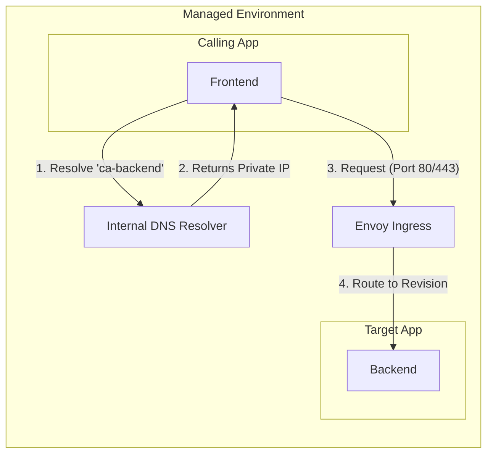

---
hide:
  - toc
---

# Service-to-Service Communication

Connect multiple Container Apps within the same environment.

## Overview

Container Apps in the same environment can communicate:
- Via internal DNS names
- Without exposing to public internet
- With optional Dapr service invocation

!!! warning "Do not hardcode revision-specific endpoints"
    Use app-level internal hostnames, not revision hostnames, for service calls.
    Revision names change during deployments and break static routing assumptions.

## Internal DNS

Each Container App gets an internal FQDN:
```
<app-name>.internal.<environment-unique-id>.<region>.azurecontainerapps.io
```

Or simply use the app name within the same environment:
```
http://<app-name>
```

### Internal Resolution Flow



## Example: Frontend + Backend

### Backend API (internal only):
```bicep
resource backendApp 'Microsoft.App/containerApps@2023-05-01' = {
  name: 'ca-backend'
  properties: {
    configuration: {
      ingress: {
        external: false  // Internal only
        targetPort: 8000
      }
    }
    // ...
  }
}
```

### Frontend calling Backend:
```python
import requests
import os

# Use internal DNS name
BACKEND_URL = os.environ.get('BACKEND_URL', 'http://ca-backend')

@app.route('/api/data')
def get_data():
    # Call internal backend service
    response = requests.get(f'{BACKEND_URL}/api/items')
    return response.json()
```

## With Dapr Service Invocation

Enable Dapr for service discovery and invocation:

```bicep
resource frontendApp 'Microsoft.App/containerApps@2023-05-01' = {
  name: 'ca-frontend'
  properties: {
    configuration: {
      dapr: {
        enabled: true
        appId: 'frontend'
        appPort: 8000
      }
    }
    // ...
  }
}
```

```python
import requests

# Dapr sidecar handles service discovery
DAPR_HTTP_PORT = 3500

@app.route('/api/data')
def get_data():
    # Invoke backend via Dapr
    response = requests.get(
        f'http://localhost:{DAPR_HTTP_PORT}/v1.0/invoke/backend/method/api/items'
    )
    return response.json()
```

## Benefits of Dapr

| Feature | Without Dapr | With Dapr |
|---------|--------------|-----------|
| Service Discovery | Manual DNS | Automatic |
| Retries | Implement yourself | Built-in |
| Tracing | Manual | Automatic |
| mTLS | Configure yourself | Automatic |

!!! tip "Add explicit timeouts and retries"
    Even with internal networking or Dapr service invocation, enforce client-side timeouts,
    bounded retries, and idempotency to avoid cascading failures.

## See Also
- [Dapr Integration](../../language-guides/python/recipes/dapr-integration.md)
- [VNet Integration](vnet-integration.md)
- [Egress Control](egress-control.md)

## Sources
- [Connect apps in Azure Container Apps (Microsoft Learn)](https://learn.microsoft.com/azure/container-apps/connect-apps)
- [Ingress overview in Azure Container Apps (Microsoft Learn)](https://learn.microsoft.com/azure/container-apps/ingress-overview)
