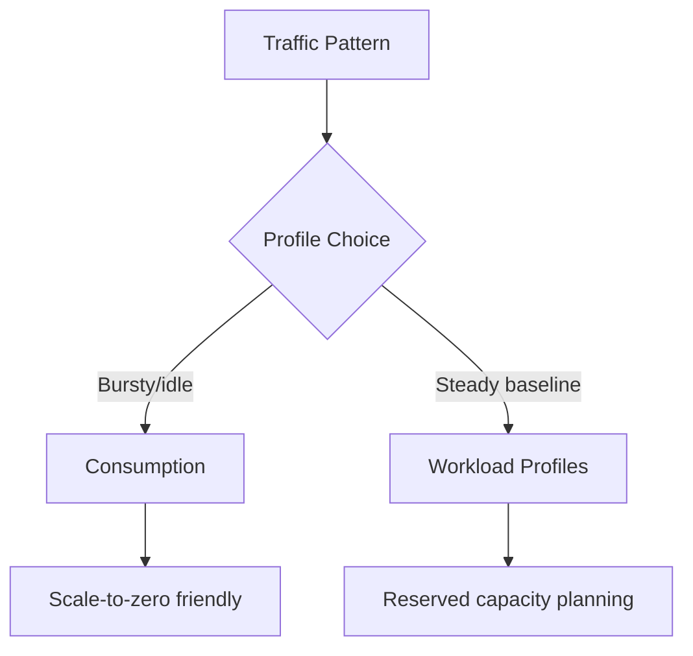

---
content_sources:
  diagrams:
  - id: workload-profiles-best-for-predictable-baseline
    type: flowchart
    source: mslearn-adapted
    based_on:
    - https://learn.microsoft.com/azure/container-apps/workload-profiles-overview
    - https://learn.microsoft.com/azure/container-apps/billing
content_validation:
  status: verified
  last_reviewed: '2026-04-12'
  reviewer: ai-agent
  core_claims:
  - claim: Azure Container Apps manages automatic horizontal scaling through declarative scaling rules.
    source: https://learn.microsoft.com/azure/container-apps/scale-app
    verified: true
  - claim: Azure Container Apps does not bill usage charges when a container app scales to zero.
    source: https://learn.microsoft.com/azure/container-apps/scale-app
    verified: true
  - claim: To ensure an instance of a revision is always running, the minimum number of replicas must be set to 1 or higher.
    source: https://learn.microsoft.com/azure/container-apps/scale-app
    verified: true
  - claim: Workload profiles environments support both Consumption and Dedicated plan types.
    source: https://learn.microsoft.com/azure/container-apps/networking
    verified: true
  - claim: The maximum number of replicas per revision can be configured up to 1,000.
    source: https://learn.microsoft.com/azure/container-apps/scale-app
    verified: true
---
# Cost Optimization Operations

This guide describes production cost operations for Azure Container Apps, including profile selection, scale-to-zero strategy, and spend governance.

## Prerequisites

- Access to subscription cost and usage data
- Known workload patterns (steady, bursty, event-driven)

```bash
export RG="rg-aca-prod"
export APP_NAME="app-python-api-prod"
export ENVIRONMENT_NAME="aca-env-prod"
```

## Choose the Right Runtime Profile

- **Consumption profile**: best for variable traffic and scale-to-zero scenarios.
- **Workload profiles**: best for predictable baseline load and dedicated capacity planning.

<!-- diagram-id: workload-profiles-best-for-predictable-baseline -->


!!! warning "Cost optimization without SLO context is risky"
    Lowering replicas or CPU aggressively can reduce spend but degrade latency and reliability.
    Validate changes against service objectives.

## Portal View: Replica Range and Scaler Type as Cost Levers

The Azure Portal **Scale** blade is the surface that names the replica range and scaler type that this page's [Cost Lever Matrix](#cost-lever-matrix) treats as cost levers.


**[Observed]** `ca-sample-d38538 | Scale`. `Container App`. `Refresh`. `Send us your feedback`. `Based on revision`. `ca-sample-d38538--0uzoi59`. `Scale`. `Scale rule settings`. `Control automatic scaling by setting the range of application replicas that'll be deployed in response to a trigger event. Use scale rules to determine the type of events that trigger scaling.` `Learn more`. `Min replicas`. `1`. `Min: 0`. `Max replicas`. `3`. `Max: 1000`. `Cooldown period`. `300`. `Polling interval`. `30`. `Current number of replicas`. `1 (View Details)`. `Scale rules`. `Add`. `Name`. `Type`. `Del...`. `http-scaler`. `HTTP scaling`. `Save as a new revision`. `Cancel`.

**[Inferred]** The `Min replicas` and `Max replicas` fields appear to map to the `minReplicas` and `maxReplicas` rows of this page's [Cost Lever Matrix](#cost-lever-matrix). The `Min replicas` placeholder text `Min: 0` is consistent with the floor this page's [Scale-to-Zero for Intermittent Workloads](#scale-to-zero-for-intermittent-workloads) section sets via `az containerapp update --min-replicas 0`.

**[Not Proven]** CPU and memory per replica are not shown on this blade. Workload profile selection is not shown. The HTTP scaler's threshold value is not shown. Cost in currency is not shown.

## Cost Lever Matrix

| Lever | Cost Impact | Reliability Impact | Recommended Guardrail |
|---|---|---|---|
| `minReplicas` | High | Cold starts possible when set to 0 | Keep critical APIs at 1+ warm replica |
| `maxReplicas` | Medium to high | Throttling risk if set too low | Tune to dependency capacity |
| CPU/memory per replica | Medium | OOM/restarts if undersized | Observe p95 utilization trends |
| Profile selection | High | Performance isolation varies | Reassess quarterly by workload type |

Inspect environment profile configuration:

```bash
az containerapp env show \
  --name "$ENVIRONMENT_NAME" \
  --resource-group "$RG" \
  --query "properties.workloadProfiles" \
  --output json
```

Review current app resource allocation:

```bash
az containerapp show \
  --name "$APP_NAME" \
  --resource-group "$RG" \
  --query "properties.template.containers[].resources" \
  --output json
```

| Command | Why it is used |
|---|---|
| `az containerapp show ...` | Reads the Container App configuration so the documented setting can be verified. |

## Scale-to-Zero for Intermittent Workloads

```bash
az containerapp update \
  --name "$APP_NAME" \
  --resource-group "$RG" \
  --min-replicas 0 \
  --max-replicas 5
```

| Command | Why it is used |
|---|---|
| `az containerapp update ...` | Updates the existing Container App configuration without recreating the app. |

Set conservative max replicas for non-critical services to cap runaway spend.

!!! tip "Use separate policies for critical vs non-critical apps"
    Apply tighter cost caps to batch/background services and protect user-facing APIs with stronger availability baselines.

## Cost Monitoring and Guardrails

List subscription costs by service for visibility:

```bash
az consumption usage list \
  --top 20 \
  --output table
```

| Command | Why it is used |
|---|---|
| `az consumption usage ...` | Runs the Azure CLI operation required by the documented step. |

Track request and replica trends with metrics to identify over-provisioning:

```bash
az monitor metrics list \
  --resource "/subscriptions/<subscription-id>/resourceGroups/$RG/providers/Microsoft.App/containerApps/$APP_NAME" \
  --metric "Replicas" \
  --interval "PT1H" \
  --output table
```

| Command | Why it is used |
|---|---|
| `az monitor metrics ...` | Creates or inspects Azure Monitor alerts, diagnostic settings, or metrics. |

## Verification Steps

```bash
az containerapp show \
  --name "$APP_NAME" \
  --resource-group "$RG" \
  --query "{minReplicas:properties.template.scale.minReplicas,maxReplicas:properties.template.scale.maxReplicas,resources:properties.template.containers[].resources}" \
  --output json
```

| Command | Why it is used |
|---|---|
| `az containerapp show ...` | Reads the Container App configuration so the documented setting can be verified. |

Example output (PII masked):

```json
{
  "minReplicas": 0,
  "maxReplicas": 5,
  "resources": [
    {
      "cpu": 0.5,
      "memory": "1Gi"
    }
  ]
}
```

## Troubleshooting

### Costs increased unexpectedly

- Check if `minReplicas` was changed from `0` to `1+`.
- Verify new scaler thresholds did not trigger excessive scale-out.
- Review revision rollouts that increased CPU/memory limits.

## Advanced Topics

- Use budget alerts and cost anomaly detection for proactive control.
- Separate critical and non-critical services into different cost centers.
- Combine workload profiles for baseline services and consumption for burst paths.

## See Also
- [Scaling](../../operations/scaling/index.md)
- [Observability](../../operations/monitoring/index.md)

## Sources
- [Container Apps workload profiles](https://learn.microsoft.com/azure/container-apps/workload-profiles-overview)
- [Azure Container Apps billing (Microsoft Learn)](https://learn.microsoft.com/azure/container-apps/billing)
