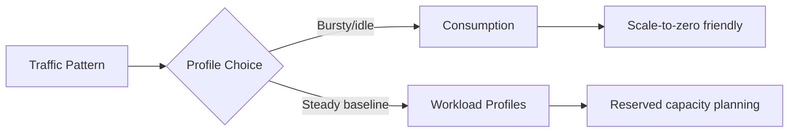

# Cost Optimization Operations

This guide describes production cost operations for Azure Container Apps, including profile selection, scale-to-zero strategy, and spend governance.

## Prerequisites

- Access to subscription cost and usage data
- Known workload patterns (steady, bursty, event-driven)

```bash
export RG="rg-aca-prod"
export APP_NAME="app-python-api-prod"
export ENVIRONMENT_NAME="aca-env-prod"
```

## Choose the Right Runtime Profile

- **Consumption profile**: best for variable traffic and scale-to-zero scenarios.
- **Workload profiles**: best for predictable baseline load and dedicated capacity planning.



!!! warning "Cost optimization without SLO context is risky"
    Lowering replicas or CPU aggressively can reduce spend but degrade latency and reliability.
    Validate changes against service objectives.

## Cost Lever Matrix

| Lever | Cost Impact | Reliability Impact | Recommended Guardrail |
|---|---|---|---|
| `minReplicas` | High | Cold starts possible when set to 0 | Keep critical APIs at 1+ warm replica |
| `maxReplicas` | Medium to high | Throttling risk if set too low | Tune to dependency capacity |
| CPU/memory per replica | Medium | OOM/restarts if undersized | Observe p95 utilization trends |
| Profile selection | High | Performance isolation varies | Reassess quarterly by workload type |

Inspect environment profile configuration:

```bash
az containerapp env show \
  --name "$ENVIRONMENT_NAME" \
  --resource-group "$RG" \
  --query "properties.workloadProfiles" \
  --output json
```

Review current app resource allocation:

```bash
az containerapp show \
  --name "$APP_NAME" \
  --resource-group "$RG" \
  --query "properties.template.containers[].resources" \
  --output json
```

## Scale-to-Zero for Intermittent Workloads

```bash
az containerapp update \
  --name "$APP_NAME" \
  --resource-group "$RG" \
  --min-replicas 0 \
  --max-replicas 5
```

Set conservative max replicas for non-critical services to cap runaway spend.

!!! tip "Use separate policies for critical vs non-critical apps"
    Apply tighter cost caps to batch/background services and protect user-facing APIs with stronger availability baselines.

## Cost Monitoring and Guardrails

List subscription costs by service for visibility:

```bash
az consumption usage list \
  --top 20 \
  --output table
```

Track request and replica trends with metrics to identify over-provisioning:

```bash
az monitor metrics list \
  --resource "/subscriptions/<subscription-id>/resourceGroups/$RG/providers/Microsoft.App/containerApps/$APP_NAME" \
  --metric "Replicas" \
  --interval "PT1H" \
  --output table
```

## Verification Steps

```bash
az containerapp show \
  --name "$APP_NAME" \
  --resource-group "$RG" \
  --query "{minReplicas:properties.template.scale.minReplicas,maxReplicas:properties.template.scale.maxReplicas,resources:properties.template.containers[].resources}" \
  --output json
```

Example output (PII masked):

```json
{
  "minReplicas": 0,
  "maxReplicas": 5,
  "resources": [
    {
      "cpu": 0.5,
      "memory": "1Gi"
    }
  ]
}
```

## Troubleshooting

### Costs increased unexpectedly

- Check if `minReplicas` was changed from `0` to `1+`.
- Verify new scaler thresholds did not trigger excessive scale-out.
- Review revision rollouts that increased CPU/memory limits.

## Advanced Topics

- Use budget alerts and cost anomaly detection for proactive control.
- Separate critical and non-critical services into different cost centers.
- Combine workload profiles for baseline services and consumption for burst paths.

## See Also
- [Scaling](../../operations/scaling/index.md)
- [Observability](../../operations/monitoring/index.md)

## Sources
- [Container Apps workload profiles](https://learn.microsoft.com/azure/container-apps/workload-profiles-overview)
- [Azure Container Apps billing (Microsoft Learn)](https://learn.microsoft.com/azure/container-apps/billing)
