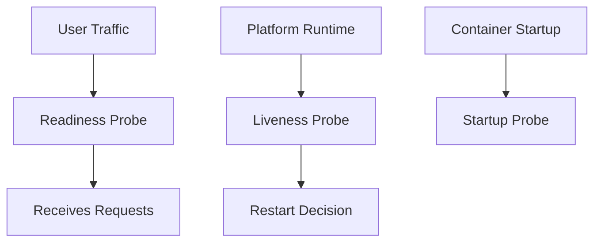

---
content_sources:
  diagrams:
    - id: configure-startup-liveness-and-readiness-probes
      type: flowchart
      source: mslearn-adapted
      based_on:
        - https://learn.microsoft.com/en-us/azure/container-apps/health-probes
        - https://learn.microsoft.com/en-us/azure/container-apps/revisions
content_validation:
  status: verified
  last_reviewed: '2026-04-12'
  reviewer: ai-agent
  core_claims:
    - claim: Revisions are snapshots of each version of a container app.
      source: https://learn.microsoft.com/en-us/azure/container-apps/revisions
      verified: true
    - claim: Revisions are immutable once they are established.
      source: https://learn.microsoft.com/en-us/azure/container-apps/revisions
      verified: true
    - claim: In single revision mode, the existing revision continues to receive traffic until the new revision is ready.
      source: https://learn.microsoft.com/en-us/azure/container-apps/revisions
      verified: true
    - claim: A new revision is considered ready only after it provisions successfully, scales to match the previous replica count, and its replicas pass startup and readiness probes.
      source: https://learn.microsoft.com/en-us/azure/container-apps/revisions
      verified: true
    - claim: Revision running status can include states such as Scale to 0, Activating, Running, Degraded, and Failed.
      source: https://learn.microsoft.com/en-us/azure/container-apps/revisions
      verified: true
---
# Health and Recovery Operations

This guide covers production health checks and recovery operations: probe tuning, restart behavior, and incident response patterns.

## Prerequisites

- Application exposes a reliable health endpoint (for example, `/health`)
- SRE runbook defines recovery time objective (RTO)

```bash
export RG="rg-aca-prod"
export APP_NAME="app-python-api-prod"
export ACA_ENV_NAME="aca-env-prod"
```

## Health Probe Configuration

Configure startup, liveness, and readiness probes in your Container App template:

<!-- diagram-id: configure-startup-liveness-and-readiness-probes -->


HTTP probes can include dependency-aware logic, but they should reflect the health signal you actually want the platform to act on. Microsoft Learn notes that HTTP probes "let you implement custom logic to check the status of application dependencies before reporting a healthy status," so keep basic process health separate from stricter dependency checks when you don't want every downstream failure to block readiness.

```bash
az containerapp update \
  --name "$APP_NAME" \
  --resource-group "$RG" \
  --yaml "./infra/containerapp-health.yaml"
```

| Command | Why it is used |
|---|---|
| `az containerapp update ...` | Updates the existing Container App configuration without recreating the app. |

Validate environment and platform-level status:

```bash
az resource show \
  --resource-group "$RG" \
  --resource-type "Microsoft.App/managedEnvironments" \
  --name "$ACA_ENV_NAME" \
  --output json
```

## Portal View: Revision State Before Recovery Actions

The Azure Portal **Revisions and replicas** blade is the surface that names the revision and reports its running status, which is also the input the recovery commands in this page operate on.


**[Observed]** Header: `ca-sample-d38538 | Revisions and replicas`, `Container App`. Toolbar: `Create new revision`, `Save`, `Refresh`, `Deployment mode`, `Send us your feedback`. Body text: `Each revision is an immutable snapshot of your container app, and can have different setups for traffic allocation, container images, autoscaling, or Dapr. Make updates to your app by creating a new revision.` `Learn more`. Tabs: `Active revisions`, `Inactive revisions`, `Replicas`. Column headers: `Name`, `Date created`, `Running status`, `View Logs`, `Label`, `Traffic`, `Replicas`. Row values: `ca-sample-d38538--0uzoi59`, `6/3/2026, 10:34:26 PM`, `Running`, `View details`, `Show Logs`, `100`, `%`, `1 (Show replicas)`.

**[Inferred]** The per-revision column `Running status` with value `Running` is consistent with this page's [Verification Steps](#verification-steps) reading revision-scoped state via `az containerapp revision list --output table`. The per-revision identifier under `Name` (`ca-sample-d38538--0uzoi59`) appears to map to the `--revision` argument shape this page's [Restart and Recovery Workflows](#restart-and-recovery-workflows) passes to `az containerapp revision restart`.

**[Not Proven]** Additional probe detail, restart detail, replica failure history detail, and health-state detail are not shown on this blade.

## Restart and Recovery Workflows

Restart a revision when transient faults occur:

```bash
az containerapp revision restart \
  --name "$APP_NAME" \
  --resource-group "$RG" \
  --revision "${APP_NAME}--stable"
```

For persistent failures, roll traffic back to a healthy revision (see revisions guide).

!!! tip "Prefer rollback over repeated restart loops"
    If failures continue after one restart cycle, route traffic to a known-good revision and investigate offline.

## Recovery Action Matrix

| Symptom | First Action | Escalation Action |
|---|---|---|
| Sporadic probe failures | Restart revision once | Increase probe delay and inspect dependency latency |
| All replicas failing readiness | Check configuration/secrets rollout | Shift traffic to prior healthy revision |
| Repeated liveness restarts | Inspect memory/CPU pressure and startup logs | Reduce resource contention and redeploy |
| Clustered multi-replica restart (≥2 replicas replaced within 60s) on a zone-redundant environment | Triage with the [zone redundancy mass-reschedule KQL pack](../../troubleshooting/kql/scaling-and-replicas/zone-redundancy-mass-reschedule.md) before assuming a per-replica zone failure | Apply the four-layer mitigation in the [Zone Redundancy Best-Effort playbook](../../troubleshooting/playbooks/platform-features/zone-redundancy-best-effort.md) |
| Environment-wide instability | Validate managed environment health | Activate incident response and failover runbook |

## Verification Steps

Check revision states and recent failures:

```bash
az containerapp revision list \
  --name "$APP_NAME" \
  --resource-group "$RG" \
  --output table
```

| Command | Why it is used |
|---|---|
| `az containerapp revision list ...` | Lists revisions so rollout state, traffic, and health can be verified. |

Review system logs for probe failures:

```bash
az containerapp logs show \
  --name "$APP_NAME" \
  --resource-group "$RG" \
  --type system \
  --follow false
```

| Command | Why it is used |
|---|---|
| `az containerapp logs show ...` | Runs the Azure CLI operation required by the documented step. |

Example output (PII masked):

```text
2026-04-02T09:10:21Z Probe failed: readiness check returned HTTP 503
2026-04-02T09:10:31Z Restarting container due to failed liveness probe
```

## Troubleshooting

### Frequent restarts

- Increase `initialDelaySeconds` for slow startup workloads.
- Confirm probe path and port match the application listener.
- Check downstream dependency outages causing readiness failures.

### App never becomes ready

- Inspect app logs for startup exceptions.
- Verify secrets and configuration are available at startup.

## Advanced Topics

- Separate startup and readiness logic to reduce false positives.
- Add synthetic probes from outside the environment for end-to-end health.
- Trigger automated recovery playbooks from alert rules.

## See Also
- [Revisions](../../operations/revision-management/index.md)
- [Observability](../../operations/monitoring/index.md)
- [Health Probes](../../operations/health-probes/index.md)
- [Zone Redundancy (Operations)](../../operations/disaster-recovery/zone-redundancy.md)
- [Zone Redundancy Best-Effort playbook](../../troubleshooting/playbooks/platform-features/zone-redundancy-best-effort.md)
- [Availability and Non-Guarantees](../../best-practices/availability-and-non-guarantees.md) — operator-facing enumeration of the five best-effort contracts (zone redundancy, node spread, clustered restart, rolling-rollout transient masking, single-region availability cap) with the Microsoft Learn disclosure for each.

## Sources
- [Azure Container Apps health probes](https://learn.microsoft.com/en-us/azure/container-apps/health-probes)
- [Azure Container Apps revisions (Microsoft Learn)](https://learn.microsoft.com/en-us/azure/container-apps/revisions)
