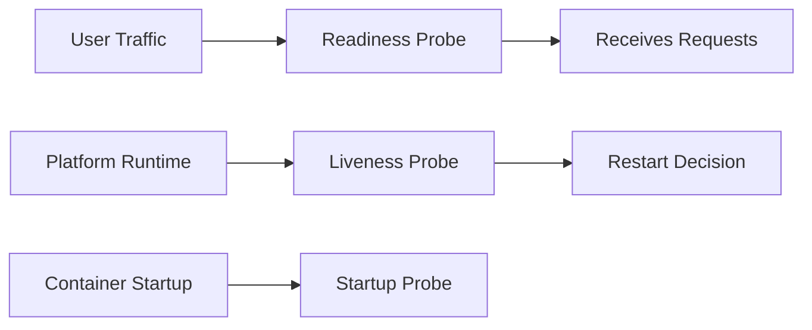

---
hide:
  - toc
content_sources:
  diagrams:
    - id: configure-startup-liveness-and-readiness-probes
      type: flowchart
      source: mslearn-adapted
      based_on:
        - https://learn.microsoft.com/azure/container-apps/health-probes
        - https://learn.microsoft.com/azure/container-apps/revisions
---

# Health and Recovery Operations

This guide covers production health checks and recovery operations: probe tuning, restart behavior, and incident response patterns.

## Prerequisites

- Application exposes a reliable health endpoint (for example, `/health`)
- SRE runbook defines recovery time objective (RTO)

```bash
export RG="rg-aca-prod"
export APP_NAME="app-python-api-prod"
export ENVIRONMENT_NAME="aca-env-prod"
```

## Health Probe Configuration

Configure startup, liveness, and readiness probes in your Container App template:

<!-- diagram-id: configure-startup-liveness-and-readiness-probes -->


!!! warning "Probe paths must reflect real dependency posture"
    If readiness requires unavailable downstream services, the app can stay unavailable even when the container is healthy.
    Separate process-health from dependency-health where appropriate.

```bash
az containerapp update \
  --name "$APP_NAME" \
  --resource-group "$RG" \
  --yaml "./infra/containerapp-health.yaml"
```

Validate environment and platform-level status:

```bash
az resource show \
  --resource-group "$RG" \
  --resource-type "Microsoft.App/managedEnvironments" \
  --name "$ENVIRONMENT_NAME" \
  --output json
```

## Restart and Recovery Workflows

Restart a revision when transient faults occur:

```bash
az containerapp revision restart \
  --name "$APP_NAME" \
  --resource-group "$RG" \
  --revision "${APP_NAME}--stable"
```

For persistent failures, roll traffic back to a healthy revision (see revisions guide).

!!! tip "Prefer rollback over repeated restart loops"
    If failures continue after one restart cycle, route traffic to a known-good revision and investigate offline.

## Recovery Action Matrix

| Symptom | First Action | Escalation Action |
|---|---|---|
| Sporadic probe failures | Restart revision once | Increase probe delay and inspect dependency latency |
| All replicas failing readiness | Check configuration/secrets rollout | Shift traffic to prior healthy revision |
| Repeated liveness restarts | Inspect memory/CPU pressure and startup logs | Reduce resource contention and redeploy |
| Environment-wide instability | Validate managed environment health | Activate incident response and failover runbook |

## Verification Steps

Check revision states and recent failures:

```bash
az containerapp revision list \
  --name "$APP_NAME" \
  --resource-group "$RG" \
  --output table
```

Review system logs for probe failures:

```bash
az containerapp logs show \
  --name "$APP_NAME" \
  --resource-group "$RG" \
  --type system \
  --follow false
```

Example output (PII masked):

```text
2026-04-02T09:10:21Z Probe failed: readiness check returned HTTP 503
2026-04-02T09:10:31Z Restarting container due to failed liveness probe
```

## Troubleshooting

### Frequent restarts

- Increase `initialDelaySeconds` for slow startup workloads.
- Confirm probe path and port match the application listener.
- Check downstream dependency outages causing readiness failures.

### App never becomes ready

- Inspect app logs for startup exceptions.
- Verify secrets and configuration are available at startup.

## Advanced Topics

- Separate startup and readiness logic to reduce false positives.
- Add synthetic probes from outside the environment for end-to-end health.
- Trigger automated recovery playbooks from alert rules.

## See Also
- [Revisions](../../operations/revision-management/index.md)
- [Observability](../../operations/monitoring/index.md)

## Sources
- [Azure Container Apps health probes](https://learn.microsoft.com/azure/container-apps/health-probes)
- [Azure Container Apps revisions (Microsoft Learn)](https://learn.microsoft.com/azure/container-apps/revisions)
