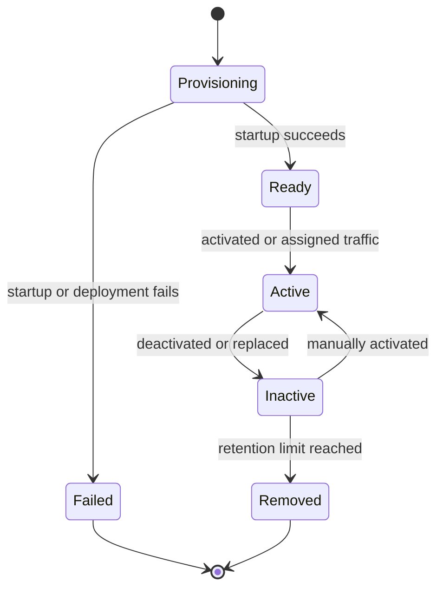

---
content_sources:
  diagrams:
    - id: documented-revision-lifecycle
      type: state
      source: self-generated
      justification: Synthesized from Microsoft Learn revision creation, activation, deactivation, and inactive-revision retention guidance.
      based_on:
        - https://learn.microsoft.com/en-us/azure/container-apps/revisions
        - https://learn.microsoft.com/en-us/azure/container-apps/revisions-manage
        - https://learn.microsoft.com/en-us/azure/container-apps/application-lifecycle-management
        - https://learn.microsoft.com/en-us/azure/templates/microsoft.app/2026-01-01/containerapps
content_validation:
  status: verified
  last_reviewed: '2026-04-25'
  reviewer: ai-agent
  core_claims:
    - claim: A revision is an immutable snapshot, and revision-scope changes create a new revision.
      source: https://learn.microsoft.com/en-us/azure/container-apps/revisions
      verified: true
    - claim: Azure Container Apps keeps up to 100 inactive revisions by default and supports the maxInactiveRevisions property.
      source: https://learn.microsoft.com/en-us/azure/container-apps/revisions
      verified: true
    - claim: Azure Container Apps lets you manually activate and deactivate revisions.
      source: https://learn.microsoft.com/en-us/azure/container-apps/revisions-manage
      verified: true
---
# Revision Lifecycle in Azure Container Apps

Revision lifecycle explains what happens from revision creation through activation, deactivation, and inactive retention. This is the platform view you need before designing rollout or cleanup policies.

## Documented lifecycle stages

Microsoft Learn documents revision creation and management behavior more clearly than it documents a single canonical state enum. In practice, these are the lifecycle checkpoints you can reason about safely:

- **Provisioning** — the platform creates the revision and prepares runtime resources.
- **Ready for activation** — the revision is healthy enough to receive traffic.
- **Active** — the revision can serve requests or process events.
- **Inactive** — the revision is retained but not serving traffic.
- **Removed** — the inactive revision ages out or is purged from retention.

!!! warning "Microsoft Learn does not publish one authoritative end-to-end revision state enum list"
    Azure CLI and API responses expose fields such as provisioning state, active status, health state, and running state. Use those fields for operational diagnosis, but treat undocumented enum combinations as implementation details rather than stable platform contracts.

<!-- diagram-id: documented-revision-lifecycle -->


## How revisions enter the lifecycle

Revision-scope changes create a new revision. Common examples include:

- container image changes
- scaling rule changes
- environment variable changes
- resource limit changes

Application-scope changes update the app without creating a new revision.

## Activation and deactivation

### Automatic activation

In single revision mode, the platform activates the new revision when it is ready and shifts traffic to it automatically.

### Manual activation and deactivation

In multiple revision mode, you can explicitly activate or deactivate revisions.

```bash
az containerapp revision activate \
  --name "$APP_NAME" \
  --resource-group "$RG" \
  --revision "$APP_NAME--20260425-1"

az containerapp revision deactivate \
  --name "$APP_NAME" \
  --resource-group "$RG" \
  --revision "$APP_NAME--20260420-3"
```

| Command | Why it is used |
|---|---|
| `az containerapp revision activate ...` | Runs the Azure CLI operation required by the documented step. |

Manual deactivation is useful when:

- a canary has failed
- a confidence window has ended
- you want to reduce operational noise before the retention limit is hit

## Inactive revision retention

Container Apps keeps inactive revisions so you can inspect or reactivate them later.

- Default inactive retention: **up to 100** inactive revisions.
- ARM/Bicep property: `maxInactiveRevisions`.
- Older inactive revisions are purged when the retention limit is exceeded.

```yaml
configuration:
  maxInactiveRevisions: 50
```

!!! tip "Retention is for rollback safety, not long-term history"
    Keep enough inactive revisions for your rollback window, but do not treat revision retention as a release archive.

## Auto-deactivation behavior

| Mode | Auto-deactivation behavior |
|---|---|
| Single | The prior active revision is deprovisioned after successful cutover |
| Multiple | Older revisions stay active until you change traffic or deactivate them |

This difference is why cleanup policy matters much more in multiple revision mode.

## Operational checks

Use revision queries to inspect lifecycle-related fields during rollout or incident response.

```bash
az containerapp revision list \
  --name "$APP_NAME" \
  --resource-group "$RG" \
  --query "[].{name:name,active:properties.active,createdTime:properties.createdTime,healthState:properties.healthState,runningState:properties.runningState}" \
  --output table
```

| Command | Why it is used |
|---|---|
| `az containerapp revision list ...` | Lists revisions so rollout state, traffic, and health can be verified. |

## Portal view: Revisions and replicas blade


[Observed] The blade header reads `<your-app-name> | Revisions and replicas` with the subtitle `Container App`. The command bar exposes `Create new revision`, `Save`, `Refresh`, `Deployment mode`, and `Send us your feedback`. A tab strip shows `Active revisions` (selected), `Inactive revisions`, and `Replicas`. The `Active revisions` table has columns `Name`, `Date created`, `Running status`, `View Logs`, `Label`, `Traffic`, `Replicas`, and `Active`. Two rows are listed: `<your-app-name>--<revision-suffix-1>` with `Date created 6/3/2026, 11:40:04 PM`, `Running` status with a `View details` link, a `Replicas` count of `1`, and the `Active` checkbox checked; and `<your-app-name>--<revision-suffix-2>` with `Date created 6/3/2026, 10:34:26 PM`, `Running` status with a `View details` link, a `Replicas` count of `1`, and the `Active` checkbox checked. The left navigation highlights `Revisions and replicas` under `Application`.

[Inferred] The `Create new revision` command in the command bar appears to map to the "How revisions enter the lifecycle" section above, which lists the revision-scope changes (image, scaling rules, environment variables, resource limits) that produce a new revision. The `Active revisions` and `Inactive revisions` tabs are consistent with the `Active` and `Inactive` checkpoints in the "Documented lifecycle stages" list. The `Active` checkbox column paired with the `Save` command is consistent with the manual activation/deactivation capability described in the "Manual activation and deactivation" section, which uses the `az containerapp revision activate` and `az containerapp revision deactivate` commands. The `Date created` column is consistent with the `createdTime` field returned by the `az containerapp revision list` query in the "Operational checks" section.

[Not Proven] The screenshot does not show the dialog that opens after clicking `Create new revision`, so the form fields for revision-scope changes are outside the scope of this image. It does not show the contents of the `Inactive revisions` tab, so the `maxInactiveRevisions` retention behavior and the count of retained inactive revisions are not visible. It does not show the `Replicas` tab contents, the `View details` panel, or the prompt that follows toggling an `Active` checkbox and clicking `Save`.

## See Also

- [Revisions Overview](index.md)
- [Revision Modes](revision-modes.md)
- [Traffic Split](traffic-split.md)
- [Revision Operations](../../operations/revision-management/index.md)
- [Bad Revision Rollout and Rollback](../../troubleshooting/playbooks/platform-features/bad-revision-rollout-and-rollback.md)

## Sources

- [Revisions in Azure Container Apps (Microsoft Learn)](https://learn.microsoft.com/en-us/azure/container-apps/revisions)
- [Manage revisions in Azure Container Apps (Microsoft Learn)](https://learn.microsoft.com/en-us/azure/container-apps/revisions-manage)
- [Application lifecycle management in Azure Container Apps (Microsoft Learn)](https://learn.microsoft.com/en-us/azure/container-apps/application-lifecycle-management)
- [Microsoft.App/containerApps template reference (Microsoft Learn)](https://learn.microsoft.com/en-us/azure/templates/microsoft.app/2026-01-01/containerapps)
