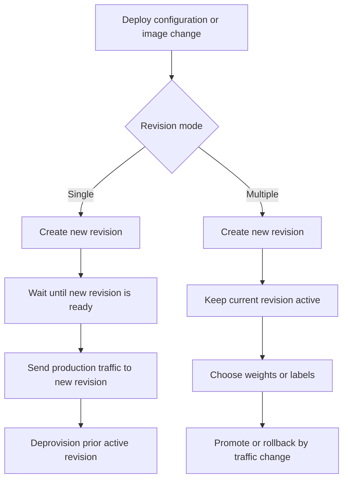
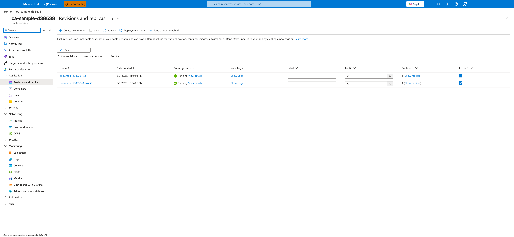

---
content_sources:
  diagrams:
  - id: revision-mode-comparison
    type: flowchart
    source: self-generated
    justification: Synthesized from Microsoft Learn guidance on single and multiple revision modes.
    based_on:
    - https://learn.microsoft.com/azure/container-apps/revisions
    - https://learn.microsoft.com/azure/container-apps/revisions-manage
content_validation:
  status: verified
  last_reviewed: '2026-04-25'
  reviewer: ai-agent
  core_claims:
  - claim: Azure Container Apps supports single and multiple revision modes, and single revision mode is the default.
    source: https://learn.microsoft.com/azure/container-apps/revisions
    verified: true
  - claim: In single revision mode, Container Apps provisions and activates the new revision and diverts traffic to it after
      it is ready.
    source: https://learn.microsoft.com/azure/container-apps/revisions
    verified: true
  - claim: In multiple revision mode, you can keep more than one revision active and split traffic between revisions.
    source: https://learn.microsoft.com/azure/container-apps/revisions
    verified: true
  - claim: The container app configuration property for revision mode is activeRevisionsMode.
    source: https://learn.microsoft.com/azure/templates/microsoft.app/2026-01-01/containerapps
    verified: true
---
# Revision Modes in Azure Container Apps

Revision mode decides whether Azure Container Apps keeps one active revision or several active revisions at the same time. It changes how deployment promotion, rollback, and traffic management work.

## Revision Modes

Azure Container Apps exposes revision mode through the `activeRevisionsMode` property.

| Mode | Active revisions | Best fit | Operational effect |
|---|---|---|---|
| `Single` | One | Standard production updates, simple zero-downtime replacement | Platform activates the new revision and deprovisions the old one after cutover |
| `Multiple` | One or more | Canary, blue/green, A/B testing, staged rollback | You decide which revisions stay active and how ingress traffic is distributed |

<!-- diagram-id: revision-mode-comparison -->


### Single revision mode

Use single revision mode when you want the platform to handle cutover automatically.

- It is the default mode.
- Container Apps provisions and activates the new revision before diverting traffic.
- If an update fails, traffic remains on the old revision.
- You do not manage weighted traffic between old and new revisions.

This mode is usually the safest choice for stateless services that only need straightforward zero-downtime replacement.

### Multiple revision mode

Use multiple revision mode when rollout control matters more than simplicity.

- Multiple revisions can stay active at the same time.
- You can split traffic by revision name, by label, or by routing all traffic to the latest revision.
- Rollback is usually a traffic update, not a redeploy.
- Old revisions remain your responsibility until you deactivate them.

This mode is the right platform primitive for canary and blue/green patterns.

## How activation behaves

Activation behavior is different enough that it should drive your mode choice.

### In single mode

The platform owns the promotion sequence:

1. Create the new revision.
2. Wait for the revision to become ready.
3. Move production traffic.
4. Deprovision the previous revision.

### In multiple mode

The platform creates the revision, but you own promotion decisions:

1. Create the new revision.
2. Keep the prior revision active.
3. Assign labels or weights.
4. Deactivate older revisions when the confidence window ends.

```bash
az containerapp revision set-mode \
  --name "$APP_NAME" \
  --resource-group "$RG" \
  --mode multiple
```

## Deployment, rollback, and traffic implications

| Concern | Single mode | Multiple mode |
|---|---|---|
| Deployment promotion | Automatic after readiness | Manual, usually through traffic or label changes |
| Rollback speed | Re-deploy or restore previous configuration | Immediate if a stable revision is still active |
| Weighted traffic split | Not available | Native capability |
| Label-based validation | Not applicable | Native capability |
| Operational overhead | Lower | Higher |

!!! tip "Choose the simplest mode that matches your release strategy"
    If you do not need side-by-side validation or partial production exposure, stay in single revision mode.

!!! warning "Multiple revision mode increases release flexibility and operational responsibility"
    Microsoft Learn documents how to keep several revisions active and split traffic between them, but it also means you must explicitly clean up older revisions and avoid accidental drift.

## Practical guidance

Choose **single** when:

- Production traffic should always go to one revision.
- Release automation should stay simple.
- Your rollback plan does not require pre-warmed side-by-side revisions.

Choose **multiple** when:

- You need a controlled canary window.
- You want blue/green labels for deterministic validation.
- You need instant rollback by moving traffic rather than rebuilding artifacts.

## Portal view: Revisions and replicas blade



[Observed] The blade header reads `<your-app-name> | Revisions and replicas` with the subtitle `Container App`. The command bar exposes `Create new revision`, `Save`, `Refresh`, `Deployment mode`, and `Send us your feedback`. A banner above the table describes each revision as an immutable snapshot of the container app. A tab strip shows `Active revisions` (selected), `Inactive revisions`, and `Replicas`. The `Active revisions` table has columns `Name`, `Date created`, `Running status`, `View Logs`, `Label`, `Traffic`, `Replicas`, and `Active`. Two rows are listed: `<your-app-name>--<revision-suffix-1>` with a `Traffic` editor showing `30 %` and the `Active` checkbox checked, and `<your-app-name>--<revision-suffix-2>` with a `Traffic` editor showing `70 %` and the `Active` checkbox checked. Both rows show `Running` status and a single replica count. The left navigation highlights `Revisions and replicas` under `Application`.

[Inferred] The `Deployment mode` button in the command bar appears to map to the `activeRevisionsMode` property described in the "Revision Modes" table above, which is the same setting toggled by the `az containerapp revision set-mode` command shown in the "In multiple mode" section. The presence of two rows with independent `Traffic` percentage editors and `Active` checkboxes on the same blade is consistent with the multiple-mode capability described in the "Multiple revision mode" section, where the page explains that you split traffic between active revisions rather than letting the platform deprovision the older one.

[Not Proven] The panel that opens after clicking `Deployment mode` is not shown in this capture, so the exact label and radio shape of the `Single` and `Multiple` choices on that panel are outside the scope of this image. The blade also does not show how the `Inactive revisions` and `Replicas` tabs render, nor what happens when the `Active` checkbox is unchecked and `Save` is clicked.

## See Also

- [Revisions Overview](index.md)
- [Traffic Split](traffic-split.md)
- [Revision Lifecycle](lifecycle.md)
- [Revision Strategy Best Practices](../../best-practices/revision-strategy.md)
- [Revision Operations](../../operations/revision-management/index.md)

## Sources

- [Revisions in Azure Container Apps (Microsoft Learn)](https://learn.microsoft.com/azure/container-apps/revisions)
- [Manage revisions in Azure Container Apps (Microsoft Learn)](https://learn.microsoft.com/azure/container-apps/revisions-manage)
- [Microsoft.App/containerApps template reference (Microsoft Learn)](https://learn.microsoft.com/azure/templates/microsoft.app/2026-01-01/containerapps)
