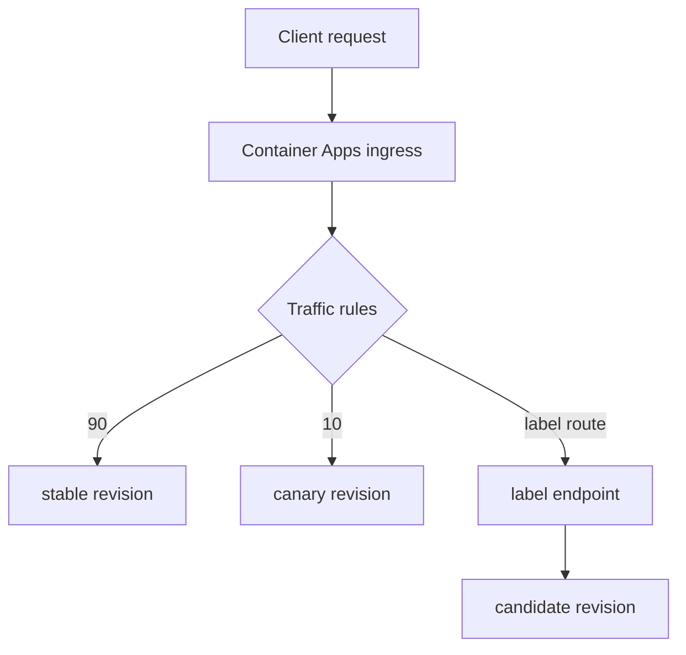

---
content_sources:
  diagrams:
    - id: weighted-traffic-routing
      type: flowchart
      source: self-generated
      justification: Synthesized from Microsoft Learn traffic-splitting and revision-label routing guidance.
      based_on:
        - https://learn.microsoft.com/en-us/azure/container-apps/traffic-splitting
        - https://learn.microsoft.com/en-us/azure/container-apps/deployment-labels
        - https://learn.microsoft.com/en-us/azure/templates/microsoft.app/2026-01-01/containerapps
content_validation:
  status: verified
  last_reviewed: '2026-04-25'
  reviewer: ai-agent
  core_claims:
    - claim: Traffic weights in Azure Container Apps can target a revision name, a label, or the latest revision.
      source: https://learn.microsoft.com/en-us/azure/templates/microsoft.app/2026-01-01/containerapps
      verified: true
    - claim: Traffic percentages across revisions must add up to 100.
      source: https://learn.microsoft.com/en-us/azure/container-apps/traffic-splitting
      verified: true
    - claim: Labels provide a stable URL that routes to a specific revision.
      source: https://learn.microsoft.com/en-us/azure/container-apps/deployment-labels
      verified: true
---
# Traffic Split in Azure Container Apps

Traffic split in Azure Container Apps lets you route ingress requests across active revisions by percentage or by label. It is the core platform feature behind canary, blue/green, and revision-specific validation.

## Weighted traffic routing

Traffic configuration is expressed through traffic weight entries. Each entry can target one of these selectors:

- `revisionName`
- `label`
- `latestRevision`

Each traffic entry also includes a `weight` percentage.

<!-- diagram-id: weighted-traffic-routing -->


### Core constraints

Microsoft Learn explicitly documents these routing constraints:

- Weighted traffic is for **ingress-enabled** apps.
- Traffic percentages must total **100**.
- Weighted split requires **multiple revision mode**.
- Label routing targets a single revision per label.

!!! warning "Microsoft Learn does not publish an authoritative maximum number of traffic entries per split"
    Keep weighted configurations small and explicit. If you need a hard platform limit for a design review, verify it against the current service contract before relying on it.

## `latestRevision` behavior

`latestRevision: true` tells Container Apps to route traffic to the latest stable revision instead of naming a specific revision.

Use it when:

- You want automatic routing to the newest stable revision.
- You do not need explicit naming in your traffic configuration.

Avoid it when:

- You need deterministic rollback to a specific known-good revision.
- You are running a controlled canary where exact revision identity matters.

## Label-based routing

Labels create deterministic revision endpoints without changing main production traffic.

Container Apps generates a label URL in this pattern:

`<app>--<label>.<domain>`

That makes labels useful for:

- pre-production verification
- partner validation against a stable endpoint
- blue/green swap patterns

```bash
az containerapp revision label add \
  --name "$APP_NAME" \
  --resource-group "$RG" \
  --revision "$APP_NAME--20260425-1" \
  --label "green"
```

| Command | Why it is used |
|---|---|
| `az containerapp revision label ...` | Runs the Azure CLI operation required by the documented step. |

Labels are movable. Reassigning a label changes which revision answers requests for that label URL.

## Common traffic operations

### Set weighted split by revision name

```bash
az containerapp ingress traffic set \
  --name "$APP_NAME" \
  --resource-group "$RG" \
  --revision-weight "$APP_NAME--stable=95" "$APP_NAME--canary=5"
```

| Command | Purpose |
|---|---|
| `az containerapp ingress traffic set` | Applies a weighted rollout so a small portion of live requests can validate the canary revision before full promotion. |
| `--revision-weight "$APP_NAME--stable=95" "$APP_NAME--canary=5"` | Keeps 95 percent of traffic on the stable revision while exposing only 5 percent to the candidate, which is the core canary safety control. |

### Route traffic by label

```bash
az containerapp ingress traffic set \
  --name "$APP_NAME" \
  --resource-group "$RG" \
  --label-weight "blue=100"
```

| Command | Purpose |
|---|---|
| `az containerapp ingress traffic set --label-weight "blue=100"` | Sends all production traffic to the revision currently holding the `blue` label, which is a clean fit for blue/green swaps where labels represent release roles. |
| `--label-weight` | Routes by movable label instead of by raw revision name, allowing you to repoint the role later without changing client-facing terminology. |

### Send all traffic to the latest stable revision

```yaml
configuration:
  ingress:
    traffic:
      - latestRevision: true
        weight: 100
```

## Operational guidance

| Need | Prefer | Why |
|---|---|---|
| Gradual production exposure | `revisionName` + `weight` | Explicit and auditable |
| Stable validation URL | `label` | Deterministic routing outside the main split |
| Automatic newest-stable route | `latestRevision: true` | Fewer named revisions in config |
| Fast rollback | Named stable revision with retained weight entry | No redeploy required |

!!! tip "Use labels and weights together"
    Labels solve validation and partner routing. Weights solve production migration. Treat them as complementary controls, not substitutes.

## Portal view: Revisions and replicas blade


[Observed] The blade header reads `ca-sample-d38538 | Revisions and replicas` with the subtitle `Container App`. The command bar exposes `+ Create new revision`, `Save`, `Refresh`, `Deployment mode`, and `Send us your feedback`. Below the command bar a description reads "Each revision is an immutable snapshot of your container app, and can have different setups for traffic allocation, container images, autoscaling, or Dapr. Make updates to your app by creating a new revision." with a `Learn more` link. Three tabs are rendered: `Active revisions` (selected), `Inactive revisions`, and `Replicas`. The `Active revisions` table has columns `Name`, `Date created`, `Running status`, `View Logs`, `Label`, `Traffic`, `Replicas`, and `Active`. Two rows are listed: `ca-sample-d38538--v2` with `Running` status, an empty `Label` text box, `Traffic` value `30 %`, `1` replica, and an `Active` checkbox marked; and `ca-sample-d38538--0uzoi59` with `Running` status, an empty `Label` text box, `Traffic` value `70 %`, `1` replica, and an `Active` checkbox marked.

[Inferred] The two rows with traffic values that sum to 100 are consistent with the "Traffic percentages must total 100" constraint described in the Core constraints section above. The presence of two simultaneously `Active` revisions appears to map to the "Weighted split requires multiple revision mode" constraint described in that same section. The `Label` text box rendered inline on each row is consistent with the `label` selector documented in the Weighted traffic routing section.

[Not Proven] The screenshot does not include the `Deployment mode` panel contents, so it does not show which revision mode value is currently selected. The empty `Label` text boxes on both rows are visible but the screenshot does not show whether they are read-only or editable. The `Inactive revisions` and `Replicas` tabs are present but their contents are not displayed in this capture.

## See Also

- [Revisions Overview](index.md)
- [Revision Modes](revision-modes.md)
- [Revision Lifecycle](lifecycle.md)
- [Blue/Green Deployment](../../best-practices/blue-green-deployment.md)
- [Canary Deployment](../../best-practices/canary-deployment.md)

## Sources

- [Traffic splitting in Azure Container Apps (Microsoft Learn)](https://learn.microsoft.com/en-us/azure/container-apps/traffic-splitting)
- [Deployment labels in Azure Container Apps (Microsoft Learn)](https://learn.microsoft.com/en-us/azure/container-apps/deployment-labels)
- [Microsoft.App/containerApps template reference (Microsoft Learn)](https://learn.microsoft.com/en-us/azure/templates/microsoft.app/2026-01-01/containerapps)
