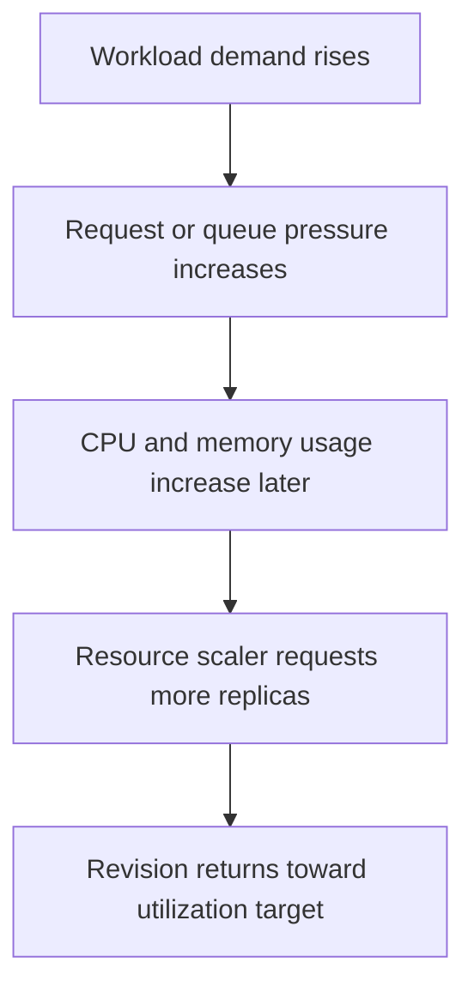

---
content_sources:
  diagrams:
  - id: cpu-memory-scaler-positioning
    type: flowchart
    source: self-generated
    justification: Synthesized from Microsoft Learn CPU and memory scaling guidance and workload profile overview.
    based_on:
    - https://learn.microsoft.com/azure/container-apps/tutorial-scaling
    - https://learn.microsoft.com/azure/container-apps/scale-app
    - https://learn.microsoft.com/azure/container-apps/workload-profiles-overview
content_validation:
  status: verified
  last_reviewed: '2026-04-25'
  reviewer: ai-agent
  core_claims:
  - claim: Azure Container Apps supports CPU and memory scale rules.
    source: https://learn.microsoft.com/azure/container-apps/tutorial-scaling
    verified: true
  - claim: CPU and memory scaling do not allow a container app to scale to zero.
    source: https://learn.microsoft.com/azure/container-apps/tutorial-scaling
    verified: true
  - claim: Workload profiles in Azure Container Apps define available compute and billing models, including Consumption, Dedicated,
      and Flex.
    source: https://learn.microsoft.com/azure/container-apps/workload-profiles-overview
    verified: true
---
# CPU and Memory Scalers in Azure Container Apps

CPU and memory scalers protect a revision when the real bottleneck is sustained resource pressure. They are useful, but they should rarely be your only scaling signal for user-facing traffic.

## Rule shape

CPU and memory scalers use custom rules with the scaler `type` set to `cpu` or `memory`.

```yaml
template:
  scale:
    minReplicas: 1
    maxReplicas: 10
    rules:
      - name: cpu-rule
        custom:
          type: cpu
          metadata:
            type: Utilization
            value: "70"
      - name: memory-rule
        custom:
          type: memory
          metadata:
            type: Utilization
            value: "80"
```

<!-- diagram-id: cpu-memory-scaler-positioning -->


## What Microsoft Learn confirms

- CPU scaling can add replicas when average CPU utilization reaches the configured threshold.
- Memory scaling can add replicas when average memory utilization reaches the configured threshold.
- CPU and memory scaling **do not allow scale-to-zero**.

## Workload profiles requirement

!!! warning "Dedicated workload profile requirement is unverified in current Microsoft Learn documentation"
    Microsoft Learn documents workload profiles and documents CPU and memory scale rules, but the current Learn pages do not state that CPU or memory scalers require a Dedicated workload profile. If your architecture review depends on that claim, treat it as unverified and validate against the current product documentation before enforcing it as policy.

What Learn does confirm is that workload profiles define the compute and billing model for the environment:

- **Consumption**
- **Dedicated**
- **Consumption + Dedicated mix**
- **Flex Consumption** preview behavior

## When to use CPU and memory rules

Use CPU or memory scaling when:

- requests are CPU-heavy and sustained
- memory growth tracks real work
- you need a protective signal against saturation

Do not rely on CPU or memory alone when:

- incoming work is visible sooner through HTTP or queue backlog
- bursts arrive faster than resource counters react

## Common gotchas

- **Lagging signal** — resource utilization usually rises after demand arrives.
- **Oscillation risk** — mismatched thresholds and low `maxReplicas` can cause noisy scaling.
- **No scale-to-zero** — these rules keep at least one replica.

```bash
az containerapp update \
  --name "$APP_NAME" \
  --resource-group "$RG" \
  --min-replicas 1 \
  --max-replicas 10 \
  --scale-rule-name "cpu-protect" \
  --scale-rule-type cpu \
  --scale-rule-metadata "type=Utilization" "value=70"
```

| Command | Why it is used |
|---|---|
| `az containerapp update ...` | Updates the existing Container App configuration without recreating the app. |

### Portal view: Scale blade (no-scale-to-zero lower bound)


[Observed] On the `Scale` tab, the `Scale rule settings` section shows a `Min / max replicas` row with the value `1 - 3`. The `Scale rules` section shows the empty-state message `There are no scaling rules defined for this revision`.

[Inferred] The `Min / max replicas` lower bound rendered as `1` (rather than `0`) is consistent with this page's note under [Common gotchas](#common-gotchas) that CPU and memory rules `keep at least one replica`. The empty `Scale rules` state is consistent with the YAML example under [Rule shape](#rule-shape), where `cpu` and `memory` rules would appear as entries under `template.scale.rules` rather than as values on the `Min / max replicas` row.

[Not Proven] This image does not show any `cpu` or `memory` rule configured, so the `type=Utilization` and `value` metadata fields shown in the YAML and `az containerapp update` examples above are not visualized here. It does not show the `Edit and deploy` panel that would surface the rule-type picker, so the Portal control that maps to `--scale-rule-type cpu` is outside the scope of this capture. It does not show any utilization metric or live replica count, so the lagging-signal and oscillation behaviors described under [Common gotchas](#common-gotchas) are not represented in this image.

## See Also

- [Scaling Overview](index.md)
- [HTTP Scaler](http-scaler.md)
- [Scaling Rules Reference](scaling-rules-reference.md)
- [Scaling Best Practices](../../best-practices/scaling.md)
- [CrashLoop OOM and Resource Pressure](../../troubleshooting/playbooks/scaling-and-runtime/crashloop-oom-and-resource-pressure.md)

## Sources

- [Tutorial: Scale an Azure Container Apps application (Microsoft Learn)](https://learn.microsoft.com/azure/container-apps/tutorial-scaling)
- [Set scaling rules in Azure Container Apps (Microsoft Learn)](https://learn.microsoft.com/azure/container-apps/scale-app)
- [Workload profiles in Azure Container Apps (Microsoft Learn)](https://learn.microsoft.com/azure/container-apps/workload-profiles-overview)
