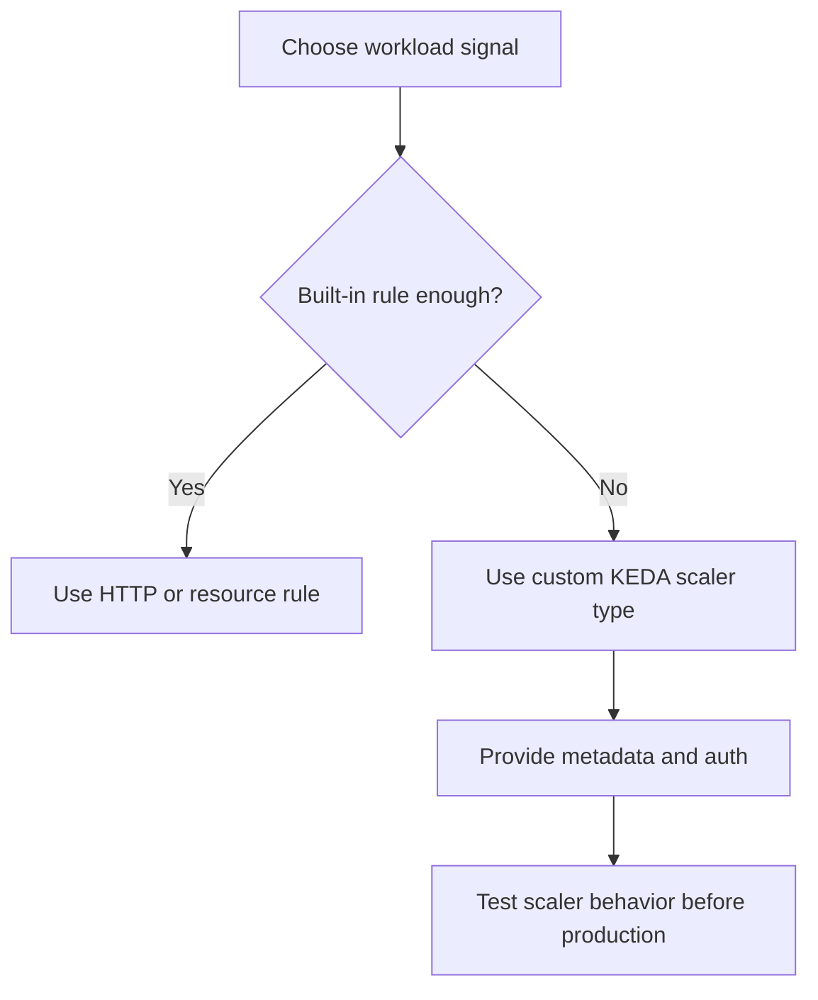

---
content_sources:
  diagrams:
  - id: custom-scaler-extension-path
    type: flowchart
    source: self-generated
    justification: Synthesized from Microsoft Learn documentation describing custom scale rules based on KEDA ScaledObject
      scalers.
    based_on:
    - https://learn.microsoft.com/azure/container-apps/scale-app
content_validation:
  status: verified
  last_reviewed: '2026-04-25'
  reviewer: ai-agent
  core_claims:
  - claim: Azure Container Apps supports custom scale rules based on KEDA ScaledObject scalers.
    source: https://learn.microsoft.com/azure/container-apps/scale-app
    verified: true
  - claim: Custom scale rules use a type plus metadata, and authentication can use secretRef or managed identity.
    source: https://learn.microsoft.com/azure/container-apps/scale-app
    verified: true
---
# Custom Scalers in Azure Container Apps

Custom scalers let you bring KEDA-backed trigger types into Azure Container Apps when HTTP, CPU, memory, or the common event examples are not enough. The Container Apps platform documents this as custom scaling based on ScaledObject scalers.

## Custom rule shape

```yaml
template:
  scale:
    minReplicas: 0
    maxReplicas: 20
    rules:
      - name: custom-rule
        custom:
          type: <scaler-type>
          metadata:
            <key>: <value>
          auth:
            - secretRef: <secret-name>
              triggerParameter: <parameter-name>
```

<!-- diagram-id: custom-scaler-extension-path -->


## What Microsoft Learn confirms

- Container Apps supports **custom** scale rules.
- These rules are based on **KEDA ScaledObject scalers**.
- Authentication can be wired with secret mappings or managed identity.

## Authentication patterns

Use these patterns when the scaler needs credentials:

- `secretRef` for trigger parameters that expect a named secret
- `identity` when the scaler supports managed identity

## Example: generic custom scaler shape

```json
{
  "name": "custom-trigger",
  "custom": {
    "type": "<scaler-type>",
    "metadata": {
      "<key>": "<value>"
    },
    "auth": [
      {
        "secretRef": "<secret-name>",
        "triggerParameter": "<parameter-name>"
      }
    ]
  }
}
```

## Example: cron or Prometheus-style bring-your-own scaler

!!! warning "Cron and Prometheus metadata examples are not currently documented in Azure Container Apps Microsoft Learn pages"
    Microsoft Learn confirms the custom-scaler extension path through KEDA, but it does not provide a first-party ACA example for every scaler family. Treat any cron- or Prometheus-specific metadata as scaler-contract validation work, not as a service default.

A safe operating pattern is:

1. define the custom scaler type and metadata in infrastructure code
2. wire secrets or identity explicitly
3. validate scaling in a non-production environment
4. keep `maxReplicas` conservative until observed behavior is understood

### Portal view: Scale blade (empty rules section where a custom scaler would appear)


[Observed] The selected `Scale` tab shows a `Scale rules` section whose body is the empty-state message `There are no scaling rules defined for this revision`. No row of the type `custom-trigger`, no `type` field, no `metadata` block, and no `auth` block is visible inside the `Scale rules` section.

[Inferred] The `Scale rules` section header rendered above the empty-state message is consistent with this page's description under [Custom rule shape](#custom-rule-shape) of custom scalers as entries living inside `template.scale.rules`. The empty state on this revision is consistent with the [Example: generic custom scaler shape](#example-generic-custom-scaler-shape) JSON snippet describing what a `custom` entry's `type`, `metadata`, and `auth` fields would look like once added.

[Not Proven] This image does not show any configured `custom` rule row, and the `<scaler-type>`, `metadata`, and `auth` fields from the YAML and JSON examples above are not visualized here. It does not show any `secretRef` or `identity` field corresponding to the choices described under [Authentication patterns](#authentication-patterns). It does not show the `Edit and deploy` panel.

## Review Matrix

| Review area | Page-specific check |
|---|---|
| Scope | Confirm the guidance applies to Custom Scalers in Azure Container Apps. |
| Source basis | Validate the recommendation against the Microsoft Learn sources in this page. |
| Evidence | Capture command output, portal state, metrics, logs, or screenshots before treating the result as proven. |

## See Also

- [Scaling Overview](index.md)
- [Event Scalers](event-scalers.md)
- [Scaling Rules Reference](scaling-rules-reference.md)
- [Scaling Best Practices](../../best-practices/scaling.md)

## Sources

- [Set scaling rules in Azure Container Apps (Microsoft Learn)](https://learn.microsoft.com/azure/container-apps/scale-app)
