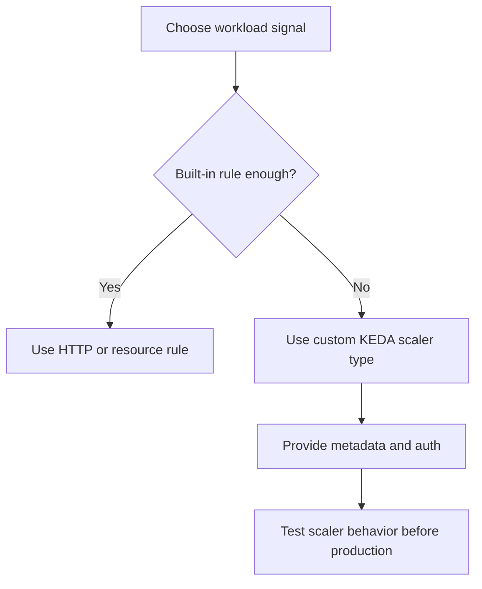

---
content_sources:
  diagrams:
    - id: custom-scaler-extension-path
      type: flowchart
      source: self-generated
      justification: Synthesized from Microsoft Learn documentation describing custom scale rules based on KEDA ScaledObject scalers.
      based_on:
        - https://learn.microsoft.com/azure/container-apps/scale-app
content_validation:
  status: verified
  last_reviewed: "2026-04-25"
  reviewer: ai-agent
  core_claims:
    - claim: "Azure Container Apps supports custom scale rules based on KEDA ScaledObject scalers."
      source: "https://learn.microsoft.com/azure/container-apps/scale-app"
      verified: true
    - claim: "Custom scale rules use a type plus metadata, and authentication can use secretRef or managed identity."
      source: "https://learn.microsoft.com/azure/container-apps/scale-app"
      verified: true
---

# Custom Scalers in Azure Container Apps

Custom scalers let you bring KEDA-backed trigger types into Azure Container Apps when HTTP, CPU, memory, or the common event examples are not enough. The Container Apps platform documents this as custom scaling based on ScaledObject scalers.

## Custom rule shape

```yaml
template:
  scale:
    minReplicas: 0
    maxReplicas: 20
    rules:
      - name: custom-rule
        custom:
          type: <scaler-type>
          metadata:
            <key>: <value>
          auth:
            - secretRef: <secret-name>
              triggerParameter: <parameter-name>
```

<!-- diagram-id: custom-scaler-extension-path -->


## What Microsoft Learn confirms

- Container Apps supports **custom** scale rules.
- These rules are based on **KEDA ScaledObject scalers**.
- Authentication can be wired with secret mappings or managed identity.

## Authentication patterns

Use these patterns when the scaler needs credentials:

- `secretRef` for trigger parameters that expect a named secret
- `identity` when the scaler supports managed identity

## Example: generic custom scaler shape

```json
{
  "name": "custom-trigger",
  "custom": {
    "type": "<scaler-type>",
    "metadata": {
      "<key>": "<value>"
    },
    "auth": [
      {
        "secretRef": "<secret-name>",
        "triggerParameter": "<parameter-name>"
      }
    ]
  }
}
```

## Example: cron or Prometheus-style bring-your-own scaler

!!! warning "Cron and Prometheus metadata examples are not currently documented in Azure Container Apps Microsoft Learn pages"
    Microsoft Learn confirms the custom-scaler extension path through KEDA, but it does not provide a first-party ACA example for every scaler family. Treat any cron- or Prometheus-specific metadata as scaler-contract validation work, not as a service default.

A safe operating pattern is:

1. define the custom scaler type and metadata in infrastructure code
2. wire secrets or identity explicitly
3. validate scaling in a non-production environment
4. keep `maxReplicas` conservative until observed behavior is understood

## See Also

- [Scaling Overview](index.md)
- [Event Scalers](event-scalers.md)
- [Scaling Rules Reference](scaling-rules-reference.md)
- [Scaling Best Practices](../../best-practices/scaling.md)

## Sources

- [Set scaling rules in Azure Container Apps (Microsoft Learn)](https://learn.microsoft.com/azure/container-apps/scale-app)
