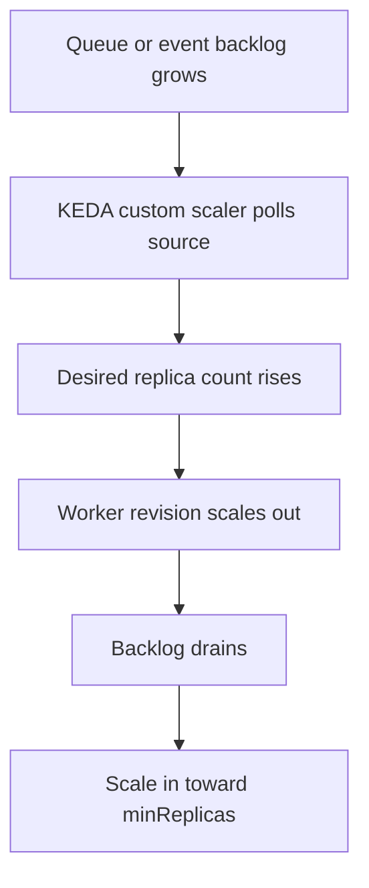

---
content_sources:
  diagrams:
    - id: event-scaler-pattern
      type: flowchart
      source: self-generated
      justification: Synthesized from Microsoft Learn event-scaler guidance and authentication examples for custom rules.
      based_on:
        - https://learn.microsoft.com/en-us/azure/container-apps/scale-app
content_validation:
  status: verified
  last_reviewed: '2026-04-25'
  reviewer: ai-agent
  core_claims:
    - claim: Azure Container Apps uses KEDA-backed custom scale rules for event-driven scaling.
      source: https://learn.microsoft.com/en-us/azure/container-apps/scale-app
      verified: true
    - claim: Microsoft Learn explicitly lists Azure Service Bus, Azure Event Hubs, Apache Kafka, and Redis as supported event sources for Container Apps scaling.
      source: https://learn.microsoft.com/en-us/azure/container-apps/scale-app
      verified: true
    - claim: Scale-rule authentication can use secretRef mappings or managed identity.
      source: https://learn.microsoft.com/en-us/azure/container-apps/scale-app
      verified: true
---
# Event Scalers in Azure Container Apps

Event scalers are the primary fit for worker-style apps where pending work exists outside the HTTP request path. Azure Container Apps implements these through KEDA-backed custom scale rules.

## Event-driven rule pattern

The common rule shape is:

```yaml
template:
  scale:
    minReplicas: 0
    maxReplicas: 30
    rules:
      - name: worker-rule
        custom:
          type: <keda-scaler-type>
          metadata:
            <key>: <value>
          auth:
            - secretRef: <secret-name>
              triggerParameter: <parameter-name>
```

<!-- diagram-id: event-scaler-pattern -->


## Supported event-scaler families

| Event source | Scaler type | Learn-confirmed metadata/auth details | Notes |
|---|---|---|---|
| Azure Service Bus | `azure-servicebus` | `queueName`, `namespace`, `messageCount`, auth mapping for `connection` | Learn provides explicit examples |
| Azure Queue Storage | `azure-queue` | `accountName`, `queueName`, `queueLength`, secret or managed identity examples | Covers Azure Storage Queue workloads |
| Azure Event Hubs | Event Hubs via KEDA custom rule | Source family is documented, but current Learn page does not include a full Azure Container Apps metadata example | Validate exact metadata before production |
| Apache Kafka | Kafka via KEDA custom rule | Source family is documented, but current Learn page does not include a full Container Apps metadata example | Validate exact metadata before production |

## Service Bus example

```bash
az containerapp update \
  --name "$APP_NAME" \
  --resource-group "$RG" \
  --min-replicas 0 \
  --max-replicas 30 \
  --scale-rule-name "servicebus-orders" \
  --scale-rule-type azure-servicebus \
  --scale-rule-metadata "queueName=orders" "namespace=$SERVICEBUS_NAMESPACE" "messageCount=25" \
  --scale-rule-auth "connection=servicebus-connection"
```

## Azure Queue Storage example

```bash
az containerapp update \
  --name "$APP_NAME" \
  --resource-group "$RG" \
  --min-replicas 0 \
  --max-replicas 40 \
  --scale-rule-name "storagequeue-ingest" \
  --scale-rule-type azure-queue \
  --scale-rule-metadata "queueName=ingest" "queueLength=50" "accountName=$STORAGE_ACCOUNT" \
  --scale-rule-auth "connection=storage-connection"
```

| Command | Why it is used |
|---|---|
| `az containerapp update ...` | Updates the existing Container App configuration without recreating the app. |

## Identity options

Microsoft Learn documents two common patterns:

- **Secret-based auth** using `secretRef` mappings for trigger parameters such as `connection`
- **Managed identity** using the `identity` field for supported scalers

Example managed identity shape from Learn:

```json
{
  "type": "azure-queue",
  "metadata": {
    "accountName": "<storage-account>",
    "queueName": "<queue-name>",
    "queueLength": "1"
  },
  "identity": "system"
}
```

## Conservative guidance for Event Hubs and Kafka

!!! warning "Full Container Apps-specific metadata examples for Event Hubs and Kafka are not currently enumerated in Microsoft Learn"
    Microsoft Learn confirms these event-source families are supported through KEDA-backed scaling, but the current page does not provide the complete metadata key sets in the way it does for Service Bus and Azure Queue. Validate exact metadata against the current scaler contract before production rollout.

### Portal view: Scale blade (revision without the event-scaler scale-to-zero pattern)


[Observed] On the selected `Scale` tab, the `Scale rule settings` section shows a `Min / max replicas` row with the value `1 - 3`. The `Scale rules` section shows the empty-state message `There are no scaling rules defined for this revision`. No row labeled `azure-servicebus`, `azure-queue`, or any other KEDA scaler type is visible inside the `Scale rules` section.

[Inferred] The `Min / max replicas` lower bound rendered as `1` is consistent with this page's framing of event-scaler revisions as a *different* shape from what this image shows, since the [Event-driven rule pattern](#event-driven-rule-pattern) YAML and the [Service Bus example](#service-bus-example) and [Azure Queue Storage example](#azure-queue-storage-example) all set `minReplicas: 0` / `--min-replicas 0`. The empty `Scale rules` section header is consistent with the [Supported event-scaler families](#supported-event-scaler-families) table that lists scaler `type` values (such as `azure-servicebus` and `azure-queue`) as entries that would appear inside this section once added.

[Not Proven] This image does not show any `azure-servicebus`, `azure-queue`, Event Hubs, or Kafka rule configured, and the `queueName`, `namespace`, `messageCount`, `accountName`, or `queueLength` metadata fields shown in the examples above are not visualized here. It does not show any `secretRef`, `connection`, or `identity` field corresponding to the [Identity options](#identity-options) section. It does not show the `Edit and deploy` panel.

## See Also

- [Scaling Overview](index.md)
- [Custom Scalers](custom-scalers.md)
- [Scaling Rules Reference](scaling-rules-reference.md)
- [Scaling Best Practices](../../best-practices/scaling.md)
- [Event Scaler Mismatch](../../troubleshooting/playbooks/scaling-and-runtime/event-scaler-mismatch.md)

## Sources

- [Set scaling rules in Azure Container Apps (Microsoft Learn)](https://learn.microsoft.com/en-us/azure/container-apps/scale-app)
