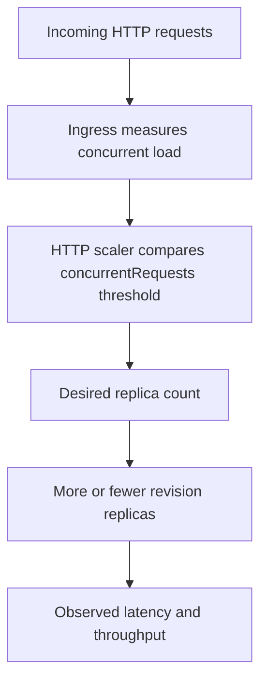

---
content_sources:
  diagrams:
    - id: http-scaler-decision-loop
      type: flowchart
      source: self-generated
      justification: Synthesized from Microsoft Learn HTTP scale-rule behavior and scale-to-zero guidance.
      based_on:
        - https://learn.microsoft.com/en-us/azure/container-apps/scale-app
        - https://learn.microsoft.com/en-us/azure/container-apps/tutorial-scaling
content_validation:
  status: verified
  last_reviewed: '2026-04-25'
  reviewer: ai-agent
  core_claims:
    - claim: HTTP scaling in Azure Container Apps uses the concurrentRequests metadata property.
      source: https://learn.microsoft.com/en-us/azure/container-apps/scale-app
      verified: true
    - claim: The default concurrentRequests value is 10 and the documented minimum is 1.
      source: https://learn.microsoft.com/en-us/azure/container-apps/scale-app
      verified: true
    - claim: HTTP rules can scale a revision in to zero when minReplicas is 0.
      source: https://learn.microsoft.com/en-us/azure/container-apps/scale-app
      verified: true
---
# HTTP Scaler in Azure Container Apps

The HTTP scaler is the default platform fit for interactive APIs and web frontends. It scales a revision based on concurrent request pressure instead of waiting for resource saturation.

## HTTP rule shape

The HTTP scale rule uses `concurrentRequests` inside the rule metadata.

```yaml
template:
  scale:
    minReplicas: 0
    maxReplicas: 5
    rules:
      - name: http-rule
        http:
          metadata:
            concurrentRequests: "100"
```

Documented defaults from Microsoft Learn:

- `concurrentRequests` default: **10**
- documented minimum: **1**

<!-- diagram-id: http-scaler-decision-loop -->


## Cold start and scale-to-zero

The HTTP scaler can scale a revision down to zero when `minReplicas` is `0`.

That is attractive for:

- low-frequency APIs
- admin tools
- internal services with loose first-request latency targets

It is risky for:

- public APIs with strict latency SLOs
- apps with heavy startup paths
- services that must respond instantly after idle periods

## When to prefer HTTP over CPU or memory

Prefer HTTP scaling when the user-facing bottleneck is request concurrency.

| Signal | Best for | Limitation |
|---|---|---|
| HTTP concurrency | Interactive web and API workloads | Can still produce cold-start bias if `minReplicas` is 0 |
| CPU | Sustained compute pressure | Reacts later than direct request pressure |
| Memory | Sustained memory pressure | Usually a lagging signal for traffic bursts |

!!! tip "Use HTTP scaling for request-driven apps first"
    Microsoft Learn explicitly recommends preferring HTTP scale rules to CPU or memory rules when possible.

## Practical tuning guidance

- Lower `concurrentRequests` for CPU-heavy handlers.
- Raise `minReplicas` above 0 when cold starts are user-visible.
- Keep `maxReplicas` aligned with downstream capacity, not just frontend demand.

```bash
az containerapp update \
  --name "$APP_NAME" \
  --resource-group "$RG" \
  --min-replicas 1 \
  --max-replicas 20 \
  --scale-rule-name "http-concurrency" \
  --scale-rule-type http \
  --scale-rule-metadata "concurrentRequests=50"
```

| Command | Why it is used |
|---|---|
| `az containerapp update ...` | Updates the existing Container App configuration without recreating the app. |

## Portal view: Scale blade


[Observed] The blade header reads `<your-app-name> | Scale` with the subtitle `Container App`. The command bar exposes `Edit and deploy`, `Refresh`, and `Send us your feedback`. A `Based on revision` selector is rendered with a `<your-app-name>--<revision-suffix>` value selected, followed by an info line "Not seeing your revision? Click here to find and activate an existing revision." A description below reads "One or more containers, along with settings such as scale rules, can be specified in a revision. Edit and deploy a new revision with an updated configuration." A single `Scale` tab is selected. The body contains a `Scale rule settings` section with `Min / max replicas` shown as `1 - 3`, and a `Scale rules` section that displays the text "There are no scaling rules defined for this revision". The left navigation highlights `Scale` under `Application`.

[Inferred] The presence of a `Based on revision` selector with a specific revision value rendered before the `Scale rule settings` section is consistent with the documentation above that scale rules are configured per revision. The `Edit and deploy` command on this blade appears to map to the `az containerapp update` flow shown in the previous code block, since both surfaces target the same revision-scoped scale configuration. The `Scale rules` section rendering an empty-state message is consistent with the YAML example above showing where an `http` rule would be added under `template.scale.rules`.

[Not Proven] The screenshot does not include the contents of the `Edit and deploy` panel, so it does not show how an HTTP rule is added through the Portal. The `Min / max replicas` value `1 - 3` is visible, but the screenshot does not show the editor controls that change those values. The `Click here to find and activate an existing revision` link is present but the screenshot does not show the panel that opens when it is followed.

## See Also

- [Scaling Overview](index.md)
- [Scaling Rules Reference](scaling-rules-reference.md)
- [CPU & Memory Scalers](cpu-memory-scaler.md)
- [Scaling Best Practices](../../best-practices/scaling.md)
- [HTTP Scaling Not Triggering](../../troubleshooting/playbooks/scaling-and-runtime/http-scaling-not-triggering.md)

## Sources

- [Set scaling rules in Azure Container Apps (Microsoft Learn)](https://learn.microsoft.com/en-us/azure/container-apps/scale-app)
- [Tutorial: Scale an Azure Container Apps application (Microsoft Learn)](https://learn.microsoft.com/en-us/azure/container-apps/tutorial-scaling)
