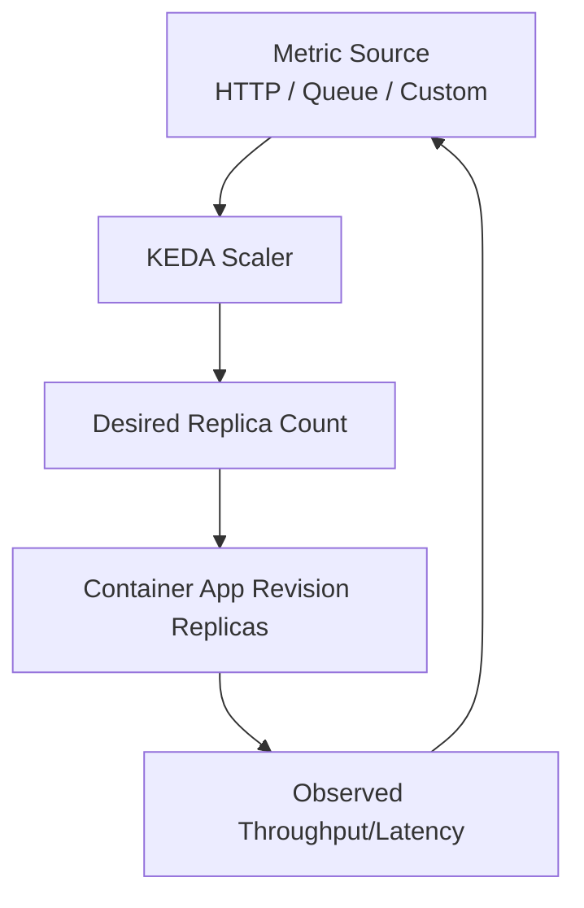
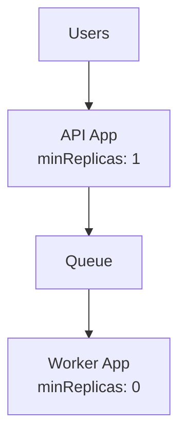

---
content_sources:
  diagrams:
    - id: how-keda-based-scaling-works
      type: flowchart
      source: mslearn-adapted
      based_on:
        - https://learn.microsoft.com/azure/container-apps/scale-app
    - id: practical-example-api-worker-pattern
      type: flowchart
      source: mslearn-adapted
      based_on:
        - https://learn.microsoft.com/azure/container-apps/scale-app
content_validation:
  status: verified
  last_reviewed: "2026-04-25"
  reviewer: ai-agent
  core_claims:
    - claim: "Azure Container Apps uses KEDA for scaling."
      source: "https://learn.microsoft.com/azure/container-apps/scale-app"
      verified: true
    - claim: "The default minimum number of replicas per revision is 0 and the default maximum number is 10."
      source: "https://learn.microsoft.com/azure/container-apps/scale-app"
      verified: true
    - claim: "If more than one scale rule is defined, the container app begins to scale once the first condition of any rule is met."
      source: "https://learn.microsoft.com/azure/container-apps/scale-app"
      verified: true
---

# Scaling in Azure Container Apps with KEDA

Azure Container Apps uses **KEDA (Kubernetes Event-Driven Autoscaling)** to scale replicas based on demand signals such as HTTP requests, queue depth, and custom metrics.

This model enables both reactive scale-out and cost-efficient scale-in, including scale-to-zero in supported scenarios.

This overview introduces the scaling model. Use the deep-dive pages for [HTTP Scaler](http-scaler.md), [CPU & Memory Scalers](cpu-memory-scaler.md), [Event Scalers](event-scalers.md), [Custom Scalers](custom-scalers.md), and the [Scaling Rules Reference](scaling-rules-reference.md).

## How KEDA-Based Scaling Works

<!-- diagram-id: how-keda-based-scaling-works -->

KEDA continuously evaluates rules and updates desired replica count within configured bounds.

!!! note "Scaling is revision-scoped"
    Scale decisions apply to the active revision(s) receiving traffic.
    During progressive rollouts, evaluate scaling behavior for each active revision mix.

## Min and Max Replicas

- **minReplicas**: lower bound of warm capacity.
- **maxReplicas**: upper bound to protect cost and downstream dependencies.

Think of these as your scaling guardrails:

| Setting | Primary Effect | Common Use |
|---|---|---|
| minReplicas = 0 | Lowest idle cost, potential cold starts | Event-driven/background workloads |
| minReplicas > 0 | Faster response, warm baseline | Public APIs with latency targets |
| maxReplicas tuned low | Controls blast radius | Protect fragile dependencies |
| maxReplicas tuned high | Handles bursts | High-volume services with resilient backends |

## Scale Rule Types (Conceptual)

| Rule Type | Trigger Signal | Typical Workload |
|---|---|---|
| HTTP | Concurrency/request pressure | APIs and web frontends |
| Queue/Event | Queue depth or event lag | Workers and async processing |
| CPU/Memory (supporting signal) | Resource pressure | Compute-heavy containers |
| Custom metrics | Domain KPI | Advanced autoscaling strategies |

## Practical Example: API + Worker Pattern

<!-- diagram-id: practical-example-api-worker-pattern -->

- API keeps one warm replica for predictable latency.
- Worker scales from zero when queue depth rises.
- Both apps can scale independently even inside one environment.

## Common Scaling Trade-offs

- Lower idle cost vs cold-start sensitivity.
- Aggressive scale-out vs downstream database saturation.
- High max replicas vs budget predictability.

Good scaling design balances **user experience**, **system stability**, and **cost controls**.

!!! warning "Max replicas without dependency limits can cause outages"
    Aggressive scale-out can overload databases, caches, or third-party APIs.
    Set max replicas based on downstream capacity, not only frontend demand.

## Advanced Topics

- Coordinated scaling policies for multi-service pipelines.
- Using custom metrics to scale on business throughput, not just infrastructure signals.
- Managing revision-level scaling behavior during canary traffic splits.

## Deep-Dive Topics

- [HTTP Scaler](http-scaler.md) — `concurrentRequests`, cold starts, and request-driven scaling
- [CPU & Memory Scalers](cpu-memory-scaler.md) — resource-pressure rules and scale-to-zero caveats
- [Event Scalers](event-scalers.md) — queue and event-driven patterns
- [Custom Scalers](custom-scalers.md) — KEDA-backed bring-your-own triggers
- [Scaling Rules Reference](scaling-rules-reference.md) — defaults, limits, and multi-rule behavior

## See Also
- [How Container Apps Works](../../start-here/overview.md)
- [Environments and Apps](../environments/index.md)
- [HTTP Scaler](http-scaler.md)
- [CPU & Memory Scalers](cpu-memory-scaler.md)
- [Event Scalers](event-scalers.md)
- [Custom Scalers](custom-scalers.md)
- [Scaling Rules Reference](scaling-rules-reference.md)
- [Networking](../networking/index.md)
- [Revision Management and Traffic Splitting](../../language-guides/python/tutorial/07-revisions-traffic.md)
- [KEDA open-source scalers documentation](https://keda.sh/docs/latest/scalers/)

## Sources
- [Set scaling rules in Azure Container Apps (Microsoft Learn)](https://learn.microsoft.com/azure/container-apps/scale-app)
