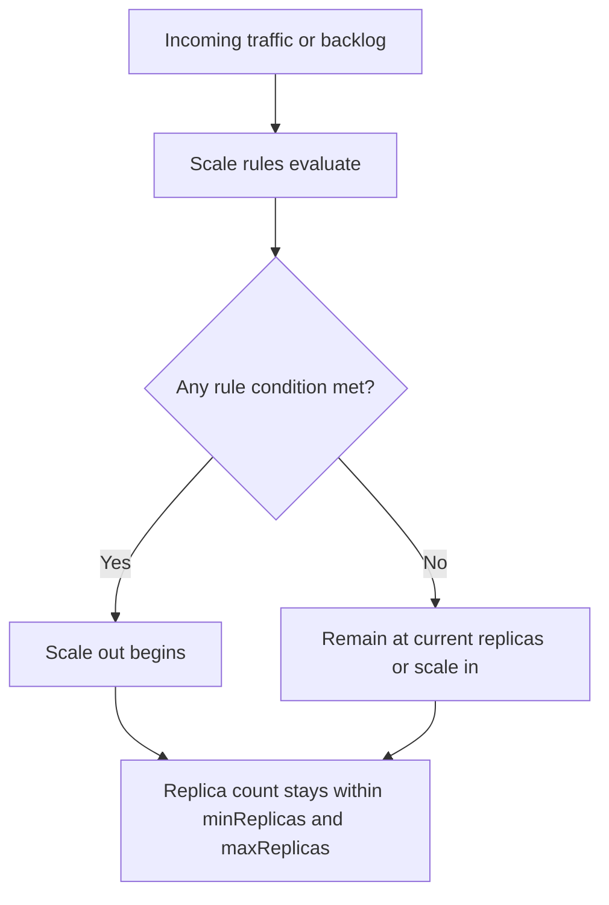
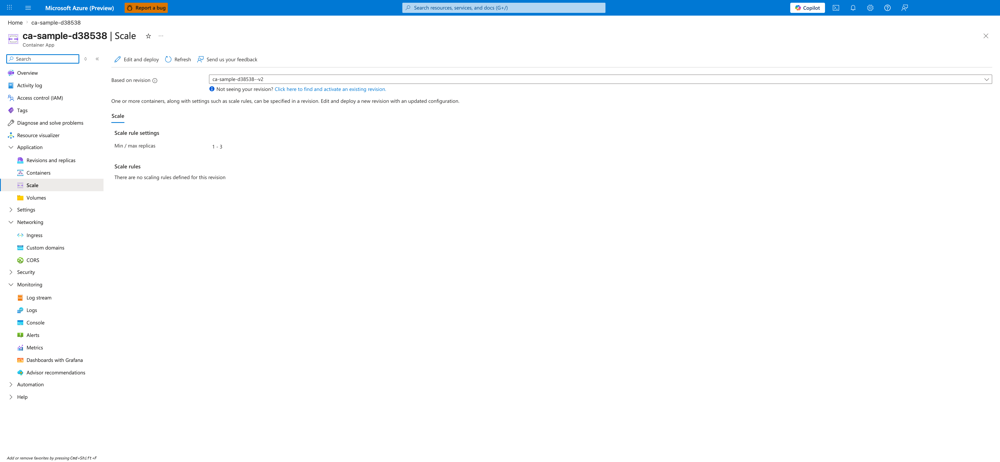

---
content_sources:
  diagrams:
    - id: scale-rule-evaluation-reference
      type: flowchart
      source: self-generated
      justification: Synthesized from Microsoft Learn scaling-rule defaults and multiple-rule evaluation guidance.
      based_on:
        - https://learn.microsoft.com/en-us/azure/container-apps/scale-app
        - https://learn.microsoft.com/en-us/azure/container-apps/tutorial-scaling
content_validation:
  status: verified
  last_reviewed: '2026-04-25'
  reviewer: ai-agent
  core_claims:
    - claim: The default minReplicas value is 0 and the default maxReplicas value is 10.
      source: https://learn.microsoft.com/en-us/azure/container-apps/scale-app
      verified: true
    - claim: The documented maximum configurable replicas is 1000.
      source: https://learn.microsoft.com/en-us/azure/container-apps/scale-app
      verified: true
    - claim: If more than one scale rule is defined, the container app begins to scale once the first condition of any rule is met.
      source: https://learn.microsoft.com/en-us/azure/container-apps/scale-app
      verified: true
    - claim: The documented default polling interval is 30 seconds and default cooldown period is 300 seconds for custom scale rules.
      source: https://learn.microsoft.com/en-us/azure/container-apps/scale-app
      verified: true
---
# Scaling Rules Reference in Azure Container Apps

This page is a compact reference for the properties and default behaviors that matter across all Azure Container Apps scaling rules.

## Common properties

| Property | Meaning | Learn-confirmed default |
|---|---|---|
| `minReplicas` | Lower bound per revision | `0` |
| `maxReplicas` | Upper bound per revision | `10` |
| `rules` | Array of scale rules | n/a |
| `pollingInterval` | Rule polling cadence for custom rules | `30` seconds |
| `cooldownPeriod` | Scale-in cooldown for custom rules | `300` seconds |

Documented limits:

- maximum configurable replicas: **1000**

<!-- diagram-id: scale-rule-evaluation-reference -->

## Rule shapes by category

| Category | Shape |
|---|---|
| HTTP | `http.metadata.concurrentRequests` |
| TCP | `tcp.metadata.concurrentConnections` |
| Custom / event-driven | `custom.type`, `custom.metadata`, optional auth |

## Scale-to-zero behavior

- Scale-to-zero depends on rule type and `minReplicas`.
- HTTP rules can scale to zero when `minReplicas` is `0`.
- CPU and memory rules do **not** allow scale-to-zero.
- Microsoft Learn also warns that apps without ingress and without a custom rule or `minReplicas >= 1` can scale to zero and have no incoming trigger to start back up.

## Multiple-rule evaluation

Microsoft Learn explicitly documents one key rule:

- If you define more than one scale rule, the container app begins to scale once the **first condition of any rule** is met.

That means:

- one aggressive rule can dominate scale-out behavior
- validation must cover rule interaction, not just individual thresholds

## Practical interpretation

| Design goal | Primary setting | Typical choice |
|---|---|---|
| Lowest idle cost | `minReplicas` | `0` |
| Warm interactive API | `minReplicas` | `1+` |
| Dependency protection | `maxReplicas` | conservative cap |
| Faster event response | scaler metadata threshold | lower backlog trigger |
| Slower scale-in churn | `cooldownPeriod` | keep default unless tested |

!!! tip "Treat defaults as a starting point, not a production tuning recommendation"
    The documented defaults are safe references, but production settings should be based on latency SLOs, backlog objectives, and downstream capacity.

## Portal view: Scale blade

[Observed] The blade header reads `<your-app-name> | Scale` with the subtitle `Container App`. The command bar exposes `Edit and deploy`, `Refresh`, and `Send us your feedback`. A `Based on revision` dropdown is set to `<your-app-name>--<revision-suffix>` with a helper link reading `Not seeing your revision? Click here to find and activate an existing revision.` A description below the dropdown explains that containers and scale rules can be specified in a revision and that updates require deploying a new revision. A single `Scale` tab is selected. Under `Scale rule settings`, the row `Min / max replicas` shows the value `1 - 3`. Under `Scale rules`, the empty-state message reads `There are no scaling rules defined for this revision`. The left navigation highlights `Scale` under `Application`.

[Inferred] The `Min / max replicas` value of `1 - 3` appears to map to the `minReplicas` and `maxReplicas` properties in the Common properties table above. The empty-state message under `Scale rules` is consistent with the `rules` row in the Common properties table, where `rules` is described as an array of scale rules. The presence of the `Based on revision` dropdown is consistent with the "Lower bound per revision" and "Upper bound per revision" wording in the `minReplicas` and `maxReplicas` rows of that same table.

[Not Proven] The screenshot does not show any configured HTTP, TCP, or custom rule details from the "Rule shapes by category" table. It does not show the `pollingInterval` or `cooldownPeriod` properties. It does not show the scale-to-zero behavior described in the "Scale-to-zero behavior" section or the first-condition-wins evaluation described in the "Multiple-rule evaluation" section. The dialog that opens after clicking `Edit and deploy` is not visible.

## See Also

- [Scaling Overview](index.md)
- [HTTP Scaler](http-scaler.md)
- [CPU & Memory Scalers](cpu-memory-scaler.md)
- [Event Scalers](event-scalers.md)
- [Custom Scalers](custom-scalers.md)
- [Scaling Best Practices](../../best-practices/scaling.md)

## Sources

- [Set scaling rules in Azure Container Apps (Microsoft Learn)](https://learn.microsoft.com/en-us/azure/container-apps/scale-app)
- [Tutorial: Scale an Azure Container Apps application (Microsoft Learn)](https://learn.microsoft.com/en-us/azure/container-apps/tutorial-scaling)
