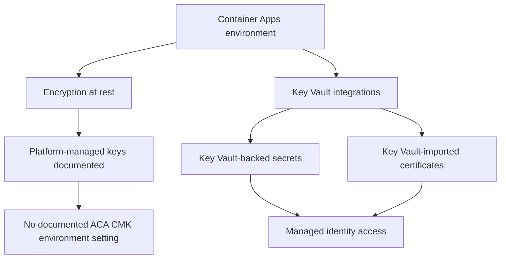

---
content_sources:
  diagrams:
    - id: current-encryption-and-key-management-scope
      type: flowchart
      source: mslearn-adapted
      based_on:
        - https://learn.microsoft.com/azure/security/fundamentals/encryption-customer-managed-keys-support
        - https://learn.microsoft.com/azure/security/fundamentals/encryption-atrest
        - https://learn.microsoft.com/azure/container-apps/manage-secrets
        - https://learn.microsoft.com/azure/container-apps/key-vault-certificates-manage
content_validation:
  status: verified
  last_reviewed: "2026-04-25"
  reviewer: ai-agent
  core_claims:
    - claim: "Microsoft Learn's customer-managed keys support matrix does not list Azure Container Apps as a CMK-supported service for encryption at rest."
      source: "https://learn.microsoft.com/azure/security/fundamentals/encryption-customer-managed-keys-support"
      verified: true
    - claim: "Azure encryption at rest guidance states that platform-managed keys are the default and customer-managed keys are optional only for supported services."
      source: "https://learn.microsoft.com/azure/security/fundamentals/encryption-atrest"
      verified: true
    - claim: "Azure Container Apps supports Key Vault-backed secrets and Key Vault certificate import through managed identity."
      source: "https://learn.microsoft.com/azure/container-apps/manage-secrets"
      verified: true
    - claim: "Container Apps updates Key Vault-imported certificates automatically after rotation, with changes applied within up to 12 hours."
      source: "https://learn.microsoft.com/azure/container-apps/key-vault-certificates-manage"
      verified: true
---

# Customer-Managed Keys in Azure Container Apps

Customer-managed keys are a common production requirement for encryption-at-rest controls. For Azure Container Apps, the important design decision is to distinguish between **environment encryption at rest** and **Key Vault-backed secrets or certificates**, because Microsoft Learn documents only the latter today.

## Current support status

!!! warning "Customer-managed keys for Azure Container Apps environment encryption at rest are not documented as supported"
    As of the current Microsoft Learn documentation, Azure Container Apps is **not listed** in the Azure services support matrix for customer-managed keys. This means you should not document Container Apps environment encryption at rest as GA or preview CMK functionality unless Microsoft Learn adds explicit support guidance.

Microsoft Learn's encryption guidance establishes two relevant facts:

- Azure services use **platform-managed keys** by default for encryption at rest.
- **Customer-managed keys** are available only on services and surfaces that Microsoft explicitly lists as supported.

The current Container Apps documentation does **not** provide a supported environment-level CMK configuration surface for encryption at rest.

## What is supported today

Even though environment-level CMK is not documented for Container Apps, Microsoft Learn does document two nearby Key Vault integration patterns:

1. **Key Vault-backed secrets** for container app configuration.
2. **Key Vault-imported certificates** for Container Apps environments.

These are security controls around secret and certificate lifecycle, but they are **not the same thing** as customer-managed key encryption for Container Apps environment data at rest.

<!-- diagram-id: current-encryption-and-key-management-scope -->

## What is not documented

The current Microsoft Learn documentation does **not** document the following Container Apps environment CMK capabilities:

- A managed environment property to attach a customer-managed key for encryption at rest.
- A documented setup flow using Azure Key Vault or Managed HSM for Container Apps environment storage encryption.
- A supported key rotation process for Container Apps environment encryption at rest.
- A Microsoft Learn statement that CMK for Container Apps environment encryption is in preview.

Because those items are not documented, this guide takes the conservative position that **Container Apps environment CMK is not currently a supported feature surface**.

## What you can use instead

### Key Vault-backed secrets

Container Apps supports Key Vault references for secrets by using managed identity. This helps you externalize sensitive values and use Key Vault rotation workflows even though it does not change the encryption-at-rest key for the Container Apps environment itself.

Relevant documented behaviors:

- The container app can resolve secrets from Key Vault by using managed identity.
- If a Key Vault secret URI does not pin a version, Container Apps retrieves the latest version within 30 minutes.

### Key Vault-imported certificates

Container Apps also supports importing certificates from Azure Key Vault for environment use.

Relevant documented behaviors:

- The environment uses a managed identity to access Key Vault.
- When the certificate is rotated in Key Vault, Container Apps updates the imported certificate automatically.
- Microsoft Learn documents that the updated certificate can take up to 12 hours to apply.

## Scope guidance for architecture reviews

Use this table when security or compliance reviewers ask whether Container Apps supports CMK.

| Question | Conservative answer |
|---|---|
| Does Azure Container Apps support environment encryption at rest with customer-managed keys? | Not documented as supported on Microsoft Learn |
| Can Container Apps use Key Vault for app secrets? | Yes |
| Can Container Apps use Key Vault-managed certificates? | Yes |
| Does Key Vault-backed secret usage equal environment CMK support? | No |
| Is there a documented key rotation workflow for Container Apps environment CMK? | No, because that CMK surface is not documented |

## Design recommendations

- Do **not** claim CMK support for Container Apps environments in internal standards unless Microsoft Learn adds explicit support.
- Use **Key Vault-backed secrets** where compliance asks for centralized secret lifecycle and auditability.
- Use **Key Vault certificate integration** for certificate lifecycle controls.
- If workload policy requires a service with documented environment-level CMK support, validate whether Container Apps is the right platform choice for that requirement.

## See Also

- [Security Overview](index.md)
- [Secrets in Azure Container Apps](secrets.md)
- [Key Vault Secrets Management (Managed Identity)](../identity-and-secrets/key-vault.md)
- [Security Best Practices](../../best-practices/security.md)
- [Compliance Baseline](../../best-practices/compliance-baseline.md)

## Sources

- [Services that support customer-managed keys in Azure Key Vault and Azure Managed HSM (Microsoft Learn)](https://learn.microsoft.com/azure/security/fundamentals/encryption-customer-managed-keys-support)
- [Azure data encryption at rest (Microsoft Learn)](https://learn.microsoft.com/azure/security/fundamentals/encryption-atrest)
- [Manage secrets in Azure Container Apps (Microsoft Learn)](https://learn.microsoft.com/azure/container-apps/manage-secrets)
- [Import certificates from Azure Key Vault to Azure Container Apps (Microsoft Learn)](https://learn.microsoft.com/azure/container-apps/key-vault-certificates-manage)
