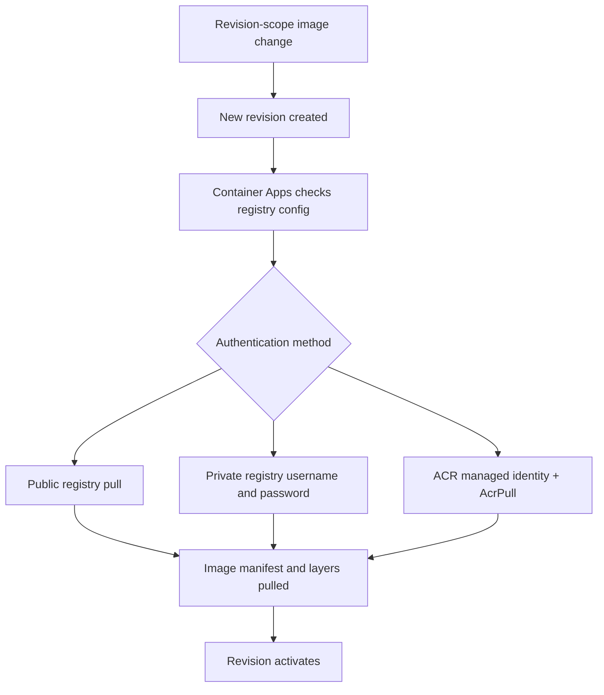

---
content_sources:
  diagrams:
    - id: image-pull-auth-and-activation-flow
      type: flowchart
      source: mslearn-adapted
      based_on:
        - https://learn.microsoft.com/azure/container-apps/containers
        - https://learn.microsoft.com/azure/container-apps/managed-identity-image-pull
        - https://learn.microsoft.com/azure/container-apps/revisions
        - https://learn.microsoft.com/azure/container-apps/security
        - https://learn.microsoft.com/azure/defender-for-cloud/defender-for-containers-azure-overview
content_validation:
  status: verified
  last_reviewed: "2026-04-25"
  reviewer: ai-agent
  core_claims:
    - claim: "Azure Container Apps can pull images from a private Azure Container Registry by using a managed identity instead of registry credentials."
      source: "https://learn.microsoft.com/azure/container-apps/managed-identity-image-pull"
      verified: true
    - claim: "To use managed identity with a registry, the identity must be enabled on the app and assigned the AcrPull role on the registry."
      source: "https://learn.microsoft.com/azure/container-apps/containers"
      verified: true
    - claim: "Changes to the container app template, including container image changes, are revision-scope changes that create a new revision."
      source: "https://learn.microsoft.com/azure/container-apps/revisions"
      verified: true
    - claim: "Defender for Containers provides vulnerability assessment for container images in Azure Container Registry, which is registry-side coverage rather than a native ACA image scanner."
      source: "https://learn.microsoft.com/azure/defender-for-cloud/defender-for-containers-azure-overview"
      verified: true
---

# Image Security in Azure Container Apps

Image security in Azure Container Apps is a combination of registry authentication, revision behavior, and external governance controls. This page explains what Azure Container Apps does natively during image pulls and where you need Azure Container Registry, Azure Policy, or Defender for Cloud to complete the control set.

## How Container Apps pulls images

Container Apps stores registry settings with the app configuration and uses them when deploying a revision.

Microsoft Learn documents three practical pull patterns:

- **Public registry**: no private registry credentials required.
- **Private registry with username/password**: registry credentials are stored and used during deployment.
- **Private Azure Container Registry with managed identity**: the app uses a system-assigned or user-assigned managed identity instead of registry credentials.

### Managed identity for Azure Container Registry

For ACR, the recommended security posture is managed identity.

Requirements documented by Microsoft Learn:

- Enable the managed identity on the container app.
- Assign the identity the `AcrPull` role on the registry.
- Do not configure a username and password when using managed identity.

!!! tip "Managed identity is the preferred ACR authentication path"
    Managed identity removes long-lived registry credentials from app configuration and gives you auditable RBAC-based access to the registry.

### Username and password for private registries

Container Apps also supports private registry authorization through username and password. This is functional, but it shifts the security burden to secret storage and credential rotation.

For ACR specifically, that usually means using either:

- An admin user credential, or
- A service principal credential.

Both are weaker production defaults than managed identity.

## Image pull and revision activation flow

Container Apps treats image changes as revision-scope configuration. That means a new or changed image reference creates a new revision, and the platform uses the configured registry authentication method to pull the image for that revision.

<!-- diagram-id: image-pull-auth-and-activation-flow -->

Security implications:

- A mutable tag can cause a new revision to pick up a different image than you expect.
- Broken registry auth blocks revision startup.
- Revision health validation should be part of image promotion, not an afterthought.

## Public vs private registries

| Registry type | Authentication model | Security posture | Typical guidance |
|---|---|---|---|
| Public registry | Usually anonymous pull | Lowest control | Acceptable for experimentation, not ideal for production |
| Private registry with username/password | Stored credential | Medium to low | Use only when managed identity is not available |
| Azure Container Registry with managed identity | RBAC + managed identity | Strongest documented ACA-native option | Preferred production default |

## Trusted or allowed registries

This is a common architecture review question: does Azure Container Apps natively enforce an allow-list of registries?

### Conservative answer

Container Apps documentation describes **how to configure registries for an app**, but it does **not** document an ACA-native feature called allowed registries or trusted registries that enforces image source allow-listing by itself.

Use these controls instead:

- **Azure Policy** for governance over approved resource configurations.
- **Azure Container Registry policy and network controls** for the registry surface.
- **Platform review standards** that require ACR or other approved registries in CI/CD.

!!! warning "Do not describe allowed registries as an ACA-native enforcement feature"
    Microsoft Learn documents registry configuration and governance options around Azure resources, but not a built-in Container Apps-only allow-list switch for image sources. Treat allow-listing as a policy and supply-chain governance control.

## Vulnerability scanning and image assessment

Container Apps does not document a built-in native image vulnerability scanner on the app resource itself. The documented vulnerability management path is registry-centric.

### Defender for Containers and ACR

Microsoft Learn documents Defender for Containers as providing vulnerability assessment for container images in Azure Container Registry.

That means the security control is primarily:

- **Registry-side**: scan the image in ACR.
- **Governance-side**: review or gate promotion based on findings.
- **ACA-side**: deploy only approved image references.

### What lives on ACA vs ACR

| Control | ACA-native surface | ACR / governance surface |
|---|---|---|
| Registry authentication | Yes | N/A |
| Managed identity for ACR pull | Yes | Requires AcrPull on ACR |
| Vulnerability scanning | No documented native ACA scanner | Yes, via Defender for Containers on ACR |
| Source allow-listing | No documented ACA-native allow-list feature | Policy / governance pattern |
| Private network path to registry | Indirectly, through environment networking | ACR private endpoints and DNS |

## Recommended image security posture

Use this as the platform baseline:

1. Store production images in **Azure Container Registry**.
2. Use **managed identity + AcrPull** for image pulls.
3. Treat image changes as **revision rollouts** and validate revision health.
4. Enable **Defender for Containers** for ACR image scanning.
5. Use **policy and CI/CD governance** to restrict image sources.

For the operational side of pull failures, registry DNS, and rollout troubleshooting, use the operations guide rather than repeating those steps here.

## See Also

- [Security Overview](index.md)
- [Operations: Image Pull and Registry](../../operations/image-pull-and-registry/index.md)
- [Managed Identity](../identity-and-secrets/managed-identity.md)
- [Private Endpoints](../networking/private-endpoints.md)
- [Image Security Best Practices](../../best-practices/image-security.md)

## Sources

- [Manage containers in Azure Container Apps (Microsoft Learn)](https://learn.microsoft.com/azure/container-apps/containers)
- [Pull images from Azure Container Registry with managed identity in Azure Container Apps (Microsoft Learn)](https://learn.microsoft.com/azure/container-apps/managed-identity-image-pull)
- [Revisions in Azure Container Apps (Microsoft Learn)](https://learn.microsoft.com/azure/container-apps/revisions)
- [Security in Azure Container Apps (Microsoft Learn)](https://learn.microsoft.com/azure/container-apps/security)
- [Microsoft Defender for Containers overview (Microsoft Learn)](https://learn.microsoft.com/azure/defender-for-cloud/defender-for-containers-azure-overview)
