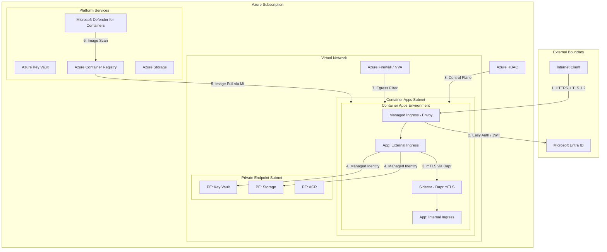
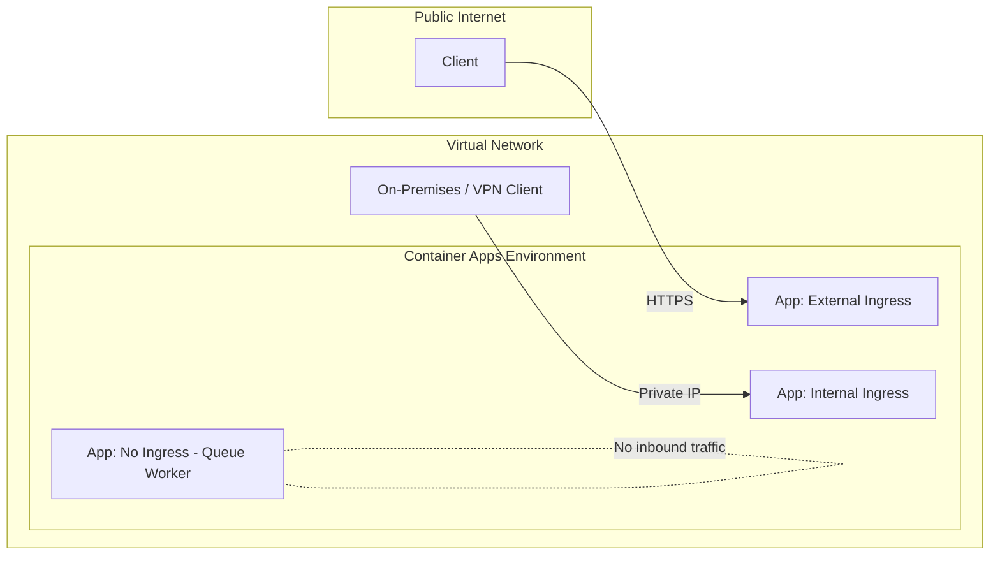
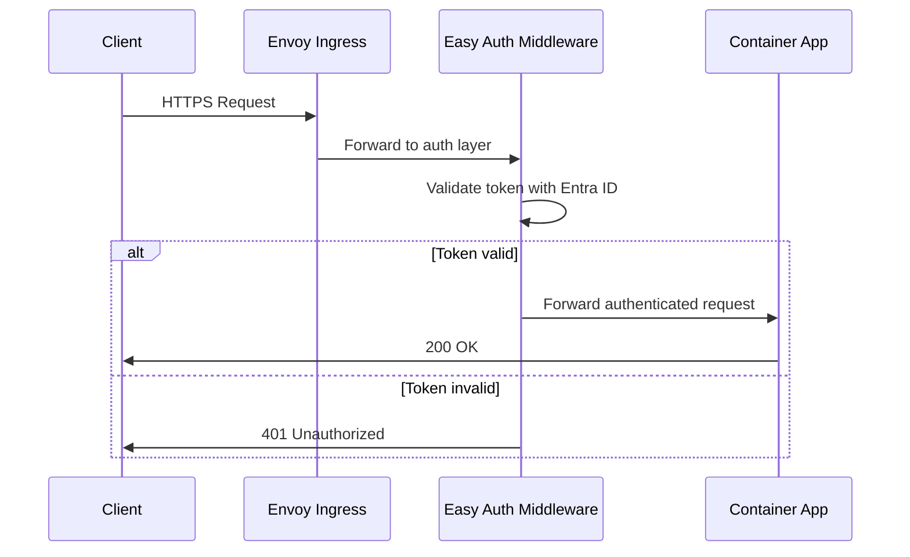
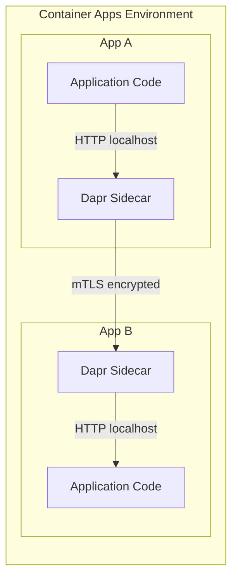
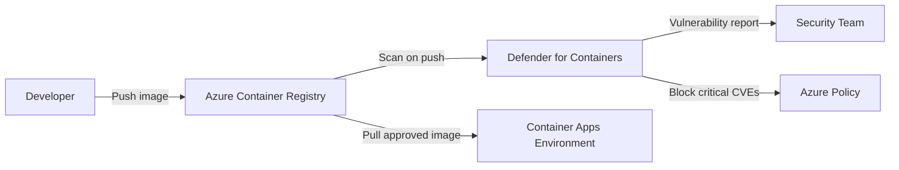
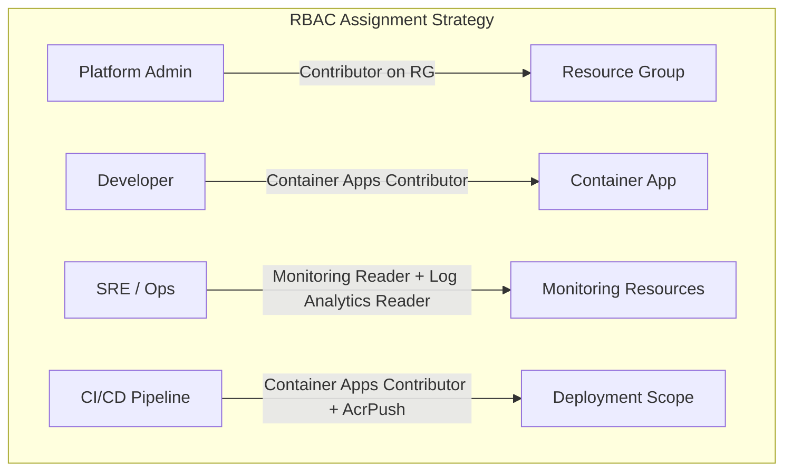

---
content_sources:
  diagrams:
    - id: security-architecture-overview
      type: flowchart
      source: mslearn-adapted
      based_on:
        - https://learn.microsoft.com/azure/container-apps/security-concept
        - https://learn.microsoft.com/azure/container-apps/networking
        - https://learn.microsoft.com/azure/container-apps/managed-identity
        - https://learn.microsoft.com/azure/container-apps/authentication
        - https://learn.microsoft.com/azure/defender-for-cloud/defender-for-containers-introduction
        - https://learn.microsoft.com/azure/role-based-access-control/overview
        - https://learn.microsoft.com/azure/container-apps/policy-reference
    - id: no-ingress-not-http-addressable-event-driven
      type: flowchart
      source: mslearn-adapted
      based_on:
        - https://learn.microsoft.com/azure/container-apps/security-concept
        - https://learn.microsoft.com/azure/container-apps/networking
        - https://learn.microsoft.com/azure/container-apps/managed-identity
        - https://learn.microsoft.com/azure/container-apps/authentication
        - https://learn.microsoft.com/azure/defender-for-cloud/defender-for-containers-introduction
        - https://learn.microsoft.com/azure/role-based-access-control/overview
        - https://learn.microsoft.com/azure/container-apps/policy-reference
    - id: container-apps-provides-a-built-in-authentication
      type: sequence
      source: mslearn-adapted
      based_on:
        - https://learn.microsoft.com/azure/container-apps/security-concept
        - https://learn.microsoft.com/azure/container-apps/networking
        - https://learn.microsoft.com/azure/container-apps/managed-identity
        - https://learn.microsoft.com/azure/container-apps/authentication
        - https://learn.microsoft.com/azure/defender-for-cloud/defender-for-containers-introduction
        - https://learn.microsoft.com/azure/role-based-access-control/overview
        - https://learn.microsoft.com/azure/container-apps/policy-reference
    - id: dapr-sidecar-enables-automatic-mtls-for
      type: flowchart
      source: mslearn-adapted
      based_on:
        - https://learn.microsoft.com/azure/container-apps/security-concept
        - https://learn.microsoft.com/azure/container-apps/networking
        - https://learn.microsoft.com/azure/container-apps/managed-identity
        - https://learn.microsoft.com/azure/container-apps/authentication
        - https://learn.microsoft.com/azure/defender-for-cloud/defender-for-containers-introduction
        - https://learn.microsoft.com/azure/role-based-access-control/overview
        - https://learn.microsoft.com/azure/container-apps/policy-reference
    - id: microsoft-defender-for-containers-provides-continuous
      type: flowchart
      source: mslearn-adapted
      based_on:
        - https://learn.microsoft.com/azure/container-apps/security-concept
        - https://learn.microsoft.com/azure/container-apps/networking
        - https://learn.microsoft.com/azure/container-apps/managed-identity
        - https://learn.microsoft.com/azure/container-apps/authentication
        - https://learn.microsoft.com/azure/defender-for-cloud/defender-for-containers-introduction
        - https://learn.microsoft.com/azure/role-based-access-control/overview
        - https://learn.microsoft.com/azure/container-apps/policy-reference
    - id: least-privilege-assignment-pattern
      type: flowchart
      source: mslearn-adapted
      based_on:
        - https://learn.microsoft.com/azure/container-apps/security-concept
        - https://learn.microsoft.com/azure/container-apps/networking
        - https://learn.microsoft.com/azure/container-apps/managed-identity
        - https://learn.microsoft.com/azure/container-apps/authentication
        - https://learn.microsoft.com/azure/defender-for-cloud/defender-for-containers-introduction
        - https://learn.microsoft.com/azure/role-based-access-control/overview
        - https://learn.microsoft.com/azure/container-apps/policy-reference
---

# Security in Azure Container Apps

Azure Container Apps provides multiple layers of security — from network isolation and identity-based access to image integrity and data protection. This page consolidates the security architecture into a single reference, connecting the topics covered in networking, identity, and operations sections.

## Security Architecture Overview

<!-- diagram-id: security-architecture-overview -->

Each numbered path represents a security control layer:

| # | Layer | Control |
|---|---|---|
| 1 | Transport | TLS 1.2 enforced at managed ingress |
| 2 | Authentication | Easy Auth or custom JWT validation |
| 3 | Service-to-service | mTLS via Dapr sidecar |
| 4 | Resource access | Managed identity with least-privilege RBAC |
| 5 | Image pull | Managed identity authentication to ACR |
| 6 | Image integrity | Vulnerability scanning via Defender for Containers |
| 7 | Egress | Outbound filtering via Azure Firewall or UDR |
| 8 | Control plane | Azure RBAC for management operations |

## Network Isolation

Network isolation in Container Apps operates at three boundaries: ingress control, VNet integration, and egress filtering.

### Ingress Boundary

The managed Envoy ingress layer controls inbound traffic:

- **External ingress**: exposed to the public internet with TLS termination.
- **Internal ingress**: accessible only from within the VNet or peered networks.
- **No ingress**: not HTTP-addressable — event-driven workloads only.

<!-- diagram-id: no-ingress-not-http-addressable-event-driven -->

!!! warning "Internal-only environments for sensitive workloads"
    Set the environment to internal mode to remove all public endpoints. Front with Application Gateway or API Management for controlled public entry.

### VNet Integration

VNet integration places the Container Apps environment inside a dedicated subnet, enabling:

- Private endpoint access to Azure services (Key Vault, Storage, SQL, ACR).
- DNS resolution through Azure Private DNS Zones.
- Subnet-level Network Security Groups (NSGs) for additional filtering.

### Egress Filtering

Control outbound traffic using User-Defined Routes (UDR) and Azure Firewall:

- Route all outbound traffic through a central firewall.
- Allow-list required FQDNs and service tags for platform dependencies.
- Audit outbound connections for compliance.

!!! note "Platform dependency FQDNs"
    Overly restrictive egress rules break image pulls, telemetry upload, and control-plane communication. Always validate with a canary app before enforcing strict egress policies.

For detailed networking configuration, see [Networking Overview](../networking/index.md).

## Authentication and Authorization

### Easy Auth (Built-in Authentication)

Container Apps provides a built-in authentication layer (Easy Auth) that validates tokens before requests reach application code:

<!-- diagram-id: container-apps-provides-a-built-in-authentication -->

Easy Auth supports Microsoft Entra ID, GitHub, Google, Twitter, and custom OpenID Connect providers.

!!! tip "When to use Easy Auth vs custom auth"
    Use Easy Auth for standard identity provider flows with minimal code. Use custom JWT validation when you need fine-grained claims inspection, multi-tenant logic, or non-standard token formats.

### API Key and Header-Based Access

For service-to-service calls that do not use identity tokens, validate API keys or custom headers at the application level. Store keys in Key Vault and reference them as managed secrets.

### Mutual TLS (mTLS)

Dapr sidecar enables automatic mTLS for service-to-service communication within a Container Apps environment:

<!-- diagram-id: dapr-sidecar-enables-automatic-mtls-for -->

Key properties of Dapr mTLS in Container Apps:

- Certificates are automatically rotated by the platform.
- Encryption is transparent to application code — apps communicate over localhost to their sidecar.
- mTLS applies to all Dapr-enabled service invocations within the environment.

!!! warning "mTLS requires Dapr enablement"
    Direct HTTP calls between apps (without Dapr) are not encrypted by default within the environment. Enable Dapr on both caller and callee for automatic mTLS.

## Image Security

### Container Registry Authentication

Use managed identity for image pulls instead of admin credentials:

| Method | Security Posture | Recommendation |
|---|---|---|
| Admin credentials | Shared password, no audit trail | Avoid in production |
| Service principal | Requires secret rotation | Acceptable with rotation policy |
| Managed identity | Passwordless, auditable, auto-rotated | Recommended |

### Vulnerability Scanning

Microsoft Defender for Containers provides continuous image scanning:

<!-- diagram-id: microsoft-defender-for-containers-provides-continuous -->

Key capabilities:

- **Scan on push**: images are scanned when pushed to ACR.
- **Continuous scanning**: running images are re-evaluated as new CVE data becomes available.
- **Policy enforcement**: Azure Policy can block deployment of images with critical vulnerabilities.

### Trusted Image Practices

- Use specific image tags or digests — never `latest` in production.
- Enable content trust (Docker Content Trust) for signed images.
- Restrict ACR network access with private endpoints and firewall rules.
- Maintain a base image update cadence to patch OS-level vulnerabilities.

## Role-Based Access Control (RBAC)

Azure RBAC controls who can manage Container Apps resources at the control plane level.

### Built-in Roles for Container Apps

| Role | Scope | Permissions |
|---|---|---|
| Contributor | Resource Group | Full management of Container Apps resources |
| Container Apps Contributor | Resource / RG | Create, update, delete Container Apps and jobs |
| Reader | Resource Group | View Container Apps configuration and status |
| Monitoring Reader | Resource Group | View metrics and logs |

### Least-Privilege Assignment Pattern

<!-- diagram-id: least-privilege-assignment-pattern -->

Principles:

- Assign roles at the narrowest scope possible (resource level over resource group).
- Use custom roles when built-in roles are too broad.
- Review role assignments quarterly — remove unused assignments.
- Separate deployment permissions (CI/CD) from runtime permissions (managed identity).

## Data Protection

### Encryption at Rest

- Container Apps platform encrypts data at rest using Microsoft-managed keys by default.
- Secrets stored in Container Apps configuration are encrypted at rest.
- Key Vault provides customer-managed key (CMK) support for stored secrets.

### Encryption in Transit

| Path | Encryption | Managed By |
|---|---|---|
| Client → Ingress | TLS 1.2 (managed certificate) | Platform |
| Ingress → App | Internal (within environment) | Platform |
| App → App (Dapr) | mTLS | Dapr sidecar |
| App → Azure Services (PE) | TLS 1.2 over private link | Platform + Private Endpoint |
| App → External APIs | TLS 1.2 (app responsibility) | Application code |

### Secret Management

Container Apps supports two secret storage patterns:

1. **Platform secrets**: stored in Container Apps configuration, referenced as environment variables.
2. **Key Vault references**: secrets fetched from Key Vault at runtime using managed identity.

!!! tip "Prefer Key Vault references for production"
    Key Vault references provide centralized rotation, audit logging, and access policies. Platform secrets are simpler but lack rotation automation.

For secret management details, see [Key Vault Integration](../identity-and-secrets/key-vault.md).

## Compliance and Governance

### Azure Policy for Container Apps

Azure Policy enforces organizational security standards:

- Require VNet integration for all environments.
- Require managed identity (block admin credential usage for ACR).
- Require HTTPS-only ingress.
- Block external ingress for sensitive workloads.
- Require minimum TLS version.

### Audit and Monitoring

Security-relevant events are captured in:

- **Azure Activity Log**: control-plane operations (create, update, delete).
- **Container Apps system logs**: runtime events, restarts, probe failures.
- **Application Insights**: request traces, dependency calls, exceptions.
- **Microsoft Entra sign-in logs**: Easy Auth authentication events.

!!! warning "Enable diagnostic settings"
    Without diagnostic settings configured, security events are not retained beyond platform defaults. Configure Log Analytics workspace integration for all Container Apps environments.

## Advanced Topics

- Zero-trust architecture patterns with internal environments and private endpoints end-to-end.
- Workload identity federation for cross-cloud and GitHub Actions OIDC deployments.
- Runtime security monitoring with Microsoft Defender for Cloud integration.
- Network micro-segmentation using multiple environments with separate VNets.
- Automated compliance scanning with Azure Policy initiatives.

## See Also

- [Networking Overview](../networking/index.md)
- [VNet Integration](../networking/vnet-integration.md)
- [Private Endpoints](../networking/private-endpoints.md)
- [Egress Control](../networking/egress-control.md)
- [Managed Identity](../identity-and-secrets/managed-identity.md)
- [Key Vault Integration](../identity-and-secrets/key-vault.md)
- [Easy Auth](../identity-and-secrets/easy-auth.md)
- [Security Operations](../identity-and-secrets/security-operations.md)
- [Security Best Practices](../../best-practices/security.md)

## Sources

- [Security in Azure Container Apps (Microsoft Learn)](https://learn.microsoft.com/azure/container-apps/security-concept)
- [Networking in Azure Container Apps (Microsoft Learn)](https://learn.microsoft.com/azure/container-apps/networking)
- [Managed Identity in Azure Container Apps (Microsoft Learn)](https://learn.microsoft.com/azure/container-apps/managed-identity)
- [Authentication and Authorization in Azure Container Apps (Microsoft Learn)](https://learn.microsoft.com/azure/container-apps/authentication)
- [Microsoft Defender for Containers (Microsoft Learn)](https://learn.microsoft.com/azure/defender-for-cloud/defender-for-containers-introduction)
- [Azure RBAC Overview (Microsoft Learn)](https://learn.microsoft.com/azure/role-based-access-control/overview)
- [Azure Policy for Container Apps (Microsoft Learn)](https://learn.microsoft.com/azure/container-apps/policy-reference)
