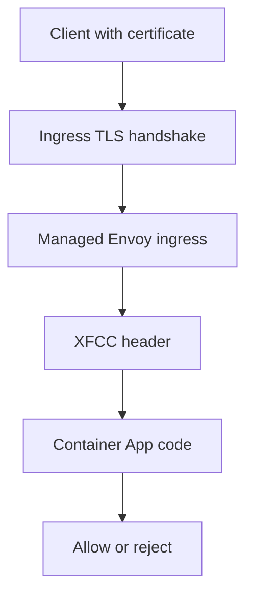

---
content_sources:
  diagrams:
    - id: aca-client-cert-ingress-flow
      type: flowchart
      source: mslearn-adapted
      based_on:
        - https://learn.microsoft.com/en-us/azure/container-apps/client-certificate-authorization
        - https://learn.microsoft.com/en-us/azure/container-apps/ingress-overview
        - https://learn.microsoft.com/en-us/azure/templates/microsoft.app/2025-01-01/containerapps
content_validation:
  status: verified
  last_reviewed: "2026-04-25"
  reviewer: ai-agent
  core_claims:
    - claim: "Ingress passes the client certificate to the container app if clientCertificateMode is set to require or accept."
      source: "https://learn.microsoft.com/en-us/azure/container-apps/client-certificate-authorization"
      verified: true
    - claim: "Azure Container Apps uses the X-Forwarded-Client-Cert header to forward client certificate information to the application."
      source: "https://learn.microsoft.com/en-us/azure/container-apps/ingress-overview"
      verified: true
    - claim: "The ARM template schema for container app ingress includes clientCertificateMode values accept, ignore, and require."
      source: "https://learn.microsoft.com/en-us/azure/templates/microsoft.app/2025-01-01/containerapps"
      verified: true
---

# Ingress Client Certificates

Use ingress client certificate authentication when Azure Container Apps should require or accept a caller certificate at the edge and forward certificate details to your application for authorization decisions.

## Prerequisites

- A container app with HTTP ingress enabled.
- A client certificate and private key for testing.
- Azure CLI installed and authenticated.
- Optional: a custom domain if you want the certificate exchange on your own hostname.

Set reusable variables:

```bash
export RG="rg-aca-security"
export APP_NAME="ca-api-mtls"
export ENVIRONMENT_NAME="cae-security"
export LOCATION="koreacentral"
```

## When to Use

- Partner or B2B APIs that require certificate-based caller authentication.
- APIs fronted by enterprise proxies or gateways that already manage client certificates.
- Workloads that need the app to inspect certificate subject, issuer, or thumbprint after ingress validation.

<!-- diagram-id: aca-client-cert-ingress-flow -->


## Procedure

### 1. Enable external ingress

If the app does not already have external ingress, enable it first.

```bash
az containerapp ingress enable \
  --name "$APP_NAME" \
  --resource-group "$RG" \
  --type external \
  --target-port 8000
```

### 2. Require client certificates

Microsoft Learn currently documents client certificate mode through the container app template or an ARM-style PATCH. Use `require` for strict enforcement.

```bash
export APP_ID=$(az containerapp show \
  --name "$APP_NAME" \
  --resource-group "$RG" \
  --query id \
  --output tsv)

az rest \
  --method patch \
  --uri "https://management.azure.com${APP_ID}?api-version=2025-01-01" \
  --body '{
    "properties": {
      "configuration": {
        "ingress": {
          "clientCertificateMode": "require"
        }
      }
    }
  }'
```

### 3. Use ARM or Bicep for repeatable configuration

```bicep
resource app 'Microsoft.App/containerApps@2025-01-01' = {
  name: appName
  location: location
  properties: {
    managedEnvironmentId: environmentId
    configuration: {
      ingress: {
        external: true
        targetPort: 8000
        transport: 'auto'
        clientCertificateMode: 'require'
      }
    }
    template: {
      containers: [
        {
          name: 'api'
          image: imageName
        }
      ]
    }
  }
}
```

### 4. Understand what the app receives

Azure Container Apps uses the `X-Forwarded-Client-Cert` header when `clientCertificateMode` is `require` or `accept`.

Documented format:

```text
Hash=<hash>;Cert="-----BEGIN CERTIFICATE-----...";Chain="-----BEGIN CERTIFICATE-----..."
```

Your application should:

1. Extract the `Cert=` segment.
2. Decode the PEM certificate.
3. Validate thumbprint, subject, issuer, or trust chain according to your policy.
4. Return `403` when the caller presents a certificate that does not match your allowlist or policy.

### 5. Treat path exclusions conservatively

!!! warning "No documented per-path mTLS exclusion in Azure Container Apps ingress"
    The Microsoft Learn sources cited on this page document `clientCertificateMode` and `corsPolicy`, but they do not document a per-path exclusion feature for client certificate enforcement. If you need mixed behavior by path, use a separate container app, a separate hostname, or application-level logic after choosing `accept` mode.

### 6. Keep CORS separate from mTLS

`corsPolicy` controls browser cross-origin behavior. It does not replace or bypass client certificate enforcement.

```bash
az containerapp ingress cors enable \
  --name "$APP_NAME" \
  --resource-group "$RG" \
  --allowed-origins "https://portal.contoso.com" \
  --allowed-methods "GET" "POST" \
  --allowed-headers "content-type" "x-request-id" \
  --allow-credentials true
```

## Verification

### Check ingress configuration

```bash
az containerapp show \
  --name "$APP_NAME" \
  --resource-group "$RG" \
  --query "properties.configuration.ingress.clientCertificateMode" \
  --output tsv
```

Expected output:

```text
require
```

### Test with curl

```bash
export FQDN=$(az containerapp show \
  --name "$APP_NAME" \
  --resource-group "$RG" \
  --query "properties.configuration.ingress.fqdn" \
  --output tsv)

curl --include \
  --cert "./client.pem" \
  --key "./client.key" \
  "https://${FQDN}/cert-info"
```

Expected outcomes:

- `200 OK` when the client certificate is accepted and the app authorizes it.
- `403` from the app when the certificate reaches the app but fails your policy.
- `403` or TLS handshake failure before the app when ingress is set to `require` and no certificate is supplied.

### Inspect the forwarded header in app logs

Confirm that the app logs the presence of `X-Forwarded-Client-Cert`, then parse the leaf certificate rather than trusting the raw header string.

## Rollback / Troubleshooting

Set the mode back to `ignore` or `accept` if you need to relax enforcement:

```bash
az rest \
  --method patch \
  --uri "https://management.azure.com${APP_ID}?api-version=2025-01-01" \
  --body '{
    "properties": {
      "configuration": {
        "ingress": {
          "clientCertificateMode": "ignore"
        }
      }
    }
  }'
```

Troubleshooting checklist:

- No `X-Forwarded-Client-Cert` header: verify the app is in `require` or `accept` mode.
- Browser preflight issues: review `corsPolicy` separately from mTLS policy.
- Direct client rejected at edge: confirm the client is actually sending the certificate and key pair.
- App rejects valid clients: inspect the parsed leaf certificate, not only the raw header.

## See Also

- [mTLS Architecture in Azure Container Apps](mtls.md)
- [Security in Azure Container Apps](index.md)
- [Azure Container Apps Networking Best Practices](../../best-practices/networking.md)
- [mTLS Failures](../../troubleshooting/playbooks/mtls-failures.md)

## Sources

- [Configure client certificate authentication in Azure Container Apps (Microsoft Learn)](https://learn.microsoft.com/en-us/azure/container-apps/client-certificate-authorization)
- [Ingress overview in Azure Container Apps (Microsoft Learn)](https://learn.microsoft.com/en-us/azure/container-apps/ingress-overview)
- [Ingress for your app in Azure Container Apps (Microsoft Learn)](https://learn.microsoft.com/en-us/azure/container-apps/ingress-how-to)
- [Microsoft.App/containerApps@2025-01-01 template reference (Microsoft Learn)](https://learn.microsoft.com/en-us/azure/templates/microsoft.app/2025-01-01/containerapps)
- [Configure CORS in Azure Container Apps (Microsoft Learn)](https://learn.microsoft.com/en-us/azure/container-apps/cors)
