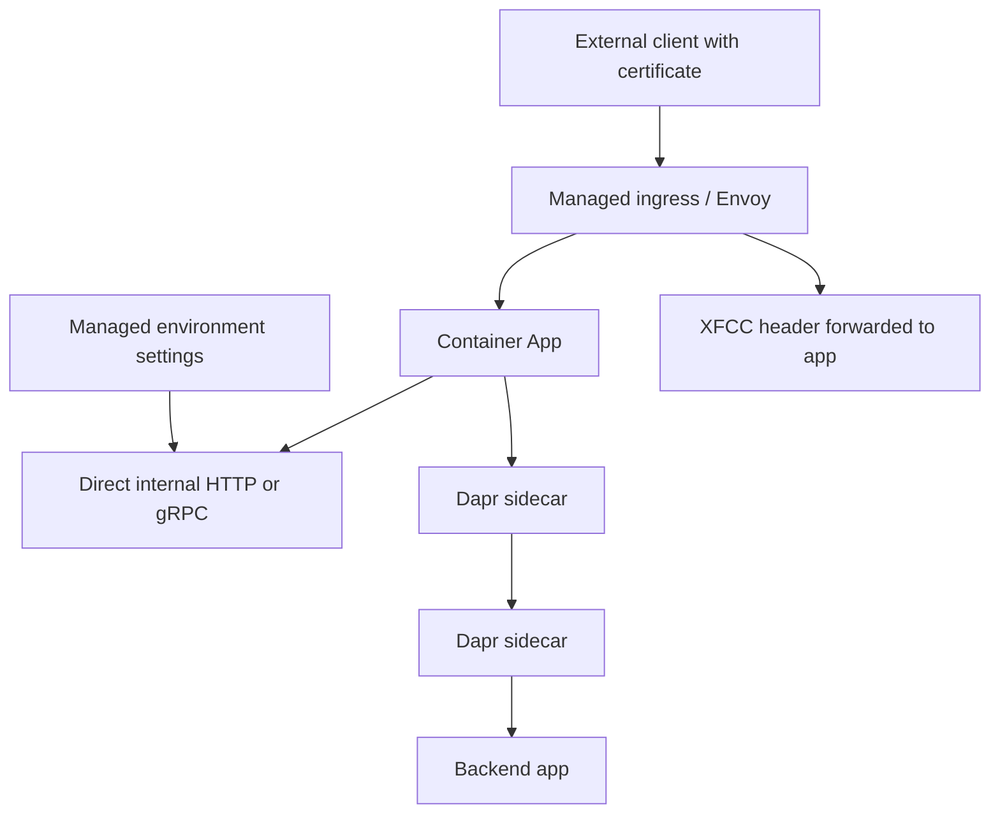

---
content_sources:
  diagrams:
    - id: aca-mtls-three-planes
      type: flowchart
      source: mslearn-adapted
      based_on:
        - https://learn.microsoft.com/en-us/azure/container-apps/ingress-environment-configuration
        - https://learn.microsoft.com/en-us/azure/container-apps/client-certificate-authorization
        - https://learn.microsoft.com/en-us/azure/container-apps/connect-apps
        - https://learn.microsoft.com/en-us/azure/container-apps/dapr-overview
content_validation:
  status: verified
  last_reviewed: '2026-04-25'
  reviewer: ai-agent
  core_claims:
    - claim: Azure Container Apps supports peer-to-peer TLS encryption within the environment, and the feature is disabled by default.
      source: https://learn.microsoft.com/en-us/azure/container-apps/ingress-environment-configuration
      verified: true
    - claim: Container Apps ingress supports clientCertificateMode values require, accept, and ignore.
      source: https://learn.microsoft.com/en-us/azure/container-apps/client-certificate-authorization
      verified: true
    - claim: Dapr service invocation in Azure Container Apps includes built-in mutual TLS.
      source: https://learn.microsoft.com/en-us/azure/container-apps/connect-apps
      verified: true
    - claim: Workload profiles environments support both Consumption and Dedicated plans, while Consumption-only environments support only the Consumption plan.
      source: https://learn.microsoft.com/en-us/azure/container-apps/environment
      verified: true
---
# mTLS Architecture in Azure Container Apps

Azure Container Apps has three distinct mTLS-related planes: environment-internal peer encryption, ingress client certificate authentication, and Dapr service-to-service calls. Treat them as complementary controls rather than one feature flag.

## mTLS Planes in Container Apps

<!-- diagram-id: aca-mtls-three-planes -->


| Plane | Primary purpose | Scope |
|---|---|---|
| Environment-internal peer encryption | Encrypt traffic inside the managed environment | App-to-app traffic inside the environment boundary |
| Ingress client certificate authentication | Authenticate external clients with certificates | Internet or private clients calling ingress |
| Dapr service-to-service mTLS | Secure Dapr sidecar-to-sidecar invocation | Dapr-enabled apps in the same environment |

### Plane 1: Environment-internal peer encryption

Azure Container Apps supports peer-to-peer TLS encryption within the environment. Microsoft Learn currently documents the managed environment property as `peerTrafficConfiguration.encryption.enabled`, and older examples also referenced `peerAuthentication.mtls.enabled` during schema evolution.

```bicep
resource managedEnvironment 'Microsoft.App/managedEnvironments@2025-01-01' = {
  name: environmentName
  location: location
  properties: {
    peerTrafficConfiguration: {
      encryption: {
        enabled: true
      }
    }
  }
}
```

What this plane does:

- Encrypts network traffic within the Azure Container Apps environment with platform-managed private certificates.
- Applies at the environment boundary, not as application code middleware.
- Helps protect east-west traffic when apps communicate directly through environment networking.

What it does not do:

- It does not authenticate external clients at ingress.
- It does not replace app-layer authorization.
- It does not make your application parse client certificates automatically.

Performance and scope notes:

- The feature is disabled by default.
- Microsoft Learn notes that enabling peer-to-peer encryption can increase response latency and reduce maximum throughput under high load.
- Document the environment type before rollout. Workload profiles environments support both Consumption and Dedicated plans, while Consumption-only environments are legacy and support only the Consumption plan.

!!! warning "Use the current property name in new IaC"
    Use `peerTrafficConfiguration.encryption.enabled` in current ARM or Bicep examples. Microsoft documentation previously showed `peerAuthentication.mtls.enabled` in earlier schema examples, so older blog posts or snippets may not match current API versions.

#### Portal view: environment Networking blade (Encryption tab label)


[Observed] The blade title ends with `| Networking` and the subtitle is `Container Apps Environment`. The tab strip lists `General`, `Ingress settings`, `Request Routing`, `Encryption`, and `Custom DNS Suffix`, with `General` selected. The `General` tab shows a `Public Network Access` field with two radios — `Enable: Allows incoming traffic from the public internet.` (selected) and `Disable: Block all incoming traffic from the public internet.` — and a `Virtual network` section that reads `This environment isn't integrated`.

[Inferred] The presence of a dedicated `Encryption` tab in the tab strip is consistent with [Plane 1: Environment-internal peer encryption](#plane-1-environment-internal-peer-encryption) being framed on this page as an environment-scoped setting rather than an app-scoped one. The grouping of `Encryption` as a peer tab alongside `Ingress settings` and `Request Routing` is consistent with the three-plane model on this page locating the environment plane and the ingress-side surfaces on the same environment blade, while [Plane 3: Dapr service-to-service mTLS](#plane-3-dapr-service-to-service-mtls) is described as configured separately on Dapr-enabled apps. The `Virtual network` row reading "This environment isn't integrated" appears to be orthogonal to the `Encryption` tab being present, which is consistent with this page's description of peer encryption as protecting east-west traffic within the managed environment rather than depending on VNet integration state.

[Not Proven] This image does not show the contents of the `Encryption` tab, so the actual toggle, the field label corresponding to `peerTrafficConfiguration.encryption.enabled`, and any latency or throughput warnings inside the tab body are not visible here. It does not show the `Ingress settings` tab contents, so the `clientCertificateMode` field referenced in [Plane 2: Ingress client certificate authentication](#plane-2-ingress-client-certificate-authentication) is outside the scope of this capture. It does not show any Dapr-related surface, so [Plane 3: Dapr service-to-service mTLS](#plane-3-dapr-service-to-service-mtls) is not represented in this image.

### Plane 2: Ingress client certificate authentication

Ingress client certificate authentication terminates at the Container Apps managed ingress layer. You configure it with `ingress.clientCertificateMode` on the container app.

| Value | Behavior |
|---|---|
| `require` | Reject requests that do not present a client certificate |
| `accept` | Accept requests with or without a certificate, and forward the certificate when present |
| `ignore` | Ignore client certificates |

When `require` or `accept` is enabled, Envoy forwards certificate details to the app through `X-Forwarded-Client-Cert`.

This plane is best for:

- Partner APIs that require certificate-based caller authentication.
- Edge APIs that must accept known enterprise devices or gateways.
- Scenarios where the application still needs certificate-aware authorization logic after ingress validation.

### Plane 3: Dapr service-to-service mTLS

For Dapr-enabled apps, Azure Container Apps uses Dapr service invocation with built-in mutual TLS. The application talks to its local sidecar over `localhost`, and Dapr handles encrypted sidecar-to-sidecar traffic.

```text
http://localhost:3500/v1.0/invoke/<dapr-app-id>/method/<path>
```

Key points:

- Dapr App ID is the service identity other apps use to invoke the target service.
- If you do not set an explicit App ID, Dapr defaults to the container app name.
- App IDs must be unique within the environment.
- Dapr on Azure Container Apps enables mTLS by default for service invocation.

!!! note "Document certificate rotation conservatively"
    Microsoft Learn is clear that Container Apps Dapr service invocation uses built-in mTLS, but it does not publish a Container Apps-specific rotation cadence on the Container Apps pages cited here. Treat the implementation as Sentry-issued, automatically managed Dapr certificates and refer to the Dapr security documentation for current certificate TTL and rotation behavior.

## Comparison of the Three Planes

| Plane | Who terminates or validates | What is encrypted | Default or opt-in | Certificate source and rotation |
|---|---|---|---|---|
| Environment-internal peer encryption | Platform-managed environment networking | Traffic within the managed environment | Opt-in | Platform-managed private certificates inside the environment |
| Ingress client certificate authentication | Managed ingress / Envoy | Client-to-ingress TLS, plus certificate forwarding metadata to the app | Opt-in per app | Client presents its own certificate; ingress forwards XFCC metadata |
| Dapr service-to-service mTLS | Dapr sidecars | Sidecar-to-sidecar service invocation | Automatic when Dapr service invocation is used | Dapr-managed certificates; see Dapr security docs for current rotation details |

## Design Guidance

- Use environment peer encryption when you want direct app-to-app traffic inside the environment protected without re-implementing TLS in each service.
- Use ingress client certificates when the trust decision belongs at the edge.
- Use Dapr service invocation when both apps are in the same environment and you want mTLS, retries, and service discovery together.
- Do not assume one plane automatically enables the others.

## See Also

- [Security in Azure Container Apps](index.md)
- [Ingress Client Certificates](ingress-client-certificates.md)
- [Service-to-Service Communication](../networking/service-to-service.md)
- [Passwordless Access with Managed Identity](../identity-and-secrets/managed-identity.md)

## Sources

- [Ingress environment configuration in Azure Container Apps (Microsoft Learn)](https://learn.microsoft.com/en-us/azure/container-apps/ingress-environment-configuration)
- [Configure client certificate authentication in Azure Container Apps (Microsoft Learn)](https://learn.microsoft.com/en-us/azure/container-apps/client-certificate-authorization)
- [Communicate between container apps in Azure Container Apps (Microsoft Learn)](https://learn.microsoft.com/en-us/azure/container-apps/connect-apps)
- [Dapr overview in Azure Container Apps (Microsoft Learn)](https://learn.microsoft.com/en-us/azure/container-apps/dapr-overview)
- [Azure Container Apps environments (Microsoft Learn)](https://learn.microsoft.com/en-us/azure/container-apps/environment)
- [Securing Dapr deployments (Dapr Docs)](https://docs.dapr.io/operations/security/_print/)
