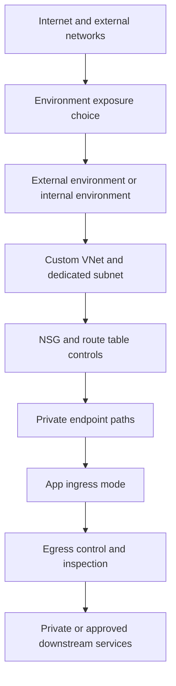

---
content_sources:
  diagrams:
    - id: layered-network-isolation-stack
      type: flowchart
      source: mslearn-adapted
      based_on:
        - https://learn.microsoft.com/azure/container-apps/networking
        - https://learn.microsoft.com/azure/container-apps/custom-virtual-networks
        - https://learn.microsoft.com/azure/container-apps/how-to-use-private-endpoint
        - https://learn.microsoft.com/azure/container-apps/firewall-integration
        - https://learn.microsoft.com/azure/container-apps/ingress-environment-configuration
content_validation:
  status: verified
  last_reviewed: "2026-04-25"
  reviewer: ai-agent
  core_claims:
    - claim: "You can deploy a Container Apps environment into your own virtual network by using a dedicated subnet."
      source: "https://learn.microsoft.com/azure/container-apps/custom-virtual-networks"
      verified: true
    - claim: "Private endpoints provide private access to a Container Apps environment, and public network access must be disabled to use them."
      source: "https://learn.microsoft.com/azure/container-apps/how-to-use-private-endpoint"
      verified: true
    - claim: "User-defined routes, Azure Firewall integration, and advanced egress control are supported for workload profiles environments."
      source: "https://learn.microsoft.com/azure/container-apps/firewall-integration"
      verified: true
    - claim: "Container Apps networking guidance distinguishes internal and external environment exposure and supports environment-level ingress configuration."
      source: "https://learn.microsoft.com/azure/container-apps/networking"
      verified: true
---

# Network Isolation in Azure Container Apps

Network isolation in Azure Container Apps is a layered design problem, not a single setting. This page consolidates the environment, ingress, private connectivity, and egress controls from a security perspective so you can choose the right boundary for the threat you are trying to reduce.

## Defense-in-depth layers

Microsoft Learn documents several network controls that work together rather than replacing one another:

- **Internal environment** to remove public environment exposure.
- **Custom VNet integration** to place the environment in a dedicated subnet you control.
- **Private endpoints** for private inbound access to the environment and private outbound access to dependencies.
- **NSG and UDR controls** to constrain traffic paths inside the VNet.
- **Ingress configuration** to decide whether each app is externally reachable, internally reachable, or not HTTP-addressable.
- **Egress control** through Azure Firewall, NAT Gateway, or approved routing patterns.

<!-- diagram-id: layered-network-isolation-stack -->

## Layer 1: Environment exposure boundary

The first security decision is whether the environment itself should be reachable from the public internet.

### Internal environment

Use an **internal** environment when the workload should stay on private address space and be reached only from within the virtual network, peered networks, or connected on-premises paths.

Security value:

- Removes the public environment endpoint.
- Creates a cleaner boundary for private APIs and back-end services.
- Pairs naturally with Application Gateway, API Management, or other controlled entry points.

### External environment

Use an **external** environment only when public ingress is part of the workload design.

Security implication:

- You still need per-app ingress decisions.
- Public reachability should be limited to true edge applications, not all services in the environment.

## Layer 2: Custom VNet integration

Microsoft Learn documents that you can deploy a Container Apps environment into a user-provided virtual network by using a dedicated subnet. This is the control that unlocks most enterprise isolation patterns.

Security value:

- Lets you apply VNet-level governance.
- Enables private endpoint consumption for downstream Azure services.
- Supports route control and inspection patterns in supported environment types.

!!! note "VNet integration is the foundation, not the finish line"
    Moving the environment into a VNet does not automatically make the workload private. You still need to choose internal or external exposure, configure ingress carefully, and validate outbound paths.

## Layer 3: Private endpoints

Private endpoints matter in two different security scenarios:

1. **Private inbound access to the Container Apps environment**.
2. **Private outbound access from apps to Azure services such as Key Vault, Storage, or Azure Container Registry**.

Microsoft Learn documents private endpoint support for Container Apps environments and notes that public network access must be disabled to create private endpoint access for the environment.

Security value:

- Keeps traffic on private IP space.
- Reduces dependency on public DNS and public service endpoints.
- Helps satisfy regulated workload requirements for private-only entry.

!!! warning "Private endpoint design is DNS-dependent"
    Private access fails when name resolution, zone links, or endpoint records are incomplete. Treat DNS as part of the isolation boundary, not as an afterthought.

## Layer 4: NSG and UDR controls

Once the environment lives in your VNet, subnet-level controls become part of the security posture.

### NSGs

Use NSGs to narrow allowed traffic patterns around the environment subnet and related private endpoint subnets.

Typical security objectives:

- Reduce accidental lateral reachability.
- Enforce approved inbound and outbound subnet flows.
- Align the environment with broader enterprise segmentation rules.

### UDRs

Use user-defined routes when you need outbound traffic to follow a controlled path, such as Azure Firewall or another network virtual appliance.

Typical security objectives:

- Force inspection of internet-bound traffic.
- Route traffic through centralized security tooling.
- Keep egress decisions out of individual application deployments.

!!! note "Advanced egress control depends on environment type"
    Microsoft Learn documents Azure Firewall and UDR-based egress control for workload profiles environments. If your design depends on strict route governance, confirm that your environment type supports the required network features.

## Layer 5: App ingress decisions

Even in a hardened environment, each app still needs an explicit ingress posture.

| Ingress mode | Security meaning | Typical use |
|---|---|---|
| External | Publicly reachable through the environment ingress path | Public API or web frontend |
| Internal | Reachable only from the environment-private network path | Private service API |
| None | No HTTP ingress surface | Worker, consumer, or event-driven app |

Security guidance:

- Use **external ingress** only for true entry-point applications.
- Use **internal ingress** for back-end services that should never be internet-addressable.
- Use **no ingress** when a workload does not need direct HTTP entry.

## Layer 6: Egress control

Inbound isolation is only half the model. Egress control reduces data exfiltration risk and helps enforce approved dependency paths.

Microsoft Learn documents egress governance options such as Azure Firewall integration and NAT Gateway in supported Container Apps network scenarios.

Security value:

- Centralizes outbound allow-listing.
- Makes dependency review auditable.
- Supports stable outbound IP requirements for partner allow-lists.

Common uses:

- Route all internet-bound traffic through Azure Firewall for FQDN-aware policy.
- Use NAT Gateway when a static outbound IP is required.
- Combine private endpoints with strict egress policy for Azure PaaS dependencies.

## Security decision matrix

Use this matrix to choose the right layer for the threat you are addressing.

| Threat model / requirement | Primary control | Supporting controls |
|---|---|---|
| Prevent public exposure of the whole environment | Internal environment | Private endpoint, controlled edge service |
| Keep a specific service off the internet | Internal ingress or no ingress | Internal environment, service-to-service routing |
| Keep access to Azure dependencies on private IP paths | Private endpoints for dependencies | VNet integration, private DNS, NSG |
| Inspect or restrict outbound traffic | UDR + Azure Firewall | NAT Gateway, dependency allow-list validation |
| Enforce subnet-level segmentation | VNet integration + NSG | Internal environment, private endpoints |
| Provide private-only inbound access from enterprise networks | Environment private endpoint | Public network access disabled, internal environment |
| Limit blast radius of public apps | Separate edge app with external ingress | Internal-only downstream apps, firewall, identity controls |

## Practical guidance for secure topologies

### Private API topology

Recommended combination:

- Internal environment.
- Custom VNet integration.
- Internal ingress on apps.
- Private endpoints to Key Vault, Storage, and ACR where required.
- UDR and firewall controls for outbound governance.

### Internet-facing edge with private backends

Recommended combination:

- One public edge app with external ingress.
- Internal ingress for downstream apps.
- VNet integration for the environment.
- Private endpoints for stateful dependencies.
- Egress control for downstream calls.

This keeps the public boundary small while avoiding duplication of networking guidance already covered elsewhere in the repo.

## See Also

- [Security Overview](index.md)
- [Networking Overview](../networking/index.md)
- [VNet Integration](../networking/vnet-integration.md)
- [Private Endpoints](../networking/private-endpoints.md)
- [Egress Control](../networking/egress-control.md)
- [Networking Best Practices](../../best-practices/networking.md)

## Sources

- [Networking in Azure Container Apps (Microsoft Learn)](https://learn.microsoft.com/azure/container-apps/networking)
- [Custom virtual networks in Azure Container Apps (Microsoft Learn)](https://learn.microsoft.com/azure/container-apps/custom-virtual-networks)
- [Use a private endpoint with Azure Container Apps (Microsoft Learn)](https://learn.microsoft.com/azure/container-apps/how-to-use-private-endpoint)
- [Use Azure Firewall with Azure Container Apps (Microsoft Learn)](https://learn.microsoft.com/azure/container-apps/firewall-integration)
- [Ingress environment configuration in Azure Container Apps (Microsoft Learn)](https://learn.microsoft.com/azure/container-apps/ingress-environment-configuration)
