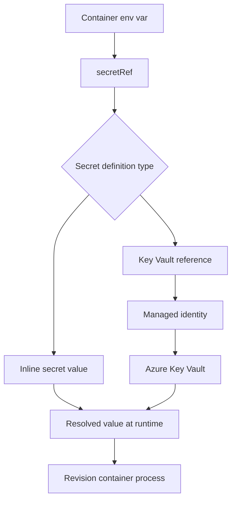

---
content_sources:
  diagrams:
  - id: secretref-resolution-path
    type: flowchart
    source: mslearn-adapted
    based_on:
    - https://learn.microsoft.com/azure/container-apps/manage-secrets
    - https://learn.microsoft.com/azure/container-apps/environment-variables
    - https://learn.microsoft.com/azure/container-apps/managed-identity
content_validation:
  status: verified
  last_reviewed: '2026-04-25'
  reviewer: ai-agent
  core_claims:
  - claim: Container Apps secrets are application-scoped, outside any specific revision, and changing a secret does not create
      a new revision.
    source: https://learn.microsoft.com/azure/container-apps/manage-secrets
    verified: true
  - claim: Container Apps supports inline secrets with a value field and Key Vault-backed secrets with keyVaultUrl and identity
      fields.
    source: https://learn.microsoft.com/azure/container-apps/manage-secrets
    verified: true
  - claim: Environment variables can reference a secret by using the secretRef field.
    source: https://learn.microsoft.com/azure/container-apps/environment-variables
    verified: true
  - claim: If a Key Vault URI omits the secret version, Container Apps retrieves the latest version within 30 minutes and
      restarts active revisions that reference the secret in an environment variable.
    source: https://learn.microsoft.com/azure/container-apps/manage-secrets
    verified: true
---
# Secrets in Azure Container Apps

Azure Container Apps supports application-scoped secrets stored directly in the app definition or referenced from Azure Key Vault. This page focuses on how those secret mechanisms work inside Container Apps and when secret changes actually reach running revisions.

## Secret exposure model

Container Apps exposes secrets through two layers:

1. **Secret definitions** in the app configuration.
2. **Secret references** from containers, most commonly through environment variables.

Microsoft Learn documents two supported secret definition patterns:

- **Inline secret**: the secret value is stored directly in the Container Apps secret store.
- **Key Vault reference**: the secret definition stores a `keyVaultUrl` and an `identity` that Container Apps uses to resolve the value from Azure Key Vault.

!!! note "Secrets are app-scoped, not revision-scoped"
    Secrets are scoped to the container app, outside any specific revision. Adding, changing, or deleting a secret does not create a new revision by itself.

## Inline secrets vs Key Vault references

| Pattern | Secret definition | Identity required | Rotation behavior | Best fit |
|---|---|---|---|---|
| Inline secret | `name` + `value` | No external identity for the secret store itself | Update secret, then deploy a new revision or restart an existing revision to apply it | Low-sensitivity or bootstrap values |
| Key Vault reference | `name` + `keyVaultUrl` + `identity` | Yes — system-assigned or user-assigned managed identity with Key Vault access | If no version is pinned, Container Apps retrieves the latest version within 30 minutes and restarts active revisions that reference it in environment variables | Production secrets with centralized governance |

### Inline secret shape

Microsoft Learn shows inline secrets as name/value pairs:

```json
{
  "name": "queue-connection-string",
  "value": "<secret-value>"
}
```

### Key Vault reference shape

Microsoft Learn shows Key Vault-backed secrets with `keyVaultUrl` and `identity`:

```json
{
  "name": "queue-connection-string",
  "keyVaultUrl": "https://<key-vault-name>.vault.azure.net/secrets/queue-connection-string",
  "identity": "system"
}
```

For a user-assigned identity, Microsoft Learn documents replacing `system` with the user-assigned identity resource ID.

## How containers consume secrets

Environment variables reference secrets with `secretRef` instead of embedding the value directly in the container spec.

<!-- diagram-id: secretref-resolution-path -->


Example environment variable reference:

```json
{
  "name": "ConnectionString",
  "secretRef": "queue-connection-string"
}
```

The same secret name can be referenced by multiple revisions because the secret definition lives at the application level.

## Managed identity requirements for Key Vault

Container Apps requires a managed identity before it can resolve a Key Vault-backed secret. Microsoft Learn documents these requirements:

- Enable either a **system-assigned** or **user-assigned** managed identity on the container app.
- Grant the identity access to the secret in Key Vault, typically through Azure RBAC such as `Key Vault Secrets User`.
- Ensure the app has a valid network path to Key Vault if the vault is behind private endpoints or other network restrictions.

!!! warning "CLI sequencing matters for system-assigned identity"
    Microsoft Learn notes that a system-assigned identity is not available until after the app is created. When you need to configure Key Vault references during initial deployment automation, verify whether your workflow should use a user-assigned identity first.

## Rotation and refresh behavior

Rotation behavior is where inline secrets and Key Vault references diverge most.

### Inline secrets

When you update or delete an inline secret:

- Existing revisions do **not** automatically receive the new value.
- You must either:
    - Deploy a new revision, or
    - Restart an existing revision.

This makes inline secrets operationally simple, but they do not provide automatic refresh behavior.

### Key Vault references

When the `keyVaultUrl` omits a secret version:

- Container Apps uses the latest Key Vault version.
- When a newer version becomes available, Container Apps automatically retrieves it within 30 minutes.
- Active revisions that reference that secret in an environment variable are automatically restarted to pick up the new value.

If you pin a specific secret version in the URI, you control promotion explicitly, but you also give up automatic latest-version refresh.

## Practical configuration patterns

### Pattern 1: Inline secret stored in Container Apps

Use this when the value is app-local and you already have a controlled revision rollout process.

```bash
az containerapp secret set \
  --name "$APP_NAME" \
  --resource-group "$RG" \
  --secrets "api-key=<secret-value>"

az containerapp update \
  --name "$APP_NAME" \
  --resource-group "$RG" \
  --set-env-vars "API_KEY=secretref:api-key"
```

| Command | Why it is used |
|---|---|
| `az containerapp secret set ...` | Manages Container Apps secrets without exposing secret values in plain configuration. |

### Pattern 2: Key Vault-backed secret with managed identity

Use this when you want centralized secret lifecycle management and auditability.

```bash
az containerapp secret set \
  --name "$APP_NAME" \
  --resource-group "$RG" \
  --secrets "db-password=keyvaultref:https://<key-vault-name>.vault.azure.net/secrets/db-password,identityref:system"

az containerapp update \
  --name "$APP_NAME" \
  --resource-group "$RG" \
  --set-env-vars "DB_PASSWORD=secretref:db-password"
```

| Command | Why it is used |
|---|---|
| `az containerapp secret set ...` | Manages Container Apps secrets without exposing secret values in plain configuration. |

!!! tip "Use Key Vault references for production defaults"
    Key Vault references reduce secret sprawl inside app configuration and align better with centralized rotation, RBAC, and audit requirements.

## Security design guidance

Use these rules of thumb to avoid duplicating the full identity guidance elsewhere in the repo:

- Prefer **managed identity + Key Vault** for production secrets.
- Use **inline secrets** only when the operational simplicity is worth the manual refresh workflow.
- Keep the **secret definition** and the **container reference** conceptually separate when reviewing revisions.
- Treat **revision restart behavior** as part of your rotation plan, not as an implementation detail.

## Portal view: Secrets blade


[Observed] The blade header reads `<your-app-name> | Secrets` with the subtitle `Container App`. The command bar exposes `Add`, `Refresh`, and `Send us your feedback`. A description paragraph reads "Secrets are key/value pairs that can be used to protect sensitive data like passwords and connection strings. Secrets that you store here will be valid across all your revisions. Note that changing secrets will not create a new revision." A table header lists `Key`, `Value`, `Edit`, and `Delete` columns. The central area shows a padlock illustration with "No secrets to display." and "Add your first secret." above an `Add` button. The left navigation highlights `Secrets` under the Settings group.

[Inferred] The description sentence "valid across all your revisions" is consistent with the "Secrets are app-scoped, not revision-scoped" note in the [Secret exposure model](#secret-exposure-model) section above. The sentence "changing secrets will not create a new revision" is consistent with the same note's statement that adding, changing, or deleting a secret does not create a new revision by itself. The single `Add` command in an otherwise empty list appears to map to the entry point for either of the two definition patterns described in the [Inline secrets vs Key Vault references](#inline-secrets-vs-key-vault-references) table — inline `name`+`value` or `name`+`keyVaultUrl`+`identity` — without committing the blade to either pattern until the Add dialog opens.

[Not Proven] The screenshot does not show the dialog that opens after clicking `Add`, so the inline-vs-Key-Vault selector, the `keyVaultUrl` input, and the `identity` selector are outside the scope of this image. It does not show any populated rows, so the per-row `Edit` and `Delete` actions are not visible in their active state. It does not show the `secretRef` consumption flow from the [How containers consume secrets](#how-containers-consume-secrets) section or the 30-minute Key Vault refresh behavior from the [Rotation and refresh behavior](#rotation-and-refresh-behavior) section.

## See Also

- [Security Overview](index.md)
- [Key Vault Secrets Management (Managed Identity)](../identity-and-secrets/key-vault.md)
- [Managed Identity](../identity-and-secrets/managed-identity.md)
- [Secret Rotation](../../operations/secret-rotation/index.md)
- [Identity and Secrets Best Practices](../../best-practices/identity-and-secrets.md)

## Sources

- [Manage secrets in Azure Container Apps (Microsoft Learn)](https://learn.microsoft.com/azure/container-apps/manage-secrets)
- [Manage environment variables in Azure Container Apps (Microsoft Learn)](https://learn.microsoft.com/azure/container-apps/environment-variables)
- [Managed identities in Azure Container Apps (Microsoft Learn)](https://learn.microsoft.com/azure/container-apps/managed-identity)
