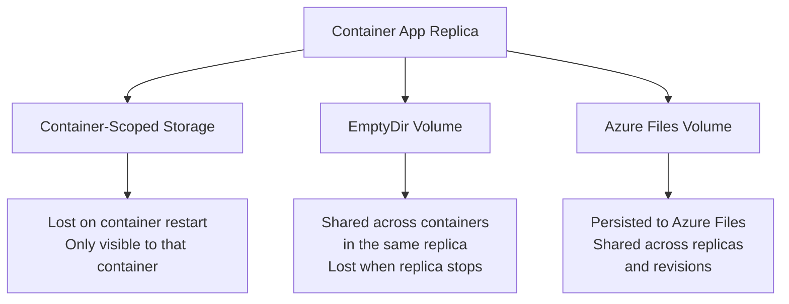
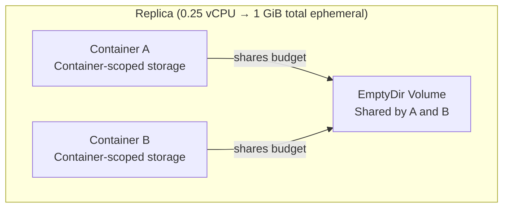
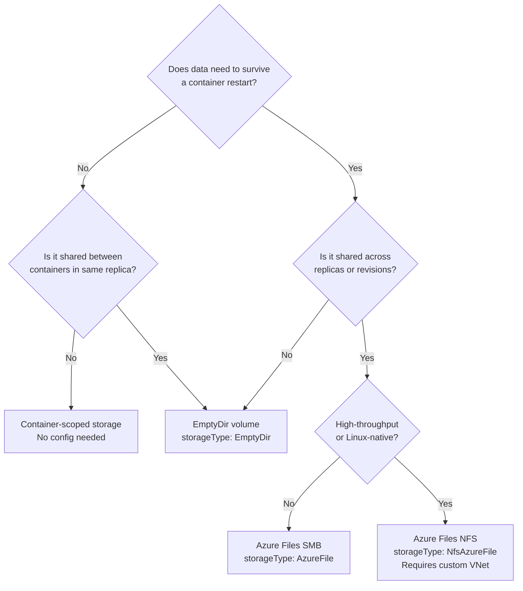

---
content_sources:
  diagrams:
  - id: storage-types-overview
    type: flowchart
    source: mslearn-adapted
    based_on:
    - https://learn.microsoft.com/en-us/azure/container-apps/storage-mounts
  - id: ephemeral-storage-scope
    type: flowchart
    source: mslearn-adapted
    based_on:
    - https://learn.microsoft.com/en-us/azure/container-apps/storage-mounts
  - id: storage-decision-guide
    type: flowchart
    source: self-generated
    justification: Decision tree synthesized from MSLearn storage-mounts article
    based_on:
    - https://learn.microsoft.com/en-us/azure/container-apps/storage-mounts
content_validation:
  status: verified
  last_reviewed: '2026-05-01'
  reviewer: agent
  core_claims:
  - claim: 'Container Apps supports three storage types: container-scoped ephemeral, replica-scoped EmptyDir, and persistent
      Azure Files.'
    source: https://learn.microsoft.com/en-us/azure/container-apps/storage-mounts
    verified: true
  - claim: 'Total ephemeral storage per replica is determined by the number of vCPUs allocated: 0.25 vCPU → 1 GiB, 0.5 vCPU
      → 2 GiB, 1 vCPU → 4 GiB, over 1 vCPU → 8 GiB.'
    source: https://learn.microsoft.com/en-us/azure/container-apps/storage-mounts
    verified: true
  - claim: EmptyDir volumes persist for the lifetime of the replica. If a container restarts, files in the EmptyDir volume
      remain.
    source: https://learn.microsoft.com/en-us/azure/container-apps/storage-mounts
    verified: true
  - claim: Azure Container Apps does not support mounting file shares from Azure NetApp Files or Azure Blob Storage.
    source: https://learn.microsoft.com/en-us/azure/container-apps/storage-mounts
    verified: true
  - claim: Azure Files supports both SMB and NFS protocols for persistent volume mounts.
    source: https://learn.microsoft.com/en-us/azure/container-apps/storage-mounts
    verified: true
---
# Storage in Azure Container Apps

Azure Container Apps supports three storage types for different lifecycle and sharing needs. Choosing the right type prevents data loss, reduces cost, and avoids common configuration errors such as writing persistent data to ephemeral volumes.

## Main Content

### Storage Types at a Glance

| Storage Type | Scope | Persistence | Typical Use |
|---|---|---|---|
| **Container-scoped** | Single container | Until container restarts | Local app cache, temp files |
| **Replica-scoped (EmptyDir)** | All containers in one replica | Until replica shuts down | Sidecar log sharing, scratch space |
| **Azure Files** | Shared across replicas/revisions | Persistent | File uploads, shared state |

!!! warning "Do not use ephemeral storage for persistent data"
    Container-scoped and replica-scoped (EmptyDir) storage is lost when a container or replica stops. Any data that must survive restarts or scaling events must be written to Azure Files or an external store.

<!-- diagram-id: storage-types-overview -->


### Ephemeral Storage

Each replica receives a total ephemeral storage budget based on its vCPU allocation. This budget is shared across container-scoped and replica-scoped storage.

| vCPUs allocated | Total ephemeral storage |
|---|---|
| 0.25 or lower | 1 GiB |
| 0.5 or lower | 2 GiB |
| 1 or lower | 4 GiB |
| Over 1 | 8 GiB |

<!-- diagram-id: ephemeral-storage-scope -->


You can inspect the ephemeral storage limit for a running container app:

```bash
az containerapp show \
  --name $APP_NAME \
  --resource-group $RG \
  --query "properties.template.containers[0].resources" \
  --output yaml
```

| Command/Code | Purpose |
|---|---|
| `--query "properties.template.containers[0].resources"` | Extracts the CPU, memory, and ephemeralStorage fields from the first container definition |

<!-- Verified: real az CLI output from koreacentral, 2026-05-01 -->
```yaml
cpu: 0.25
ephemeralStorage: 1Gi
memory: 0.5Gi
```

#### Container-Scoped Storage

Every container has access to its own writable filesystem. This storage:

- Is temporary and disappears when the container shuts down or restarts.
- Is visible only to the current container — not to sidecars or other replicas.
- Requires no configuration — it is always available.

Use container-scoped storage for ephemeral operations: unpacking archives, writing intermediate computation output, or storing short-lived session data.

#### Replica-Scoped Storage (EmptyDir)

An EmptyDir volume is the equivalent of a Kubernetes `EmptyDir` mount — a temporary directory shared across all containers in the same replica. It persists for the lifetime of the replica, surviving individual container restarts.

**When to use EmptyDir:**

- Main app container writes log files, sidecar container ships them.
- Multiple init containers pass data to the main container.
- Scratch space for data processing that must survive container crashes but not replica replacement.

##### Configure EmptyDir via YAML

Export your app spec, add a volume and mount, then redeploy:

```bash
az containerapp show \
  --name $APP_NAME \
  --resource-group $RG \
  --output yaml > app.yaml
```

| Command/Code | Purpose |
|---|---|
| `--output yaml` | Exports the full app spec as YAML for editing |

Edit `app.yaml` to add the volume and mount:

```yaml
properties:
  template:
    containers:
    - name: my-app
      image: <IMAGE>
      resources:
        cpu: 0.25
        memory: 0.5Gi
      volumeMounts:
      - mountPath: /tmp/cache
        volumeName: cache-vol
    volumes:
    - name: cache-vol
      storageType: EmptyDir
```

| Field | Purpose |
|---|---|
| `storageType: EmptyDir` | Declares a replica-scoped ephemeral volume |
| `volumeName` | Links the volume definition to the container mount |
| `mountPath` | Absolute path inside the container where the volume appears |

Apply the update:

```bash
az containerapp update \
  --name $APP_NAME \
  --resource-group $RG \
  --yaml app.yaml \
  --output yaml
```

| Command/Code | Purpose |
|---|---|
| `--yaml app.yaml` | Applies the edited spec including the new volume definition |
| `--output yaml` | Returns the updated app spec for verification |

Verify the volume is applied:

```bash
az containerapp show \
  --name $APP_NAME \
  --resource-group $RG \
  --output yaml
```

| Command/Code | Purpose |
|---|---|
| `--output yaml` | Returns the full app spec; inspect `volumes` and `volumeMounts` to confirm the EmptyDir is registered |

<!-- Verified: real az CLI output from koreacentral, 2026-05-01 -->
```yaml
volumeMounts:
- mountPath: /tmp/cache
  volumeName: cache-vol
volumes:
- name: cache-vol
  storageType: EmptyDir
```

##### Verify EmptyDir Write and Read at Runtime

Run a Container Apps Job to write a file and read it back from the EmptyDir mount:

```bash
az containerapp job start \
  --name $JOB_NAME \
  --resource-group $RG
```

| Command/Code | Purpose |
|---|---|
| `az containerapp job start` | Triggers a manual job execution; the job writes to and reads from the EmptyDir volume |

The job command writes a file to `/mnt/cache`, reads it back, lists the directory, and reports disk usage:

<!-- Verified: real az CLI output from koreacentral, 2026-05-01 -->
```text
WRITTEN
hello-emptydir
total 12
drwxr-xr-x 2 root root 4096 May  1 12:30 .
drwxr-xr-x 1 root root 4096 May  1 12:30 ..
-rw-r--r-- 1 root root   15 May  1 12:30 test.txt
Filesystem      Size  Used Avail Use% Mounted on
overlay          148G   28G  114G  20% /mnt/cache
DONE
```

| Output | Meaning |
|---|---|
| `WRITTEN` / `hello-emptydir` | Write and read succeeded — EmptyDir is writable |
| `test.txt` 15 bytes | File persisted within the replica lifetime |
| `148G … /mnt/cache` | Backed by node ephemeral disk, not a separate volume limit |

!!! note "EmptyDir does not share data across replicas"
    Each replica has its own EmptyDir instance. Data written by one replica is not visible to another. For cross-replica sharing, use Azure Files.

### Azure Files (Persistent Storage)

Azure Files provides persistent storage that survives container restarts, replica replacements, and revision rollbacks. Multiple containers across different replicas, revisions, or container apps can mount the same file share simultaneously.

**Supported protocols:**

| Protocol | storageType value | Use case |
|---|---|---|
| SMB | `AzureFile` | General-purpose file sharing, Windows-compatible |
| NFS | `NfsAzureFile` | Linux-native workloads, high-throughput scenarios |

!!! warning "NFS requires a custom VNet"
    NFS Azure Files requires the Container Apps environment to use a custom VNet. Ports 445 (SMB) and 2049 (NFS) must be open in the NSG associated with the environment subnet.

!!! note "Unsupported storage backends"
    Azure Container Apps does not support mounting Azure NetApp Files or Azure Blob Storage as volumes.

!!! warning "Azure Files SMB in Consumption environments"
    Port 445 (SMB) outbound may be blocked in Consumption-only environments without a custom VNet.
    If your job or app replica stays in `Activating` state after adding an Azure Files volume, the mount is failing silently.
    Workarounds:

    - Deploy into a **Workload Profiles environment** with a custom VNet and an NSG that allows port 445 outbound.
    - Switch to **NFS** (`storageType: NfsAzureFile`) — requires a Premium FileStorage account and a custom VNet.
    - Use **EmptyDir** for ephemeral scratch space and persist data to Azure Blob Storage via application code.

#### Register Azure Files with the Environment

Before mounting, register the file share at the environment level:

```bash
az containerapp env storage set \
  --name $ENV_NAME \
  --resource-group $RG \
  --storage-name my-files \
  --storage-type AzureFile \
  --azure-file-account-name $STORAGE_ACCOUNT \
  --azure-file-account-key $STORAGE_KEY \
  --azure-file-share-name $SHARE_NAME \
  --access-mode ReadWrite
```

| Command/Code | Purpose |
|---|---|
| `--storage-name` | Logical name for the storage definition in the environment |
| `--storage-type AzureFile` | Specifies SMB Azure Files |
| `--access-mode ReadWrite` | Mounts with read and write permissions |

Verify the registration:

```bash
az containerapp env storage list \
  --name $ENV_NAME \
  --resource-group $RG \
  --output table
```

| Command/Code | Purpose |
|---|---|
| `az containerapp env storage list` | Lists all storage definitions registered in the environment |

<!-- Verified: real az CLI output from koreacentral, 2026-05-01 -->
```text
Name            ResourceGroup
--------------  ----------------
my-files        rg-myapp
```

#### Mount Azure Files in a Container

Add the volume and mount to your app YAML:

```yaml
properties:
  template:
    containers:
    - name: my-app
      image: <IMAGE>
      volumeMounts:
      - mountPath: /mnt/data
        volumeName: files-vol
        subPath: uploads
    volumes:
    - name: files-vol
      storageType: AzureFile
      storageName: my-files
```

| Field | Purpose |
|---|---|
| `storageName` | References the storage definition registered in the environment |
| `subPath` | Optional subdirectory within the share to mount (do not prefix with `/`) |

### Storage Decision Guide

<!-- diagram-id: storage-decision-guide -->


### Common Mistakes

| Mistake | Impact | Fix |
|---|---|---|
| Writing upload files to container-scoped storage | Files lost on container restart | Mount Azure Files at the upload path |
| Using EmptyDir for cross-replica cache | Each replica has isolated storage; cache misses on every new replica | Use Redis Cache or Azure Files |
| Mounting NFS without a custom VNet | Deployment fails silently | Configure custom VNet before creating the environment |
| Sub path starting with `/` | Container app fails to start | Use relative sub paths: `uploads`, not `/uploads` |
| Exceeding ephemeral storage budget | `EphemeralStorageExceeded` crash loop | Reduce write volume, add log rotation, or increase vCPU allocation |

### Verify storage surfaces in Azure Portal


**[Observed]** `ca-sample-d38538 | Revisions and replicas` `Container App` `Create new revision` `Save` `Refresh` `Deployment mode` `Active revisions` `Inactive revisions` `Replicas` `Name` `Date created` `Running status` `View Logs` `Label` `Traffic` `Replicas` `ca-sample-d38538--0uzoi59` `6/3/2026, 10:34:26 PM` `Running` `View details` `Show Logs` `100 %` `1 (Show replicas)`.

**[Inferred]** The `Replicas` `1 (Show replicas)` value is consistent with the per-replica ephemeral storage budget described in [Ephemeral Storage](#ephemeral-storage).

**[Not Proven]** The configured vCPU allocation that determines the ephemeral storage budget is not visible on this view. The mounted Azure Files volumes and their sub paths are not visible on this view. The EmptyDir volume definitions shared across containers in this replica are not visible on this view. The container-scoped storage usage relative to the budget is not visible on this view.

## See Also

- [EmptyDir Disk Full — Lab Guide](../../troubleshooting/lab-guides/emptydir-disk-full.md)
- [EmptyDir Disk Full — Playbook](../../troubleshooting/playbooks/storage-and-volumes/emptydir-disk-full.md)
- [Azure Files Mount Failure — Playbook](../../troubleshooting/playbooks/storage-and-volumes/azure-files-mount-failure.md)
- [Volume Permission Denied — Playbook](../../troubleshooting/playbooks/storage-and-volumes/volume-permission-denied.md)

## Sources

- [Use storage mounts in Azure Container Apps — Microsoft Learn](https://learn.microsoft.com/en-us/azure/container-apps/storage-mounts)
- [Create an Azure Files storage mount — Microsoft Learn](https://learn.microsoft.com/en-us/azure/container-apps/storage-mounts-azure-files)
- [Troubleshoot storage mount failures — Microsoft Learn](https://learn.microsoft.com/en-us/azure/container-apps/troubleshoot-storage-mount-failures)
