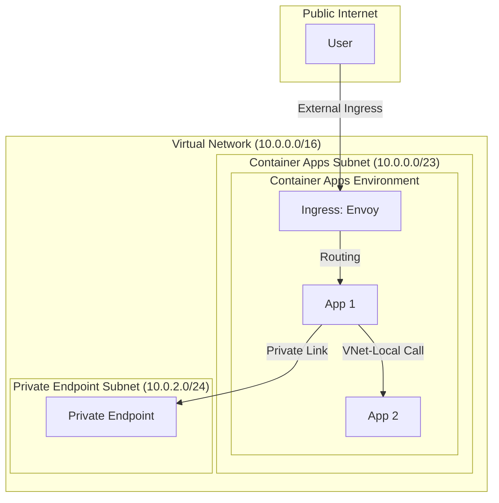

# VNet Integration

Deploy Container Apps in a custom virtual network for network isolation.

## Overview

Container Apps can be deployed into a custom VNet to:
- Isolate traffic from the public internet
- Connect to private resources (databases, storage)
- Control ingress/egress with NSG rules

## Architecture



## Prerequisites

- Azure subscription with VNet creation permissions
- Existing VNet or create new one

## Create VNet with Subnets

Container Apps requires a dedicated subnet with minimum /23 CIDR block.

### Using Azure CLI:
```bash
# Create VNet
az network vnet create \
  --name vnet-containerapp \
  --resource-group $RESOURCE_GROUP \
  --location $LOCATION \
  --address-prefix 10.0.0.0/16

# Create subnet for Container Apps (minimum /23)
az network vnet subnet create \
  --name snet-containerapp \
  --vnet-name vnet-containerapp \
  --resource-group $RESOURCE_GROUP \
  --address-prefix 10.0.0.0/23
```

### Using Bicep:
```bicep
resource vnet 'Microsoft.Network/virtualNetworks@2023-05-01' = {
  name: 'vnet-containerapp'
  location: location
  properties: {
    addressSpace: {
      addressPrefixes: ['10.0.0.0/16']
    }
    subnets: [
      {
        name: 'snet-containerapp'
        properties: {
          addressPrefix: '10.0.0.0/23'
        }
      }
    ]
  }
}
```

## Deploy Container Apps Environment with VNet

```bicep
resource containerAppEnv 'Microsoft.App/managedEnvironments@2023-05-01' = {
  name: 'cae-${baseName}'
  location: location
  properties: {
    vnetConfiguration: {
      infrastructureSubnetId: vnet.properties.subnets[0].id
      internal: false  // true for internal-only access
    }
    appLogsConfiguration: {
      destination: 'log-analytics'
      logAnalyticsConfiguration: {
        customerId: logAnalytics.properties.customerId
        sharedKey: logAnalytics.listKeys().primarySharedKey
      }
    }
  }
}
```

## Internal vs External Ingress

| Mode | Description | Use Case |
|------|-------------|----------|
| `internal: false` | Public IP + VNet | Public APIs with VNet backend access |
| `internal: true` | Private IP only | Internal microservices, no public access |

## Access Private Resources

Once in a VNet, Container Apps can access:
- Private Endpoints (Azure SQL, Storage, Key Vault)
- VNet-peered resources
- On-premises via VPN/ExpressRoute

### Example: Connect to Private Azure SQL
```python
import os
import pyodbc

# Connection string uses private endpoint DNS
conn_str = os.environ['SQL_CONNECTION_STRING']
# Server=myserver.database.windows.net -> resolves to private IP
```

## Network Security Groups

Apply NSG rules to the Container Apps subnet:

```bicep
resource nsg 'Microsoft.Network/networkSecurityGroups@2023-05-01' = {
  name: 'nsg-containerapp'
  location: location
  properties: {
    securityRules: [
      {
        name: 'AllowHTTPS'
        properties: {
          priority: 100
          direction: 'Inbound'
          access: 'Allow'
          protocol: 'Tcp'
          sourceAddressPrefix: '*'
          sourcePortRange: '*'
          destinationAddressPrefix: '*'
          destinationPortRange: '443'
        }
      }
    ]
  }
}
```

## Troubleshooting

### Container can't reach private endpoint
1. Check DNS resolution inside container
2. Verify private endpoint is in same/peered VNet
3. Check NSG rules allow outbound traffic

### Public access not working
1. Verify `internal: false` in environment config
2. Check ingress is enabled on container app
3. Verify FQDN is correctly configured

## See Also

- [Private Endpoints](./networking-private-endpoint.md)
- [Egress Control](./networking-egress.md)
- [Service-to-Service Communication](./networking-service-to-service.md)
- [Azure SQL](./azure-sql.md)
- [Custom virtual networks in Azure Container Apps (Microsoft Learn)](https://learn.microsoft.com/azure/container-apps/vnet-custom)
- [Networking architecture in Azure Container Apps (Microsoft Learn)](https://learn.microsoft.com/azure/container-apps/networking)
