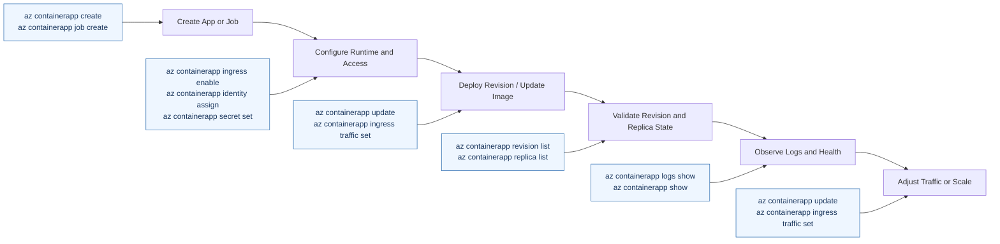

---
hide:
  - toc
---

# Azure Container Apps CLI Reference

This reference summarizes commonly used Azure Container Apps CLI command groups with production-friendly examples that use long flags.

## Prerequisites

- Azure CLI 2.57+
- Container Apps extension installed and updated

```bash
az extension add --name containerapp --upgrade
```

!!! warning "Destructive commands require explicit target verification"
    Commands such as `az containerapp delete` and revision deactivation can immediately impact availability. Validate `$RG`, `$APP_NAME`, and `$REVISION_NAME` before execution, and confirm intended scope with `az containerapp show` first.

!!! tip "Use a predictable lifecycle workflow"
    For day-to-day operations, use a consistent order: create or update, configure ingress/identity/secrets, then validate revisions and logs. This reduces missed steps during incident response.

## CLI workflow map



## `az containerapp` commands

### Create

```bash
az containerapp create \
  --name "$APP_NAME" \
  --resource-group "$RG" \
  --environment "$ENVIRONMENT_NAME" \
  --image "$ACR_NAME.azurecr.io/$APP_NAME:v1.0.0" \
  --target-port 8000 \
  --ingress external \
  --registry-server "$ACR_NAME.azurecr.io" \
  --registry-identity system \
  --min-replicas 1 \
  --max-replicas 5
```

Example output (PII scrubbed):

```json
{
  "name": "ca-myapp",
  "location": "Korea Central",
  "provisioningState": "Succeeded",
  "runningStatus": "Running",
  "latestRevisionName": "ca-myapp--0000001"
}
```

### Update

```bash
az containerapp update \
  --name "$APP_NAME" \
  --resource-group "$RG" \
  --image "$ACR_NAME.azurecr.io/$APP_NAME:$IMAGE_TAG" \
  --cpu 0.5 \
  --memory 1.0Gi \
  --set-env-vars "ENV=prod" "LOG_LEVEL=info"
```

Example output (PII scrubbed):

```json
{
  "name": "ca-myapp",
  "provisioningState": "Succeeded",
  "template": {
    "containers": [
      {
        "name": "ca-myapp",
        "image": "<acr-name>.azurecr.io/myapp:v1.0.0",
        "resources": {
          "cpu": 0.5,
          "memory": "1Gi"
        }
      }
    ],
    "scale": {
      "minReplicas": 1,
      "maxReplicas": 3
    }
  }
}
```

### Show

```bash
az containerapp show \
  --name "$APP_NAME" \
  --resource-group "$RG" \
  --output json
```

Example output (PII scrubbed):

```json
{
  "name": "ca-myapp",
  "location": "Korea Central",
  "provisioningState": "Succeeded",
  "runningStatus": "Running",
  "latestRevisionName": "ca-myapp--0000001",
  "ingress": {
    "fqdn": "ca-myapp.<hash>.<region>.azurecontainerapps.io",
    "external": true,
    "targetPort": 8000,
    "transport": "Auto"
  },
  "identity": {
    "type": "SystemAssigned"
  }
}
```

### List

```bash
az containerapp list \
  --resource-group "$RG" \
  --output table
```

Example output (PII scrubbed):

```text
Name      ResourceGroup  Location      Environment  LatestRevision      ProvisioningState  RunningStatus
--------  -------------  ------------  -----------  ------------------  -----------------  -------------
ca-myapp  rg-myapp       koreacentral  cae-myapp    ca-myapp--0000001  Succeeded          Running
```

### Delete

```bash
az containerapp delete \
  --name "$APP_NAME" \
  --resource-group "$RG" \
  --yes
```

Example output:

```text
Command group 'containerapp' is in preview and under development.
```

## `az containerapp revision` commands

```bash
az containerapp revision list \
  --name "$APP_NAME" \
  --resource-group "$RG" \
  --output table

az containerapp revision show \
  --name "$APP_NAME" \
  --resource-group "$RG" \
  --revision "$REVISION_NAME" \
  --output json

az containerapp revision deactivate \
  --name "$APP_NAME" \
  --resource-group "$RG" \
  --revision "$REVISION_NAME"

az containerapp revision restart \
  --name "$APP_NAME" \
  --resource-group "$RG" \
  --revision "$REVISION_NAME"
```

Example output for `az containerapp revision list` (PII scrubbed):

```json
[
  {
    "name": "ca-myapp--0000001",
    "active": true,
    "trafficWeight": 100,
    "replicas": 1,
    "healthState": "Healthy",
    "runningState": "Running"
  }
]
```

Example output for `az containerapp revision show`:

```json
{
  "name": "ca-myapp--0000001",
  "active": true,
  "healthState": "Healthy",
  "runningState": "Running"
}
```

Example output for `deactivate` / `restart`:

```text
{
  "name": "ca-myapp--0000001",
  "provisioningState": "Succeeded"
}
```

## `az containerapp replica` commands

```bash
az containerapp replica list \
  --name "$APP_NAME" \
  --resource-group "$RG" \
  --revision "$REVISION_NAME" \
  --output table

az containerapp replica show \
  --name "$APP_NAME" \
  --resource-group "$RG" \
  --replica "$REPLICA_NAME" \
  --revision "$REVISION_NAME" \
  --output json
```

Example output for `az containerapp replica list` (PII scrubbed):

```json
[
  {
    "name": "ca-myapp--0000001-646779b4c5-bhc2v",
    "properties": {
      "containers": [
        {
          "name": "ca-myapp",
          "ready": true,
          "restartCount": 0,
          "runningState": "Running"
        }
      ],
      "runningState": "Running"
    }
  }
]
```

Example output for `az containerapp replica show`:

```json
{
  "name": "ca-myapp--0000001-646779b4c5-bhc2v",
  "properties": {
    "runningState": "Running"
  }
}
```

## `az containerapp logs` commands

```bash
az containerapp logs show \
  --name "$APP_NAME" \
  --resource-group "$RG" \
  --follow false

az containerapp logs show \
  --name "$APP_NAME" \
  --resource-group "$RG" \
  --revision "$REVISION_NAME" \
  --tail 200
```

Example output:

```text
{"status":"healthy","timestamp":"2026-04-04T11:32:37.322216+00:00"}
```

## `az containerapp env` commands

```bash
az containerapp env create \
  --name "$ENVIRONMENT_NAME" \
  --resource-group "$RG" \
  --location "$LOCATION"

az containerapp env show \
  --name "$ENVIRONMENT_NAME" \
  --resource-group "$RG" \
  --output json

az containerapp env list \
  --resource-group "$RG" \
  --output table
```

Example output for `az containerapp env show` (PII scrubbed):

```json
{
  "name": "cae-myapp",
  "location": "Korea Central",
  "provisioningState": "Succeeded",
  "defaultDomain": "<hash>.<region>.azurecontainerapps.io",
  "staticIp": "<static-ip>",
  "zoneRedundant": false
}
```

Example output for `az containerapp env list`:

```text
Name       ResourceGroup  Location      ProvisioningState
---------  -------------  ------------  -----------------
cae-myapp  rg-myapp       koreacentral  Succeeded
```

## `az containerapp job` commands

```bash
az containerapp job create \
  --name "$JOB_NAME" \
  --resource-group "$RG" \
  --environment "$ENVIRONMENT_NAME" \
  --trigger-type Schedule \
  --cron-expression "*/15 * * * *" \
  --image "$ACR_NAME.azurecr.io/$JOB_NAME:v1.0.0" \
  --registry-server "$ACR_NAME.azurecr.io" \
  --registry-identity system

az containerapp job start \
  --name "$JOB_NAME" \
  --resource-group "$RG"

az containerapp job show \
  --name "$JOB_NAME" \
  --resource-group "$RG" \
  --output json

az containerapp job execution list \
  --name "$JOB_NAME" \
  --resource-group "$RG" \
  --output table
```

Example output for `az containerapp job show` (PII scrubbed):

```json
{
  "name": "job-myapp",
  "provisioningState": "Succeeded",
  "triggerType": "Schedule",
  "replicaTimeout": 1800,
  "replicaRetryLimit": 2,
  "identity": {
    "type": "UserAssigned"
  }
}
```

Example output for `az containerapp job execution list`:

```json
[
  {
    "name": "job-myapp-w6gm0ew",
    "status": "Succeeded",
    "startTime": "2026-04-04T12:53:54+00:00",
    "endTime": "2026-04-04T12:54:29+00:00"
  }
]
```

## `az containerapp ingress` commands

```bash
az containerapp ingress enable \
  --name "$APP_NAME" \
  --resource-group "$RG" \
  --type external \
  --target-port 8000

az containerapp ingress traffic set \
  --name "$APP_NAME" \
  --resource-group "$RG" \
  --revision-weight "$REVISION_STABLE=90" "$REVISION_CANARY=10"

az containerapp ingress show \
  --name "$APP_NAME" \
  --resource-group "$RG" \
  --output json
```

Example output for `az containerapp ingress show` (PII scrubbed):

```json
{
  "allowInsecure": false,
  "external": true,
  "fqdn": "ca-myapp.<hash>.<region>.azurecontainerapps.io",
  "targetPort": 8000,
  "transport": "Auto",
  "traffic": [
    {
      "latestRevision": true,
      "weight": 100
    }
  ]
}
```

## `az containerapp secret` commands

```bash
az containerapp secret set \
  --name "$APP_NAME" \
  --resource-group "$RG" \
  --secrets "redis-password=<redacted>" "api-key=<redacted>"

az containerapp secret list \
  --name "$APP_NAME" \
  --resource-group "$RG" \
  --output table

az containerapp secret remove \
  --name "$APP_NAME" \
  --resource-group "$RG" \
  --secret-names "api-key"
```

Example output for `az containerapp secret list`:

```text
Name            Value
--------------  -----
redis-password  null
api-key         null
```

## `az containerapp identity` commands

```bash
az containerapp identity assign \
  --name "$APP_NAME" \
  --resource-group "$RG" \
  --system-assigned

az containerapp identity assign \
  --name "$APP_NAME" \
  --resource-group "$RG" \
  --user-assigned "$UAMI_ID"

az containerapp identity show \
  --name "$APP_NAME" \
  --resource-group "$RG" \
  --output json
```

Example output (PII scrubbed):

```json
{
  "type": "SystemAssigned",
  "principalId": "xxxxxxxx-xxxx-xxxx-xxxx-xxxxxxxxxxxx",
  "tenantId": "<tenant-id>"
}
```

## Common flag combinations

| Scenario | Useful flags |
|---|---|
| Script-friendly output | `--output json`, `--query <JMESPath>` |
| Non-interactive execution | `--yes`, `--only-show-errors` |
| Targeting revisions | `--revision <name>`, `--revision-weight` |
| Environment/app targeting | `--resource-group`, `--name`, `--environment` |

!!! note "Prefer deterministic automation output"
    In CI/CD and runbooks, combine `--output json` with `--query` so scripts parse stable machine-readable results instead of table/text formatting.

## Advanced Topics

- Pin CLI and extension versions in CI to avoid drift.
- Use `--query` and structured outputs for deterministic automation.
- Wrap high-risk operations (`delete`, `deactivate`) with change controls.

## See Also

- [Environment Variables Reference](environment-variables.md)
- [Platform Limits](platform-limits.md)

## Sources

- [Microsoft Learn: Azure Container Apps CLI](https://learn.microsoft.com/cli/azure/containerapp)
