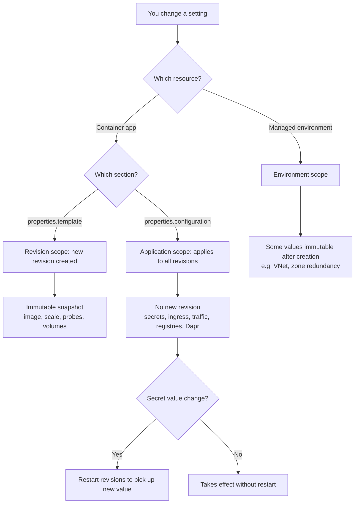

---
content_sources:
  diagrams:
    - id: config-scope-decision
      type: flowchart
      source: mslearn-adapted
      based_on:
        - https://learn.microsoft.com/en-us/azure/container-apps/revisions
        - https://learn.microsoft.com/en-us/azure/container-apps/azure-resource-manager-api-spec
content_validation:
  status: verified
  last_reviewed: '2026-07-18'
  reviewer: ai-agent
  core_claims:
    - claim: Changes to parameters in the container app's properties.template section are revision-scope changes that trigger a new revision.
      source: https://learn.microsoft.com/en-us/azure/container-apps/revisions
      verified: true
    - claim: Changes to parameters in the container app's properties.configuration section are application-scope changes that are applied to all revisions and do not create a new revision.
      source: https://learn.microsoft.com/en-us/azure/container-apps/revisions
      verified: true
    - claim: Secret value changes are application-scope, but revisions must be restarted before a container recognizes the new secret values.
      source: https://learn.microsoft.com/en-us/azure/container-apps/revisions
      verified: true
    - claim: The properties.template section includes revisionSuffix, containers, initContainers, scale, and volumes, while properties.configuration includes activeRevisionsMode, secrets, ingress, registries, and dapr.
      source: https://learn.microsoft.com/en-us/azure/container-apps/azure-resource-manager-api-spec
      verified: true
    - claim: Container Apps environment-level properties such as vnetConfiguration, appLogsConfiguration, workloadProfiles, and zoneRedundant are defined on the managed environment resource.
      source: https://learn.microsoft.com/en-us/azure/container-apps/azure-resource-manager-api-spec
      verified: true
---
# Configuration Scope Matrix

Azure Container Apps settings live at several scopes — the managed **environment**, the **container app** (application scope), the **revision** (revision scope), and the individual **container**. The scope of a setting determines *what happens when you change it*: whether the change creates a new revision, applies globally to every revision, requires a restart to take effect, or is immutable after the environment is created.

Use this matrix to answer a common production question: **"If I change this setting, does it create a revision, affect the whole environment, or need a redeploy?"**

!!! tip "The rule of thumb"
    Anything under `properties.template` is **revision-scope** (creates a new, immutable revision). Anything under `properties.configuration` is **application-scope** (applies to all revisions, no new revision). Environment-level settings live on a separate resource entirely.

## Scope decision at a glance

<!-- diagram-id: config-scope-decision -->

## Change-type model

Microsoft documents two categories of change to a container app:

- **Revision-scope changes** — any change to a parameter in the [`properties.template`](https://learn.microsoft.com/en-us/azure/container-apps/azure-resource-manager-api-spec#propertiestemplate) section. These trigger a new revision when you deploy, and are limited to the revision in which they are deployed.
- **Application-scope changes** — any change to a parameter in the [`properties.configuration`](https://learn.microsoft.com/en-us/azure/container-apps/azure-resource-manager-api-spec#propertiesconfiguration) section. These are applied globally to all revisions and do **not** create a new revision.

## Environment-scope settings

These settings are defined on the **managed environment** resource, not on individual apps. They affect every app in the environment. Several are immutable after the environment is created.

| Setting | ARM property | Change effect | Notes |
|---|---|---|---|
| VNet integration | `vnetConfiguration.infrastructureSubnetId` | Immutable after creation | Requires recreating the environment to change |
| Zone redundancy | `zoneRedundant` | Immutable after creation | Must be set at environment creation |
| Log destination | `appLogsConfiguration` | Environment-wide | Log Analytics workspace / logging configuration |
| Workload profiles | `workloadProfiles` | Environment-wide | Add/scale profiles; apps select a profile by name |
| mTLS (peer authentication) | `peerAuthentication` | Environment-wide | Enables environment-level mTLS encryption |
| Dapr AI instrumentation key | `daprAIInstrumentationKey` | Environment-wide | Application Insights key used by Dapr |
| Environment custom domain | `customDomainConfiguration` | Environment-wide | DNS suffix and certificate for the environment |

## Application-scope settings (no new revision)

These are `properties.configuration` parameters. Changing them applies to all revisions and does **not** create a new revision.

| Setting | ARM property | Change effect | Notes |
|---|---|---|---|
| Revision mode | `activeRevisionsMode` | Applies globally | `single` or `multiple`; `multiple` is required for traffic splitting |
| Secret values | `secrets` | Applies globally; **restart required** | Revisions must be restarted before the container recognizes new secret values |
| Ingress on/off | `ingress.external` / ingress enabled | Applies globally | Turning ingress on or off is application-scope |
| Traffic splitting | `ingress.traffic` | Applies globally | Weights and `latestRevision` routing |
| Revision labels | `ingress.traffic[].label` | Applies globally | Labels can be moved between revisions without a deploy |
| IP restrictions | `ingress.ipSecurityRestrictions` | Applies globally | Allow/deny ranges |
| Sticky sessions | `ingress.stickySessions` | Applies globally | Session affinity |
| Client certificate mode | `ingress.clientCertificateMode` | Applies globally | mTLS ingress client certificate handling |
| CORS policy | `ingress.corsPolicy` | Applies globally | Allowed origins/methods/headers |
| Registry credentials | `registries` | Applies globally | Credentials for private container registries |
| Dapr settings | `dapr` | Applies globally | Enable/configure the app's managed Dapr sidecar |
| Inactive revision limit | `maxInactiveRevisions` | Applies globally | Controls retained inactive revision count |

!!! warning "Secret values are application-scope but not live"
    Changing a secret's value is an application-scope change (it does not create a new revision), **but a container only reads secret values at startup**. You must restart the affected revisions before the new value is used. See [Secret Rotation](../operations/secret-rotation/index.md).

## Revision-scope settings (new revision created)

These are `properties.template` parameters. Any change here creates a new, immutable revision on deploy.

| Setting | ARM property | Change effect | Notes |
|---|---|---|---|
| Revision suffix | `template.revisionSuffix` | New revision | Friendly name suffix; must be unique |
| Container image | `template.containers[].image` | New revision | Prefer immutable tags over `:latest` |
| Scale rules | `template.scale` | New revision | `minReplicas`, `maxReplicas`, and KEDA rules |
| Volumes | `template.volumes` | New revision | `EmptyDir`, `AzureFile`, or `Secret` volumes |
| Init containers | `template.initContainers` | New revision | Run-to-completion before app containers |
| Service binds | `template.serviceBinds` | New revision | Dev-time service connections |

## Container-scope settings (part of the revision)

Container settings live inside `template.containers[]` (and `template.initContainers[]`). They are part of the revision snapshot, so changing any of them is a **revision-scope** change.

| Setting | ARM property | Change effect | Notes |
|---|---|---|---|
| CPU / memory | `containers[].resources` | New revision | Must use a supported CPU/memory combination |
| Health probes | `containers[].probes` | New revision | Liveness, readiness, startup |
| Environment variables | `containers[].env` | New revision | Plain values or `secretRef` references |
| Volume mounts | `containers[].volumeMounts` | New revision | Bind a defined volume to a mount path |
| Command / args | `containers[].command` / `args` | New revision | Container entrypoint overrides |

!!! note "Env vars that reference secrets"
    An env var value change is revision-scope (new revision). But when the env var uses `secretRef`, rotating the *underlying secret value* is application-scope and requires a restart — see the secret note above.

## Jobs: a different lifecycle

Container Apps **jobs** do not use the revision model. For jobs, `properties.configuration` holds `triggerType`, `replicaTimeout`, and `replicaRetryLimit`, while `properties.template` holds `containers` and `scale`. Updating a job changes the job definition used by subsequent executions rather than creating a revision.

## Usage Notes

- When you need a change to be picked up **without** creating a new revision, confirm it is a `properties.configuration` parameter.
- When you need an **auditable, rollback-able** snapshot, make the change revision-scope so it produces a new revision.
- Environment-level immutable settings (VNet, zone redundancy) must be decided at environment creation; plan them during architecture review, not day-2.
- Use `az containerapp revision list` to confirm whether your change produced a new revision.

## See Also

- [Revision Lifecycle](../platform/revisions/lifecycle.md)
- [Revision Modes](../platform/revisions/revision-modes.md)
- [Traffic Split](../platform/revisions/traffic-split.md)
- [Secret Rotation](../operations/secret-rotation/index.md)
- [Platform Limits](platform-limits.md)

## Sources

- [Microsoft Learn: Update and deploy changes in Azure Container Apps (revisions)](https://learn.microsoft.com/en-us/azure/container-apps/revisions)
- [Microsoft Learn: Azure Container Apps ARM and YAML template specifications](https://learn.microsoft.com/en-us/azure/container-apps/azure-resource-manager-api-spec)
- [Microsoft Learn: Manage secrets in Azure Container Apps](https://learn.microsoft.com/en-us/azure/container-apps/manage-secrets)
