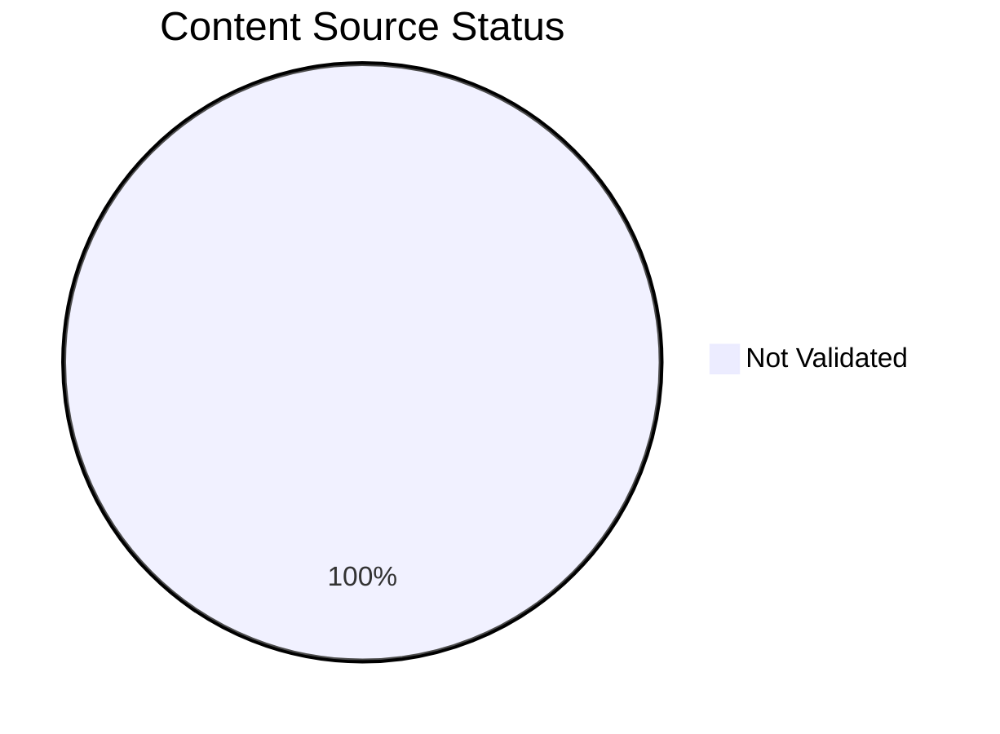
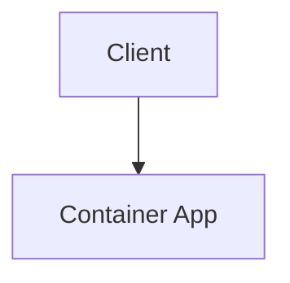

# Content Source Validation Status

This page tracks the source validation status of documentation content, including diagrams and narrative sections. All content must be traceable to official Microsoft Learn documentation.

## Summary

*Generated: 2026-04-10*

| Content Type | Total | ✅ MSLearn Sourced | ⚠️ Self-Generated | ❌ No Source |
|---|---:|---:|---:|---:|
| Mermaid Diagrams | 255 | 0 | 0 | 255 |
| Text Sections | — | — | — | — |

!!! warning "Validation Required"
    All 255 mermaid diagrams require source validation. Content without MSLearn sources must be either:
    
    1. Linked to an official Microsoft Learn URL, or
    2. Marked as `self-generated` with clear justification



## Validation Categories

### Source Types

| Type | Description | Allowed? |
|---|---|---|
| `mslearn` | Content directly from or based on Microsoft Learn | ✅ Yes |
| `mslearn-adapted` | MSLearn content adapted for this guide | ✅ Yes (with source URL) |
| `self-generated` | Original content created for this guide | ⚠️ Requires justification |
| `community` | From community sources (Stack Overflow, GitHub) | ❌ Not for core content |
| `unknown` | Source not documented | ❌ Must be validated |

### Diagram Validation Status

#### Mermaid Diagrams (255 total)

| File | Diagrams | Source Type | MSLearn URL | Status |
|---|---:|---|---|---|
| Content pages and diagrams across the repository | 255 | unknown | — | ❌ Not Validated |

## How to Validate Content

### Step 1: Add Source Metadata to Frontmatter

Add `content_sources` to the document's YAML frontmatter:

```yaml
---
title: Example Page
content_sources:
  diagrams:
    - id: architecture-overview
      type: flowchart
      source: mslearn
      mslearn_url: https://learn.microsoft.com/en-us/azure/container-apps/
    - id: request-flow
      type: sequence
      source: self-generated
      justification: "Synthesized from multiple Microsoft Learn articles for clarity"
      based_on:
        - https://learn.microsoft.com/en-us/azure/container-apps/
  text:
    - section: "## Summary"
      source: mslearn-adapted
      mslearn_url: https://learn.microsoft.com/en-us/azure/container-apps/
---
```

### Step 2: Mark Diagram Blocks with IDs

Add an HTML comment before each mermaid block to identify it:

```markdown
<!-- diagram-id: architecture-overview -->

```

### Step 3: Run Validation Script

```bash
python3 scripts/validate_content_sources.py
```

### Step 4: Update This Page

```bash
python3 scripts/generate_content_validation_status.py
```

## Validation Rules

!!! danger "Mandatory Rules"
    1. **Platform diagrams** (`docs/platform/`) MUST have MSLearn sources
    2. **Architecture diagrams** MUST reference official Microsoft documentation
    3. **Troubleshooting flowcharts** MAY be self-generated if they synthesize MSLearn content
    4. **Self-generated content** MUST have a `justification` field explaining the source basis

## Official MSLearn Architecture References

Use these official sources for diagram validation:

| Topic | MSLearn URL |
|---|---|
| Azure Container Apps Overview | https://learn.microsoft.com/en-us/azure/container-apps/ |
| Ingress and networking | https://learn.microsoft.com/en-us/azure/container-apps/ingress-overview |
| Workload profiles | https://learn.microsoft.com/en-us/azure/container-apps/workload-profiles-overview |
| Managed identities | https://learn.microsoft.com/en-us/azure/container-apps/managed-identity |
| Secrets | https://learn.microsoft.com/en-us/azure/container-apps/manage-secrets |
| Jobs | https://learn.microsoft.com/en-us/azure/container-apps/jobs |

## See Also

- [Tutorial Validation Status](validation-status.md)
- [Reference Home](index.md)

## Sources

- [Azure Container Apps overview](https://learn.microsoft.com/en-us/azure/container-apps/)
- [Ingress and networking in Azure Container Apps](https://learn.microsoft.com/en-us/azure/container-apps/ingress-overview)
- [Workload profiles in Azure Container Apps](https://learn.microsoft.com/en-us/azure/container-apps/workload-profiles-overview)
- [Managed identities in Azure Container Apps](https://learn.microsoft.com/en-us/azure/container-apps/managed-identity)
- [Manage secrets in Azure Container Apps](https://learn.microsoft.com/en-us/azure/container-apps/manage-secrets)
- [Jobs in Azure Container Apps](https://learn.microsoft.com/en-us/azure/container-apps/jobs)
