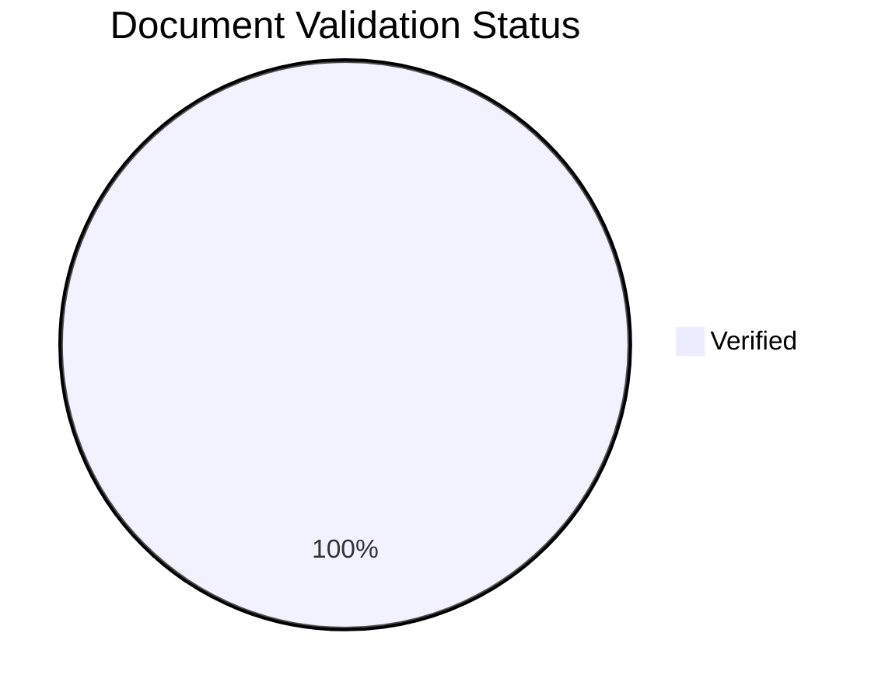

---
content_sources:
  - type: self-generated
    justification: Auto-generated dashboard tracking content validation status
---

# Content Validation Status

This page tracks the source validation status of all documentation content. All content must be traceable to official Microsoft Learn documentation.

## Summary

*Generated: 2026-04-12*

| Content Type | Total | Verified | Pending | Unverified | No Metadata |
|---|---:|---:|---:|---:|---:|
| Mermaid Diagrams | 261 | 261 | 0 | 0 | 0 |
| Text Documents | 87 | 87 | 0 | 0 | 0 |

!!! success "All Content Verified"
    All text documents have verified Microsoft Learn sources for core claims.



## By Section

### Platform

| Document | Has Sources | Status | Claims | Last Reviewed |
|---|---|---|---|---|
| [Cost Optimization](../platform/reliability/cost-optimization.md) | ✅ | ✅ Verified | 5/5 | 2026-04-12 |
| [Deployment Scenarios](../platform/deployment-scenarios.md) | ✅ | ✅ Verified | 5/5 | 2026-04-12 |
| [Easy Auth](../platform/identity-and-secrets/easy-auth.md) | ✅ | ✅ Verified | 4/4 | 2026-04-12 |
| [Egress Control](../platform/networking/egress-control.md) | ✅ | ✅ Verified | 4/4 | 2026-04-12 |
| [Health Recovery](../platform/reliability/health-recovery.md) | ✅ | ✅ Verified | 5/5 | 2026-04-12 |
| [Key Vault](../platform/identity-and-secrets/key-vault.md) | ✅ | ✅ Verified | 4/4 | 2026-04-12 |
| [Managed Identity](../platform/identity-and-secrets/managed-identity.md) | ✅ | ✅ Verified | 4/4 | 2026-04-12 |
| [Private Endpoints](../platform/networking/private-endpoints.md) | ✅ | ✅ Verified | 5/5 | 2026-04-12 |
| [Resource Relationships](../platform/architecture/resource-relationships.md) | ✅ | ✅ Verified | 4/4 | 2026-04-12 |
| [Security Operations](../platform/identity-and-secrets/security-operations.md) | ✅ | ✅ Verified | 5/5 | 2026-04-12 |
| [Service To Service](../platform/networking/service-to-service.md) | ✅ | ✅ Verified | 4/4 | 2026-04-12 |
| [Vnet Integration](../platform/networking/vnet-integration.md) | ✅ | ✅ Verified | 5/5 | 2026-04-12 |

### Best Practices

| Document | Has Sources | Status | Claims | Last Reviewed |
|---|---|---|---|---|
| [Anti Patterns](../best-practices/anti-patterns.md) | ✅ | ✅ Verified | 5/5 | 2026-04-12 |
| [Container Design](../best-practices/container-design.md) | ✅ | ✅ Verified | 5/5 | 2026-04-12 |
| [Cost](../best-practices/cost.md) | ✅ | ✅ Verified | 4/4 | 2026-04-12 |
| [Identity And Secrets](../best-practices/identity-and-secrets.md) | ✅ | ✅ Verified | 5/5 | 2026-04-12 |
| [Jobs](../best-practices/jobs.md) | ✅ | ✅ Verified | 5/5 | 2026-04-12 |
| [Networking](../best-practices/networking.md) | ✅ | ✅ Verified | 5/5 | 2026-04-12 |
| [Reliability](../best-practices/reliability.md) | ✅ | ✅ Verified | 4/4 | 2026-04-12 |
| [Revision Strategy](../best-practices/revision-strategy.md) | ✅ | ✅ Verified | 5/5 | 2026-04-12 |
| [Scaling](../best-practices/scaling.md) | ✅ | ✅ Verified | 5/5 | 2026-04-12 |
| [Security](../best-practices/security.md) | ✅ | ✅ Verified | 5/5 | 2026-04-12 |

### Operations

| Document | Has Sources | Status | Claims | Last Reviewed |
|---|---|---|---|---|
| [Networking](../operations/deployment/networking.md) | ✅ | ✅ Verified | 4/4 | 2026-04-12 |

### Troubleshooting

| Document | Has Sources | Status | Claims | Last Reviewed |
|---|---|---|---|---|
| [5Xx Trend Over Time](../troubleshooting/kql/http/5xx-trend-over-time.md) | ✅ | ✅ Verified | 2/2 | 2026-04-12 |
| [Acr Pull Failure](../troubleshooting/lab-guides/acr-pull-failure.md) | ✅ | ✅ Verified | 2/2 | 2026-04-12 |
| [Architecture Overview](../troubleshooting/architecture-overview.md) | ✅ | ✅ Verified | 4/4 | 2026-04-12 |
| [Bad Revision Rollout And Rollback](../troubleshooting/playbooks/platform-features/bad-revision-rollout-and-rollback.md) | ✅ | ✅ Verified | 2/2 | 2026-04-12 |
| [Cli Reference](../troubleshooting/first-10-minutes/cli-reference.md) | ✅ | ✅ Verified | 5/5 | 2026-04-12 |
| [Container App Job Execution Failure](../troubleshooting/playbooks/platform-features/container-app-job-execution-failure.md) | ✅ | ✅ Verified | 2/2 | 2026-04-12 |
| [Container Start Failure](../troubleshooting/playbooks/startup-and-provisioning/container-start-failure.md) | ✅ | ✅ Verified | 2/2 | 2026-04-12 |
| [Crashloop Oom And Resource Pressure](../troubleshooting/playbooks/scaling-and-runtime/crashloop-oom-and-resource-pressure.md) | ✅ | ✅ Verified | 2/2 | 2026-04-12 |
| [Dapr Integration](../troubleshooting/lab-guides/dapr-integration.md) | ✅ | ✅ Verified | 2/2 | 2026-04-12 |
| [Dapr Sidecar Logs](../troubleshooting/kql/dapr-and-jobs/dapr-sidecar-logs.md) | ✅ | ✅ Verified | 2/2 | 2026-04-12 |
| [Dapr Sidecar Or Component Failure](../troubleshooting/playbooks/platform-features/dapr-sidecar-or-component-failure.md) | ✅ | ✅ Verified | 2/2 | 2026-04-12 |
| [Decision Tree](../troubleshooting/decision-tree.md) | ✅ | ✅ Verified | 4/4 | 2026-04-12 |
| [Detector Map](../troubleshooting/methodology/detector-map.md) | ✅ | ✅ Verified | 4/4 | 2026-04-12 |
| [Dns And Connectivity Failures](../troubleshooting/kql/ingress-and-networking/dns-and-connectivity-failures.md) | ✅ | ✅ Verified | 2/2 | 2026-04-12 |
| [Environment Variables](../troubleshooting/first-10-minutes/environment-variables.md) | ✅ | ✅ Verified | 3/3 | 2026-04-12 |
| [Errors By Revision](../troubleshooting/kql/correlation/errors-by-revision.md) | ✅ | ✅ Verified | 2/2 | 2026-04-12 |
| [Event Scaler Mismatch](../troubleshooting/playbooks/scaling-and-runtime/event-scaler-mismatch.md) | ✅ | ✅ Verified | 2/2 | 2026-04-12 |
| [Evidence Map](../troubleshooting/evidence-map.md) | ✅ | ✅ Verified | 4/4 | 2026-04-12 |
| [Failed Requests App Insights](../troubleshooting/kql/correlation/failed-requests-app-insights.md) | ✅ | ✅ Verified | 2/2 | 2026-04-12 |
| [Http Scaling Not Triggering](../troubleshooting/playbooks/scaling-and-runtime/http-scaling-not-triggering.md) | ✅ | ✅ Verified | 2/2 | 2026-04-12 |
| [Image Pull And Auth Errors](../troubleshooting/kql/system-and-revisions/image-pull-and-auth-errors.md) | ✅ | ✅ Verified | 2/2 | 2026-04-12 |
| [Image Pull Failure](../troubleshooting/playbooks/startup-and-provisioning/image-pull-failure.md) | ✅ | ✅ Verified | 2/2 | 2026-04-12 |
| [Ingress Error Analysis](../troubleshooting/kql/ingress-and-networking/ingress-error-analysis.md) | ✅ | ✅ Verified | 2/2 | 2026-04-12 |
| [Ingress Not Reachable](../troubleshooting/playbooks/ingress-and-networking/ingress-not-reachable.md) | ✅ | ✅ Verified | 2/2 | 2026-04-12 |
| [Ingress Target Port Mismatch](../troubleshooting/lab-guides/ingress-target-port-mismatch.md) | ✅ | ✅ Verified | 2/2 | 2026-04-12 |
| [Internal Dns And Private Endpoint Failure](../troubleshooting/playbooks/ingress-and-networking/internal-dns-and-private-endpoint-failure.md) | ✅ | ✅ Verified | 2/2 | 2026-04-12 |
| [Job Execution History](../troubleshooting/kql/dapr-and-jobs/job-execution-history.md) | ✅ | ✅ Verified | 2/2 | 2026-04-12 |
| [Latency Trend By Status Code](../troubleshooting/kql/http/latency-trend-by-status-code.md) | ✅ | ✅ Verified | 2/2 | 2026-04-12 |
| [Latest Errors And Exceptions](../troubleshooting/kql/console-and-runtime/latest-errors-and-exceptions.md) | ✅ | ✅ Verified | 2/2 | 2026-04-12 |
| [Link Exceptions To Operations](../troubleshooting/kql/correlation/link-exceptions-to-operations.md) | ✅ | ✅ Verified | 2/2 | 2026-04-12 |
| [Managed Identity Auth Failure](../troubleshooting/playbooks/identity-and-configuration/managed-identity-auth-failure.md) | ✅ | ✅ Verified | 2/2 | 2026-04-12 |
| [Managed Identity Key Vault Failure](../troubleshooting/lab-guides/managed-identity-key-vault-failure.md) | ✅ | ✅ Verified | 2/2 | 2026-04-12 |
| [Managed Identity Token Errors](../troubleshooting/kql/identity-and-secrets/managed-identity-token-errors.md) | ✅ | ✅ Verified | 2/2 | 2026-04-12 |
| [Mental Model](../troubleshooting/mental-model.md) | ✅ | ✅ Verified | 4/4 | 2026-04-12 |
| [Observability Tracing](../troubleshooting/lab-guides/observability-tracing.md) | ✅ | ✅ Verified | 2/2 | 2026-04-12 |
| [Platform Limits](../troubleshooting/first-10-minutes/platform-limits.md) | ✅ | ✅ Verified | 4/4 | 2026-04-12 |
| [Probe And Port Mismatch](../troubleshooting/lab-guides/probe-and-port-mismatch.md) | ✅ | ✅ Verified | 2/2 | 2026-04-12 |
| [Probe Failure And Slow Start](../troubleshooting/playbooks/startup-and-provisioning/probe-failure-and-slow-start.md) | ✅ | ✅ Verified | 2/2 | 2026-04-12 |
| [Quick Diagnosis Cards](../troubleshooting/quick-diagnosis-cards.md) | ✅ | ✅ Verified | 4/4 | 2026-04-12 |
| [Repeated Startup Attempts](../troubleshooting/kql/restarts/repeated-startup-attempts.md) | ✅ | ✅ Verified | 2/2 | 2026-04-12 |
| [Replica Count Over Time](../troubleshooting/kql/scaling-and-replicas/replica-count-over-time.md) | ✅ | ✅ Verified | 2/2 | 2026-04-12 |
| [Replica Crash Signals](../troubleshooting/kql/system-and-revisions/replica-crash-signals.md) | ✅ | ✅ Verified | 2/2 | 2026-04-12 |
| [Request Latency From Logs](../troubleshooting/kql/console-and-runtime/request-latency-from-logs.md) | ✅ | ✅ Verified | 2/2 | 2026-04-12 |
| [Restart Timing Correlation](../troubleshooting/kql/restarts/restart-timing-correlation.md) | ✅ | ✅ Verified | 2/2 | 2026-04-12 |
| [Revision Failover](../troubleshooting/lab-guides/revision-failover.md) | ✅ | ✅ Verified | 2/2 | 2026-04-12 |
| [Revision Failures And Startup](../troubleshooting/kql/system-and-revisions/revision-failures-and-startup.md) | ✅ | ✅ Verified | 2/2 | 2026-04-12 |
| [Revision Provisioning Failure](../troubleshooting/lab-guides/revision-provisioning-failure.md) | ✅ | ✅ Verified | 2/2 | 2026-04-12 |
| [Revision Provisioning Failure](../troubleshooting/playbooks/startup-and-provisioning/revision-provisioning-failure.md) | ✅ | ✅ Verified | 2/2 | 2026-04-12 |
| [Scale Rule Mismatch](../troubleshooting/lab-guides/scale-rule-mismatch.md) | ✅ | ✅ Verified | 2/2 | 2026-04-12 |
| [Scaling Events](../troubleshooting/kql/scaling-and-replicas/scaling-events.md) | ✅ | ✅ Verified | 2/2 | 2026-04-12 |
| [Secret And Key Vault Reference Failure](../troubleshooting/playbooks/identity-and-configuration/secret-and-key-vault-reference-failure.md) | ✅ | ✅ Verified | 2/2 | 2026-04-12 |
| [Secret Reference Failures](../troubleshooting/kql/identity-and-secrets/secret-reference-failures.md) | ✅ | ✅ Verified | 2/2 | 2026-04-12 |
| [Service To Service Connectivity Failure](../troubleshooting/playbooks/ingress-and-networking/service-to-service-connectivity-failure.md) | ✅ | ✅ Verified | 2/2 | 2026-04-12 |
| [Slowest Requests By Path](../troubleshooting/kql/http/slowest-requests-by-path.md) | ✅ | ✅ Verified | 2/2 | 2026-04-12 |
| [Top Noisy Messages](../troubleshooting/kql/console-and-runtime/top-noisy-messages.md) | ✅ | ✅ Verified | 2/2 | 2026-04-12 |
| [Traffic Routing Canary](../troubleshooting/lab-guides/traffic-routing-canary.md) | ✅ | ✅ Verified | 2/2 | 2026-04-12 |

### Start Here

| Document | Has Sources | Status | Claims | Last Reviewed |
|---|---|---|---|---|
| [Learning Paths](../start-here/learning-paths.md) | ✅ | ✅ Verified | 2/2 | 2026-04-12 |
| [Overview](../start-here/overview.md) | ✅ | ✅ Verified | 2/2 | 2026-04-12 |
| [Repository Map](../start-here/repository-map.md) | ✅ | ✅ Verified | 2/2 | 2026-04-12 |
| [When To Use Container Apps](../start-here/when-to-use-container-apps.md) | ✅ | ✅ Verified | 2/2 | 2026-04-12 |

### Reference

| Document | Has Sources | Status | Claims | Last Reviewed |
|---|---|---|---|---|
| [Cli Reference](../reference/cli-reference.md) | ✅ | ✅ Verified | 2/2 | 2026-04-12 |
| [Environment Variables](../reference/environment-variables.md) | ✅ | ✅ Verified | 2/2 | 2026-04-12 |
| [Platform Limits](../reference/platform-limits.md) | ✅ | ✅ Verified | 2/2 | 2026-04-12 |
| [Validation Status](../reference/validation-status.md) | ✅ | ✅ Verified | 2/2 | 2026-04-12 |

## Validation Categories

### Source Types

| Type | Description | Allowed? |
|---|---|---|
| `mslearn` | Content directly from or based on Microsoft Learn | Yes |
| `mslearn-adapted` | Microsoft Learn content adapted for this guide | Yes, with source URL |
| `self-generated` | Original content created for this guide | Requires justification |
| `community` | From community sources | Not for core content |
| `unknown` | Source not documented | Must be validated |

### Validation Status

| Status | Description |
|---|---|
| `verified` | All core claims traced to Microsoft Learn sources |
| `pending_review` | Document exists but claims need source verification |
| `unverified` | New document, no validation performed |

## How to Add Validation

Add a `content_validation` block to your document's frontmatter:

```yaml
---
content_sources:
  - type: mslearn-adapted
    url: https://learn.microsoft.com/azure/container-apps/...
content_validation:
  status: verified
  last_reviewed: 2026-04-12
  reviewer: ai-agent
  core_claims:
    - claim: "Container Apps supports automatic scaling based on HTTP traffic, CPU, memory, and custom metrics."
      source: https://learn.microsoft.com/azure/container-apps/scale-app
      verified: true
---
```

Then regenerate this page:

```bash
python3 scripts/generate_content_validation_status.py
```

## See Also

- [CLI Reference](cli-reference.md)
- [Platform Limits](platform-limits.md)

