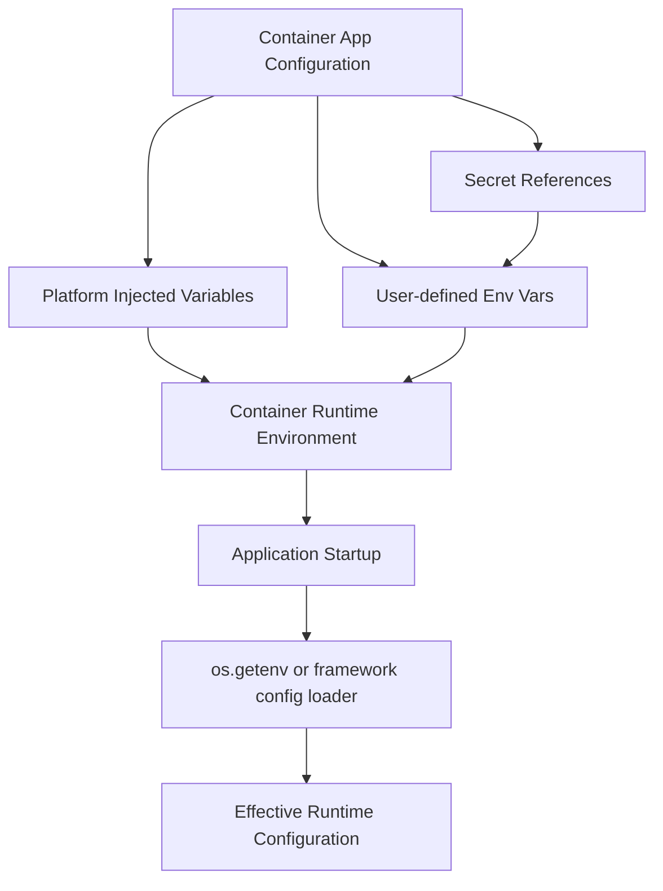

---
hide:
  - toc
content_sources:
  diagrams:
    - id: environment-variable-resolution-flow
      type: flowchart
      source: mslearn-adapted
      based_on:
        - https://learn.microsoft.com/azure/container-apps/environment-variables
content_validation:
  status: verified
  last_reviewed: "2026-04-12"
  reviewer: ai-agent
  core_claims:
    - claim: "Azure Container Apps injects runtime environment variables into running containers."
      source: "https://learn.microsoft.com/azure/container-apps/environment-variables"
      verified: true
    - claim: "Environment variables can reference secrets stored in Container Apps."
      source: "https://learn.microsoft.com/azure/container-apps/manage-secrets"
      verified: true
---

# Container Apps Environment Variables Reference

Use this reference to understand variables injected by Azure Container Apps and common application/runtime variables used in Python workloads.

## Prerequisites

- Python app running in Azure Container Apps
- Basic understanding of app configuration and secrets

!!! warning "Port mismatches cause startup and ingress failures"
    If your application listens on a different port than the configured ingress target, the revision may stay unhealthy. Ensure app binding and `CONTAINER_APP_PORT` expectations are aligned.

!!! tip "Debug variable state from inside the running container"
    Use `az containerapp exec` to inspect runtime environment values when behavior differs between local and cloud. Validate expected names, defaults, and secret references directly in the replica.

## Environment variable resolution flow

<!-- diagram-id: environment-variable-resolution-flow -->


## Platform-injected variables

These variables are provided by the platform at runtime.

| Variable | Description | Default | Example |
|---|---|---|---|
| `CONTAINER_APP_NAME` | Container App resource name | None | `ca-myapp` |
| `CONTAINER_APP_REVISION` | Active revision name | None | `ca-myapp--0000001` |
| `CONTAINER_APP_REPLICA_NAME` | Replica identifier | None | `ca-myapp--0000001-646779b4c5-bhc2v` |
| `CONTAINER_APP_PORT` | Expected listening port for app container | `8000` (if configured that way) | `8000` |
| `CONTAINER_APP_HOSTNAME` | Internal hostname for app service discovery | None | `ca-orders-api.internal` |
| `CONTAINER_APP_ENV_DNS_SUFFIX` | Environment-level internal DNS suffix | None | `<hash>.<region>.azurecontainerapps.io` |
| `CONTAINER_APP_JOB_NAME` | Job name (jobs only) | None | `job-data-sync` |
| `CONTAINER_APP_JOB_EXECUTION_NAME` | Job execution id (jobs only) | None | `job-data-sync-xxxxxxxx` |
| `CONTAINER_APP_JOB_TRIGGER_TYPE` | Trigger type for job execution | None | `Schedule` |

## Verified runtime values from real deployment

The following values were observed from a real Azure Container Apps deployment and container runtime (PII scrubbed):

```text
CONTAINER_APP_NAME=ca-myapp
CONTAINER_APP_REVISION=ca-myapp--0000001
CONTAINER_APP_REPLICA_NAME=ca-myapp--0000001-646779b4c5-bhc2v
CONTAINER_APP_ENV_DNS_SUFFIX=<hash>.<region>.azurecontainerapps.io
CONTAINER_APP_PORT=8000
```

Health and info endpoint outputs from the same revision:

```json
{"status":"healthy","timestamp":"2026-04-04T11:32:37.322216+00:00"}
```

```json
{
  "containerApp": "ca-myapp",
  "environment": "development",
  "python": "3.11.15",
  "revision": "ca-myapp--0000001",
  "version": "1.0.0"
}
```

## Common app configuration variables

| Variable | Description | Default | Example |
|---|---|---|---|
| `ENV` | App environment identifier | `development` | `production` |
| `LOG_LEVEL` | Logging verbosity | `info` | `warning` |
| `APP_VERSION` | Deployed app version string | None | `2026.04.04.1` |
| `FEATURE_FLAGS` | Comma-separated feature toggles | None | `checkout_v2,recommendations` |
| `STORAGE_ACCOUNT_URL` | Blob service endpoint | None | `https://storders.blob.core.windows.net` |
| `REDIS_HOST` | Redis hostname | None | `orders-redis.redis.cache.windows.net` |
| `DB_SERVER` | Database server hostname | None | `sql-orders.database.windows.net` |

## Gunicorn and Flask variables

| Variable | Description | Default | Example |
|---|---|---|---|
| `GUNICORN_CMD_ARGS` | Extra Gunicorn command arguments | None | `--workers 4 --timeout 120` |
| `WEB_CONCURRENCY` | Gunicorn worker process count | Gunicorn default | `4` |
| `PYTHONUNBUFFERED` | Unbuffer stdout/stderr logs | `0` | `1` |
| `PYTHONDONTWRITEBYTECODE` | Disable `.pyc` creation | `0` | `1` |
| `FLASK_ENV` | Flask environment mode | `production` | `production` |
| `FLASK_DEBUG` | Flask debug mode toggle | `0` | `0` |

## OpenTelemetry variables

| Variable | Description | Default | Example |
|---|---|---|---|
| `OTEL_SERVICE_NAME` | Logical service name | App name | `orders-api` |
| `OTEL_EXPORTER_OTLP_ENDPOINT` | OTLP collector endpoint | None | `http://otel-collector:4317` |
| `OTEL_EXPORTER_OTLP_PROTOCOL` | OTLP transport protocol | `grpc` | `http/protobuf` |
| `OTEL_RESOURCE_ATTRIBUTES` | Resource attributes list | None | `service.namespace=commerce,deployment.environment=prod` |
| `OTEL_TRACES_SAMPLER` | Sampling strategy | `parentbased_always_on` | `traceidratio` |
| `OTEL_TRACES_SAMPLER_ARG` | Sampler argument value | None | `0.1` |

## Example: reading variables in Python

```python
import os
from flask import Flask, jsonify

app = Flask(__name__)

@app.get("/runtime")
def runtime_info():
    return jsonify(
        appName=os.getenv("CONTAINER_APP_NAME"),
        revision=os.getenv("CONTAINER_APP_REVISION"),
        replica=os.getenv("CONTAINER_APP_REPLICA_NAME"),
        port=os.getenv("CONTAINER_APP_PORT", "8000"),
        logLevel=os.getenv("LOG_LEVEL", "info")
    ), 200
```

## Advanced Topics

- Prefer `secretref:` for sensitive values instead of plain env values.
- Keep environment variable names consistent across local/dev/prod.
- Use schema validation on app startup to fail fast on missing critical configuration.

!!! note "Establish a configuration contract"
    Keep a versioned list of required environment variables per service. This helps teams detect breaking configuration changes before deployment.

## See Also

- [CLI Reference](cli-reference.md)
- [Managed Identity Recipe](../language-guides/python/recipes/managed-identity.md)

## Sources

- [Microsoft Learn: Environment variables in Container Apps](https://learn.microsoft.com/azure/container-apps/environment-variables)
