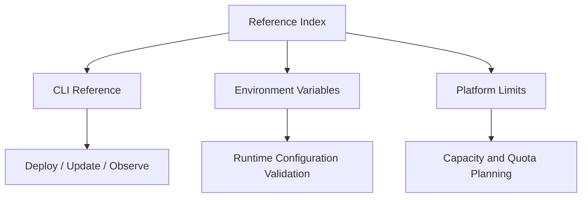

# Reference

Quick lookup documentation for Azure Container Apps operations and diagnostics.

## How to use this section

This section is optimized for fast operational lookup during build, deploy, and incident response workflows. Start from the overview table, then jump directly to the command set, variable reference, or quota boundary you need.

!!! tip "Use this as your runbook landing page"
    Keep this page open during deployment and troubleshooting sessions. The linked reference pages are designed to reduce context switching when you need exact command syntax, variable meaning, or limit checks.

!!! note "Bookmark for production operations"
    Save this page and the linked reference pages in your browser. During incidents, a predictable navigation path is more valuable than searching through full tutorial content.

<!-- diagram-id: save-this-page-and-the-linked -->


## Reference coverage map

| Reference Area | Primary Use Case | Typical User | Best Time to Use | Key Output |
|---|---|---|---|---|
| [CLI Reference](cli-reference.md) | Execute repeatable app, revision, ingress, identity, and job operations | Platform engineer, SRE, developer | Deployment, rollback, diagnostics | Correct `az containerapp` command with long flags |
| [Environment Variables](environment-variables.md) | Validate runtime injection and app config behavior | Application developer, SRE | Startup validation, config debugging | Confirmed variable names, defaults, and examples |
| [Platform Limits](platform-limits.md) | Check design boundaries and quota-sensitive architecture decisions | Architect, platform owner, SRE | Load planning, scaling strategy, pre-production review | Limit/constraint table for design and operations |
| [Metrics](metrics.md) | Look up Azure Monitor metric IDs, dimensions, and percentage denominators for Container Apps | SRE, platform engineer, developer | Building alerts, dashboards, autoscale rules, KQL queries | Metric ID, aggregation, dimension, and CLI query template |
| [Configuration Scope Matrix](configuration-scope-matrix.md) | Determine whether a setting is environment-, application-, or revision-scoped before changing it | Platform engineer, SRE, developer | Config changes, revision planning, change-impact review | Scope classification and revision-impact for each setting |

## Quick navigation by task

| If you need to... | Go to | Why |
|---|---|---|
| Create or update an app quickly | [CLI Reference](cli-reference.md#az-containerapp-commands) | Includes common lifecycle commands and PII-scrubbed output |
| Inspect revision and replica health state | [CLI Reference](cli-reference.md#az-containerapp-revision-commands) | Dedicated revision/replica command groups |
| Verify the correct runtime port variable | [Environment Variables](environment-variables.md#platform-injected-variables) | Shows `CONTAINER_APP_PORT` and related injected variables |
| Align autoscale assumptions with known boundaries | [Platform Limits](platform-limits.md#scale-limits) | Centralized scale-related constraints and notes |
| Check networking and ingress constraints | [Platform Limits](platform-limits.md#networking-limits) | Clarifies ingress/port and network boundary expectations |
| Validate job runtime metadata variables | [Environment Variables](environment-variables.md#platform-injected-variables) | Includes job-specific variable names |
| Look up the exact metric ID, aggregation, or dimension for an alert | [Metrics](metrics.md) | Catalog of every Azure Monitor metric Container Apps publishes, with denominators and CLI query templates |
| Find out which KEDA scaler caused a replica change | [Metrics → KEDA scaler observability](metrics.md#keda-scaler-observability) | Explains the two-pipeline split (KEDA scaler decisions vs Azure Monitor `Replicas` metric) and the KQL pack used to attribute replica changes to a scaler |
| Decide whether a config change forces a new revision | [Configuration Scope Matrix](configuration-scope-matrix.md) | Classifies each setting as environment-, application-, or revision-scoped and shows revision impact |

## Main Content

## Documents

| Document | Description |
|----------|-------------|
| [CLI Reference](cli-reference.md) | Common `az containerapp` commands for app lifecycle, configuration, deployment, and scaling |
| [Environment Variables](environment-variables.md) | Platform-injected variables and recommended app/runtime variables |
| [Platform Limits](platform-limits.md) | Platform quotas, request/timeout constraints, storage behavior, and scale boundaries |
| [Metrics](metrics.md) | Azure Monitor metric reference for Container Apps including percentage metric denominators and CLI query examples |
| [Configuration Scope Matrix](configuration-scope-matrix.md) | Classifies each Container Apps setting as environment-, application-, or revision-scoped, with revision impact |

## Quick Links

| URL | Purpose |
|-----|---------|
| `https://${APP_NAME}.${ENVIRONMENT_DEFAULT_DOMAIN}` | Application endpoint (external ingress) |
| `${APP_NAME}.internal.${ENVIRONMENT_DEFAULT_DOMAIN}` | Internal endpoint (internal ingress) |
| Azure Portal → Container App → Log stream | Real-time container logs |
| Azure Portal → Container App → Console | Interactive container shell |

## Common Variables

| Variable | Description | Example |
|----------|-------------|---------|
| `$RG` | Resource group name | `rg-myapp` |
| `$APP_NAME` | Container App name | `ca-myapp` |
| `$ACA_ENV_NAME` | Container Apps Environment name | `cae-myapp` |
| `$ENVIRONMENT_DEFAULT_DOMAIN` | Environment's default domain suffix | `<hash>.<region>.azurecontainerapps.io` |
| `$ACR_NAME` | Azure Container Registry name | `acrmyapp` |
| `$LOCATION` | Azure region | `koreacentral` |

```bash
az containerapp env show --name "$ACA_ENV_NAME" --resource-group "$RG" --query "properties.defaultDomain" --output tsv
```

## Fast verification checklist

Use this checklist before production deploys or incident handoff:

1. Confirm command syntax and long flags in [CLI Reference](cli-reference.md).
2. Validate expected runtime variables in [Environment Variables](environment-variables.md).
3. Check quota and scaling boundaries in [Platform Limits](platform-limits.md).
4. Record environment domain and ingress endpoint for test execution.

## Advanced Topics

- Standardize your team runbooks to link to these three reference documents directly.
- Include reference links in incident templates and deployment pipelines.
- Re-verify command output formats after Azure CLI extension upgrades.

## Language-Specific Details

For runtime-specific guidance, see:
- [Python Guide](../language-guides/python/index.md)

## See Also

- [Operations](../operations/index.md)
- [Troubleshooting Methodology](../troubleshooting/methodology/index.md)

## Sources

- [Azure Container Apps documentation (Microsoft Learn)](https://learn.microsoft.com/en-us/azure/container-apps/)
- [Azure Container Apps CLI reference](https://learn.microsoft.com/en-us/cli/azure/containerapp)
