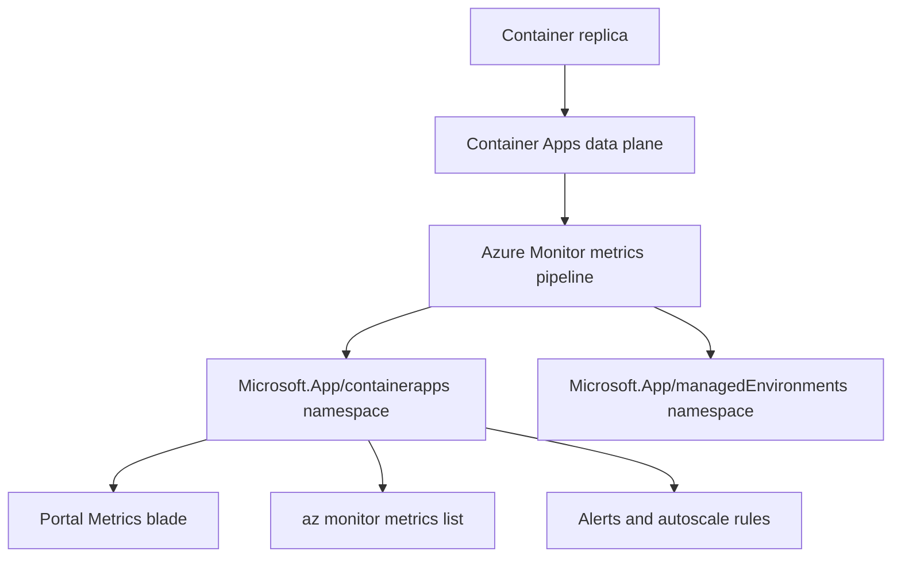

---
content_sources:
  diagrams:
  - id: metric-collection-flow
    type: flowchart
    source: mslearn-adapted
    based_on:
    - https://learn.microsoft.com/azure/container-apps/metrics
    - https://learn.microsoft.com/azure/azure-monitor/essentials/data-platform-metrics
content_validation:
  status: verified
  last_reviewed: '2026-06-04'
  reviewer: agent
  core_claims:
  - claim: Azure Container Apps publishes platform metrics under the Microsoft.App/containerapps namespace, including CPU, memory, network, replica, request, and resiliency metrics.
    source: https://learn.microsoft.com/azure/container-apps/metrics
    verified: true
  - claim: CPU Usage Percentage and Memory Percentage metrics report consumption as a percentage of the container's configured CPU and memory limits.
    source: https://learn.microsoft.com/azure/container-apps/metrics
    verified: true
  - claim: Container Apps metrics support Replica and Revision dimensions for splitting and filtering.
    source: https://learn.microsoft.com/azure/container-apps/metrics
    verified: true
---
# Azure Container Apps Metrics Reference

Quick lookup for the platform metrics that Azure Container Apps publishes to Azure Monitor. Use this page when you build alerts, dashboards, autoscaling rules, or KQL queries against your Container Apps.

!!! info "Two metric namespaces"
    Container App resources publish metrics under `Microsoft.App/containerapps`. The Container Apps Environment publishes a separate small set under `Microsoft.App/managedEnvironments`. Pick the namespace that matches the resource scope you opened in Portal or the resource ID you pass to `az monitor metrics list`.

!!! tip "Percentage metrics are denominator-relative"
    `CpuPercentage` and `MemoryPercentage` are computed against the **container's configured CPU and memory limits**, not against the node or environment. A replica scoped to `cpu=0.5, memory=1Gi` reports 100% when it consumes 0.5 vCPU or 1 GiB respectively. See [Percentage metric denominators](#percentage-metric-denominators) below.

## Prerequisites

- A deployed Container App with a Log Analytics workspace attached to the environment.
- Access to the Container App's resource scope in the Azure Portal, or `az monitor metrics list` permissions on the resource.
- Familiarity with revisions and replicas; see [Revisions and replicas](../platform/revisions/index.md).

## Metric collection flow

<!-- diagram-id: metric-collection-flow -->


## Container App metrics (Microsoft.App/containerapps)

The metric IDs below are the values you pass to `az monitor metrics list --metric` or select from the Metric dropdown in the Portal Metrics blade. Dimensions are reproduced verbatim from Microsoft Learn.

| Metric ID | Display name | Unit | Dimensions |
|---|---|---|---|
| `UsageNanoCores` | CPU Usage | Nanocores | Replica, Revision |
| `WorkingSetBytes` | Memory Working Set Bytes | Bytes | Replica, Revision |
| `RxBytes` | Network In Bytes | Bytes | Replica, Revision |
| `TxBytes` | Network Out Bytes | Bytes | Replica, Revision |
| `Replicas` | Replica count | Count | Revision |
| `RestartCount` | Total Replica Restart Count | Count | Replica, Revision |
| `Requests` | Requests | Count | Replica, Revision, Status Code, Status Code Category |
| `CoresQuotaUsed` | Reserved Cores | Count | Revision |
| `TotalCoresQuotaUsed` | Total Reserved Cores | Count | None |
| `ResiliencyConnectTimeouts` | Resiliency Connection Timeouts | Count | Revision |
| `ResiliencyEjectedHosts` | Resiliency Ejected Hosts | Count | Revision |
| `ResiliencyEjectionsAborted` | Resiliency Ejections Aborted | Count | Revision |
| `ResiliencyRequestRetries` | Resiliency Request Retries | Count | Revision |
| `ResiliencyRequestTimeouts` | Resiliency Request Timeouts | Count | Revision |
| `ResiliencyRequestsPendingConnectionPool` | Resiliency Requests Pending Connection Pool | Count | Replica |
| `ResponseTime` | Average Response Time (Preview) | Milliseconds | Status Code, Status Code Category |
| `CpuPercentage` | CPU Usage Percentage (Preview) | Percent | Replica |
| `MemoryPercentage` | Memory Percentage (Preview) | Percent | Replica |

## Environment metrics (Microsoft.App/managedEnvironments)

| Metric ID | Display name | Unit | Dimensions |
|---|---|---|---|
| `NodeCount` | Workload Profile Node Count (Preview) | Count | Workload Profile Name |

## Percentage metric denominators

The two `Preview` percentage metrics are the easiest way to reason about saturation in a dashboard, but they only make sense if you know what 100% means for your specific app.

| Metric | Numerator | Denominator | 100% means |
|---|---|---|---|
| `CpuPercentage` | Replica CPU usage (nanocores) | Replica CPU limit (`properties.template.containers[].resources.cpu` × 1,000,000,000 nanocores per vCPU) | The replica is consuming its full configured CPU allotment |
| `MemoryPercentage` | Replica working set (bytes) | Replica memory limit (`properties.template.containers[].resources.memory` converted to bytes) | The replica is consuming its full configured memory allotment |

### Worked example

For an app provisioned with `--cpu 0.5 --memory 1Gi`:

- `CpuPercentage` 100% corresponds to **500,000,000 nanocores** (0.5 vCPU).
- `MemoryPercentage` 100% corresponds to **1,073,741,824 bytes** (1 GiB).
- `CpuPercentage` 10% corresponds to roughly **50,000,000 nanocores** of `UsageNanoCores`.
- `MemoryPercentage` 50% corresponds to roughly **536,870,912 bytes** of `WorkingSetBytes`.

If you change the CPU/memory limits on a revision, the denominator changes for any new revision; percentage values across revisions are only directly comparable when the resource limits match.

!!! warning "Percentage metrics are not KEDA scaler utilization"
    The KEDA `cpu` and `memory` scalers report `utilization` against their own targets (the value you put in `--scale-rule-metadata value=...`). `CpuPercentage` and `MemoryPercentage` are independent Azure Monitor metrics. They can disagree on the same replica because the denominator and aggregation window differ. See [CPU and memory scaler](../platform/scaling/cpu-memory-scaler.md) and [Memory percentage vs. KEDA utilization](../troubleshooting/playbooks/scaling-and-runtime/memory-percentage-vs-keda-utilization.md).

## Portal verification: CPU Usage Percentage

The chart below was captured from the `Metrics` blade of `ca-dotnet-d38538` (`cpu=0.5, memory=1Gi`, one running replica `ca-dotnet-d38538--0000001-6dbf4684d5-7w5sh`). The app was idle, so the percentage hovers near zero.


**[Observed]** `Microsoft Azure (Preview)`. `Report a bug`. `Search resources, services, and docs (G+/)`. `Copilot`. `Home`. `ca-dotnet-d38538 | Metrics`. `Container App`. `New chart`. `Refresh`. `Share`. `Local Time: Last 24 hours (Automatic - 5 minut...)`. `Avg CPU Usage Percentage (Preview) for ca-dotnet-d38538`. `Add metric`. `Add filter`. `Apply splitting`. `Line chart`. `Drill into Logs`. `New alert rule`. `Save to dashboard`. `ca-dotnet-d38538, CPU Usage Percentage (P... Avg`. `CPU Usage Percentage (Preview) (Avg), ca-dotnet-d38538`. `0.0016%`. `Thu 04`. `6 AM`. `12 PM`. `6 PM`. `Jun 04 10:17 PM`. `Overview`. `Activity log`. `Access control (IAM)`. `Tags`. `Diagnose and solve problems`. `Resource visualizer`. `Application`. `Revisions and replicas`. `Containers`. `Scale`. `Volumes`. `Settings`. `Networking`. `Ingress`. `Custom domains`. `CORS`. `Security`. `Monitoring`. `Log stream`. `Logs`. `Console`. `Alerts`. `Metrics`. `Dashboards with Grafana`. `Advisor recommendations`. `Automation`. `Help`.

**[Inferred]** The metric pill text `ca-dotnet-d38538, CPU Usage Percentage (P... Avg` appears consistent with the `CpuPercentage` metric described in the [Container App metrics (Microsoft.App/containerapps)](#container-app-metrics-microsoftappcontainerapps) table. The `Avg` aggregation chip appears consistent with the `--aggregation Average` invocation for `CpuPercentage` shown in [Query metrics with az CLI](#query-metrics-with-az-cli). The `0.0016%` average appears consistent with an idle replica consuming a small fraction of the 0.5 vCPU denominator described in [Percentage metric denominators](#percentage-metric-denominators), where 100% corresponds to 500,000,000 nanocores. The `Local Time: Last 24 hours (Automatic - 5 minut...)` time scope appears consistent with a Portal default time range that aggregates the metric into 5-minute buckets.

**[Not Proven]** The `properties.template.containers[].resources.cpu` value on the `ca-dotnet-d38538` revision is not visible on this view. The `UsageNanoCores` numerator that produced the `0.0016%` average is not visible on this view; the chart shows only the derived percentage. The per-replica split implied by the `Replica` dimension in the [Container App metrics (Microsoft.App/containerapps)](#container-app-metrics-microsoftappcontainerapps) table is not visible on this view; no `Apply splitting` chip is applied. The KEDA `cpu` scaler `utilization` value that the [CPU and memory scaler](../platform/scaling/cpu-memory-scaler.md) page warns can diverge from `CpuPercentage` is not visible on this view.

## Portal verification: Memory Percentage

The same `Metrics` blade was reconfigured to plot `MemoryPercentage` for the same replica. The plateau near 3% reflects the .NET runtime working set against the 1 GiB memory limit, not a problem with the app.


**[Observed]** `Microsoft Azure (Preview)`. `Report a bug`. `Search resources, services, and docs (G+/)`. `Copilot`. `How can I programmatically access Azure metrics?`. `Home`. `ca-dotnet-d38538 | Metrics`. `Container App`. `New chart`. `Refresh`. `Share`. `Local Time: Last 24 hours (Automatic - 5 minut...)`. `Avg Memory Percentage (Preview) for ca-dotnet-d38538`. `Add metric`. `Add filter`. `Apply splitting`. `Line chart`. `Drill into Logs`. `New alert rule`. `Save to dashboard`. `ca-dotnet-d38538, Memory Percentage (P... Avg`. `Memory Percentage (Preview) (Avg), ca-dotnet-d38538`. `3%`. `0%`. `0.5%`. `1%`. `1.5%`. `2%`. `2.5%`. `Thu 04`. `6 AM`. `12 PM`. `6 PM`. `Jun 04 10:17 PM`. `Overview`. `Activity log`. `Access control (IAM)`. `Tags`. `Diagnose and solve problems`. `Resource visualizer`. `Application`. `Revisions and replicas`. `Containers`. `Scale`. `Volumes`. `Settings`. `Networking`. `Ingress`. `Custom domains`. `CORS`. `Security`. `Monitoring`. `Log stream`. `Logs`. `Console`. `Alerts`. `Metrics`. `Dashboards with Grafana`. `Advisor recommendations`. `Automation`. `Help`.

**[Inferred]** The metric pill text `ca-dotnet-d38538, Memory Percentage (P... Avg` appears consistent with the `MemoryPercentage` metric described in the [Container App metrics (Microsoft.App/containerapps)](#container-app-metrics-microsoftappcontainerapps) table. The `Avg` aggregation chip appears consistent with the `--aggregation Average` invocation pattern for percentage metrics shown in [Query metrics with az CLI](#query-metrics-with-az-cli). The `3%` average appears consistent with the 1 GiB memory denominator described in [Percentage metric denominators](#percentage-metric-denominators), where 3% corresponds to roughly 30.7 MiB of working set against a 1,073,741,824-byte limit. The Y-axis tick range from `0%` to `3%` appears consistent with the Portal default auto-scaling behavior for a low-magnitude percentage series.

**[Not Proven]** The `properties.template.containers[].resources.memory` value on the `ca-dotnet-d38538` revision is not visible on this view. The `WorkingSetBytes` numerator that produced the `3%` average is not visible on this view; the chart shows only the derived percentage. The per-replica split implied by the `Replica` dimension in the [Container App metrics (Microsoft.App/containerapps)](#container-app-metrics-microsoftappcontainerapps) table is not visible on this view; no `Apply splitting` chip is applied. The KEDA `memory` scaler `utilization` value that the [Memory percentage vs. KEDA utilization](../troubleshooting/playbooks/scaling-and-runtime/memory-percentage-vs-keda-utilization.md) playbook warns can diverge from `MemoryPercentage` is not visible on this view.

## Query metrics with az CLI

`az monitor metrics list` returns the same data as the Portal Metrics blade. Use it for scripted dashboards, CI checks, or alert validation.

```bash
# CPU usage percentage, last 1 hour, 5-minute granularity
az monitor metrics list \
    --resource "/subscriptions/$SUBSCRIPTION_ID/resourceGroups/$RG/providers/Microsoft.App/containerApps/$APP_NAME" \
    --metric CpuPercentage \
    --aggregation Average \
    --interval PT5M \
    --output table
```

| Command flag | What it does |
|---|---|
| `--resource` | Full Azure resource ID for the Container App or Container Apps Environment |
| `--metric` | Metric ID from the tables above (case sensitive) |
| `--aggregation` | One of `Average`, `Minimum`, `Maximum`, `Total`, `Count` (must be supported by the metric) |
| `--interval` | ISO 8601 duration for the aggregation bucket (for example `PT1M`, `PT5M`, `PT1H`) |
| `--filter` | Dimension filter, for example `replicaName eq '*'` to split by replica |
| `--output` | Output format such as `table`, `json`, or `tsv` |

```bash
# Memory working set bytes split by replica
az monitor metrics list \
    --resource "/subscriptions/$SUBSCRIPTION_ID/resourceGroups/$RG/providers/Microsoft.App/containerApps/$APP_NAME" \
    --metric WorkingSetBytes \
    --aggregation Average \
    --interval PT1M \
    --filter "replicaName eq '*'" \
    --output table
```

| Command flag | What it does |
|---|---|
| `--metric WorkingSetBytes` | Absolute memory numerator from the [Container App metrics](#container-app-metrics-microsoftappcontainerapps) table |
| `--interval PT1M` | 1-minute aggregation buckets for higher resolution |
| `--filter "replicaName eq '*'"` | Splits the series across every replica reported in the interval |

```bash
# HTTP request count split by status code category, last 24 hours
az monitor metrics list \
    --resource "/subscriptions/$SUBSCRIPTION_ID/resourceGroups/$RG/providers/Microsoft.App/containerApps/$APP_NAME" \
    --metric Requests \
    --aggregation Total \
    --interval PT15M \
    --filter "statusCodeCategory eq '*'" \
    --output table
```

| Command flag | What it does |
|---|---|
| `--metric Requests` | HTTP request counter from the [Container App metrics](#container-app-metrics-microsoftappcontainerapps) table |
| `--aggregation Total` | Sums requests inside each interval rather than averaging |
| `--filter "statusCodeCategory eq '*'"` | Splits the series across `2xx`, `3xx`, `4xx`, `5xx` categories |

```bash
# Environment-level node count
az monitor metrics list \
    --resource "/subscriptions/$SUBSCRIPTION_ID/resourceGroups/$RG/providers/Microsoft.App/managedEnvironments/$CONTAINER_ENV" \
    --metric NodeCount \
    --aggregation Average \
    --interval PT5M \
    --output table
```

| Command flag | What it does |
|---|---|
| `--resource` | Full Azure resource ID for the Container Apps Environment in this query |
| `--metric` | Environment metric ID from the [Environment metrics](#environment-metrics-microsoftappmanagedenvironments) table |
| `--aggregation` | `Average` returns the per-interval mean node count |
| `--interval` | `PT5M` aligns the bucket with the default Portal Metrics blade granularity |

## When to use which metric

| Question | Metric(s) | Aggregation |
|---|---|---|
| Is a replica close to its CPU limit? | `CpuPercentage` | Avg, Max |
| Is a replica close to its memory limit? | `MemoryPercentage` | Avg, Max |
| What is the absolute CPU consumption? | `UsageNanoCores` | Avg |
| What is the absolute memory working set? | `WorkingSetBytes` | Avg |
| How many replicas are running for a revision? | `Replicas` | Avg, Min, Max |
| Are replicas restarting? | `RestartCount` | Max, Total |
| What is the request rate and HTTP error split? | `Requests` | Total, with `statusCodeCategory` split |
| Are retries or ejections happening? | `ResiliencyRequestRetries`, `ResiliencyEjectedHosts`, `ResiliencyEjectionsAborted` | Total, Max |
| Am I approaching the subscription cores quota? | `TotalCoresQuotaUsed` | Max |

## See Also

- [CLI Reference](cli-reference.md)
- [Platform Limits](platform-limits.md)
- [Environment Variables](environment-variables.md)
- [Operations — Monitoring](../operations/monitoring/index.md)
- [Platform — CPU and memory scaler](../platform/scaling/cpu-memory-scaler.md)
- [Troubleshooting — Memory percentage vs. KEDA utilization](../troubleshooting/playbooks/scaling-and-runtime/memory-percentage-vs-keda-utilization.md)

## Sources

- [Supported metrics for Microsoft.App/containerapps (Microsoft Learn)](https://learn.microsoft.com/azure/container-apps/metrics)
- [Supported metrics for Microsoft.App/managedEnvironments (Microsoft Learn)](https://learn.microsoft.com/azure/container-apps/metrics)
- [Azure Monitor metrics overview (Microsoft Learn)](https://learn.microsoft.com/azure/azure-monitor/essentials/data-platform-metrics)
- [`az monitor metrics list` reference (Microsoft Learn)](https://learn.microsoft.com/cli/azure/monitor/metrics)
