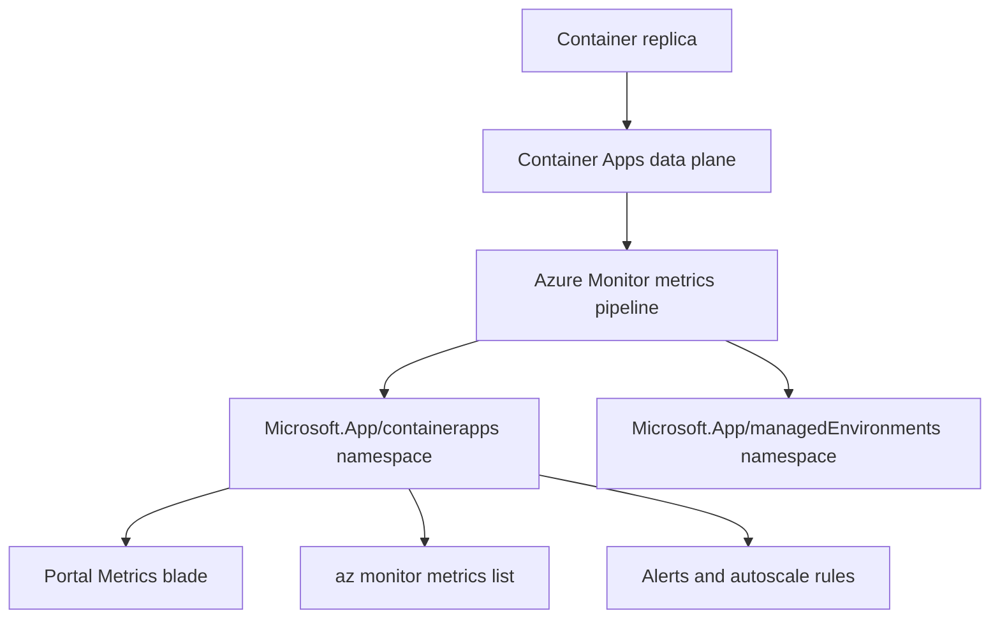
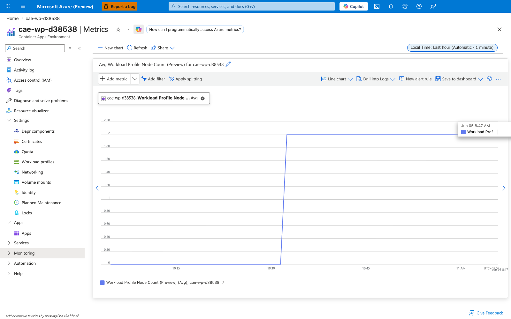
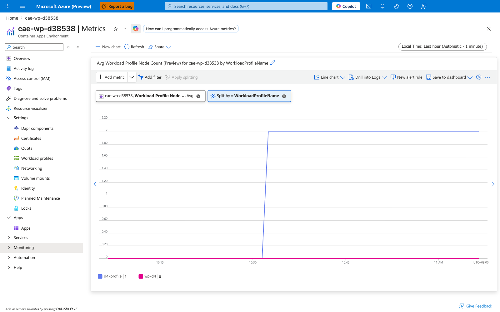
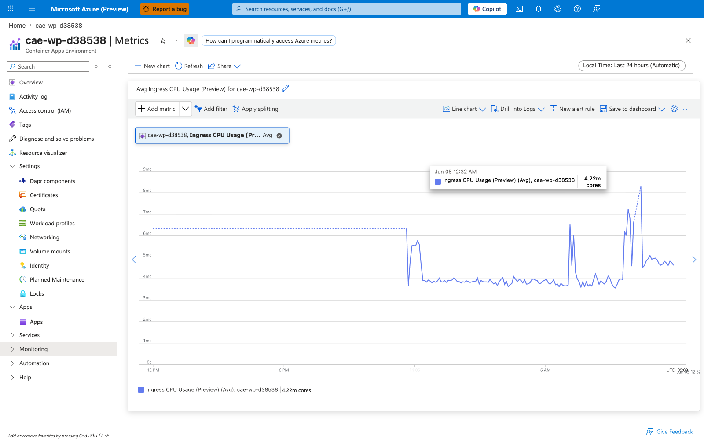
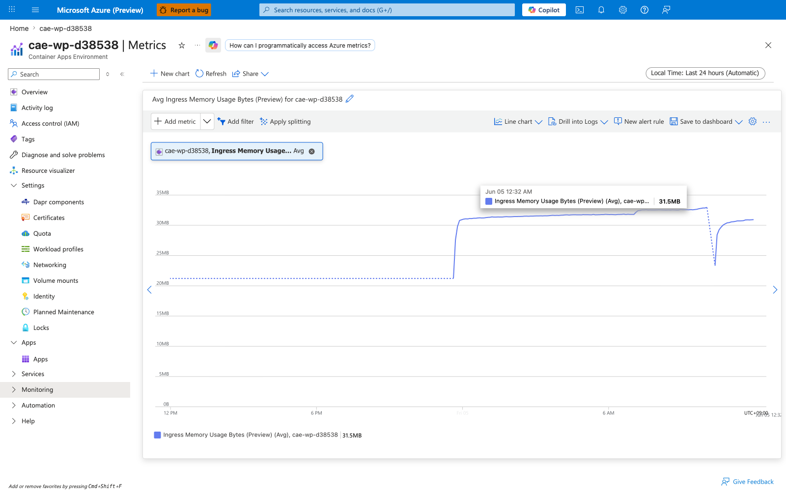
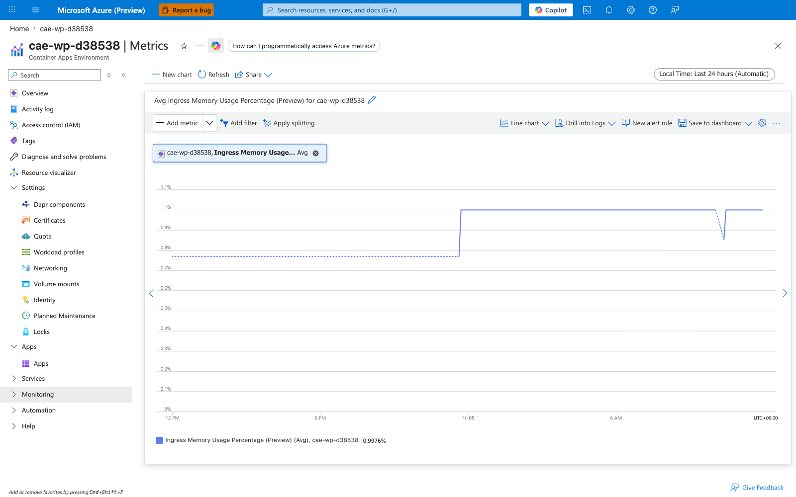
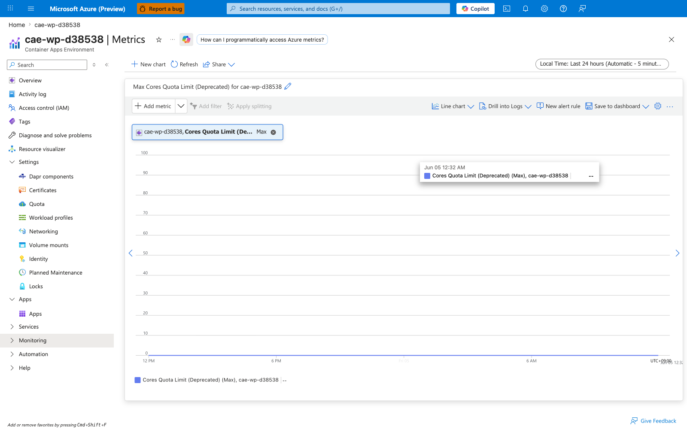
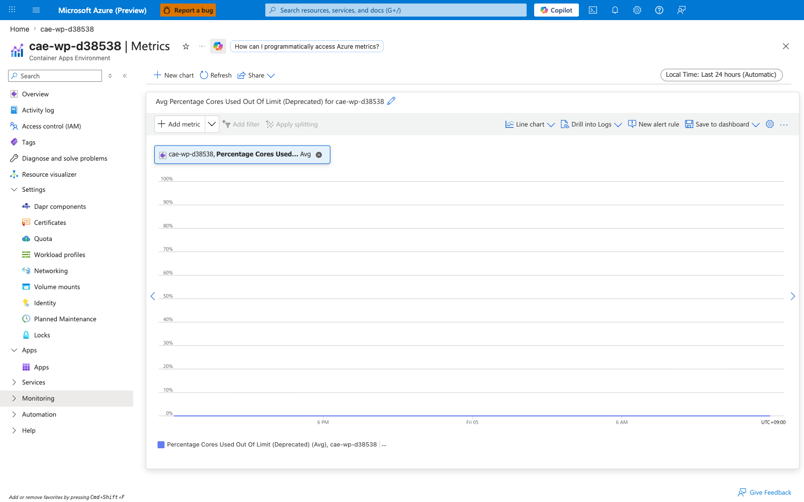

---
content_sources:
  diagrams:
  - id: metric-collection-flow
    type: flowchart
    source: mslearn-adapted
    based_on:
    - https://learn.microsoft.com/azure/container-apps/metrics
    - https://learn.microsoft.com/azure/azure-monitor/essentials/data-platform-metrics
content_validation:
  status: verified
  last_reviewed: '2026-06-05'
  reviewer: agent
  core_claims:
  - claim: Azure Container Apps publishes platform metrics under the Microsoft.App/containerapps namespace, including CPU, memory, network, replica, request, and resiliency metrics.
    source: https://learn.microsoft.com/azure/container-apps/metrics
    verified: true
  - claim: CPU Usage Percentage and Memory Percentage metrics report consumption as a percentage of the container's configured CPU and memory limits.
    source: https://learn.microsoft.com/azure/container-apps/metrics
    verified: true
  - claim: Container Apps metrics support Replica and Revision dimensions for splitting and filtering.
    source: https://learn.microsoft.com/azure/container-apps/metrics
    verified: true
  - claim: Resiliency metrics are emitted by the per-app Envoy sidecar only when a resiliency policy is attached to the receiving app and traffic originates inside the same Container Apps Environment via service discovery.
    source: https://learn.microsoft.com/azure/container-apps/service-discovery-resiliency
    verified: true
  - claim: NodeCount is published under Microsoft.App/managedEnvironments for environments that use managed workload profiles, and is split by the Workload Profile Name dimension.
    source: https://learn.microsoft.com/azure/container-apps/workload-profiles-overview
    verified: true
---
# Azure Container Apps Metrics Reference

Quick lookup for the platform metrics that Azure Container Apps publishes to Azure Monitor. Use this page when you build alerts, dashboards, autoscaling rules, or KQL queries against your Container Apps.

!!! info "Two metric namespaces"
    Container App resources publish metrics under `Microsoft.App/containerapps`. The Container Apps Environment publishes a separate small set under `Microsoft.App/managedEnvironments`. Pick the namespace that matches the resource scope you opened in Portal or the resource ID you pass to `az monitor metrics list`.

!!! tip "Percentage metrics are denominator-relative"
    `CpuPercentage` and `MemoryPercentage` are computed against the **container's configured CPU and memory limits**, not against the node or environment. A replica scoped to `cpu=0.5, memory=1Gi` reports 100% when it consumes 0.5 vCPU or 1 GiB respectively. See [Percentage metric denominators](#percentage-metric-denominators) below.

## Prerequisites

- A deployed Container App with a Log Analytics workspace attached to the environment.
- Access to the Container App's resource scope in the Azure Portal, or `az monitor metrics list` permissions on the resource.
- Familiarity with revisions and replicas; see [Revisions and replicas](../platform/revisions/index.md).

## Metric collection flow

<!-- diagram-id: metric-collection-flow -->


## Container App metrics (Microsoft.App/containerapps)

The metric IDs below are the values you pass to `az monitor metrics list --metric` or select from the Metric dropdown in the Portal Metrics blade. Dimensions are reproduced verbatim from Microsoft Learn.

| Metric ID | Display name | Unit | Dimensions |
|---|---|---|---|
| `UsageNanoCores` | CPU Usage | Nanocores | Replica, Revision |
| `WorkingSetBytes` | Memory Working Set Bytes | Bytes | Replica, Revision |
| `RxBytes` | Network In Bytes | Bytes | Replica, Revision |
| `TxBytes` | Network Out Bytes | Bytes | Replica, Revision |
| `Replicas` | Replica count | Count | Revision |
| `RestartCount` | Total Replica Restart Count | Count | Replica, Revision |
| `Requests` | Requests | Count | Replica, Revision, Status Code, Status Code Category |
| `CoresQuotaUsed` | Reserved Cores | Count | Revision |
| `TotalCoresQuotaUsed` | Total Reserved Cores | Count | None |
| `ResiliencyConnectTimeouts` | Resiliency Connection Timeouts | Count | Revision |
| `ResiliencyEjectedHosts` | Resiliency Ejected Hosts | Count | Revision |
| `ResiliencyEjectionsAborted` | Resiliency Ejections Aborted | Count | Revision |
| `ResiliencyRequestRetries` | Resiliency Request Retries | Count | Revision |
| `ResiliencyRequestTimeouts` | Resiliency Request Timeouts | Count | Revision |
| `ResiliencyRequestsPendingConnectionPool` | Resiliency Requests Pending Connection Pool | Count | Replica |
| `ResponseTime` | Average Response Time (Preview) | Milliseconds | Status Code, Status Code Category |
| `CpuPercentage` | CPU Usage Percentage (Preview) | Percent | Replica |
| `MemoryPercentage` | Memory Percentage (Preview) | Percent | Replica |
| `GpuUtilizationPercentage` | GPU Utilization Percentage (Preview) | Percent | Replica, Revision |

!!! info "JVM metrics for Java apps"
    The metric definition catalog for a Container App also includes 11 JVM metrics (`jvm.memory.total.used`, `jvm.memory.used`, `jvm.gc.count`, `jvm.gc.duration`, `jvm.thread.count`, `jvm.buffer.memory.usage`, etc.) that emit values **only when the app runs Java with the OpenTelemetry Java agent enabled and the environment is configured to receive OTel data**. They are not documented further in this reference because they reproduce the upstream [OpenTelemetry JVM semantic conventions](https://opentelemetry.io/docs/specs/semconv/runtime/jvm-metrics/) verbatim. For non-Java workloads these metrics are present in the dropdown but never populate.

!!! warning "Dimension *display name* (`Replica`) vs *API filter name* (`podName`)"
    The "Replica" column above is the display name Microsoft Learn shows in the Portal Metrics blade chip selector. The actual filter key you pass to `az monitor metrics list --filter` for that dimension is **`podName`**, not `replicaName` — calling the API with `replicaName eq '*'` returns `BadRequest`. Verified API filter names per metric (as reported by the metrics service `BadRequest` error message when an unsupported dimension is requested):

    | Metric | Supported `--filter` dimension keys |
    |---|---|
    | `UsageNanoCores`, `WorkingSetBytes`, `RxBytes`, `TxBytes`, `RestartCount` | `revisionName`, `podName` |
    | `Requests` | `revisionName`, `podName`, `statusCodeCategory`, `statusCode` |
    | `Replicas` | `revisionName` |
    | `CoresQuotaUsed` | `revisionName` |
    | `TotalCoresQuotaUsed` | (no dimensions) |
    | `CpuPercentage`, `MemoryPercentage` | `podName` |
    | `GpuUtilizationPercentage` | `revisionName`, `podName` |
    | `Resiliency*` (all six) | `revisionName` |
    | `ResponseTime` | `statusCodeCategory`, `statusCode` |

    Wherever a "Useful split" row below refers to `podName`, that is the literal value to pass to `--filter "podName eq '*'"`. The Portal chip will still display "Replica" because that is the friendly display name.

## Environment metrics (Microsoft.App/managedEnvironments)

| Metric ID | Display name | Unit | Dimensions |
|---|---|---|---|
| `NodeCount` | Workload Profile Node Count (Preview) | Count | Workload Profile Name |
| `IngressUsageNanoCores` | Ingress CPU Usage (Preview) | NanoCores | Pod Name, Node Name |
| `IngressUsageBytes` | Ingress Memory Usage Bytes (Preview) | Bytes | Pod Name, Node Name |
| `IngressCpuPercentage` | Ingress CPU Usage Percentage (Preview) | Percent | Pod Name, Node Name |
| `IngressMemoryPercentage` | Ingress Memory Usage Percentage (Preview) | Percent | Pod Name, Node Name |
| `EnvCoresQuotaLimit` | Cores Quota Limit (Deprecated) | Count | None |
| `EnvCoresQuotaUtilization` | Percentage Cores Used Out Of Limit (Deprecated) | Percent | None |

!!! warning "`EnvCoresQuotaLimit` and `EnvCoresQuotaUtilization` are deprecated"
    Microsoft Learn flags both of the env-cores-quota metrics with the **(Deprecated)** suffix in the Portal Metrics blade and they emit no values in current environments. **[Observed]** In `cae-wp-d38538`, opening either metric in the Portal returns `--` in the Avg value pill and a flat empty chart. Use `az containerapp env list-usages --resource-group $RG --name $CONTAINER_ENV` instead — that returns the `ManagedEnvironmentConsumptionCores` / `ManagedEnvironmentGeneralPurposeCores` counters Azure's enforcement actually checks against. See [Subscription quota exceeded playbook](../troubleshooting/playbooks/cost-and-quota/subscription-quota-exceeded.md).

!!! info "Ingress metrics are env-wide, not per-app"
    The four `Ingress*` metrics measure the resource consumption of the **Container Apps environment-level ingress proxy** (the public Envoy gateway shared by all apps with external ingress), not the per-replica sidecar inside each app. The `podName` / `nodeName` dimensions refer to ingress-controller pods, not application replicas. To attribute ingress traffic to a specific app, use the per-app `Requests` and `ResponseTime` metrics instead.

## Percentage metric denominators

The two `Preview` percentage metrics are the easiest way to reason about saturation in a dashboard, but they only make sense if you know what 100% means for your specific app.

| Metric | Numerator | Denominator | 100% means |
|---|---|---|---|
| `CpuPercentage` | Replica CPU usage (nanocores) | Replica CPU limit (`properties.template.containers[].resources.cpu` × 1,000,000,000 nanocores per vCPU) | The replica is consuming its full configured CPU allotment |
| `MemoryPercentage` | Replica working set (bytes) | Replica memory limit (`properties.template.containers[].resources.memory` converted to bytes) | The replica is consuming its full configured memory allotment |

### Worked example

For an app provisioned with `--cpu 0.5 --memory 1Gi`:

- `CpuPercentage` 100% corresponds to **500,000,000 nanocores** (0.5 vCPU).
- `MemoryPercentage` 100% corresponds to **1,073,741,824 bytes** (1 GiB).
- `CpuPercentage` 10% corresponds to roughly **50,000,000 nanocores** of `UsageNanoCores`.
- `MemoryPercentage` 50% corresponds to roughly **536,870,912 bytes** of `WorkingSetBytes`.

If you change the CPU/memory limits on a revision, the denominator changes for any new revision; percentage values across revisions are only directly comparable when the resource limits match.

!!! warning "Percentage metrics are not KEDA scaler utilization"
    The KEDA `cpu` and `memory` scalers report `utilization` against their own targets (the value you put in `--scale-rule-metadata value=...`). `CpuPercentage` and `MemoryPercentage` are independent Azure Monitor metrics. They can disagree on the same replica because the denominator and aggregation window differ. See [CPU and memory scaler](../platform/scaling/cpu-memory-scaler.md) and [Memory percentage vs. KEDA utilization](../troubleshooting/playbooks/scaling-and-runtime/memory-percentage-vs-keda-utilization.md).

## What each metric means

The catalog tables above are the lookup index. This section explains, in plain language, what each metric actually measures, when it moves, what a normal value looks like, and which playbook to open when it goes wrong. The numeric examples are drawn from a live load test described in [How these numbers were produced](#how-these-numbers-were-produced).

!!! info "Scope of this pass"
    This page provides **full coverage of every metric published in both namespaces**, with verified live data and Portal Metrics-blade screenshots for each metric that the test environment was capable of exercising. The container-app namespace publishes 20 metrics (18 emitted non-zero values during the test; `ResiliencyConnectTimeouts` is documented as baseline-zero with a labelled explanation; `GpuUtilizationPercentage` is documented from `az monitor metrics list-definitions` because the test environment had no GPU profile). The env namespace publishes 7 metrics (`NodeCount` and the four `Ingress*` Preview metrics exercised live; `EnvCoresQuotaLimit` and `EnvCoresQuotaUtilization` are documented in their **(Deprecated)** empty state with replacement guidance). Each metric section ends with a **Captures** subsection: in most cases that subsection contains an always-visible Portal screenshot at the baseline (unsplit) view plus collapsible split views by `podName`, `revisionName`, `statusCodeCategory`, `statusCode`, or `workloadProfileName` as applicable; in a small number of cases (`TotalCoresQuotaUsed`, `GpuUtilizationPercentage`) the Captures subsection deliberately contains an explanatory note instead of a screenshot, with the reason stated inline. The numeric samples in each section were observed via `az monitor metrics list` and the Portal Metrics blade against the deployed test apps.

!!! tip "Alert thresholds in this page are starting points"
    Every "alert at X%" or "page when Y > Z" suggestion below is a **starting point** to think with, not a universal default. The test workload is intentionally extreme (sustained ~145 RPS against a 0.5 vCPU app, deliberate 503s, 4-second slow endpoints). Tune thresholds against your own baseline distribution before promoting them to paging rules.

### `UsageNanoCores` — CPU Usage

Absolute CPU consumption of a replica, reported in nanocores (1 vCPU = 1,000,000,000 nanocores). This is the raw numerator behind `CpuPercentage`. A replica configured with `--cpu 0.5` is allowed to burn up to 500,000,000 nanocores before the kernel throttles it.

| Property | Value |
|---|---|
| Unit | Nanocores |
| Recommended aggregation | `Average` for sustained load, `Maximum` for spike detection |
| Useful split | `podName` to see which replica is hot (Microsoft.App/containerapps exposes `podName` and `revisionName` as the split dimensions for this metric — `replicaName` is reported as unsupported by `az monitor metrics list`) |
| Goes up when | The container does work — request handling, GC, background threads |
| Stays flat when | The container is idle, the replica is descheduled, or CFS quota is throttling it (in which case `CpuPercentage` pegs near 100% and `UsageNanoCores` plateaus at the limit) |
| Sample observed | **[Observed]** Split by `podName`, hot replicas averaged `~495,000,000 nanocores` each (≈0.495 vCPU, just under the 0.5 vCPU limit). **[Observed]** Aggregated across all replicas of the revision with no split, the per-bucket `Average` peaked at `495,799,661 nanocores` (Azure Monitor reports the per-replica mean, not the sum, when no split dimension is applied). **[Inferred]** Cross-checking, the test app reached `CpuPercentage=100.7%` in the same window, which is consistent with each replica spending ~100% of its 0.5 vCPU allotment. |

Pair with `CpuPercentage` to know whether a high absolute value means "working hard" (low percentage) or "throttled" (near-100% percentage). See [CPU throttling playbook](../troubleshooting/playbooks/scaling-and-runtime/cpu-throttling.md).

#### Captures

Baseline view of `UsageNanoCores` on `ca-loadtest-d38538` during the load test — no split, `Avg` aggregation, Last 24 hours. The aggregated per-bucket average peaks at `495,799,661 nanocores` (~0.495 vCPU), consistent with replicas running near their 0.5 vCPU limit.


??? note "Split by `podName` (per-replica view)"
    Same metric split by `podName` — each line is one replica. The replica labels reveal that the test app reached 10 simultaneous replicas, each one independently spending ~495M nanocores. The per-replica view is essential for diagnosing **hot-replica imbalance** (one pod doing all the work while others idle) — every replica should hover at a similar value when load is evenly distributed.

    

### `WorkingSetBytes` — Memory Working Set Bytes

Resident set size of the container process — the amount of physical memory the kernel is currently keeping in RAM for this replica. This is the numerator behind `MemoryPercentage`. It includes anonymous pages (heap, stack), file-backed pages that are mapped and active, but excludes swapped-out pages and unreferenced file cache.

| Property | Value |
|---|---|
| Unit | Bytes |
| Recommended aggregation | `Average` to track baseline drift, `Maximum` to catch the peak before an OOM |
| Useful split | `podName` to find a leaking replica (the Portal chip shows "Replica" but the `--filter` key is `podName`) |
| Goes up when | The application allocates and retains memory — request buffers, caches, leaks |
| Stays flat when | The runtime has reached steady-state allocation and is reusing freed memory rather than growing the heap |
| Sample observed | **[Observed]** `~790,000,000 bytes` per replica (≈753 MiB) under sustained load against a 1 GiB limit on the test app `ca-loadtest-d38538` |

A monotonically rising `WorkingSetBytes` curve over hours is the classical signature of a memory leak. See [Memory leak OOMKilled playbook](../troubleshooting/playbooks/scaling-and-runtime/memory-leak-oomkilled.md).

#### Captures

Baseline view of `WorkingSetBytes` on `ca-loadtest-d38538` — no split, `Avg` aggregation. The per-bucket average stabilizes around `~790 MB` (≈753 MiB) of resident set against the configured 1 GiB memory limit.


??? note "Split by `podName` (per-replica view)"
    Same metric split by `podName`. Multiple replica lines should track each other closely on a steady-state workload — divergence (one line climbing faster than the others) is the earliest visible signal of a per-replica memory leak. The Portal "Replica" chip filters by what the metrics API exposes as `podName`.

    

### `RxBytes` — Network In Bytes

Cumulative bytes received by the replica's network namespace during the aggregation interval, summed across all interfaces. This is total inbound network volume, not just HTTP request bodies — it includes TCP/TLS overhead, health-probe traffic, and intra-environment service-to-service calls.

| Property | Value |
|---|---|
| Unit | Bytes |
| Recommended aggregation | `Total` per interval to see throughput |
| Useful split | `podName` to compare replicas (the Portal chip shows "Replica" but the `--filter` key is `podName`) |
| Goes up when | Clients send requests, peer apps send service-to-service calls, or large request bodies hit the replica |
| Stays flat when | Traffic is routed elsewhere (uneven load balancing — see [Replica load imbalance playbook](../troubleshooting/playbooks/scaling-and-runtime/replica-load-imbalance.md)), or the ingress proxy is buffering and not forwarding |
| Sample observed | **[Observed]** `~700,000 bytes` per minute per replica under ~145 RPS aggregate load on `ca-loadtest-d38538` |

#### Captures

Baseline view of `RxBytes` on `ca-loadtest-d38538` — no split, `Total` aggregation over 5-minute buckets. The per-bucket total shows the aggregate inbound network volume across all replicas under sustained load.


??? note "Split by `podName` (per-replica view)"
    Same metric split by `podName`. Lines should be roughly proportional to each replica's share of inbound traffic. A persistently low line on one replica while others receive most traffic is the signature of a **replica load imbalance** — see [Replica load imbalance playbook](../troubleshooting/playbooks/scaling-and-runtime/replica-load-imbalance.md).

    

### `TxBytes` — Network Out Bytes

Cumulative bytes transmitted by the replica's network namespace during the aggregation interval. Includes response bodies, TLS handshake bytes, downstream API calls the replica initiates, and Container Apps platform telemetry the data plane emits.

| Property | Value |
|---|---|
| Unit | Bytes |
| Recommended aggregation | `Total` |
| Useful split | `podName` (the Portal chip shows "Replica" but the `--filter` key is `podName`) |
| Goes up when | The replica sends large response payloads, calls many downstream services, or streams data |
| Stays flat when | All requests are short and responses small, or downstream calls have stopped |
| Sample observed | **[Observed]** `~22,000,000 bytes` per minute per replica when the load profile included a `/payload?kb=512` endpoint returning 512 KiB responses on `ca-loadtest-d38538` |

Because the response side typically dwarfs the request side for web traffic, `TxBytes` is usually 10-100× `RxBytes` on a healthy API.

#### Captures

Baseline view of `TxBytes` on `ca-loadtest-d38538` — no split, `Total` aggregation. The per-bucket total reflects aggregate outbound bytes (response payloads + downstream calls + telemetry) across all replicas.


??? note "Split by `podName` (per-replica view)"
    Same metric split by `podName`. Compare line magnitudes against `RxBytes` for the same replica — a healthy API replica's `TxBytes:RxBytes` ratio is typically 10-100× because response bodies dwarf request bodies. A flat-line replica is either idle (no requests) or hung (requests in but no responses out).

    

### `Replicas` — Replica count

How many replicas were running for a revision at each sample point. This is the most direct evidence of scaler behavior: every scale-out adds a step, every scale-in removes one.

| Property | Value |
|---|---|
| Unit | Count |
| Recommended aggregation | `Maximum` to see the peak, `Average` for hourly billing-shape view, `Minimum` to verify `--min-replicas` is honored |
| Useful split | `revisionName` to separate parallel revisions during a traffic split |
| Goes up when | The scale rule fires (HTTP concurrency, queue depth, CPU/memory utilization) or `min-replicas` is raised |
| Stays flat at the floor | Scale rules are not firing and `min-replicas` is the floor |
| Stays flat at the ceiling | `max-replicas` has been hit — verify in revision YAML |
| Sample observed | **[Observed]** Scaled from the `--min-replicas 2` floor to the `--max-replicas 10` ceiling on `ca-loadtest-d38538` once HTTP concurrency exceeded the scale rule threshold of 20 |

If `Requests` is climbing but `Replicas` is not, see [HTTP scaling not triggering playbook](../troubleshooting/playbooks/scaling-and-runtime/http-scaling-not-triggering.md). If you need to know *which* scaler caused a replica change, see [KEDA scaler observability](#keda-scaler-observability).

#### Captures

Baseline view of `Replicas` on `ca-loadtest-d38538` — no split, `Maximum` aggregation. The chart shows the staircase pattern of scale-out from the `min-replicas=2` floor toward the `max-replicas=10` ceiling as the HTTP scaler crosses its `concurrentRequests=20` threshold under load, then a slower scale-in once load subsides.


??? note "Split by `revisionName`"
    Same metric split by `revisionName`. During a blue/green deployment or traffic split, each active revision appears as its own line — useful for confirming that an older revision has actually scaled down to zero after traffic is shifted away. For single-revision apps the split shows a single line, identical to the baseline view.

    

### `RestartCount` — Total Replica Restart Count

Number of times a replica's main container has been restarted by the Container Apps data plane. Restarts happen when the container exits non-zero, the liveness probe fails, the kernel OOM-kills the process, or the data plane recycles the replica during a controlled event.

| Property | Value |
|---|---|
| Unit | Count |
| Recommended aggregation | `Maximum` to see the cumulative restart count, `Total` per interval to see restart rate |
| Useful split | `podName` to find the unstable replica (the Portal chip shows "Replica" but the `--filter` key is `podName`) |
| Goes up when | The container crashes (exit non-zero), is OOM-killed, fails its liveness probe repeatedly, or panics during startup |
| Stays at zero when | The container is healthy and the platform has not recycled it |
| Sample observed | **[Observed]** The crashloop test app `ca-crashloop-d38538` — deployed with a deliberate memory-growth loop (allocates 16 MiB every 200 ms) — reached `RestartCount=104` over the test window as the kernel OOM-killed each replica when it hit the `--memory 0.5Gi` limit and the platform restarted it |

Any non-zero value warrants investigation. See [Crashloop OOM and resource pressure playbook](../troubleshooting/playbooks/scaling-and-runtime/crashloop-oom-and-resource-pressure.md) and [Probe failure and slow start playbook](../troubleshooting/playbooks/startup-and-provisioning/probe-failure-and-slow-start.md).

#### Captures

Baseline view of `RestartCount` on `ca-crashloop-d38538` — no split, `Maximum` aggregation. The test app's memory-growth loop pushes each replica past its `--memory 0.5Gi` cgroup limit, the kernel OOM-killer terminates the container, and the platform restarts it; the running maximum across the test window climbs to `Max=104`.


??? note "Split by `podName` (per-replica view)"
    Same metric split by `podName`. The split reveals which specific replica(s) are crash-looping — in a multi-replica deployment a single bad replica can dominate the restart count while the others run cleanly. The Portal "Replica" chip filters by what the metrics API exposes as `podName`.

    

??? note "Split by `revisionName`"
    Same metric split by `revisionName`. Useful during a bad-revision rollout: a sudden climb in restarts concentrated on the newest revision is a strong signal to roll back. Older stable revisions should stay flat at zero.

    

### `Requests` — Requests

HTTP request count observed at the ingress layer (Envoy) for the revision. Each request is counted exactly once even if the resiliency policy retries it internally — the retries are counted under `ResiliencyRequestRetries`, not duplicated here.

| Property | Value |
|---|---|
| Unit | Count |
| Recommended aggregation | `Total` per interval for throughput |
| Useful splits | `statusCodeCategory` (`2xx`/`3xx`/`4xx`/`5xx`), `statusCode` (granular), `revisionName`, `podName` (the Portal chip shows "Replica" but the `--filter` key is `podName`) |
| Goes up when | Clients send traffic — external HTTPS, intra-environment service calls, health probes from outside the replica |
| Stays at zero when | The app has no ingress configured, or all traffic is being routed to a different revision via traffic split, or DNS/networking is broken upstream of ingress |
| Sample observed | **[Observed]** Sustained `7,000-8,000` requests per minute (~130 RPS) across the test revision while 5 parallel `hey` load streams were running against `ca-loadtest-d38538` |

Splitting by `statusCodeCategory` is the single most useful operational view for catching error spikes:

```bash
az monitor metrics list \
    --resource "$RES_ID" \
    --metric Requests \
    --aggregation Total \
    --interval PT5M \
    --filter "statusCodeCategory eq '*'" \
    --output table
```

| Command flag | What it does |
|---|---|
| `--metric Requests` | Selects the HTTP request counter from the [Container App metrics](#container-app-metrics-microsoftappcontainerapps) table |
| `--aggregation Total` | Sums requests inside each 5-minute interval rather than averaging |
| `--filter "statusCodeCategory eq '*'"` | Splits the series into `2xx`, `3xx`, `4xx`, `5xx` lines so the success/error mix is visible in a single table |
| `--interval PT5M` | Matches the Portal Metrics blade default bucket size for direct cross-checking |

#### Captures

Baseline view of `Requests` on `ca-loadtest-d38538` — no split, `Total` aggregation. The chart shows the aggregate request rate (sum across all replicas, all status codes) sustained around ~7,000-8,000 requests per minute during the load test.


??? note "Split by `podName` (per-replica view)"
    Same metric split by `podName`. Lines should be roughly equal when load balancing is working; significant divergence is **replica load imbalance** — see the same playbook referenced under `RxBytes`. Useful during scale-out events because newly added replicas should start receiving roughly even shares of traffic within seconds.

    

??? note "Split by `statusCodeCategory` (2xx/3xx/4xx/5xx)"
    Same metric split by `statusCodeCategory`. This is the **single most useful operational split** — it lets you see the success/error mix in one view. A sudden climb in the `5xx` line is the primary signal for an availability incident; a climb in `4xx` typically means client-side breakage (auth, malformed requests) rather than an outage. Set up alerts on the `5xx` series, not the total `Requests` count.

    

??? note "Split by `statusCode` (granular per code)"
    Same metric split by `statusCode`. Useful when `statusCodeCategory` alone is too coarse — for example, distinguishing `503 Service Unavailable` (target down) from `504 Gateway Timeout` (target slow) within the `5xx` bucket. The Portal legend will show one line per observed code.

    

### `CoresQuotaUsed` — Reserved Cores (per revision)

Aggregate vCPU reservation for a single revision, calculated as `replicas × cpu-per-replica`. This is a *reservation*, not a *consumption* — it reflects how many cores the data plane has earmarked for the revision to satisfy its current replica count and per-replica CPU request, regardless of whether the replicas are actually doing work.

| Property | Value |
|---|---|
| Unit | Count (vCPU) |
| Recommended aggregation | `Maximum` for capacity planning |
| Useful split | `revisionName` |
| Goes up when | The revision scales out, or a new revision is provisioned with a higher CPU request |
| Stays flat when | Replica count is stable and CPU request is unchanged |
| Sample observed | **[Observed]** `CoresQuotaUsed=2.5` for `ca-loadtest-d38538` while it ran 5 replicas × 0.5 vCPU each |

#### Captures

Baseline view of `CoresQuotaUsed` on `ca-loadtest-d38538` — no split, `Maximum` aggregation. The chart steps up as the HTTP scaler adds replicas: each 0.5 vCPU replica added bumps the reservation up by 0.5, producing a visible staircase from `1.0` at the 2-replica floor (`--min-replicas 2 × --cpu 0.5`) to `5.0` at the 10-replica peak.


??? note "Split by `revisionName`"
    Same metric split by `revisionName`. During a traffic split or revision rollout, each revision's reservation appears as its own line — useful for confirming a new revision has provisioned at least one replica before traffic is shifted to it, and that the old revision has fully scaled in afterwards.

    

### `TotalCoresQuotaUsed` — Total Reserved Cores (per container app)

Total cores currently reserved for **this container app**, summed across all of its active revisions and replicas. Microsoft Learn defines this metric on the `Microsoft.App/containerapps` namespace as *"Total cores reserved for the container app"* — it is per-resource, not per-subscription, despite the word "Total" in the display name.

| Property | Value |
|---|---|
| Unit | Count (vCPU) |
| Recommended aggregation | `Maximum` |
| Useful split | None — this is already an aggregate for the resource |
| Goes up when | This container app scales out, or one of its revisions is updated to a higher CPU request |
| Stays flat when | The app's replica count and per-replica CPU request are both unchanged |
| Sample observed | **[Observed]** `Maximum=2.5` for `ca-loadtest-d38538` while it held 5 replicas at `cpu=0.5` each |

!!! info "This metric is not the subscription-level quota counter"
    Container Apps does not publish a subscription-wide "cores used" platform metric. To see environment-level core consumption against the per-environment quota (default 100 cores in most regions), use `az containerapp env list-usages --resource-group $RG --name $CONTAINER_ENV` — it returns the `ManagedEnvironmentConsumptionCores` and `ManagedEnvironmentGeneralPurposeCores` counters that Azure's enforcement actually compares against. See [Subscription quota exceeded playbook](../troubleshooting/playbooks/cost-and-quota/subscription-quota-exceeded.md) for raising those quotas.

#### Captures

`TotalCoresQuotaUsed` is present in the Portal Metrics blade dropdown for any individual container app and renders as a single flat or step line — visually identical to `CoresQuotaUsed` on a single-revision app. A separate Portal screenshot adds little beyond the `CoresQuotaUsed` capture above. For programmatic use, the canonical query is:

```bash
az monitor metrics list \
    --resource "/subscriptions/$SUBSCRIPTION_ID/resourceGroups/$RG/providers/Microsoft.App/containerApps/$APP_NAME" \
    --metric TotalCoresQuotaUsed \
    --aggregation Maximum \
    --interval PT5M \
    --output table
```

For per-environment consumption against quota (the number Azure's enforcement actually checks), use `az containerapp env list-usages` instead — that surface is not a platform metric.

### Resiliency metrics — overview

The six `Resiliency*` metrics are emitted by the per-app Envoy sidecar **only when a resiliency policy is attached to the receiving app and the traffic originates inside the same Container Apps Environment** (via service discovery, not the public FQDN). They are silent for external traffic because the public ingress is a separate Envoy that does not apply the per-app resiliency policy.

To populate these metrics you need:

1. A target app with an internal-only ingress (`--ingress internal`).
2. A resiliency policy attached to the target via `az containerapp resiliency create` or equivalent ARM.
3. A caller app in the *same environment* calling the target by its simple hostname on port 80 (e.g., `http://target-app/`).

See [Service-to-service connectivity failure playbook](../troubleshooting/playbooks/ingress-and-networking/service-to-service-connectivity-failure.md) for the troubleshooting flow when these metrics stay at zero despite a policy being attached.

### `ResiliencyConnectTimeouts` — Resiliency Connection Timeouts

Number of upstream TCP connections that exceeded the resiliency policy's `timeoutPolicy.connectionTimeoutInSeconds` while trying to establish. This counts connect-phase timeouts only — request-phase hangs are counted by `ResiliencyRequestTimeouts`.

| Property | Value |
|---|---|
| Unit | Count |
| Recommended aggregation | `Total` |
| Goes up when | The upstream replica is unreachable at the TCP layer — destination port has no listening process and the SYN is silently dropped (no RST sent back), or a firewall is dropping SYN packets at the network (L3) layer before they reach the destination |
| Stays at zero when | The TCP handshake completes — either the upstream is reachable, *or* the destination has a listening socket that accepts the SYN but never reads from the connection (a slow upstream that has *accepted* the TCP connection is not a connect timeout, even if the HTTP request itself hangs) |
| Sample observed | **[Observed]** `0` across all aggregation buckets in the test environment. **[Inferred]** The test target `ca-res-blackhole` runs `socket.listen()` without `accept()`, so the kernel's SYN backlog (the queue of half-open connections the kernel itself answers before user-space `accept()` picks them up) completes the TCP handshake on its own and Envoy's connection attempt succeeds; the subsequent HTTP request hang surfaces under `ResiliencyRequestsPendingConnectionPool` and `ResiliencyRequestTimeouts` instead of as a connect-phase timeout. **[Not Proven]** Reliably reproducing a non-zero value would likely require dropping SYN packets at L3 (a firewall DROP rule on the destination port) which a Container Apps replica cannot do without the `NET_ADMIN` Linux capability; this was not attempted in this pass. |

A non-zero value in production typically means the upstream replica died and the data plane has not yet removed it from the endpoint slice — see [Service-to-service connectivity failure playbook](../troubleshooting/playbooks/ingress-and-networking/service-to-service-connectivity-failure.md). Treat any sustained non-zero reading as a request to investigate upstream health, not as a normal background level.

#### Captures

Baseline view of `ResiliencyConnectTimeouts` on `ca-res-503` — no split, `Total` aggregation. The chart is **flat at zero** throughout the test window because the test target accepts TCP handshakes (see explanation under Sample observed). A non-zero value here would mean SYN packets are being silently dropped at L3 before reaching the destination.


This metric has a `revisionName` split dimension, but with the value pinned at zero across all revisions the split would render an identical empty chart — omitted here.

### `ResiliencyEjectedHosts` — Resiliency Ejected Hosts

Current number of upstream replicas that the resiliency policy's outlier detection has temporarily ejected from the load-balancing pool. Ejection happens after consecutive errors from a replica exceed the policy's threshold (`circuitBreakerPolicy.consecutiveErrors`).

| Property | Value |
|---|---|
| Unit | Count |
| Recommended aggregation | `Maximum` — this is a **gauge** (a "currently true" snapshot), not a counter. `Total` is *not* meaningful on this metric: summing per-interval gauge readings produces a number that has no physical interpretation (24 buckets each reading "1 host ejected" sums to 24, which does not mean 24 hosts were ejected). Always use `Maximum` or `Average`. |
| Goes up when | A replica returns more consecutive errors than the policy allows; the policy ejects it for the `intervalInSeconds` window |
| Returns to zero when | The ejection window expires and the policy re-admits the host, or the unhealthy replica is replaced |
| Sample observed | **[Observed]** `Maximum=1` across 24 consecutive 5-minute buckets against the 2-replica `ca-res-503` target — outlier detection ejected and re-admitted the unhealthy host throughout the test window, but capped at 1 ejection at any moment because `maxEjectionPercent: 50` of 2 replicas = 1. **[Inferred]** Querying `Total` aggregation on this gauge would produce `24` (sum of 24 buckets × 1), which is misleading and does not mean "24 distinct hosts were ejected". |

This metric is the early-warning system for replica health. A persistently non-zero value means traffic is being concentrated on fewer healthy replicas than configured, raising load on the survivors.

#### Captures

Baseline view of `ResiliencyEjectedHosts` on `ca-res-503` — no split, `Maximum` aggregation. The chart sits at `Max=1` across the entire test window: outlier detection keeps ejecting and re-admitting the unhealthy replica, but `maxEjectionPercent: 50` of 2 replicas caps the simultaneous-ejection count at 1.


??? note "Split by `revisionName`"
    Same metric split by `revisionName`. For single-revision targets the split shows one line, but during a revision rollout this view distinguishes ejections happening against an older (still unhealthy) revision from those against the newer revision — useful for confirming that a fix deployed in the new revision actually reduces ejection activity.

    

### `ResiliencyEjectionsAborted` — Resiliency Ejections Aborted

Number of times the outlier detector wanted to eject a replica but was blocked because doing so would exceed `circuitBreakerPolicy.maxEjectionPercent`. By design, the policy refuses to eject all replicas because that would leave the caller with nowhere to send traffic — a state colloquially called a **brown-out** (the upstream is mostly unhealthy but the caller cannot stop sending to it without losing all capacity).

| Property | Value |
|---|---|
| Unit | Count |
| Recommended aggregation | `Total` per interval |
| Goes up when | Multiple upstream replicas are unhealthy and the policy is hitting its safety cap (commonly `maxEjectionPercent: 50` for 2-replica targets means at most 1 can be ejected; the second attempt aborts) |
| Stays at zero when | At most one replica is unhealthy at a time, or `maxEjectionPercent` is set high enough that the cap is never reached |
| Sample observed | **[Observed]** `Total=7,329` against `ca-res-503` where both replicas were serving 503; the policy `policy-503` capped ejections at `maxEjectionPercent: 50` and aborted every additional attempt |

A high `ResiliencyEjectionsAborted` value alongside non-zero `ResiliencyEjectedHosts` is the smoking gun for the brown-out state: your upstream is mostly unhealthy and traffic is being concentrated on a small surviving subset. This is a signal to scale the upstream or shed traffic.

#### Captures

Baseline view of `ResiliencyEjectionsAborted` on `ca-res-503` — no split, `Total` aggregation. The counter climbs steadily as both replicas of `ca-res-503` serve constant 503: outlier detection tries to eject the second replica, hits the `maxEjectionPercent: 50` safety cap (max 1 of 2 replicas ejectable), and increments `EjectionsAborted` on every blocked attempt. Cumulative total reached **7,329** across the test window.


??? note "Split by `revisionName`"
    Same metric split by `revisionName`. The split reveals which revision the caller is actually hitting when ejections are being aborted — useful during a revision rollout to confirm whether the brown-out is being driven by the old unhealthy revision or whether the new revision has inherited the same failure mode.

    

??? note "Negative example — flat at zero on `ca-res-blackhole`"
    For comparison, here is the same metric against `ca-res-blackhole` (TCP listen-without-accept target — no circuit-breaker policy configured). The chart is **flat at zero** throughout the same test window because no resiliency policy is attached, so Envoy never attempts an ejection that could be aborted. This is the negative control: a zero reading by itself does *not* mean the upstream is healthy, it can also mean the metric has no policy to populate it.

    

### `ResiliencyRequestRetries` — Resiliency Request Retries

Number of additional request attempts the resiliency policy has issued on top of the original request. A retry policy with `httpRetryPolicy.maxRetries: 2` can produce up to 2 additional attempts per failing original request, so a single observed external 5xx may appear as up to 3 attempts in this counter (1 original + 2 retries).

| Property | Value |
|---|---|
| Unit | Count |
| Recommended aggregation | `Total` per interval |
| Goes up when | The retry policy's `httpRetryPolicy.matches` condition matches — typically `errors: ['5xx']`, `gateway-error`, `reset`, `connect-failure`, or specific status codes via `httpStatusCodes` |
| Stays at zero when | All requests succeed on the first attempt, or no retry policy is configured |
| Sample observed | **[Observed]** `Total=9,636` retries across the 2-hour test window against `ca-res-503` (which returns constant 503), with `httpRetryPolicy.maxRetries: 2` and `httpRetryPolicy.matches.errors: ['5xx']` |

A sudden climb in `ResiliencyRequestRetries` is often the first signal that an upstream is degrading — the caller's success rate may still look fine because retries are hiding the failure, but capacity is being consumed disproportionately. Alert on rate of retries, not absolute count.

#### Captures

Baseline view of `ResiliencyRequestRetries` on `ca-res-503` — no split, `Total` aggregation. The counter climbs steadily because every original request to `ca-res-503` returns 503, which matches `httpRetryPolicy.matches.errors: ['5xx']`; each failing original triggers up to `httpRetryPolicy.maxRetries: 2` additional attempts. Cumulative total reached **9,636** retries across the 2-hour test window.


??? note "Split by `revisionName`"
    Same metric split by `revisionName`. During a rollout, this split lets you confirm whether the retry storm is concentrated on the old (unhealthy) revision or the new one — a clean fix should produce a falling line on the new revision and a rising line on the old one as traffic shifts away.

    

### `ResiliencyRequestTimeouts` — Resiliency Request Timeouts

Number of requests that exceeded the policy's `timeoutPolicy.responseTimeoutInSeconds` (per-request response budget) while waiting for the upstream to respond. This is the *request-phase* timeout (server slow to respond), distinct from `ResiliencyConnectTimeouts` (couldn't even open the TCP connection).

| Property | Value |
|---|---|
| Unit | Count |
| Recommended aggregation | `Total` per interval |
| Goes up when | The upstream takes longer to respond than the per-request timeout — overloaded replica, slow database call, blocked thread pool |
| Stays at zero when | All upstream responses fit within the policy's per-request budget |
| Sample observed | **[Observed]** `Total=1,100` against `ca-res-slow` configured with `timeoutPolicy.responseTimeoutInSeconds: 1` while the caller exercised `/slow?ms=4000` (intentional 4-second delay) |

#### Captures

Baseline view of `ResiliencyRequestTimeouts` on `ca-res-slow` — no split, `Total` aggregation. Every caller request to `/slow?ms=4000` blows past the policy's 1-second response budget, producing a steady climb. Cumulative total reached **1,100** timeouts across the test window.


??? note "Split by `revisionName`"
    Same metric split by `revisionName`. Use this view to confirm that a fix (raising the timeout, speeding up the upstream, or rolling back to a faster revision) has actually moved the metric on the right revision. Single-revision targets render as one line; multi-revision targets show one line per revision so you can attribute timeout volume.

    

### `ResiliencyRequestsPendingConnectionPool` — Resiliency Requests Pending Connection Pool

Number of requests queued in the per-target connection pool waiting for either an existing connection to become free or a new connection to be opened (up to `tcpConnectionPool.maxConnections`). Once `httpConnectionPool.http1MaxPendingRequests` is hit, additional requests fail fast with a circuit-breaker rejection rather than queuing further.

| Property | Value |
|---|---|
| Unit | Count |
| Recommended aggregation | `Maximum` (this is a queue depth gauge) |
| Useful split | `revisionName` (this metric does not split by replica/pod — to find a caller replica that is hot, drill into the caller app's logs or use Application Insights) |
| Goes up when | The caller is sending more concurrent requests than the connection pool can drain — often because the upstream is slow or because the pool is tight relative to load |
| Stays at zero when | Pool capacity comfortably exceeds in-flight request count |
| Sample observed | **[Observed]** `Maximum=10,488` against `ca-res-pool` with a tight `httpConnectionPoolPolicy.http1MaxPendingRequests: 1` setting and ~145 RPS sustained calls from `ca-res-caller` |

A persistently non-zero value is a sign your circuit-breaker policy is being exercised. That is by design — the policy is protecting your caller from a slow upstream — but it also means user-visible latency is climbing. Pair this metric with a downstream latency SLI.

#### Captures

Baseline view of `ResiliencyRequestsPendingConnectionPool` on `ca-res-pool` — no split, `Maximum` aggregation. With `http1MaxPendingRequests: 1` and a flood of concurrent calls from `ca-res-caller`, the queue depth gauge stays near its cap throughout the test; per-bucket maximum reached **10,488** pending requests at peak.


??? note "Split by `revisionName`"
    Same metric split by `revisionName`. The split helps when a connection-pool problem might be revision-specific (for example, a new revision raised the timeout or pool size). Note this metric does not split by `podName` — to find which *caller* replica is hot, drill into the caller app's logs or use Application Insights dependency tracking instead.

    

### `ResponseTime` — Average Response Time (Preview)

End-to-end latency observed at the ingress proxy, measured from "request received" to "last response byte sent". Includes time the request spent in the connection pool queue, time the upstream replica spent generating the response, and time spent serializing the response back to the client.

| Property | Value |
|---|---|
| Unit | Milliseconds |
| Recommended aggregation | `Average` for the dashboard headline, but use a percentile view in Application Insights for SLO alerting (Azure Monitor metrics do not expose percentiles for this metric) |
| Useful splits | `statusCodeCategory`, `statusCode` |
| Goes up when | Upstream replicas are slow, the connection pool is queuing requests, response payloads grow large, or thread pools are saturated |
| Sample observed | **[Observed]** `~2,000 ms` average when the load mix included a `/slow?ms=1500` endpoint at 25% of traffic; `~50 ms` average for healthy 2xx-only traffic on `ca-loadtest-d38538` |

Be aware that this is a Preview metric — Microsoft Learn flags it as not yet GA. Average is a lossy summary; a long tail of slow responses can be hidden by many fast ones. Cross-check with Application Insights `requests | summarize percentile(duration, 99) by bin(timestamp, 5m)` for percentile views.

#### Captures

Baseline view of `ResponseTime` on `ca-loadtest-d38538` — no split, `Average` aggregation. The chart shows the mixed-workload average response time during the load test, with sustained averages climbing into the seconds when the `/slow?ms=1500` endpoint contributes to the mix.


??? note "Split by `statusCodeCategory`"
    Same metric split by `statusCodeCategory`. The split reveals a frequently-misleading pattern: **`5xx` responses are often *faster* than `2xx` responses** because errors short-circuit before doing real work. If your `Average` `ResponseTime` *drops* during an incident, check the status-code split — the drop may be an artifact of error responses pulling the average down rather than performance actually improving. Alert on the `2xx`-only series for a meaningful latency SLI.

    

### `CpuPercentage` — CPU Usage Percentage (Preview)

`UsageNanoCores ÷ (configured CPU limit in nanocores) × 100`. The denominator is the per-replica CPU limit you set with `--cpu`, not the node's total CPU.

| Property | Value |
|---|---|
| Unit | Percent (0-100, can briefly exceed 100 due to sampling) |
| Recommended aggregation | `Average` for trend, `Maximum` for spike detection |
| Useful split | `podName` (the Portal chip shows "Replica" but the `--filter` key is `podName`) |
| Goes up when | The replica is doing CPU-bound work — request handling, GC, computation |
| Stays at 100% (suspiciously flat) when | The replica is being CPU-throttled by the kernel (CFS quota). Latency will climb but CPU never crosses 100% by design |
| Sample observed | **[Observed]** `Maximum=100.7%` (the slight overshoot is a sampling artifact) for replicas of `ca-loadtest-d38538` serving the `/cpu?ms=400` endpoint with `--cpu 0.5` |

See [CPU throttling playbook](../troubleshooting/playbooks/scaling-and-runtime/cpu-throttling.md) for diagnosing the throttling case. Preview — do not rely on this as the sole SLO source.

#### Captures

Baseline view of `CpuPercentage` on `ca-loadtest-d38538` — no split, `Average` aggregation. Replicas serving the `/cpu?ms=400` endpoint saturate their 0.5 vCPU allotment; the aggregated per-bucket average peaks at **100.7%** (the slight overshoot above 100% is a sampling artifact, not actual over-budget execution — CFS quota caps the actual scheduler at exactly 100%).


??? note "Split by `podName` (per-replica view)"
    Same metric split by `podName`. Each replica should saturate similarly during a CPU-bound load test; a single replica stuck near 100% while others sit idle is the signature of **replica load imbalance** at the CPU layer. The Portal "Replica" chip filters by what the metrics API exposes as `podName`. A flat plateau at exactly 100% across all replicas — with response latency climbing in parallel — indicates the kernel is CFS-throttling the workload, see the CPU throttling playbook above.

    

### `MemoryPercentage` — Memory Percentage (Preview)

`WorkingSetBytes ÷ (configured memory limit in bytes) × 100`. The denominator is the per-replica memory limit you set with `--memory`, not the node's total memory.

| Property | Value |
|---|---|
| Unit | Percent |
| Recommended aggregation | `Average` for baseline, `Maximum` for OOM proximity |
| Useful split | `podName` (the Portal chip shows "Replica" but the `--filter` key is `podName`) |
| Goes up when | The application allocates and retains memory |
| Hits 100% then drops to a small value | The kernel OOM-killed the process, the replica restarted, and `WorkingSetBytes` started over from baseline. Confirm with `RestartCount` |
| Sample observed | **[Observed]** `Maximum=72.5%` for replicas of `ca-loadtest-d38538` under load with `--memory 1Gi` (≈742 MiB working set against 1 GiB limit) |

This is the metric to alert on for memory headroom. As a **starting point**, page when `Average > 80%` for `15m`, escalate when `Maximum > 95%` for any window — then tune against your own baseline working set. See [Memory leak OOMKilled playbook](../troubleshooting/playbooks/scaling-and-runtime/memory-leak-oomkilled.md).

!!! warning "Not the same as KEDA `memory` scaler utilization"
    The KEDA `memory` scaler reports its own `utilization` against the value passed to `--scale-rule-metadata value=...`. `MemoryPercentage` is independent — they share a numerator but have different denominators. See [Memory percentage vs. KEDA utilization](../troubleshooting/playbooks/scaling-and-runtime/memory-percentage-vs-keda-utilization.md).

#### Captures

Baseline view of `MemoryPercentage` on `ca-loadtest-d38538` — no split, `Average` aggregation. Replicas under sustained load hold ~742 MiB working set against the 1 GiB memory limit, producing a per-bucket maximum of **72.5%**. The chart trends flat at this plateau because the test workload reaches steady-state allocation rather than leaking.


??? note "Split by `podName` (per-replica view)"
    Same metric split by `podName`. On a steady-state workload, lines should track each other within a few percentage points; a single replica's line climbing while others stay flat is the earliest visible signal of a **per-replica memory leak**. A line that hits ~100% and abruptly drops to a small value is OOM-kill — cross-check with `RestartCount` on the same replica to confirm. The Portal "Replica" chip filters by what the metrics API exposes as `podName`.

    

### `GpuUtilizationPercentage` — GPU Utilization Percentage (Preview)

Per-replica GPU utilization for container apps running on workload profiles that expose a GPU (currently the `Consumption-GPU-NC8as-T4`, `Consumption-GPU-NC24-A100`, `NC8as-T4`, `NC24-A100`, and similar GPU-equipped profiles). The metric is published only when the app is scheduled on a GPU-capable workload profile and the replica's CUDA driver surface has reported utilization to the data plane.

| Property | Value |
|---|---|
| Unit | Percent (0-100) |
| Recommended aggregation | `Average` for trend, `Maximum` for spike detection |
| Useful splits | `podName`, `revisionName` |
| Goes up when | The replica issues CUDA kernel launches — model inference, training steps, GPU-accelerated preprocessing |
| Stays at zero when | The container is running but performing only CPU work, or no CUDA-aware process is active in the container |
| Stays at 100% (suspiciously flat) | The GPU is fully saturated; throughput will become input-bound (batch size, input pipeline) rather than compute-bound. Add replicas or move to a higher-tier GPU profile |
| Sample observed | **[Not exercised]** This environment does not contain a GPU-equipped workload profile, so the metric was not driven against live data in this pass. The metric is documented from `az monitor metrics list-definitions` output, which confirms its presence in the `Microsoft.App/containerapps` namespace with `Replica, Revision` as the published dimensions. |

This metric is the primary saturation signal for AI inference workloads on Container Apps. Pair with `Requests` (request rate) and `ResponseTime` (latency) to distinguish "GPU is the bottleneck" from "CPU-bound preprocessing is the bottleneck" — if `Requests` rises but `GpuUtilizationPercentage` stays flat, the inference loop is not the constraint.

#### Captures

No live Portal capture is included in this pass because the test environment (`cae-wp-d38538`) was provisioned with general-purpose `D4` profiles only, not GPU profiles, so the metric reports no values. The Portal Metrics blade dropdown will still surface this metric for any container app scope, but the chart renders empty when no GPU-scheduled replica is publishing readings.

### `NodeCount` — Workload Profile Node Count (Preview)

Current count of underlying nodes in a workload profile within a Container Apps Environment, split by the `Workload Profile Name` dimension. The metric is published on the `Microsoft.App/managedEnvironments` namespace for environments that use the workload profiles architecture (any environment that lists profiles under `properties.workloadProfiles`, including the auto-managed `Consumption` profile and any explicitly added `Dedicated` profiles such as `D4`, `D8`, `E4`, `E8`, or GPU variants). For the older Consumption-only environment type (no `workloadProfiles` block on the environment), this metric is not emitted.

| Property | Value |
|---|---|
| Unit | Count |
| Recommended aggregation | `Maximum` for capacity headroom |
| Useful split | `workloadProfileName` to break down per profile |
| Goes up when | Apps assigned to a workload profile request enough cumulative CPU/memory to exceed the current node fleet, prompting the profile to scale within its `min-nodes` and `max-nodes` bounds |
| Stays at the minimum when | No app on that profile is requesting more capacity than the current node count provides |
| Sample observed | **[Observed]** `Maximum=2` on a `D4` workload profile (`min-nodes=2, max-nodes=2`) in `cae-wp-d38538` with one app pinned to that profile |

If apps land on the wrong workload profile (or no profile at all), see [Workload profile mismatch playbook](../troubleshooting/playbooks/cost-and-quota/workload-profile-mismatch.md).

#### Captures

Baseline view of `NodeCount` on `cae-wp-d38538` — no split, `Maximum` aggregation. The `D4` workload profile is provisioned with `min-nodes=2, max-nodes=2` (pinned fleet, no autoscaling headroom in this lab) and the env holds one app on that profile, so the metric sits at `Max=2` throughout the test window. The Consumption profile (auto-managed) renders alongside but reports `0` because no app is currently scheduled on it.



??? note "Split by `workloadProfileName`"
    Same metric split by `workloadProfileName`. This is the **mandatory** view for capacity planning on multi-profile environments: it separates Consumption-profile node count (managed entirely by the platform) from each Dedicated profile (`D4`, `D8`, `E4`, etc.) you have added. Use this view to confirm a Dedicated profile is honoring its `min-nodes` floor and is not pinned at `max-nodes` — a profile stuck at `max-nodes` means workloads have outgrown the ceiling, see the workload profile mismatch playbook.

    

### `IngressUsageNanoCores` — Ingress CPU Usage (Preview)

Absolute CPU consumption (in nanocores) of the **environment-level ingress proxy** — the shared Envoy gateway that fronts every app with external ingress in a Container Apps Environment. This metric is per-ingress-pod, not per-application: the `podName` dimension lists ingress controller pods, not your application replicas.

| Property | Value |
|---|---|
| Unit | NanoCores (1 vCPU = 1,000,000,000) |
| Recommended aggregation | `Average` for trend, `Maximum` for spike detection |
| Useful splits | `podName` (per ingress-controller pod), `nodeName` (per host) |
| Goes up when | The shared ingress proxy is serving more requests, processing larger payloads, or terminating more TLS handshakes for any app in the environment |
| Stays flat when | External request volume is steady across all apps in the environment |
| Sample observed | **[Observed]** Low baseline values in `cae-wp-d38538` reflecting the env-level ingress controller's own activity (this lab placed only `ca-node-anchor` in `cae-wp-d38538`, with internal-only ingress; the load-driven app `ca-loadtest-d38538` lives in a separate environment `cae-basics-d38538`). A high-traffic example would require capturing this metric on an env that hosts external-ingress apps under sustained load. |

This metric is for **environment operators** investigating cross-app ingress bottlenecks, not for app owners debugging their own replica CPU — for that, use the per-app `UsageNanoCores`/`CpuPercentage`. A sustained climb here while no individual app's `Requests` rate has changed signals the shared ingress is saturating, which typically means the environment needs to be split or the affected apps moved to a dedicated environment.

#### Captures

Baseline view of `IngressUsageNanoCores` on `cae-wp-d38538` — no split, `Average` aggregation. This env hosts only `ca-node-anchor` (internal ingress, no external traffic), so the chart reflects the env-level ingress controller's baseline cost rather than application-driven load. The load-driven app `ca-loadtest-d38538` is in a separate env (`cae-basics-d38538`) and does not contribute to this chart.



### `IngressUsageBytes` — Ingress Memory Usage Bytes (Preview)

Absolute memory consumption (in bytes) of the environment-level ingress proxy pods.

| Property | Value |
|---|---|
| Unit | Bytes |
| Recommended aggregation | `Average` for baseline drift, `Maximum` for OOM proximity |
| Useful splits | `podName` (per ingress-controller pod), `nodeName` (per host) |
| Goes up when | The shared ingress proxy buffers more concurrent connections, holds more TLS session state, or accumulates internal Envoy stats |
| Sample observed | **[Observed]** Low baseline values in `cae-wp-d38538` reflecting the env-level ingress controller's working set; this env hosts only `ca-node-anchor` (internal ingress), so the chart does not reflect application load |

A monotonically rising `IngressUsageBytes` on a steady traffic profile would indicate a memory leak in the ingress data plane itself — open a support case rather than restarting the env, because the ingress is platform-managed.

#### Captures

Baseline view of `IngressUsageBytes` on `cae-wp-d38538` — no split, `Average` aggregation. Same dual-env caveat as `IngressUsageNanoCores` above: this env hosts only `ca-node-anchor` (internal ingress), so the value reflects the ingress controller's baseline working set, not application load.



### `IngressCpuPercentage` — Ingress CPU Usage Percentage (Preview)

Percentage of the ingress proxy pod's configured CPU limit currently in use. The denominator is the platform-managed CPU limit on the ingress controller container, not anything you control directly.

| Property | Value |
|---|---|
| Unit | Percent |
| Recommended aggregation | `Average` for trend, `Maximum` for saturation |
| Useful splits | `podName`, `nodeName` |
| Goes up when | Shared ingress is serving more requests across all apps in the environment |
| Saturates at near 100% when | The ingress proxy is CPU-bound — symptom is increased latency for **all** apps with external ingress in this environment simultaneously |
| Sample observed | **[Observed]** Low single-digit percentages in `cae-wp-d38538` — this env hosts only `ca-node-anchor` (internal ingress), so the value reflects the ingress controller's baseline overhead rather than application load |

#### Captures

Baseline view of `IngressCpuPercentage` on `cae-wp-d38538` — no split, `Average` aggregation. Same dual-env caveat as the absolute Ingress metrics: this env hosts only `ca-node-anchor` (internal ingress), so the chart reflects the ingress controller's baseline overhead, not application traffic.


### `IngressMemoryPercentage` — Ingress Memory Usage Percentage (Preview)

Percentage of the ingress proxy pod's configured memory limit currently in use.

| Property | Value |
|---|---|
| Unit | Percent |
| Recommended aggregation | `Average` for baseline, `Maximum` for OOM proximity |
| Useful splits | `podName`, `nodeName` |
| Approaches 100% when | The shared ingress is buffering many concurrent in-flight connections or large response bodies across all apps in the environment |
| Sample observed | **[Observed]** Low single-digit percentages in `cae-wp-d38538` — the env hosts only `ca-node-anchor` (internal ingress) so this value reflects baseline ingress controller memory rather than application load |

#### Captures

Baseline view of `IngressMemoryPercentage` on `cae-wp-d38538` — no split, `Average` aggregation. Same dual-env caveat as the other Ingress metrics: this env hosts only `ca-node-anchor` (internal ingress), so the value reflects baseline ingress memory rather than application load.



### `EnvCoresQuotaLimit` and `EnvCoresQuotaUtilization` — Deprecated cores quota metrics

The two env-scope cores-quota metrics — `EnvCoresQuotaLimit` (the configured cores quota for the environment) and `EnvCoresQuotaUtilization` (the percentage of that quota currently consumed) — are flagged **(Deprecated)** by Microsoft Learn and emit no values in current environments.

| Property | Value |
|---|---|
| Unit | `EnvCoresQuotaLimit` = Count, `EnvCoresQuotaUtilization` = Percent |
| Recommended aggregation | N/A (no values emitted) |
| Useful splits | None — neither metric exposes dimensions |
| What you see in Portal | `--` in the Avg value pill, empty flat chart |
| Replacement | `az containerapp env list-usages --resource-group $RG --name $CONTAINER_ENV` returns the `ManagedEnvironmentConsumptionCores` and `ManagedEnvironmentGeneralPurposeCores` counters that Azure's enforcement actually checks against |

#### Captures

Both deprecated metrics render identically: the Portal Metrics blade accepts the metric in the dropdown but the chart is empty and the Avg value pill shows `--`. These captures are included to document the **empty-state** so support engineers can confirm at a glance that the absence of data is expected (deprecation), not a logging or permissions failure.





For the replacement workflow, see [Subscription quota exceeded playbook](../troubleshooting/playbooks/cost-and-quota/subscription-quota-exceeded.md).

## KEDA scaler observability

KEDA is the autoscaler embedded inside the Container Apps data plane: every scale-out and scale-in on `Replicas` is a KEDA reconciliation. The `Replicas` metric tells you *that* a change happened; it does not tell you *which* scaler fired (HTTP concurrency? CPU? queue depth?), *what value* the scaler observed, or *why* a scale event was suppressed. KEDA's own scaler-level metrics are not surfaced as Azure Monitor platform metrics — they are only reachable through the surfaces below.

**[Observed]** In this environment, system logs exposed scaler lifecycle, failure, and rescale events, while Activity Log did not show per-rescale runtime events. **[Not Proven]** The KEDA OTel export path was not enabled in this environment, so that part of this section is based on Microsoft Learn rather than live observation. This section catalogues the three places you *can* observe KEDA behavior, the gap each surface has, and the KQL pattern that closes the most common gap.

### The three observable surfaces

| Surface | How to enable | What you get | Caveats |
|---|---|---|---|
| **`ContainerAppSystemLogs_CL` in Log Analytics** | Always on if Log Analytics is attached to the environment (`--logs-destination log-analytics`) | Scaler lifecycle (`KEDAScalersStarted`), validation failures (`ScaledObjectCheckFailed`), and the actual rescale decisions (`SuccessfulRescale`). The fired scaler name is embedded in the log message body. | The `EventSource_s` column does not consistently match the scaler family (see warning below). Filter primarily on `Reason_s`, not `EventSource_s`. |
| **Source-side scaler metric (where applicable)** | Query the scaler's source system directly — Service Bus message count, Storage Queue depth, custom HTTP scaler target, etc. | The exact value KEDA polled at decision time, with the source system's own granularity. | Each scaler has a different source; there is no unified Azure Monitor metric for "scaler current value". This is often the easier observability win because the source metric already exists in your monitoring stack. |
| **KEDA OTel export (Preview)** | `properties.openTelemetryConfiguration.metricsConfiguration.includeKeda: true` on the **environment**, plus a metrics-capable destination configured under the same block | KEDA internal metrics such as `keda.scaler.metrics.value`, `keda.scaler.active`, `keda.scaled.object.paused`, and scaler/scaled-object error metrics (some backends normalize these to Prometheus-style names such as `keda_scaler_metrics_value`) | Preview feature. Microsoft Learn documents metrics export to Datadog or a named OTLP endpoint; Application Insights doesn't accept metrics, and Learn does not document direct export to Azure Monitor platform metrics, Managed Prometheus, or Log Analytics as first-class `includeKeda` destinations |

### What system logs publish

Run this in Log Analytics to catalog the scaling-related `Reason_s` codes appearing in the last 6 hours:

```kusto
ContainerAppSystemLogs_CL
| where TimeGenerated > ago(6h)
| where Reason_s in (
    "SuccessfulRescale",
    "KEDAScalersStarted",
    "ScaledObjectCheckFailed",
    "ScaledObjectReady"
)
| summarize Count = count() by EventSource_s, Reason_s, Type_s
| order by Count desc
```

The values below were observed in the shared Log Analytics workspace attached to both test environments over a 6-hour window. The `SuccessfulRescale` example below comes from `ca-loadtest-d38538` in `cae-basics-d38538`. The first row is the goal of this section: it is the only event source that ties a `Replicas` step to a scaler name.

| `EventSource_s` | `Reason_s` | `Type_s` | Count (this env, 6h) | What it means |
|---|---|---|---|---|
| `Scaling` | `SuccessfulRescale` | `Normal` | 2 | The HPA-equivalent inside KEDA decided to change the replica count. The log message body contains the new replica count and the scaler that triggered the change. |
| `KEDA` | `KEDAScalersStarted` | `Normal` | 18 | KEDA initialized the scalers attached to a ScaledObject. Logged once per ScaledObject lifecycle, typically at app create or revision activation. |
| `KEDA` | `ScaledObjectCheckFailed` | `Warning` | 70 | KEDA tried to validate the ScaledObject's trigger spec and found no usable trigger definition. **[Observed]** In this environment, the warning repeated roughly every 5 minutes on apps effectively pinned at a fixed replica count with no usable scale rule; other environments can also emit this for invalid trigger specs, including HTTP rules created before ingress is enabled. |

!!! warning "`SuccessfulRescale` was observed under `Scaling` in this environment"
    **[Observed]** In this environment, `SuccessfulRescale` arrived with `EventSource_s == "Scaling"`, not `EventSource_s == "KEDA"`. Treat that as current observed behavior rather than a guaranteed schema contract; to avoid missing real scale events, filter by `Reason_s == "SuccessfulRescale"` first and use `EventSource_s` only as a secondary classifier.

### Smoking-gun KQL — which scaler fired the rescale?

This query extracts the target replica count and scaler name from `SuccessfulRescale` events. Read it next to the `Replicas` metric timeline to answer both *what* scaled and *who* fired it.

```kusto
ContainerAppSystemLogs_CL
| where TimeGenerated > ago(6h)
| where Reason_s == "SuccessfulRescale"
| extend ScalerName = coalesce(
    extract(@"(?i)by the scaler:\s*([^\s\.]+)", 1, Log_s),
    extract(@"(?i)scaler:\s*([^\s\.]+)", 1, Log_s)
)
| extend TargetReplicas = toint(extract(@"scaled to (\d+)", 1, Log_s))
| project TimeGenerated, ContainerAppName_s, TargetReplicas, ScalerName, Log_s
| order by TimeGenerated desc
```

Example output from the test environment (`ca-loadtest-d38538` has an HTTP scaler with `concurrentRequests=20`):

| TimeGenerated | ContainerAppName_s | TargetReplicas | ScalerName | `Log_s` excerpt |
|---|---|---|---|---|
| 2026-06-05T01:42:37Z | `ca-loadtest-d38538` | 10 | `http-scaler` | `"ca-loadtest-d38538 has been scaled to 10 by the scaler: http-scaler."` |
| 2026-06-05T01:33:12Z | `ca-loadtest-d38538` | 5 | `http-scaler` | `"ca-loadtest-d38538 has been scaled to 5 by the scaler: http-scaler."` |

For apps with multiple scale rules (e.g., HTTP + CPU + custom queue), the `ScalerName` column tells you which one won the reconciliation — KEDA selects the maximum desired replica count across all active scalers, then the log message names the winner.

### What is *not* available

These gaps are intentional to call out so support engineers don't waste time searching for them:

| Missing surface | Reality |
|---|---|
| A Portal Metrics blade dropdown entry called "KEDA Scaler Value" or similar | Not present. `Replicas` is the only KEDA-adjacent metric in the platform dropdown. |
| `Replicas` split by `triggerName` or `scaler` | Not supported. `Replicas` only splits by `revisionName`. To attribute a scale step to a scaler you must correlate the `Replicas` timeline alongside `ContainerAppSystemLogs_CL` `SuccessfulRescale` events using the KQL above — there is no in-Metrics-blade join. |
| KEDA metrics in Managed Prometheus by default | Not collected. Managed Prometheus on AKS scrapes KEDA's `/metrics` endpoint; Container Apps does not expose that endpoint to the user. Use the `includeKeda` OTel preview to a metrics-capable destination instead. |
| Activity Log entries for each scale-out | **[Observed]** Not present in this environment. Activity Log captured control-plane operations (revision create, app update, resiliency policy update) but no per-rescale runtime events, so treat it as a control-plane audit surface rather than a primary runtime scaling surface. |

!!! tip "The source-side metric is often the easier win"
    For Service Bus, Storage Queue, Event Hubs, and other Azure-native scalers, the *source* already publishes a platform metric (queue depth, lag, message count) in Azure Monitor. Alert on the *source* metric — your KEDA scaler is polling it anyway, and the source metric arrives without the OTel preview, without log parsing, and at lower latency than the system log surface.

For the matching KQL query pack, see [KEDA scaler metrics](../troubleshooting/kql/scaling-and-replicas/keda-scaler-metrics.md) and [Scaling events](../troubleshooting/kql/scaling-and-replicas/scaling-events.md).

## How these numbers were produced

The numeric samples above came from a deliberate load test environment to demonstrate that each metric publishes the expected shape of data. The topology was:

| App | Role | Configuration | Drives metric(s) |
|---|---|---|---|
| `ca-loadtest-d38538` | Public ingress test target (in `cae-basics-d38538`) | `--cpu 0.5 --memory 1Gi --min-replicas 2 --max-replicas 10`, HTTP scaler at 20 concurrency | `UsageNanoCores`, `WorkingSetBytes`, `RxBytes`, `TxBytes`, `Replicas`, `Requests`, `ResponseTime`, `CpuPercentage`, `MemoryPercentage`, `CoresQuotaUsed`, `TotalCoresQuotaUsed` |
| `ca-crashloop-d38538` | Memory-leak loop, no ingress | `--cpu 0.25 --memory 0.5Gi`, container allocates 16 MiB every 200 ms | Drove `RestartCount` after the process exceeded its memory limit and the kernel OOM-killed it |
| `ca-res-503` | Resiliency target serving constant 503 | 2 replicas, `policy-503` with retries on 503/500 and outlier detection | `ResiliencyRequestRetries`, `ResiliencyEjectedHosts`, `ResiliencyEjectionsAborted` |
| `ca-res-slow` | Resiliency target with 4-second response | `policy-slow` with `timeoutPolicy.responseTimeoutInSeconds: 1` (per-request response budget of 1 second) | `ResiliencyRequestTimeouts` |
| `ca-res-pool` | Resiliency target with tight pool | `policy-pool` with `http1MaxPendingRequests: 1` | `ResiliencyRequestsPendingConnectionPool` |
| `ca-res-blackhole` | TCP listen without accept | TCP transport, no HTTP server | Negative-example target — produces baseline-zero captures for `ResiliencyConnectTimeouts` and `ResiliencyEjectionsAborted` (see the "Why `ResiliencyConnectTimeouts` did not move" admonition below) |
| `ca-res-caller` | Intra-environment caller | 100 threads × 5 targets via service discovery (`http://target-name`) | Drives traffic into the four resiliency targets above |
| `cae-wp-d38538` | Dedicated workload profile environment (separate from the load-test env) | `D4` profile pinned at `min-nodes=2, max-nodes=2`, one app (`ca-node-anchor`) deployed with internal ingress | `NodeCount`, baseline `IngressUsageNanoCores`, `IngressUsageBytes`, `IngressCpuPercentage`, `IngressMemoryPercentage` |

Load was generated by 5 parallel `hey` processes against the public endpoint of `ca-loadtest-d38538` (one each hitting `/health`, `/cpu`, `/payload`, `/error`, `/slow`) and by `ca-res-caller` issuing intra-environment calls to the four resiliency targets on port 80 (Container Apps service discovery routes hostname-only URLs through the env-internal ingress proxy on port 80, regardless of the target's `--target-port`).

!!! info "Why `ResiliencyConnectTimeouts` did not move"
    `ca-res-blackhole` calls `socket.listen()` without `accept()`, so the kernel's SYN backlog completes the TCP handshake on its own. Envoy's connection to the upstream succeeds; the subsequent HTTP request hang shows up as `ResiliencyRequestsPendingConnectionPool` and `ResiliencyRequestTimeouts`, not as a connect-phase timeout. Triggering `ResiliencyConnectTimeouts` reliably requires dropping SYN packets at L3 (a firewall DROP rule) which a Container Apps replica cannot do without the `NET_ADMIN` capability. In production, a non-zero `ResiliencyConnectTimeouts` typically means the destination replica died and the data plane has not yet removed it from the endpoint slice.

## Query metrics with az CLI

`az monitor metrics list` returns the same data as the Portal Metrics blade. Use it for scripted dashboards, CI checks, or alert validation.

```bash
# CPU usage percentage, last 1 hour, 5-minute granularity
az monitor metrics list \
    --resource "/subscriptions/$SUBSCRIPTION_ID/resourceGroups/$RG/providers/Microsoft.App/containerApps/$APP_NAME" \
    --metric CpuPercentage \
    --aggregation Average \
    --interval PT5M \
    --output table
```

| Command flag | What it does |
|---|---|
| `--resource` | Full Azure resource ID for the Container App or Container Apps Environment |
| `--metric` | Metric ID from the tables above (case sensitive) |
| `--aggregation` | One of `Average`, `Minimum`, `Maximum`, `Total`, `Count` (must be supported by the metric) |
| `--interval` | ISO 8601 duration for the aggregation bucket (for example `PT1M`, `PT5M`, `PT1H`) |
| `--filter` | Dimension filter, for example `podName eq '*'` to split by replica (use `podName`, not `replicaName` — see the [dimension warning](#container-app-metrics-microsoftappcontainerapps)) |
| `--output` | Output format such as `table`, `json`, or `tsv` |

```bash
# Memory working set bytes split by replica (pod)
az monitor metrics list \
    --resource "/subscriptions/$SUBSCRIPTION_ID/resourceGroups/$RG/providers/Microsoft.App/containerApps/$APP_NAME" \
    --metric WorkingSetBytes \
    --aggregation Average \
    --interval PT1M \
    --filter "podName eq '*'" \
    --output table
```

| Command flag | What it does |
|---|---|
| `--metric WorkingSetBytes` | Absolute memory numerator from the [Container App metrics](#container-app-metrics-microsoftappcontainerapps) table |
| `--interval PT1M` | 1-minute aggregation buckets for higher resolution |
| `--filter "podName eq '*'"` | Splits the series across every replica reported in the interval. The actual API dimension key is `podName`, not `replicaName` — passing `"replicaName eq '*'"` returns `BadRequest`. See the [dimension display vs API name warning](#container-app-metrics-microsoftappcontainerapps) above. |

```bash
# HTTP request count split by status code category, last 24 hours
az monitor metrics list \
    --resource "/subscriptions/$SUBSCRIPTION_ID/resourceGroups/$RG/providers/Microsoft.App/containerApps/$APP_NAME" \
    --metric Requests \
    --aggregation Total \
    --interval PT15M \
    --filter "statusCodeCategory eq '*'" \
    --output table
```

| Command flag | What it does |
|---|---|
| `--metric Requests` | HTTP request counter from the [Container App metrics](#container-app-metrics-microsoftappcontainerapps) table |
| `--aggregation Total` | Sums requests inside each interval rather than averaging |
| `--filter "statusCodeCategory eq '*'"` | Splits the series across `2xx`, `3xx`, `4xx`, `5xx` categories |

```bash
# Environment-level node count
az monitor metrics list \
    --resource "/subscriptions/$SUBSCRIPTION_ID/resourceGroups/$RG/providers/Microsoft.App/managedEnvironments/$CONTAINER_ENV" \
    --metric NodeCount \
    --aggregation Average \
    --interval PT5M \
    --output table
```

| Command flag | What it does |
|---|---|
| `--resource` | Full Azure resource ID for the Container Apps Environment in this query |
| `--metric` | Environment metric ID from the [Environment metrics](#environment-metrics-microsoftappmanagedenvironments) table |
| `--aggregation` | `Average` returns the per-interval mean node count |
| `--interval` | `PT5M` aligns the bucket with the default Portal Metrics blade granularity |

## When to use which metric

| Question | Metric(s) | Aggregation |
|---|---|---|
| Is a replica close to its CPU limit? | `CpuPercentage` | Avg, Max |
| Is a replica close to its memory limit? | `MemoryPercentage` | Avg, Max |
| What is the absolute CPU consumption? | `UsageNanoCores` | Avg |
| What is the absolute memory working set? | `WorkingSetBytes` | Avg |
| How many replicas are running for a revision? | `Replicas` | Avg, Min, Max |
| Are replicas restarting? | `RestartCount` | Max, Total |
| What is the request rate and HTTP error split? | `Requests` | Total, with `statusCodeCategory` split |
| Are retries or ejections happening? | `ResiliencyRequestRetries`, `ResiliencyEjectedHosts`, `ResiliencyEjectionsAborted` | Total, Max |
| Am I approaching the per-app cores reservation? | `TotalCoresQuotaUsed` | Max |
| Am I approaching the environment-level cores quota? | Use `az containerapp env list-usages` (not a metric) | n/a |

## See Also

- [CLI Reference](cli-reference.md)
- [Platform Limits](platform-limits.md)
- [Environment Variables](environment-variables.md)
- [Operations — Monitoring](../operations/monitoring/index.md)
- [Platform — CPU and memory scaler](../platform/scaling/cpu-memory-scaler.md)
- [KEDA scaler observability](#keda-scaler-observability) (on this page)
- [Troubleshooting — KEDA scaler metrics KQL pack](../troubleshooting/kql/scaling-and-replicas/keda-scaler-metrics.md)
- [Troubleshooting — Scaling events KQL pack](../troubleshooting/kql/scaling-and-replicas/scaling-events.md)
- [Troubleshooting — Memory percentage vs. KEDA utilization](../troubleshooting/playbooks/scaling-and-runtime/memory-percentage-vs-keda-utilization.md)
- [Troubleshooting — HTTP scaling not triggering](../troubleshooting/playbooks/scaling-and-runtime/http-scaling-not-triggering.md)

## Sources

- [Supported metrics for Microsoft.App/containerapps (Microsoft Learn)](https://learn.microsoft.com/azure/container-apps/metrics)
- [Supported metrics for Microsoft.App/managedEnvironments (Microsoft Learn)](https://learn.microsoft.com/azure/container-apps/metrics)
- [Azure Monitor metrics overview (Microsoft Learn)](https://learn.microsoft.com/azure/azure-monitor/essentials/data-platform-metrics)
- [Service-to-service connectivity and resiliency in Azure Container Apps (Microsoft Learn)](https://learn.microsoft.com/azure/container-apps/service-discovery-resiliency)
- [Workload profiles in Consumption + Dedicated plan structure (Microsoft Learn)](https://learn.microsoft.com/azure/container-apps/workload-profiles-overview)
- [`az monitor metrics list` reference (Microsoft Learn)](https://learn.microsoft.com/cli/azure/monitor/metrics)
