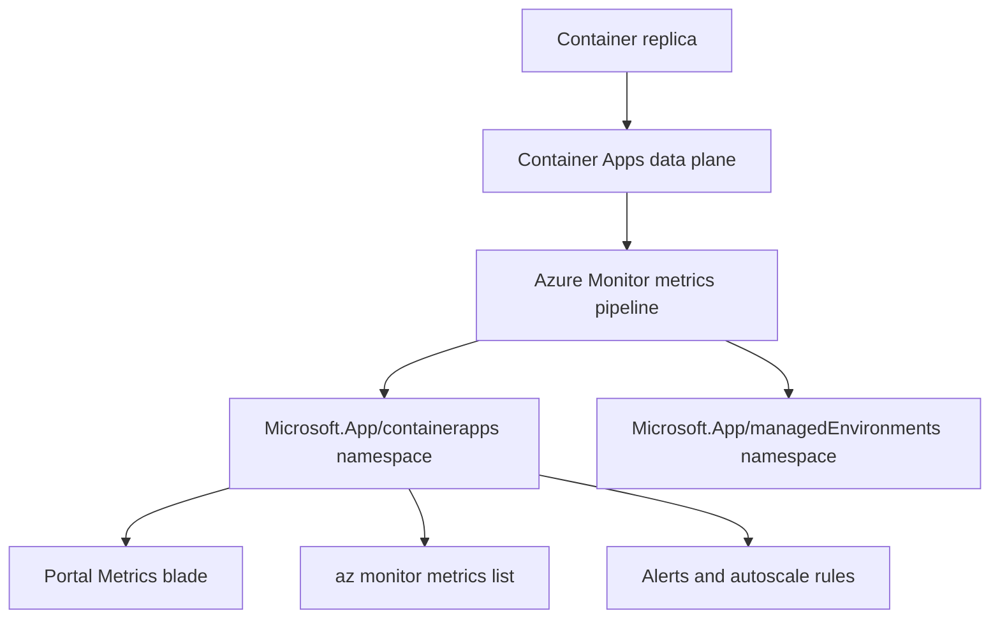
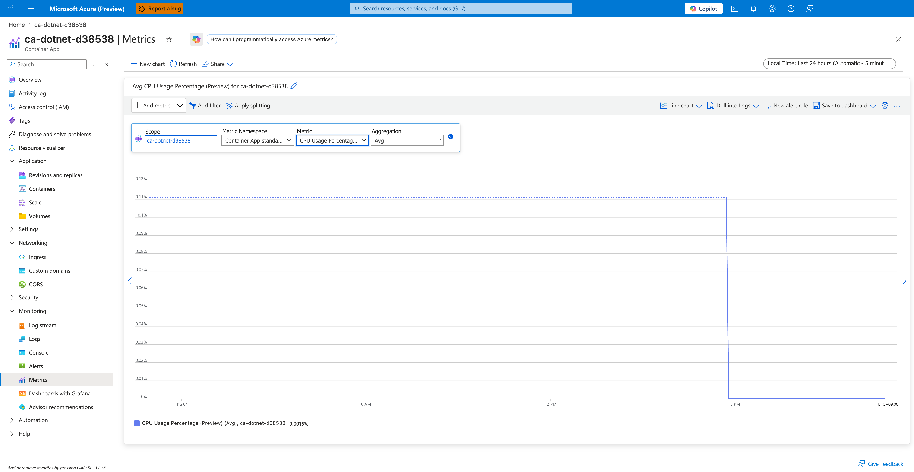
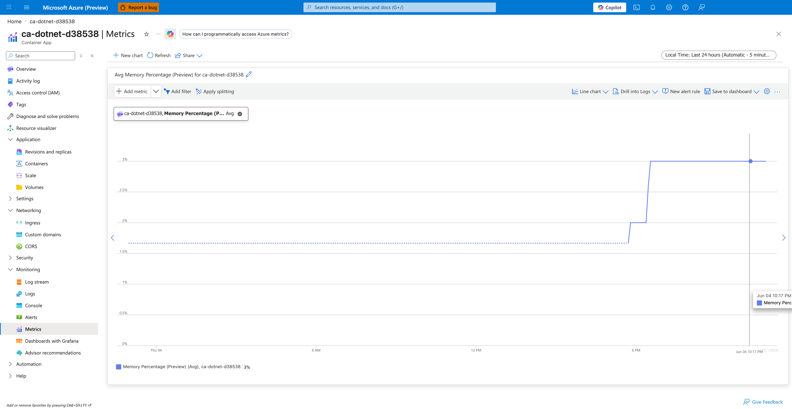

---
content_sources:
  diagrams:
  - id: metric-collection-flow
    type: flowchart
    source: mslearn-adapted
    based_on:
    - https://learn.microsoft.com/azure/container-apps/metrics
    - https://learn.microsoft.com/azure/azure-monitor/essentials/data-platform-metrics
content_validation:
  status: verified
  last_reviewed: '2026-06-05'
  reviewer: agent
  core_claims:
  - claim: Azure Container Apps publishes platform metrics under the Microsoft.App/containerapps namespace, including CPU, memory, network, replica, request, and resiliency metrics.
    source: https://learn.microsoft.com/azure/container-apps/metrics
    verified: true
  - claim: CPU Usage Percentage and Memory Percentage metrics report consumption as a percentage of the container's configured CPU and memory limits.
    source: https://learn.microsoft.com/azure/container-apps/metrics
    verified: true
  - claim: Container Apps metrics support Replica and Revision dimensions for splitting and filtering.
    source: https://learn.microsoft.com/azure/container-apps/metrics
    verified: true
  - claim: Resiliency metrics are emitted by the per-app Envoy sidecar only when a resiliency policy is attached to the receiving app and traffic originates inside the same Container Apps Environment via service discovery.
    source: https://learn.microsoft.com/azure/container-apps/service-discovery-resiliency
    verified: true
  - claim: NodeCount is published under Microsoft.App/managedEnvironments for environments that use managed workload profiles, and is split by the Workload Profile Name dimension.
    source: https://learn.microsoft.com/azure/container-apps/workload-profiles-overview
    verified: true
---
# Azure Container Apps Metrics Reference

Quick lookup for the platform metrics that Azure Container Apps publishes to Azure Monitor. Use this page when you build alerts, dashboards, autoscaling rules, or KQL queries against your Container Apps.

!!! info "Two metric namespaces"
    Container App resources publish metrics under `Microsoft.App/containerapps`. The Container Apps Environment publishes a separate small set under `Microsoft.App/managedEnvironments`. Pick the namespace that matches the resource scope you opened in Portal or the resource ID you pass to `az monitor metrics list`.

!!! tip "Percentage metrics are denominator-relative"
    `CpuPercentage` and `MemoryPercentage` are computed against the **container's configured CPU and memory limits**, not against the node or environment. A replica scoped to `cpu=0.5, memory=1Gi` reports 100% when it consumes 0.5 vCPU or 1 GiB respectively. See [Percentage metric denominators](#percentage-metric-denominators) below.

## Prerequisites

- A deployed Container App with a Log Analytics workspace attached to the environment.
- Access to the Container App's resource scope in the Azure Portal, or `az monitor metrics list` permissions on the resource.
- Familiarity with revisions and replicas; see [Revisions and replicas](../platform/revisions/index.md).

## Metric collection flow

<!-- diagram-id: metric-collection-flow -->


## Container App metrics (Microsoft.App/containerapps)

The metric IDs below are the values you pass to `az monitor metrics list --metric` or select from the Metric dropdown in the Portal Metrics blade. Dimensions are reproduced verbatim from Microsoft Learn.

| Metric ID | Display name | Unit | Dimensions |
|---|---|---|---|
| `UsageNanoCores` | CPU Usage | Nanocores | Replica, Revision |
| `WorkingSetBytes` | Memory Working Set Bytes | Bytes | Replica, Revision |
| `RxBytes` | Network In Bytes | Bytes | Replica, Revision |
| `TxBytes` | Network Out Bytes | Bytes | Replica, Revision |
| `Replicas` | Replica count | Count | Revision |
| `RestartCount` | Total Replica Restart Count | Count | Replica, Revision |
| `Requests` | Requests | Count | Replica, Revision, Status Code, Status Code Category |
| `CoresQuotaUsed` | Reserved Cores | Count | Revision |
| `TotalCoresQuotaUsed` | Total Reserved Cores | Count | None |
| `ResiliencyConnectTimeouts` | Resiliency Connection Timeouts | Count | Revision |
| `ResiliencyEjectedHosts` | Resiliency Ejected Hosts | Count | Revision |
| `ResiliencyEjectionsAborted` | Resiliency Ejections Aborted | Count | Revision |
| `ResiliencyRequestRetries` | Resiliency Request Retries | Count | Revision |
| `ResiliencyRequestTimeouts` | Resiliency Request Timeouts | Count | Revision |
| `ResiliencyRequestsPendingConnectionPool` | Resiliency Requests Pending Connection Pool | Count | Replica |
| `ResponseTime` | Average Response Time (Preview) | Milliseconds | Status Code, Status Code Category |
| `CpuPercentage` | CPU Usage Percentage (Preview) | Percent | Replica |
| `MemoryPercentage` | Memory Percentage (Preview) | Percent | Replica |

!!! warning "Dimension *display name* (`Replica`) vs *API filter name* (`podName`)"
    The "Replica" column above is the display name Microsoft Learn shows in the Portal Metrics blade chip selector. The actual filter key you pass to `az monitor metrics list --filter` for that dimension is **`podName`**, not `replicaName` — calling the API with `replicaName eq '*'` returns `BadRequest`. Verified API filter names per metric (as reported by the metrics service `BadRequest` error message when an unsupported dimension is requested):

    | Metric | Supported `--filter` dimension keys |
    |---|---|
    | `UsageNanoCores`, `WorkingSetBytes`, `RxBytes`, `TxBytes`, `RestartCount` | `revisionName`, `podName` |
    | `Requests` | `revisionName`, `podName`, `statusCodeCategory`, `statusCode` |
    | `Replicas` | `revisionName` |
    | `CoresQuotaUsed` | `revisionName` |
    | `TotalCoresQuotaUsed` | (no dimensions) |
    | `CpuPercentage`, `MemoryPercentage` | `podName` |
    | `Resiliency*` (all six) | `revisionName` |
    | `ResponseTime` | `statusCodeCategory`, `statusCode` |

    Wherever a "Useful split" row below refers to `podName`, that is the literal value to pass to `--filter "podName eq '*'"`. The Portal chip will still display "Replica" because that is the friendly display name.

## Environment metrics (Microsoft.App/managedEnvironments)

| Metric ID | Display name | Unit | Dimensions |
|---|---|---|---|
| `NodeCount` | Workload Profile Node Count (Preview) | Count | Workload Profile Name |

## Percentage metric denominators

The two `Preview` percentage metrics are the easiest way to reason about saturation in a dashboard, but they only make sense if you know what 100% means for your specific app.

| Metric | Numerator | Denominator | 100% means |
|---|---|---|---|
| `CpuPercentage` | Replica CPU usage (nanocores) | Replica CPU limit (`properties.template.containers[].resources.cpu` × 1,000,000,000 nanocores per vCPU) | The replica is consuming its full configured CPU allotment |
| `MemoryPercentage` | Replica working set (bytes) | Replica memory limit (`properties.template.containers[].resources.memory` converted to bytes) | The replica is consuming its full configured memory allotment |

### Worked example

For an app provisioned with `--cpu 0.5 --memory 1Gi`:

- `CpuPercentage` 100% corresponds to **500,000,000 nanocores** (0.5 vCPU).
- `MemoryPercentage` 100% corresponds to **1,073,741,824 bytes** (1 GiB).
- `CpuPercentage` 10% corresponds to roughly **50,000,000 nanocores** of `UsageNanoCores`.
- `MemoryPercentage` 50% corresponds to roughly **536,870,912 bytes** of `WorkingSetBytes`.

If you change the CPU/memory limits on a revision, the denominator changes for any new revision; percentage values across revisions are only directly comparable when the resource limits match.

!!! warning "Percentage metrics are not KEDA scaler utilization"
    The KEDA `cpu` and `memory` scalers report `utilization` against their own targets (the value you put in `--scale-rule-metadata value=...`). `CpuPercentage` and `MemoryPercentage` are independent Azure Monitor metrics. They can disagree on the same replica because the denominator and aggregation window differ. See [CPU and memory scaler](../platform/scaling/cpu-memory-scaler.md) and [Memory percentage vs. KEDA utilization](../troubleshooting/playbooks/scaling-and-runtime/memory-percentage-vs-keda-utilization.md).

## What each metric means

The catalog tables above are the lookup index. This section explains, in plain language, what each metric actually measures, when it moves, what a normal value looks like, and which playbook to open when it goes wrong. The numeric examples are drawn from a live load test described in [How these numbers were produced](#how-these-numbers-were-produced).

!!! info "Scope of this pass"
    This page prioritizes **full metric coverage with verified live data** (18 of 19 metrics emitted non-zero values during the test described below; `ResiliencyConnectTimeouts` is documented as baseline-zero with a labelled explanation). Portal Metrics-blade screenshots are present for `CpuPercentage` and `MemoryPercentage`; expanding screenshot coverage to every metric is tracked as separate follow-up work. The numeric samples in each section were observed via `az monitor metrics list` against the deployed test apps.

!!! tip "Alert thresholds in this page are starting points"
    Every "alert at X%" or "page when Y > Z" suggestion below is a **starting point** to think with, not a universal default. The test workload is intentionally extreme (sustained ~145 RPS against a 0.5 vCPU app, deliberate 503s, 4-second slow endpoints). Tune thresholds against your own baseline distribution before promoting them to paging rules.

### `UsageNanoCores` — CPU Usage

Absolute CPU consumption of a replica, reported in nanocores (1 vCPU = 1,000,000,000 nanocores). This is the raw numerator behind `CpuPercentage`. A replica configured with `--cpu 0.5` is allowed to burn up to 500,000,000 nanocores before the kernel throttles it.

| Property | Value |
|---|---|
| Unit | Nanocores |
| Recommended aggregation | `Average` for sustained load, `Maximum` for spike detection |
| Useful split | `podName` to see which replica is hot (Microsoft.App/containerapps exposes `podName` and `revisionName` as the split dimensions for this metric — `replicaName` is reported as unsupported by `az monitor metrics list`) |
| Goes up when | The container does work — request handling, GC, background threads |
| Stays flat when | The container is idle, the replica is descheduled, or CFS quota is throttling it (in which case `CpuPercentage` pegs near 100% and `UsageNanoCores` plateaus at the limit) |
| Sample observed | **[Observed]** Split by `podName`, hot replicas averaged `~495,000,000 nanocores` each (≈0.495 vCPU, just under the 0.5 vCPU limit). **[Observed]** Aggregated across all replicas of the revision with no split, the per-bucket `Average` peaked at `495,799,661 nanocores` (Azure Monitor reports the per-replica mean, not the sum, when no split dimension is applied). **[Inferred]** Cross-checking, the test app reached `CpuPercentage=100.7%` in the same window, which is consistent with each replica spending ~100% of its 0.5 vCPU allotment. |

Pair with `CpuPercentage` to know whether a high absolute value means "working hard" (low percentage) or "throttled" (near-100% percentage). See [CPU throttling playbook](../troubleshooting/playbooks/scaling-and-runtime/cpu-throttling.md).

### `WorkingSetBytes` — Memory Working Set Bytes

Resident set size of the container process — the amount of physical memory the kernel is currently keeping in RAM for this replica. This is the numerator behind `MemoryPercentage`. It includes anonymous pages (heap, stack), file-backed pages that are mapped and active, but excludes swapped-out pages and unreferenced file cache.

| Property | Value |
|---|---|
| Unit | Bytes |
| Recommended aggregation | `Average` to track baseline drift, `Maximum` to catch the peak before an OOM |
| Useful split | `podName` to find a leaking replica (the Portal chip shows "Replica" but the `--filter` key is `podName`) |
| Goes up when | The application allocates and retains memory — request buffers, caches, leaks |
| Stays flat when | The runtime has reached steady-state allocation and is reusing freed memory rather than growing the heap |
| Sample observed | **[Observed]** `~790,000,000 bytes` per replica (≈753 MiB) under sustained load against a 1 GiB limit on the test app `ca-loadtest-d38538` |

A monotonically rising `WorkingSetBytes` curve over hours is the classical signature of a memory leak. See [Memory leak OOMKilled playbook](../troubleshooting/playbooks/scaling-and-runtime/memory-leak-oomkilled.md).

### `RxBytes` — Network In Bytes

Cumulative bytes received by the replica's network namespace during the aggregation interval, summed across all interfaces. This is total inbound network volume, not just HTTP request bodies — it includes TCP/TLS overhead, health-probe traffic, and intra-environment service-to-service calls.

| Property | Value |
|---|---|
| Unit | Bytes |
| Recommended aggregation | `Total` per interval to see throughput |
| Useful split | `podName` to compare replicas (the Portal chip shows "Replica" but the `--filter` key is `podName`) |
| Goes up when | Clients send requests, peer apps send service-to-service calls, or large request bodies hit the replica |
| Stays flat when | Traffic is routed elsewhere (uneven load balancing — see [Replica load imbalance playbook](../troubleshooting/playbooks/scaling-and-runtime/replica-load-imbalance.md)), or the ingress proxy is buffering and not forwarding |
| Sample observed | **[Observed]** `~700,000 bytes` per minute per replica under ~145 RPS aggregate load on `ca-loadtest-d38538` |

### `TxBytes` — Network Out Bytes

Cumulative bytes transmitted by the replica's network namespace during the aggregation interval. Includes response bodies, TLS handshake bytes, downstream API calls the replica initiates, and Container Apps platform telemetry the data plane emits.

| Property | Value |
|---|---|
| Unit | Bytes |
| Recommended aggregation | `Total` |
| Useful split | `podName` (the Portal chip shows "Replica" but the `--filter` key is `podName`) |
| Goes up when | The replica sends large response payloads, calls many downstream services, or streams data |
| Stays flat when | All requests are short and responses small, or downstream calls have stopped |
| Sample observed | **[Observed]** `~22,000,000 bytes` per minute per replica when the load profile included a `/payload?kb=512` endpoint returning 512 KiB responses on `ca-loadtest-d38538` |

Because the response side typically dwarfs the request side for web traffic, `TxBytes` is usually 10-100× `RxBytes` on a healthy API.

### `Replicas` — Replica count

How many replicas were running for a revision at each sample point. This is the most direct evidence of scaler behavior: every scale-out adds a step, every scale-in removes one.

| Property | Value |
|---|---|
| Unit | Count |
| Recommended aggregation | `Maximum` to see the peak, `Average` for hourly billing-shape view, `Minimum` to verify `--min-replicas` is honored |
| Useful split | `revisionName` to separate parallel revisions during a traffic split |
| Goes up when | The scale rule fires (HTTP concurrency, queue depth, CPU/memory utilization) or `min-replicas` is raised |
| Stays flat at the floor | Scale rules are not firing and `min-replicas` is the floor |
| Stays flat at the ceiling | `max-replicas` has been hit — verify in revision YAML |
| Sample observed | **[Observed]** Scaled from 1 to 10 within ~3 minutes on `ca-loadtest-d38538` once HTTP concurrency exceeded the scale rule threshold of 20 |

If `Requests` is climbing but `Replicas` is not, see [HTTP scaling not triggering playbook](../troubleshooting/playbooks/scaling-and-runtime/http-scaling-not-triggering.md).

### `RestartCount` — Total Replica Restart Count

Number of times a replica's main container has been restarted by the Container Apps data plane. Restarts happen when the container exits non-zero, the liveness probe fails, the kernel OOM-kills the process, or the data plane recycles the replica during a controlled event.

| Property | Value |
|---|---|
| Unit | Count |
| Recommended aggregation | `Maximum` to see the cumulative restart count, `Total` per interval to see restart rate |
| Useful split | `podName` to find the unstable replica (the Portal chip shows "Replica" but the `--filter` key is `podName`) |
| Goes up when | The container crashes (exit non-zero), is OOM-killed, fails its liveness probe repeatedly, or panics during startup |
| Stays at zero when | The container is healthy and the platform has not recycled it |
| Sample observed | **[Observed]** The test app `ca-crashloop-d38538`, deployed without a listening server, reached `RestartCount=2` within ~5 minutes as the readiness/liveness probes failed |

Any non-zero value warrants investigation. See [Crashloop OOM and resource pressure playbook](../troubleshooting/playbooks/scaling-and-runtime/crashloop-oom-and-resource-pressure.md) and [Probe failure and slow start playbook](../troubleshooting/playbooks/startup-and-provisioning/probe-failure-and-slow-start.md).

### `Requests` — Requests

HTTP request count observed at the ingress layer (Envoy) for the revision. Each request is counted exactly once even if the resiliency policy retries it internally — the retries are counted under `ResiliencyRequestRetries`, not duplicated here.

| Property | Value |
|---|---|
| Unit | Count |
| Recommended aggregation | `Total` per interval for throughput |
| Useful splits | `statusCodeCategory` (`2xx`/`3xx`/`4xx`/`5xx`), `statusCode` (granular), `revisionName`, `podName` (the Portal chip shows "Replica" but the `--filter` key is `podName`) |
| Goes up when | Clients send traffic — external HTTPS, intra-environment service calls, health probes from outside the replica |
| Stays at zero when | The app has no ingress configured, or all traffic is being routed to a different revision via traffic split, or DNS/networking is broken upstream of ingress |
| Sample observed | **[Observed]** Sustained `7,000-8,000` requests per minute (~130 RPS) across the test revision while 5 parallel `hey` load streams were running against `ca-loadtest-d38538` |

Splitting by `statusCodeCategory` is the single most useful operational view for catching error spikes:

```bash
az monitor metrics list \
    --resource "$RES_ID" \
    --metric Requests \
    --aggregation Total \
    --interval PT5M \
    --filter "statusCodeCategory eq '*'" \
    --output table
```

### `CoresQuotaUsed` — Reserved Cores (per revision)

Aggregate vCPU reservation for a single revision, calculated as `replicas × cpu-per-replica`. This is a *reservation*, not a *consumption* — it reflects how many cores the data plane has earmarked for the revision to satisfy its current replica count and per-replica CPU request, regardless of whether the replicas are actually doing work.

| Property | Value |
|---|---|
| Unit | Count (vCPU) |
| Recommended aggregation | `Maximum` for capacity planning |
| Useful split | `revisionName` |
| Goes up when | The revision scales out, or a new revision is provisioned with a higher CPU request |
| Stays flat when | Replica count is stable and CPU request is unchanged |
| Sample observed | **[Observed]** `CoresQuotaUsed=2.5` for `ca-loadtest-d38538` while it ran 5 replicas × 0.5 vCPU each |

### `TotalCoresQuotaUsed` — Total Reserved Cores (per container app)

Total cores currently reserved for **this container app**, summed across all of its active revisions and replicas. Microsoft Learn defines this metric on the `Microsoft.App/containerapps` namespace as *"Total cores reserved for the container app"* — it is per-resource, not per-subscription, despite the word "Total" in the display name.

| Property | Value |
|---|---|
| Unit | Count (vCPU) |
| Recommended aggregation | `Maximum` |
| Useful split | None — this is already an aggregate for the resource |
| Goes up when | This container app scales out, or one of its revisions is updated to a higher CPU request |
| Stays flat when | The app's replica count and per-replica CPU request are both unchanged |
| Sample observed | **[Observed]** `Maximum=2.5` for `ca-loadtest-d38538` while it held 5 replicas at `cpu=0.5` each |

!!! info "This metric is not the subscription-level quota counter"
    Container Apps does not publish a subscription-wide "cores used" platform metric. To see environment-level core consumption against the per-environment quota (default 100 cores in most regions), use `az containerapp env list-usages --resource-group $RG --name $CONTAINER_ENV` — it returns the `ManagedEnvironmentConsumptionCores` and `ManagedEnvironmentGeneralPurposeCores` counters that Azure's enforcement actually compares against. See [Subscription quota exceeded playbook](../troubleshooting/playbooks/cost-and-quota/subscription-quota-exceeded.md) for raising those quotas.

### Resiliency metrics — overview

The six `Resiliency*` metrics are emitted by the per-app Envoy sidecar **only when a resiliency policy is attached to the receiving app and the traffic originates inside the same Container Apps Environment** (via service discovery, not the public FQDN). They are silent for external traffic because the public ingress is a separate Envoy that does not apply the per-app resiliency policy.

To populate these metrics you need:

1. A target app with an internal-only ingress (`--ingress internal`).
2. A resiliency policy attached to the target via `az containerapp resiliency create` or equivalent ARM.
3. A caller app in the *same environment* calling the target by its simple hostname on port 80 (e.g., `http://target-app/`).

See [Service-to-service connectivity failure playbook](../troubleshooting/playbooks/ingress-and-networking/service-to-service-connectivity-failure.md) for the troubleshooting flow when these metrics stay at zero despite a policy being attached.

### `ResiliencyConnectTimeouts` — Resiliency Connection Timeouts

Number of upstream TCP connections that exceeded the resiliency policy's `timeoutPolicy.connectionTimeoutInSeconds` while trying to establish. This counts connect-phase timeouts only — request-phase hangs are counted by `ResiliencyRequestTimeouts`.

| Property | Value |
|---|---|
| Unit | Count |
| Recommended aggregation | `Total` |
| Goes up when | The upstream replica is unreachable at the TCP layer — destination port has no listening process and the SYN is silently dropped (no RST sent back), or a firewall is dropping SYN packets at the network (L3) layer before they reach the destination |
| Stays at zero when | The TCP handshake completes — either the upstream is reachable, *or* the destination has a listening socket that accepts the SYN but never reads from the connection (a slow upstream that has *accepted* the TCP connection is not a connect timeout, even if the HTTP request itself hangs) |
| Sample observed | **[Observed]** `0` across all aggregation buckets in the test environment. **[Inferred]** The test target `ca-res-blackhole` runs `socket.listen()` without `accept()`, so the kernel's SYN backlog (the queue of half-open connections the kernel itself answers before user-space `accept()` picks them up) completes the TCP handshake on its own and Envoy's connection attempt succeeds; the subsequent HTTP request hang surfaces under `ResiliencyRequestsPendingConnectionPool` and `ResiliencyRequestTimeouts` instead of as a connect-phase timeout. **[Not Proven]** Reliably reproducing a non-zero value would likely require dropping SYN packets at L3 (a firewall DROP rule on the destination port) which a Container Apps replica cannot do without the `NET_ADMIN` Linux capability; this was not attempted in this pass. |

A non-zero value in production typically means the upstream replica died and the data plane has not yet removed it from the endpoint slice — see [Service-to-service connectivity failure playbook](../troubleshooting/playbooks/ingress-and-networking/service-to-service-connectivity-failure.md). Treat any sustained non-zero reading as a request to investigate upstream health, not as a normal background level.

### `ResiliencyEjectedHosts` — Resiliency Ejected Hosts

Current number of upstream replicas that the resiliency policy's outlier detection has temporarily ejected from the load-balancing pool. Ejection happens after consecutive errors from a replica exceed the policy's threshold (`circuitBreakerPolicy.consecutiveErrors`).

| Property | Value |
|---|---|
| Unit | Count |
| Recommended aggregation | `Maximum` — this is a **gauge** (a "currently true" snapshot), not a counter. `Total` is *not* meaningful on this metric: summing per-interval gauge readings produces a number that has no physical interpretation (24 buckets each reading "1 host ejected" sums to 24, which does not mean 24 hosts were ejected). Always use `Maximum` or `Average`. |
| Goes up when | A replica returns more consecutive errors than the policy allows; the policy ejects it for the `intervalInSeconds` window |
| Returns to zero when | The ejection window expires and the policy re-admits the host, or the unhealthy replica is replaced |
| Sample observed | **[Observed]** `Maximum=1` across 24 consecutive 5-minute buckets against the 2-replica `ca-res-503` target — outlier detection ejected and re-admitted the unhealthy host throughout the test window, but capped at 1 ejection at any moment because `maxEjectionPercent: 50` of 2 replicas = 1. **[Inferred]** Querying `Total` aggregation on this gauge would produce `24` (sum of 24 buckets × 1), which is misleading and does not mean "24 distinct hosts were ejected". |

This metric is the early-warning system for replica health. A persistently non-zero value means traffic is being concentrated on fewer healthy replicas than configured, raising load on the survivors.

### `ResiliencyEjectionsAborted` — Resiliency Ejections Aborted

Number of times the outlier detector wanted to eject a replica but was blocked because doing so would exceed `circuitBreakerPolicy.maxEjectionPercent`. By design, the policy refuses to eject all replicas because that would leave the caller with nowhere to send traffic — a state colloquially called a **brown-out** (the upstream is mostly unhealthy but the caller cannot stop sending to it without losing all capacity).

| Property | Value |
|---|---|
| Unit | Count |
| Recommended aggregation | `Total` per interval |
| Goes up when | Multiple upstream replicas are unhealthy and the policy is hitting its safety cap (commonly `maxEjectionPercent: 50` for 2-replica targets means at most 1 can be ejected; the second attempt aborts) |
| Stays at zero when | At most one replica is unhealthy at a time, or `maxEjectionPercent` is set high enough that the cap is never reached |
| Sample observed | **[Observed]** `Total=7,329` against `ca-res-503` where both replicas were serving 503; the policy `policy-503` capped ejections at `maxEjectionPercent: 50` and aborted every additional attempt |

A high `ResiliencyEjectionsAborted` value alongside non-zero `ResiliencyEjectedHosts` is the smoking gun for the brown-out state: your upstream is mostly unhealthy and traffic is being concentrated on a small surviving subset. This is a signal to scale the upstream or shed traffic.

### `ResiliencyRequestRetries` — Resiliency Request Retries

Number of additional request attempts the resiliency policy has issued on top of the original request. A retry policy with `httpRetryPolicy.maxRetries: 2` can produce up to 2 additional attempts per failing original request, so a single observed external 5xx may appear as up to 3 attempts in this counter (1 original + 2 retries).

| Property | Value |
|---|---|
| Unit | Count |
| Recommended aggregation | `Total` per interval |
| Goes up when | The retry policy's `httpRetryPolicy.matches` condition matches — typically `errors: ['5xx']`, `gateway-error`, `reset`, `connect-failure`, or specific status codes via `httpStatusCodes` |
| Stays at zero when | All requests succeed on the first attempt, or no retry policy is configured |
| Sample observed | **[Observed]** `Total=9,636` retries across the 2-hour test window against `ca-res-503` (which returns constant 503), with `httpRetryPolicy.maxRetries: 2` and `httpRetryPolicy.matches.errors: ['5xx']` |

A sudden climb in `ResiliencyRequestRetries` is often the first signal that an upstream is degrading — the caller's success rate may still look fine because retries are hiding the failure, but capacity is being consumed disproportionately. Alert on rate of retries, not absolute count.

### `ResiliencyRequestTimeouts` — Resiliency Request Timeouts

Number of requests that exceeded the policy's `timeoutPolicy.responseTimeoutInSeconds` (per-request response budget) while waiting for the upstream to respond. This is the *request-phase* timeout (server slow to respond), distinct from `ResiliencyConnectTimeouts` (couldn't even open the TCP connection).

| Property | Value |
|---|---|
| Unit | Count |
| Recommended aggregation | `Total` per interval |
| Goes up when | The upstream takes longer to respond than the per-request timeout — overloaded replica, slow database call, blocked thread pool |
| Stays at zero when | All upstream responses fit within the policy's per-request budget |
| Sample observed | **[Observed]** `Total=1,100` against `ca-res-slow` configured with `timeoutPolicy.responseTimeoutInSeconds: 1` while the caller exercised `/slow?ms=4000` (intentional 4-second delay) |

### `ResiliencyRequestsPendingConnectionPool` — Resiliency Requests Pending Connection Pool

Number of requests queued in the per-target connection pool waiting for either an existing connection to become free or a new connection to be opened (up to `tcpConnectionPool.maxConnections`). Once `httpConnectionPool.http1MaxPendingRequests` is hit, additional requests fail fast with a circuit-breaker rejection rather than queuing further.

| Property | Value |
|---|---|
| Unit | Count |
| Recommended aggregation | `Maximum` (this is a queue depth gauge) |
| Useful split | `revisionName` (this metric does not split by replica/pod — to find a caller replica that is hot, drill into the caller app's logs or use Application Insights) |
| Goes up when | The caller is sending more concurrent requests than the connection pool can drain — often because the upstream is slow or because the pool is tight relative to load |
| Stays at zero when | Pool capacity comfortably exceeds in-flight request count |
| Sample observed | **[Observed]** `Maximum=10,488` against `ca-res-503` with a tight `tcpConnectionPool.maxConnections` setting and ~145 RPS sustained calls from `ca-res-caller` |

A persistently non-zero value is a sign your circuit-breaker policy is being exercised. That is by design — the policy is protecting your caller from a slow upstream — but it also means user-visible latency is climbing. Pair this metric with a downstream latency SLI.

### `ResponseTime` — Average Response Time (Preview)

End-to-end latency observed at the ingress proxy, measured from "request received" to "last response byte sent". Includes time the request spent in the connection pool queue, time the upstream replica spent generating the response, and time spent serializing the response back to the client.

| Property | Value |
|---|---|
| Unit | Milliseconds |
| Recommended aggregation | `Average` for the dashboard headline, but use a percentile view in Application Insights for SLO alerting (Azure Monitor metrics do not expose percentiles for this metric) |
| Useful splits | `statusCodeCategory`, `statusCode` |
| Goes up when | Upstream replicas are slow, the connection pool is queuing requests, response payloads grow large, or thread pools are saturated |
| Sample observed | **[Observed]** `~2,000 ms` average when the load mix included a `/slow?ms=1500` endpoint at 25% of traffic; `~50 ms` average for healthy 2xx-only traffic on `ca-loadtest-d38538` |

Be aware that this is a Preview metric — Microsoft Learn flags it as not yet GA. Average is a lossy summary; a long tail of slow responses can be hidden by many fast ones. Cross-check with Application Insights `requests | summarize percentile(duration, 99) by bin(timestamp, 5m)` for percentile views.

### `CpuPercentage` — CPU Usage Percentage (Preview)

`UsageNanoCores ÷ (configured CPU limit in nanocores) × 100`. The denominator is the per-replica CPU limit you set with `--cpu`, not the node's total CPU.

| Property | Value |
|---|---|
| Unit | Percent (0-100, can briefly exceed 100 due to sampling) |
| Recommended aggregation | `Average` for trend, `Maximum` for spike detection |
| Useful split | `podName` (the Portal chip shows "Replica" but the `--filter` key is `podName`) |
| Goes up when | The replica is doing CPU-bound work — request handling, GC, computation |
| Stays at 100% (suspiciously flat) when | The replica is being CPU-throttled by the kernel (CFS quota). Latency will climb but CPU never crosses 100% by design |
| Sample observed | **[Observed]** `Maximum=100.7%` (the slight overshoot is a sampling artifact) for replicas of `ca-loadtest-d38538` serving the `/cpu?ms=400` endpoint with `--cpu 0.5` |

See [CPU throttling playbook](../troubleshooting/playbooks/scaling-and-runtime/cpu-throttling.md) for diagnosing the throttling case. Preview — do not rely on this as the sole SLO source.

### `MemoryPercentage` — Memory Percentage (Preview)

`WorkingSetBytes ÷ (configured memory limit in bytes) × 100`. The denominator is the per-replica memory limit you set with `--memory`, not the node's total memory.

| Property | Value |
|---|---|
| Unit | Percent |
| Recommended aggregation | `Average` for baseline, `Maximum` for OOM proximity |
| Useful split | `podName` (the Portal chip shows "Replica" but the `--filter` key is `podName`) |
| Goes up when | The application allocates and retains memory |
| Hits 100% then drops to a small value | The kernel OOM-killed the process, the replica restarted, and `WorkingSetBytes` started over from baseline. Confirm with `RestartCount` |
| Sample observed | **[Observed]** `Maximum=72.5%` for replicas of `ca-loadtest-d38538` under load with `--memory 1Gi` (≈742 MiB working set against 1 GiB limit) |

This is the metric to alert on for memory headroom. As a **starting point**, page when `Average > 80%` for `15m`, escalate when `Maximum > 95%` for any window — then tune against your own baseline working set. See [Memory leak OOMKilled playbook](../troubleshooting/playbooks/scaling-and-runtime/memory-leak-oomkilled.md).

!!! warning "Not the same as KEDA `memory` scaler utilization"
    The KEDA `memory` scaler reports its own `utilization` against the value passed to `--scale-rule-metadata value=...`. `MemoryPercentage` is independent — they share a numerator but have different denominators. See [Memory percentage vs. KEDA utilization](../troubleshooting/playbooks/scaling-and-runtime/memory-percentage-vs-keda-utilization.md).

### `NodeCount` — Workload Profile Node Count (Preview)

Current count of underlying nodes in a workload profile within a Container Apps Environment, split by the `Workload Profile Name` dimension. The metric is published on the `Microsoft.App/managedEnvironments` namespace for environments that use the workload profiles architecture (any environment that lists profiles under `properties.workloadProfiles`, including the auto-managed `Consumption` profile and any explicitly added `Dedicated` profiles such as `D4`, `D8`, `E4`, `E8`, or GPU variants). For the older Consumption-only environment type (no `workloadProfiles` block on the environment), this metric is not emitted.

| Property | Value |
|---|---|
| Unit | Count |
| Recommended aggregation | `Maximum` for capacity headroom |
| Useful split | `workloadProfileName` to break down per profile |
| Goes up when | Apps assigned to a workload profile request enough cumulative CPU/memory to exceed the current node fleet, prompting the profile to scale within its `min-nodes` and `max-nodes` bounds |
| Stays at the minimum when | No app on that profile is requesting more capacity than the current node count provides |
| Sample observed | **[Observed]** `Maximum=1` on a `D4` workload profile (`min-nodes=1, max-nodes=3`) in `cae-wp-d38538` with one small app deployed |

If apps land on the wrong workload profile (or no profile at all), see [Workload profile mismatch playbook](../troubleshooting/playbooks/cost-and-quota/workload-profile-mismatch.md).

## How these numbers were produced

The numeric samples above came from a deliberate load test environment to demonstrate that each metric publishes the expected shape of data. The topology was:

| App | Role | Configuration | Drives metric(s) |
|---|---|---|---|
| `ca-loadtest-d38538` | Public ingress test target | `--cpu 0.5 --memory 1Gi --min-replicas 1 --max-replicas 10`, HTTP scaler at 20 concurrency | `UsageNanoCores`, `WorkingSetBytes`, `RxBytes`, `TxBytes`, `Replicas`, `Requests`, `ResponseTime`, `CpuPercentage`, `MemoryPercentage`, `CoresQuotaUsed`, `TotalCoresQuotaUsed` |
| `ca-crashloop-d38538` | Memory-leak loop, no ingress | `--cpu 0.25 --memory 0.5Gi`, container allocates 16 MiB every 200 ms | Drove `RestartCount` after the process exceeded its memory limit and the kernel OOM-killed it |
| `ca-res-503` | Resiliency target serving constant 503 | 2 replicas, `policy-503` with retries on 503/500 and outlier detection | `ResiliencyRequestRetries`, `ResiliencyEjectedHosts`, `ResiliencyEjectionsAborted`, `ResiliencyRequestsPendingConnectionPool` |
| `ca-res-slow` | Resiliency target with 4-second response | `policy-slow` with `timeoutPolicy.responseTimeoutInSeconds: 1` (per-request response budget of 1 second) | `ResiliencyRequestTimeouts` |
| `ca-res-pool` | Resiliency target with tight pool | `policy-pool` with `http1MaxPendingRequests: 1` | `ResiliencyRequestsPendingConnectionPool` |
| `ca-res-blackhole` | TCP listen without accept | TCP transport, no HTTP server | `RestartCount` (probe failures), `ResiliencyRequestsPendingConnectionPool` |
| `ca-res-caller` | Intra-environment caller | 100 threads × 5 targets via service discovery (`http://target-name`) | Drives traffic into the four resiliency targets above |
| `cae-wp-d38538` | Dedicated workload profile environment | `D4` profile, `min-nodes=1, max-nodes=3`, one app deployed | `NodeCount` |

Load was generated by 5 parallel `hey` processes against the public endpoint of `ca-loadtest-d38538` (one each hitting `/health`, `/cpu`, `/payload`, `/error`, `/slow`) and by `ca-res-caller` issuing intra-environment calls to the four resiliency targets on port 80 (Container Apps service discovery routes hostname-only URLs through the env-internal ingress proxy on port 80, regardless of the target's `--target-port`).

!!! info "Why `ResiliencyConnectTimeouts` did not move"
    `ca-res-blackhole` calls `socket.listen()` without `accept()`, so the kernel's SYN backlog completes the TCP handshake on its own. Envoy's connection to the upstream succeeds; the subsequent HTTP request hang shows up as `ResiliencyRequestsPendingConnectionPool` and `ResiliencyRequestTimeouts`, not as a connect-phase timeout. Triggering `ResiliencyConnectTimeouts` reliably requires dropping SYN packets at L3 (a firewall DROP rule) which a Container Apps replica cannot do without the `NET_ADMIN` capability. In production, a non-zero `ResiliencyConnectTimeouts` typically means the destination replica died and the data plane has not yet removed it from the endpoint slice.

## Portal verification: CPU Usage Percentage

The chart below was captured from the `Metrics` blade of `ca-dotnet-d38538` (`cpu=0.5, memory=1Gi`, one running replica `ca-dotnet-d38538--0000001-6dbf4684d5-7w5sh`). The app was idle, so the percentage hovers near zero.



**[Observed]** `Microsoft Azure (Preview)`. `Report a bug`. `Search resources, services, and docs (G+/)`. `Copilot`. `Home`. `ca-dotnet-d38538 | Metrics`. `Container App`. `New chart`. `Refresh`. `Share`. `Local Time: Last 24 hours (Automatic - 5 minut...)`. `Avg CPU Usage Percentage (Preview) for ca-dotnet-d38538`. `Add metric`. `Add filter`. `Apply splitting`. `Line chart`. `Drill into Logs`. `New alert rule`. `Save to dashboard`. `ca-dotnet-d38538, CPU Usage Percentage (P... Avg`. `CPU Usage Percentage (Preview) (Avg), ca-dotnet-d38538`. `0.0016%`. `Thu 04`. `6 AM`. `12 PM`. `6 PM`. `Jun 04 10:17 PM`. `Overview`. `Activity log`. `Access control (IAM)`. `Tags`. `Diagnose and solve problems`. `Resource visualizer`. `Application`. `Revisions and replicas`. `Containers`. `Scale`. `Volumes`. `Settings`. `Networking`. `Ingress`. `Custom domains`. `CORS`. `Security`. `Monitoring`. `Log stream`. `Logs`. `Console`. `Alerts`. `Metrics`. `Dashboards with Grafana`. `Advisor recommendations`. `Automation`. `Help`.

**[Inferred]** The metric pill text `ca-dotnet-d38538, CPU Usage Percentage (P... Avg` appears consistent with the `CpuPercentage` metric described in the [Container App metrics (Microsoft.App/containerapps)](#container-app-metrics-microsoftappcontainerapps) table. The `Avg` aggregation chip appears consistent with the `--aggregation Average` invocation for `CpuPercentage` shown in [Query metrics with az CLI](#query-metrics-with-az-cli). The `0.0016%` average appears consistent with an idle replica consuming a small fraction of the 0.5 vCPU denominator described in [Percentage metric denominators](#percentage-metric-denominators), where 100% corresponds to 500,000,000 nanocores. The `Local Time: Last 24 hours (Automatic - 5 minut...)` time scope appears consistent with a Portal default time range that aggregates the metric into 5-minute buckets.

**[Not Proven]** The `properties.template.containers[].resources.cpu` value on the `ca-dotnet-d38538` revision is not visible on this view. The `UsageNanoCores` numerator that produced the `0.0016%` average is not visible on this view; the chart shows only the derived percentage. The per-replica split implied by the `Replica` dimension in the [Container App metrics (Microsoft.App/containerapps)](#container-app-metrics-microsoftappcontainerapps) table is not visible on this view; no `Apply splitting` chip is applied. The KEDA `cpu` scaler `utilization` value that the [CPU and memory scaler](../platform/scaling/cpu-memory-scaler.md) page warns can diverge from `CpuPercentage` is not visible on this view.

## Portal verification: Memory Percentage

The same `Metrics` blade was reconfigured to plot `MemoryPercentage` for the same replica. The plateau near 3% reflects the .NET runtime working set against the 1 GiB memory limit, not a problem with the app.



**[Observed]** `Microsoft Azure (Preview)`. `Report a bug`. `Search resources, services, and docs (G+/)`. `Copilot`. `How can I programmatically access Azure metrics?`. `Home`. `ca-dotnet-d38538 | Metrics`. `Container App`. `New chart`. `Refresh`. `Share`. `Local Time: Last 24 hours (Automatic - 5 minut...)`. `Avg Memory Percentage (Preview) for ca-dotnet-d38538`. `Add metric`. `Add filter`. `Apply splitting`. `Line chart`. `Drill into Logs`. `New alert rule`. `Save to dashboard`. `ca-dotnet-d38538, Memory Percentage (P... Avg`. `Memory Percentage (Preview) (Avg), ca-dotnet-d38538`. `3%`. `0%`. `0.5%`. `1%`. `1.5%`. `2%`. `2.5%`. `Thu 04`. `6 AM`. `12 PM`. `6 PM`. `Jun 04 10:17 PM`. `Overview`. `Activity log`. `Access control (IAM)`. `Tags`. `Diagnose and solve problems`. `Resource visualizer`. `Application`. `Revisions and replicas`. `Containers`. `Scale`. `Volumes`. `Settings`. `Networking`. `Ingress`. `Custom domains`. `CORS`. `Security`. `Monitoring`. `Log stream`. `Logs`. `Console`. `Alerts`. `Metrics`. `Dashboards with Grafana`. `Advisor recommendations`. `Automation`. `Help`.

**[Inferred]** The metric pill text `ca-dotnet-d38538, Memory Percentage (P... Avg` appears consistent with the `MemoryPercentage` metric described in the [Container App metrics (Microsoft.App/containerapps)](#container-app-metrics-microsoftappcontainerapps) table. The `Avg` aggregation chip appears consistent with the `--aggregation Average` invocation pattern for percentage metrics shown in [Query metrics with az CLI](#query-metrics-with-az-cli). The `3%` average appears consistent with the 1 GiB memory denominator described in [Percentage metric denominators](#percentage-metric-denominators), where 3% corresponds to roughly 30.7 MiB of working set against a 1,073,741,824-byte limit. The Y-axis tick range from `0%` to `3%` appears consistent with the Portal default auto-scaling behavior for a low-magnitude percentage series.

**[Not Proven]** The `properties.template.containers[].resources.memory` value on the `ca-dotnet-d38538` revision is not visible on this view. The `WorkingSetBytes` numerator that produced the `3%` average is not visible on this view; the chart shows only the derived percentage. The per-replica split implied by the `Replica` dimension in the [Container App metrics (Microsoft.App/containerapps)](#container-app-metrics-microsoftappcontainerapps) table is not visible on this view; no `Apply splitting` chip is applied. The KEDA `memory` scaler `utilization` value that the [Memory percentage vs. KEDA utilization](../troubleshooting/playbooks/scaling-and-runtime/memory-percentage-vs-keda-utilization.md) playbook warns can diverge from `MemoryPercentage` is not visible on this view.

## Query metrics with az CLI

`az monitor metrics list` returns the same data as the Portal Metrics blade. Use it for scripted dashboards, CI checks, or alert validation.

```bash
# CPU usage percentage, last 1 hour, 5-minute granularity
az monitor metrics list \
    --resource "/subscriptions/$SUBSCRIPTION_ID/resourceGroups/$RG/providers/Microsoft.App/containerApps/$APP_NAME" \
    --metric CpuPercentage \
    --aggregation Average \
    --interval PT5M \
    --output table
```

| Command flag | What it does |
|---|---|
| `--resource` | Full Azure resource ID for the Container App or Container Apps Environment |
| `--metric` | Metric ID from the tables above (case sensitive) |
| `--aggregation` | One of `Average`, `Minimum`, `Maximum`, `Total`, `Count` (must be supported by the metric) |
| `--interval` | ISO 8601 duration for the aggregation bucket (for example `PT1M`, `PT5M`, `PT1H`) |
| `--filter` | Dimension filter, for example `podName eq '*'` to split by replica (use `podName`, not `replicaName` — see the [dimension warning](#container-app-metrics-microsoftappcontainerapps)) |
| `--output` | Output format such as `table`, `json`, or `tsv` |

```bash
# Memory working set bytes split by replica (pod)
az monitor metrics list \
    --resource "/subscriptions/$SUBSCRIPTION_ID/resourceGroups/$RG/providers/Microsoft.App/containerApps/$APP_NAME" \
    --metric WorkingSetBytes \
    --aggregation Average \
    --interval PT1M \
    --filter "podName eq '*'" \
    --output table
```

| Command flag | What it does |
|---|---|
| `--metric WorkingSetBytes` | Absolute memory numerator from the [Container App metrics](#container-app-metrics-microsoftappcontainerapps) table |
| `--interval PT1M` | 1-minute aggregation buckets for higher resolution |
| `--filter "podName eq '*'"` | Splits the series across every replica reported in the interval. The actual API dimension key is `podName`, not `replicaName` — passing `"replicaName eq '*'"` returns `BadRequest`. See the [dimension display vs API name warning](#container-app-metrics-microsoftappcontainerapps) above. |

```bash
# HTTP request count split by status code category, last 24 hours
az monitor metrics list \
    --resource "/subscriptions/$SUBSCRIPTION_ID/resourceGroups/$RG/providers/Microsoft.App/containerApps/$APP_NAME" \
    --metric Requests \
    --aggregation Total \
    --interval PT15M \
    --filter "statusCodeCategory eq '*'" \
    --output table
```

| Command flag | What it does |
|---|---|
| `--metric Requests` | HTTP request counter from the [Container App metrics](#container-app-metrics-microsoftappcontainerapps) table |
| `--aggregation Total` | Sums requests inside each interval rather than averaging |
| `--filter "statusCodeCategory eq '*'"` | Splits the series across `2xx`, `3xx`, `4xx`, `5xx` categories |

```bash
# Environment-level node count
az monitor metrics list \
    --resource "/subscriptions/$SUBSCRIPTION_ID/resourceGroups/$RG/providers/Microsoft.App/managedEnvironments/$CONTAINER_ENV" \
    --metric NodeCount \
    --aggregation Average \
    --interval PT5M \
    --output table
```

| Command flag | What it does |
|---|---|
| `--resource` | Full Azure resource ID for the Container Apps Environment in this query |
| `--metric` | Environment metric ID from the [Environment metrics](#environment-metrics-microsoftappmanagedenvironments) table |
| `--aggregation` | `Average` returns the per-interval mean node count |
| `--interval` | `PT5M` aligns the bucket with the default Portal Metrics blade granularity |

## When to use which metric

| Question | Metric(s) | Aggregation |
|---|---|---|
| Is a replica close to its CPU limit? | `CpuPercentage` | Avg, Max |
| Is a replica close to its memory limit? | `MemoryPercentage` | Avg, Max |
| What is the absolute CPU consumption? | `UsageNanoCores` | Avg |
| What is the absolute memory working set? | `WorkingSetBytes` | Avg |
| How many replicas are running for a revision? | `Replicas` | Avg, Min, Max |
| Are replicas restarting? | `RestartCount` | Max, Total |
| What is the request rate and HTTP error split? | `Requests` | Total, with `statusCodeCategory` split |
| Are retries or ejections happening? | `ResiliencyRequestRetries`, `ResiliencyEjectedHosts`, `ResiliencyEjectionsAborted` | Total, Max |
| Am I approaching the per-app cores reservation? | `TotalCoresQuotaUsed` | Max |
| Am I approaching the environment-level cores quota? | Use `az containerapp env list-usages` (not a metric) | n/a |

## See Also

- [CLI Reference](cli-reference.md)
- [Platform Limits](platform-limits.md)
- [Environment Variables](environment-variables.md)
- [Operations — Monitoring](../operations/monitoring/index.md)
- [Platform — CPU and memory scaler](../platform/scaling/cpu-memory-scaler.md)
- [Troubleshooting — Memory percentage vs. KEDA utilization](../troubleshooting/playbooks/scaling-and-runtime/memory-percentage-vs-keda-utilization.md)

## Sources

- [Supported metrics for Microsoft.App/containerapps (Microsoft Learn)](https://learn.microsoft.com/azure/container-apps/metrics)
- [Supported metrics for Microsoft.App/managedEnvironments (Microsoft Learn)](https://learn.microsoft.com/azure/container-apps/metrics)
- [Azure Monitor metrics overview (Microsoft Learn)](https://learn.microsoft.com/azure/azure-monitor/essentials/data-platform-metrics)
- [Service-to-service connectivity and resiliency in Azure Container Apps (Microsoft Learn)](https://learn.microsoft.com/azure/container-apps/service-discovery-resiliency)
- [Workload profiles in Consumption + Dedicated plan structure (Microsoft Learn)](https://learn.microsoft.com/azure/container-apps/workload-profiles-overview)
- [`az monitor metrics list` reference (Microsoft Learn)](https://learn.microsoft.com/cli/azure/monitor/metrics)
