---
content_sources:
  diagrams: []
content_validation:
  status: verified
  last_reviewed: '2026-06-05'
  reviewer: agent
  core_claims:
    - claim: Azure Container Apps publishes platform metrics under the Microsoft.App/containerapps namespace, including CPU, memory, network, replica, request, and resiliency metrics.
      source: https://learn.microsoft.com/en-us/azure/container-apps/metrics
      verified: true
    - claim: CPU Usage Percentage and Memory Percentage metrics report consumption as a percentage of the container's configured CPU and memory limits.
      source: https://learn.microsoft.com/en-us/azure/container-apps/metrics
      verified: true
    - claim: Container Apps metrics support Replica and Revision dimensions for splitting and filtering.
      source: https://learn.microsoft.com/en-us/azure/container-apps/metrics
      verified: true
    - claim: Resiliency metrics are emitted by the per-app Envoy sidecar only when a resiliency policy is attached to the receiving app and traffic originates inside the same Container Apps Environment via service discovery.
      source: https://learn.microsoft.com/en-us/azure/container-apps/service-discovery-resiliency
      verified: true
---
# Container App Metrics (Microsoft.App/containerapps)

The metric IDs below are the values you pass to `az monitor metrics list --metric` or select from the Metric dropdown in the Portal Metrics blade. Dimensions are reproduced verbatim from Microsoft Learn.

| Metric ID | Display name | Unit | Dimensions |
|---|---|---|---|
| `UsageNanoCores` | CPU Usage | Nanocores | Replica, Revision |
| `WorkingSetBytes` | Memory Working Set Bytes | Bytes | Replica, Revision |
| `RxBytes` | Network In Bytes | Bytes | Replica, Revision |
| `TxBytes` | Network Out Bytes | Bytes | Replica, Revision |
| `Replicas` | Replica count | Count | Revision |
| `RestartCount` | Total Replica Restart Count | Count | Replica, Revision |
| `Requests` | Requests | Count | Replica, Revision, Status Code, Status Code Category |
| `CoresQuotaUsed` | Reserved Cores | Count | Revision |
| `TotalCoresQuotaUsed` | Total Reserved Cores | Count | None |
| `ResiliencyConnectTimeouts` | Resiliency Connection Timeouts | Count | Revision |
| `ResiliencyEjectedHosts` | Resiliency Ejected Hosts | Count | Revision |
| `ResiliencyEjectionsAborted` | Resiliency Ejections Aborted | Count | Revision |
| `ResiliencyRequestRetries` | Resiliency Request Retries | Count | Revision |
| `ResiliencyRequestTimeouts` | Resiliency Request Timeouts | Count | Revision |
| `ResiliencyRequestsPendingConnectionPool` | Resiliency Requests Pending Connection Pool | Count | Revision |
| `ResponseTime` | Average Response Time (Preview) | Milliseconds | Status Code, Status Code Category |
| `CpuPercentage` | CPU Usage Percentage (Preview) | Percent | Replica |
| `MemoryPercentage` | Memory Percentage (Preview) | Percent | Replica |
| `GpuUtilizationPercentage` | GPU Utilization Percentage (Preview) | Percent | Replica, Revision |

!!! info "JVM metrics for Java apps"
    The metric definition catalog for a Container App also includes 11 JVM metrics (`jvm.memory.total.used`, `jvm.memory.used`, `jvm.gc.count`, `jvm.gc.duration`, `jvm.thread.count`, `jvm.buffer.memory.usage`, etc.) that emit values **only when the app runs Java with the OpenTelemetry Java agent enabled and the environment is configured to receive OTel data**. They are not documented further in this reference because they reproduce the upstream [OpenTelemetry JVM semantic conventions](https://opentelemetry.io/docs/specs/semconv/runtime/jvm-metrics/) verbatim. For non-Java workloads these metrics are present in the dropdown but never populate.

!!! warning "Dimension *display name* (`Replica`) vs *API filter name* (`podName`)"
    The "Replica" column above is the display name Microsoft Learn shows in the Portal Metrics blade chip selector. The actual filter key you pass to `az monitor metrics list --filter` for that dimension is **`podName`**, not `replicaName` — calling the API with `replicaName eq '*'` returns `BadRequest`. Verified API filter names per metric (as reported by the metrics service `BadRequest` error message when an unsupported dimension is requested):

    | Metric | Supported `--filter` dimension keys |
    |---|---|
    | `UsageNanoCores`, `WorkingSetBytes`, `RxBytes`, `TxBytes`, `RestartCount` | `revisionName`, `podName` |
    | `Requests` | `revisionName`, `podName`, `statusCodeCategory`, `statusCode` |
    | `Replicas` | `revisionName` |
    | `CoresQuotaUsed` | `revisionName` |
    | `TotalCoresQuotaUsed` | (no dimensions) |
    | `CpuPercentage`, `MemoryPercentage` | `podName` |
    | `GpuUtilizationPercentage` | `revisionName`, `podName` |
    | `Resiliency*` (all six) | `revisionName` |
    | `ResponseTime` | `statusCodeCategory`, `statusCode` |

    Wherever a "Useful split" row below refers to `podName`, that is the literal value to pass to `--filter "podName eq '*'"`. The Portal chip will still display "Replica" because that is the friendly display name.

## What each metric means

The catalog tables above are the lookup index. This section explains, in plain language, what each metric actually measures, when it moves, what a normal value looks like, and which playbook to open when it goes wrong. The numeric examples are drawn from a live load test described in [How these numbers were produced](evidence-and-captures.md).

!!! info "Scope of this pass"
    This page provides **full coverage of every metric published in both namespaces**, with verified live data and Portal Metrics-blade screenshots for each metric that the test environment was capable of exercising. The container-app namespace publishes 20 metrics (18 emitted non-zero values during the test; `ResiliencyConnectTimeouts` is documented as baseline-zero with a labelled explanation; `GpuUtilizationPercentage` is documented from `az monitor metrics list-definitions` because the test environment had no GPU profile). The env namespace publishes 7 metrics (`NodeCount` and the four `Ingress*` Preview metrics exercised live; `EnvCoresQuotaLimit` and `EnvCoresQuotaUtilization` are documented in their **(Deprecated)** empty state with replacement guidance). Each metric section ends with a **Captures** subsection: in most cases that subsection contains an always-visible Portal screenshot at the baseline (unsplit) view plus collapsible split views by `podName`, `revisionName`, `statusCodeCategory`, `statusCode`, or `workloadProfileName` as applicable; in a small number of cases (`TotalCoresQuotaUsed`, `GpuUtilizationPercentage`) the Captures subsection deliberately contains an explanatory note instead of a screenshot, with the reason stated inline. The numeric samples in each section were observed via `az monitor metrics list` and the Portal Metrics blade against the deployed test apps.

!!! tip "Alert thresholds in this page are starting points"
    Every "alert at X%" or "page when Y > Z" suggestion below is a **starting point** to think with, not a universal default. The test workload is intentionally extreme (sustained ~145 RPS against a 0.5 vCPU app, deliberate 503s, 4-second slow endpoints). Tune thresholds against your own baseline distribution before promoting them to paging rules.

### `UsageNanoCores` — CPU Usage

Absolute CPU consumption of a replica, reported in nanocores (1 vCPU = 1,000,000,000 nanocores). This is the raw numerator behind `CpuPercentage`. A replica configured with `--cpu 0.5` is allowed to burn up to 500,000,000 nanocores before the kernel throttles it.

| Property | Value |
|---|---|
| Unit | Nanocores |
| Recommended aggregation | `Average` for sustained load, `Maximum` for spike detection |
| Useful split | `podName` to see which replica is hot (Microsoft.App/containerapps exposes `podName` and `revisionName` as the split dimensions for this metric — `replicaName` is reported as unsupported by `az monitor metrics list`) |
| Goes up when | The container does work — request handling, GC, background threads |
| Stays flat when | The container is idle, the replica is descheduled, or CFS quota is throttling it (in which case `CpuPercentage` pegs near 100% and `UsageNanoCores` plateaus at the limit) |
| Sample observed | **[Observed]** Split by `podName`, hot replicas averaged `~495,000,000 nanocores` each (≈0.495 vCPU, just under the 0.5 vCPU limit). **[Observed]** Aggregated across all replicas of the revision with no split, the per-bucket `Average` peaked at `495,799,661 nanocores` (Azure Monitor reports the per-replica mean, not the sum, when no split dimension is applied). **[Inferred]** Cross-checking, the test app reached `CpuPercentage=100.7%` in the same window, which is consistent with each replica spending ~100% of its 0.5 vCPU allotment. |

Pair with `CpuPercentage` to know whether a high absolute value means "working hard" (low percentage) or "throttled" (near-100% percentage). See [CPU throttling playbook](../../troubleshooting/playbooks/scaling-and-runtime/cpu-throttling.md).

#### Captures

Baseline view of `UsageNanoCores` on `ca-loadtest-d38538` during the load test — no split, `Avg` aggregation, Last 24 hours. The aggregated per-bucket average peaks at `495,799,661 nanocores` (~0.495 vCPU), consistent with replicas running near their 0.5 vCPU limit.

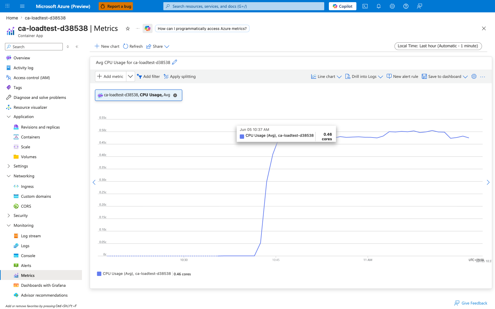

??? note "Split by `podName` (per-replica view)"
    Same metric split by `podName` — each line is one replica. The replica labels reveal that the test app reached 10 simultaneous replicas, each one independently spending ~495M nanocores. The per-replica view is essential for diagnosing **hot-replica imbalance** (one pod doing all the work while others idle) — every replica should hover at a similar value when load is evenly distributed.

    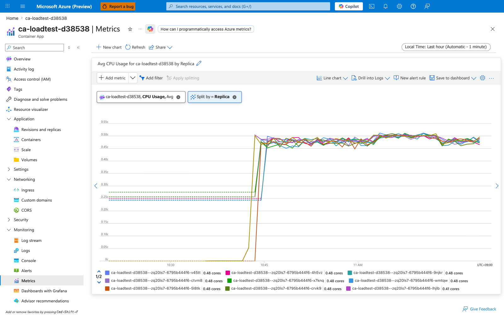

### `WorkingSetBytes` — Memory Working Set Bytes

Resident set size of the container process — the amount of physical memory the kernel is currently keeping in RAM for this replica. This is the numerator behind `MemoryPercentage`. It includes anonymous pages (heap, stack), file-backed pages that are mapped and active, but excludes swapped-out pages and unreferenced file cache.

| Property | Value |
|---|---|
| Unit | Bytes |
| Recommended aggregation | `Average` to track baseline drift, `Maximum` to catch the peak before an OOM |
| Useful split | `podName` to find a leaking replica (the Portal chip shows "Replica" but the `--filter` key is `podName`) |
| Goes up when | The application allocates and retains memory — request buffers, caches, leaks |
| Stays flat when | The runtime has reached steady-state allocation and is reusing freed memory rather than growing the heap |
| Sample observed | **[Observed]** `~790,000,000 bytes` per replica (≈753 MiB) under sustained load against a 1 GiB limit on the test app `ca-loadtest-d38538` |

A monotonically rising `WorkingSetBytes` curve over hours is the classical signature of a memory leak. See [Memory leak OOMKilled playbook](../../troubleshooting/playbooks/scaling-and-runtime/memory-leak-oomkilled.md).

#### Captures

Baseline view of `WorkingSetBytes` on `ca-loadtest-d38538` — no split, `Avg` aggregation. The per-bucket average stabilizes around `~790 MB` (≈753 MiB) of resident set against the configured 1 GiB memory limit.

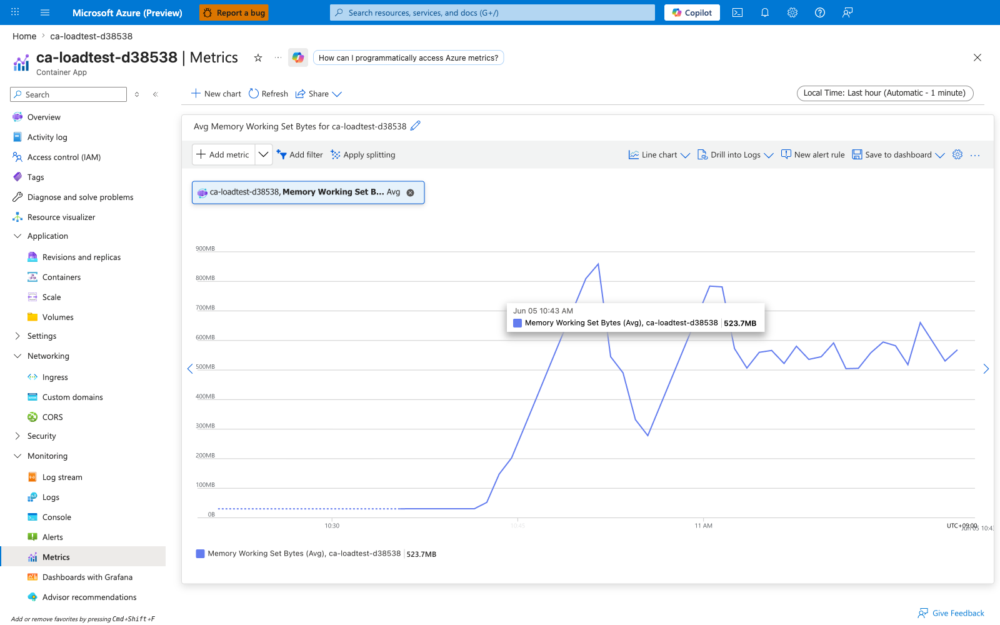

??? note "Split by `podName` (per-replica view)"
    Same metric split by `podName`. Multiple replica lines should track each other closely on a steady-state workload — divergence (one line climbing faster than the others) is the earliest visible signal of a per-replica memory leak. The Portal "Replica" chip filters by what the metrics API exposes as `podName`.

    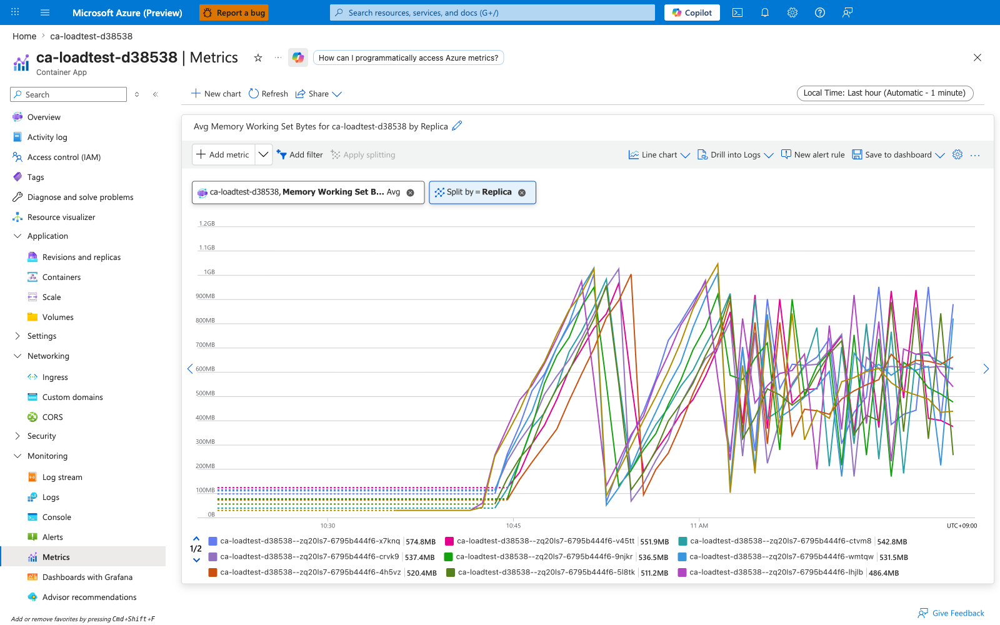

### `RxBytes` — Network In Bytes

Cumulative bytes received by the replica's network namespace during the aggregation interval, summed across all interfaces. This is total inbound network volume, not just HTTP request bodies — it includes TCP/TLS overhead, health-probe traffic, and intra-environment service-to-service calls.

| Property | Value |
|---|---|
| Unit | Bytes |
| Recommended aggregation | `Total` per interval to see throughput |
| Useful split | `podName` to compare replicas (the Portal chip shows "Replica" but the `--filter` key is `podName`) |
| Goes up when | Clients send requests, peer apps send service-to-service calls, or large request bodies hit the replica |
| Stays flat when | Traffic is routed elsewhere (uneven load balancing — see [Replica load imbalance playbook](../../troubleshooting/playbooks/scaling-and-runtime/replica-load-imbalance.md)), or the ingress proxy is buffering and not forwarding |
| Sample observed | **[Observed]** `~700,000 bytes` per minute per replica under ~145 RPS aggregate load on `ca-loadtest-d38538` |

#### Captures

Baseline view of `RxBytes` on `ca-loadtest-d38538` — no split, `Total` aggregation over 5-minute buckets. The per-bucket total shows the aggregate inbound network volume across all replicas under sustained load.

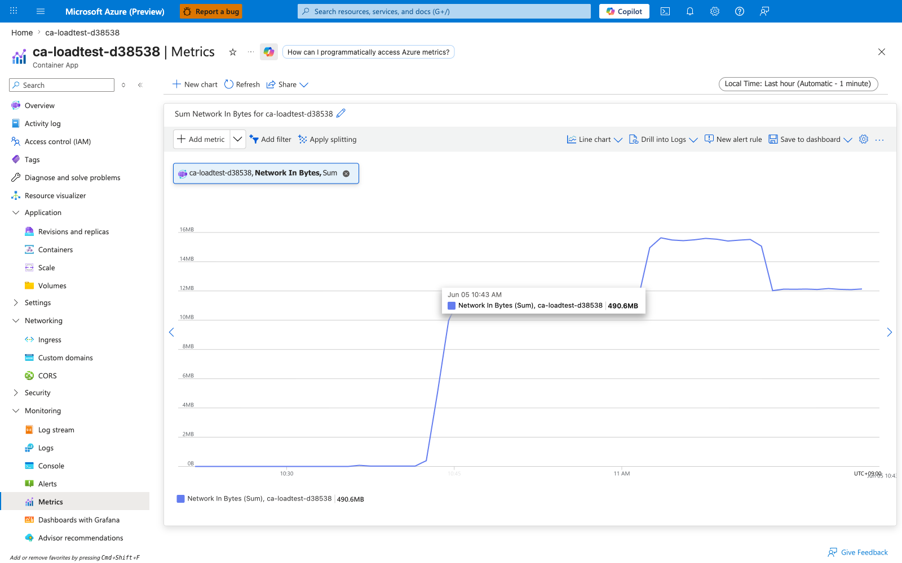

??? note "Split by `podName` (per-replica view)"
    Same metric split by `podName`. Lines should be roughly proportional to each replica's share of inbound traffic. A persistently low line on one replica while others receive most traffic is the signature of a **replica load imbalance** — see [Replica load imbalance playbook](../../troubleshooting/playbooks/scaling-and-runtime/replica-load-imbalance.md).

    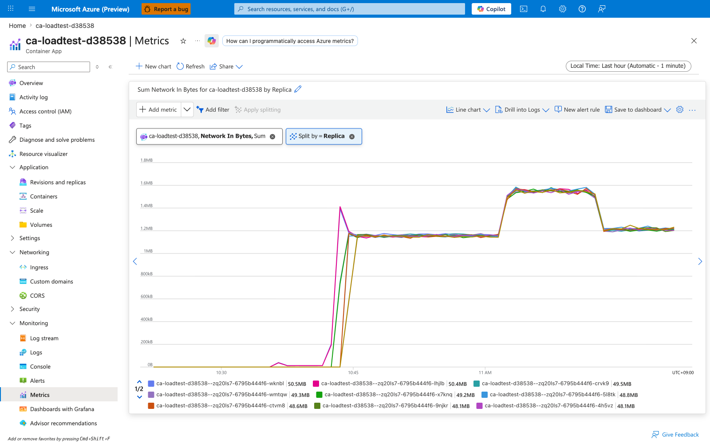

### `TxBytes` — Network Out Bytes

Cumulative bytes transmitted by the replica's network namespace during the aggregation interval. Includes response bodies, TLS handshake bytes, downstream API calls the replica initiates, and Container Apps platform telemetry the data plane emits.

| Property | Value |
|---|---|
| Unit | Bytes |
| Recommended aggregation | `Total` |
| Useful split | `podName` (the Portal chip shows "Replica" but the `--filter` key is `podName`) |
| Goes up when | The replica sends large response payloads, calls many downstream services, or streams data |
| Stays flat when | All requests are short and responses small, or downstream calls have stopped |
| Sample observed | **[Observed]** `~22,000,000 bytes` per minute per replica when the load profile included a `/payload?kb=512` endpoint returning 512 KiB responses on `ca-loadtest-d38538` |

Because the response side typically dwarfs the request side for web traffic, `TxBytes` is usually 10-100× `RxBytes` on a healthy API.

#### Captures

Baseline view of `TxBytes` on `ca-loadtest-d38538` — no split, `Total` aggregation. The per-bucket total reflects aggregate outbound bytes (response payloads + downstream calls + telemetry) across all replicas.

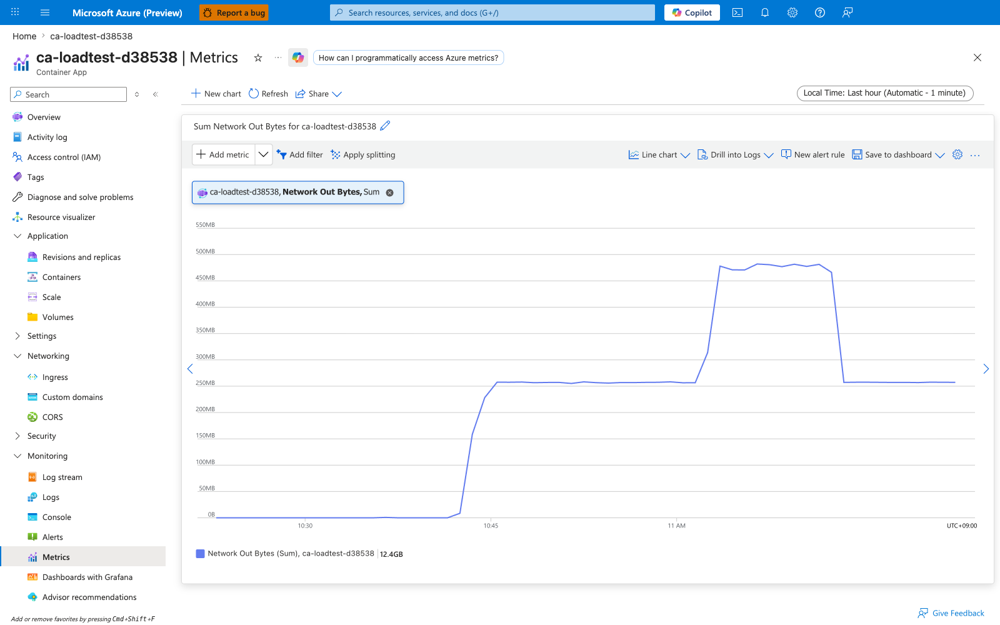

??? note "Split by `podName` (per-replica view)"
    Same metric split by `podName`. Compare line magnitudes against `RxBytes` for the same replica — a healthy API replica's `TxBytes:RxBytes` ratio is typically 10-100× because response bodies dwarf request bodies. A flat-line replica is either idle (no requests) or hung (requests in but no responses out).

    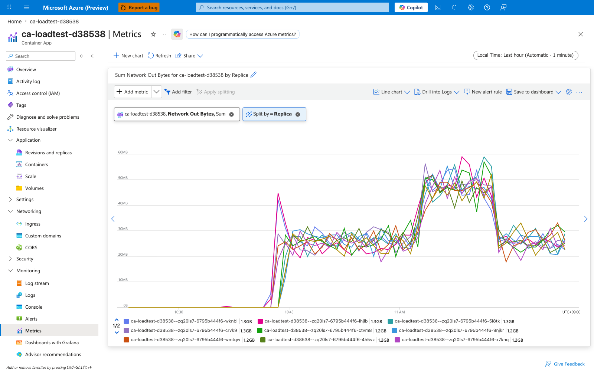

### `Replicas` — Replica count

How many replicas were running for a revision at each sample point. This is the most direct evidence of scaler behavior: every scale-out adds a step, every scale-in removes one.

| Property | Value |
|---|---|
| Unit | Count |
| Recommended aggregation | `Maximum` to see the peak, `Average` for hourly billing-shape view, `Minimum` to verify `--min-replicas` is honored |
| Useful split | `revisionName` to separate parallel revisions during a traffic split |
| Goes up when | The scale rule fires (HTTP concurrency, queue depth, CPU/memory utilization) or `min-replicas` is raised |
| Stays flat at the floor | Scale rules are not firing and `min-replicas` is the floor |
| Stays flat at the ceiling | `max-replicas` has been hit — verify in revision YAML |
| Sample observed | **[Observed]** Scaled from the `--min-replicas 2` floor to the `--max-replicas 10` ceiling on `ca-loadtest-d38538` once HTTP concurrency exceeded the scale rule threshold of 20 |

If `Requests` is climbing but `Replicas` is not, see [HTTP scaling not triggering playbook](../../troubleshooting/playbooks/scaling-and-runtime/http-scaling-not-triggering.md). If you need to know *which* scaler caused a replica change, see [KEDA scaler observability](keda-observability.md).

#### Captures

Baseline view of `Replicas` on `ca-loadtest-d38538` — no split, `Maximum` aggregation. The chart shows the staircase pattern of scale-out from the `min-replicas=2` floor toward the `max-replicas=10` ceiling as the HTTP scaler crosses its `concurrentRequests=20` threshold under load, then a slower scale-in once load subsides.

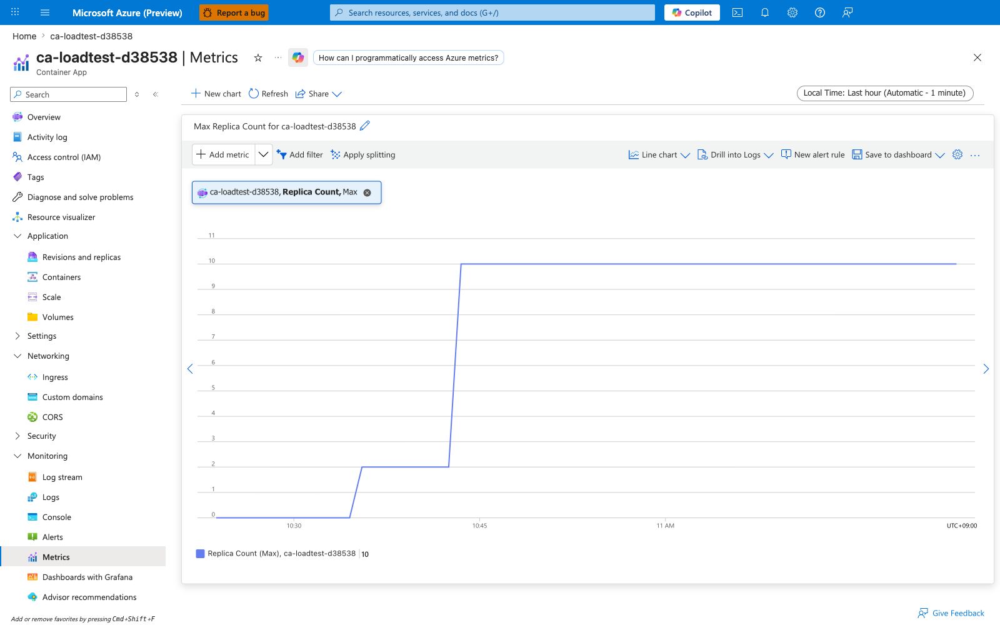

??? note "Split by `revisionName`"
    Same metric split by `revisionName`. During a blue/green deployment or traffic split, each active revision appears as its own line — useful for confirming that an older revision has actually scaled down to zero after traffic is shifted away. For single-revision apps the split shows a single line, identical to the baseline view.

    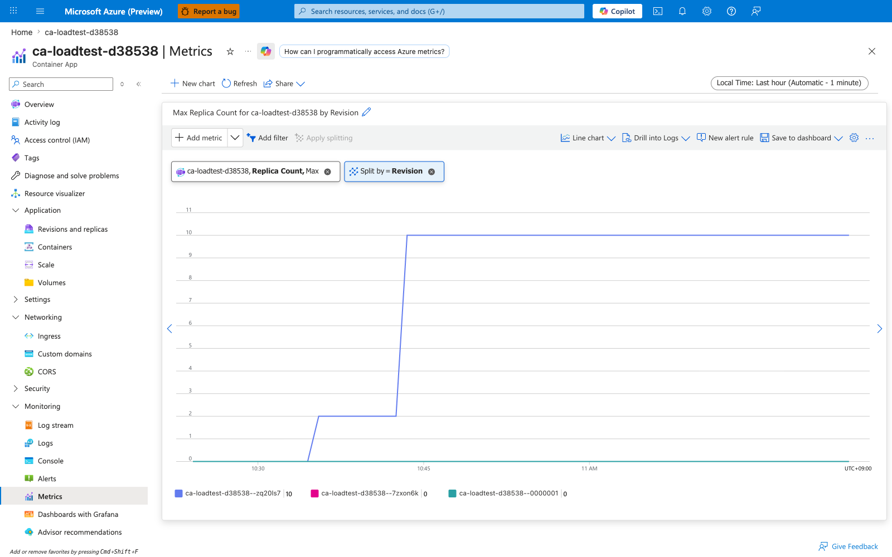

### `RestartCount` — Total Replica Restart Count

Number of times a replica's main container has been restarted by the Container Apps data plane. Restarts happen when the container exits non-zero, the liveness probe fails, the kernel OOM-kills the process, or the data plane recycles the replica during a controlled event.

| Property | Value |
|---|---|
| Unit | Count |
| Recommended aggregation | `Maximum` to see the cumulative restart count, `Total` per interval to see restart rate |
| Useful split | `podName` to find the unstable replica (the Portal chip shows "Replica" but the `--filter` key is `podName`) |
| Goes up when | The container crashes (exit non-zero), is OOM-killed, fails its liveness probe repeatedly, or panics during startup |
| Stays at zero when | The container is healthy and the platform has not recycled it |
| Sample observed | **[Observed]** The crashloop test app `ca-crashloop-d38538` — deployed with a deliberate memory-growth loop (allocates 16 MiB every 200 ms) — reached `RestartCount=104` over the test window as the kernel OOM-killed each replica when it hit the `--memory 0.5Gi` limit and the platform restarted it |

Any non-zero value warrants investigation. See [Crashloop OOM and resource pressure playbook](../../troubleshooting/playbooks/scaling-and-runtime/crashloop-oom-and-resource-pressure.md) and [Probe failure and slow start playbook](../../troubleshooting/playbooks/startup-and-provisioning/probe-failure-and-slow-start.md).

#### Captures

Baseline view of `RestartCount` on `ca-crashloop-d38538` — no split, `Maximum` aggregation. The test app's memory-growth loop pushes each replica past its `--memory 0.5Gi` cgroup limit, the kernel OOM-killer terminates the container, and the platform restarts it; the running maximum across the test window climbs to `Max=104`.

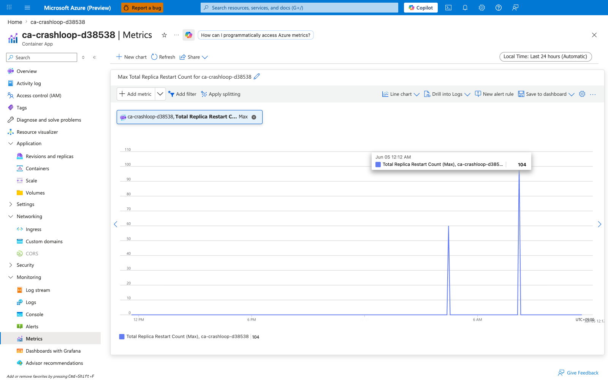

??? note "Split by `podName` (per-replica view)"
    Same metric split by `podName`. The split reveals which specific replica(s) are crash-looping — in a multi-replica deployment a single bad replica can dominate the restart count while the others run cleanly. The Portal "Replica" chip filters by what the metrics API exposes as `podName`.

    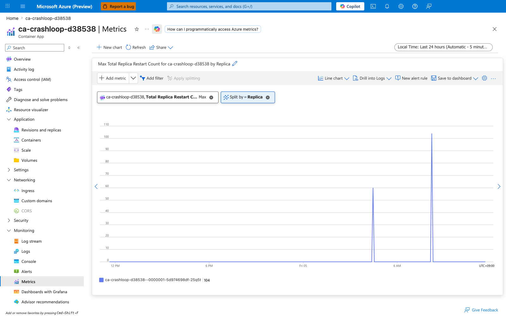

??? note "Split by `revisionName`"
    Same metric split by `revisionName`. Useful during a bad-revision rollout: a sudden climb in restarts concentrated on the newest revision is a strong signal to roll back. Older stable revisions should stay flat at zero.

    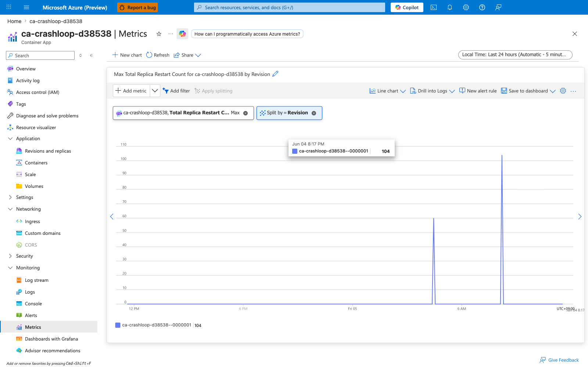

### `Requests` — Requests

HTTP request count observed at the ingress layer (Envoy) for the revision. Each request is counted exactly once even if the resiliency policy retries it internally — the retries are counted under `ResiliencyRequestRetries`, not duplicated here.

| Property | Value |
|---|---|
| Unit | Count |
| Recommended aggregation | `Total` per interval for throughput |
| Useful splits | `statusCodeCategory` (`2xx`/`3xx`/`4xx`/`5xx`), `statusCode` (granular), `revisionName`, `podName` (the Portal chip shows "Replica" but the `--filter` key is `podName`) |
| Goes up when | Clients send traffic — external HTTPS, intra-environment service calls, health probes from outside the replica |
| Stays at zero when | The app has no ingress configured, or all traffic is being routed to a different revision via traffic split, or DNS/networking is broken upstream of ingress |
| Sample observed | **[Observed]** Sustained `7,000-8,000` requests per minute (~130 RPS) across the test revision while 5 parallel `hey` load streams were running against `ca-loadtest-d38538` |

Splitting by `statusCodeCategory` is the single most useful operational view for catching error spikes:

```bash
az monitor metrics list \
    --resource "$RES_ID" \
    --metric Requests \
    --aggregation Total \
    --interval PT5M \
    --filter "statusCodeCategory eq '*'" \
    --output table
```

| Command flag | What it does |
|---|---|
| `--metric Requests` | Selects the HTTP request counter from the the metrics table above table |
| `--aggregation Total` | Sums requests inside each 5-minute interval rather than averaging |
| `--filter "statusCodeCategory eq '*'"` | Splits the series into `2xx`, `3xx`, `4xx`, `5xx` lines so the success/error mix is visible in a single table |
| `--interval PT5M` | Matches the Portal Metrics blade default bucket size for direct cross-checking |

#### Captures

Baseline view of `Requests` on `ca-loadtest-d38538` — no split, `Total` aggregation. The chart shows the aggregate request rate (sum across all replicas, all status codes) sustained around ~7,000-8,000 requests per minute during the load test.

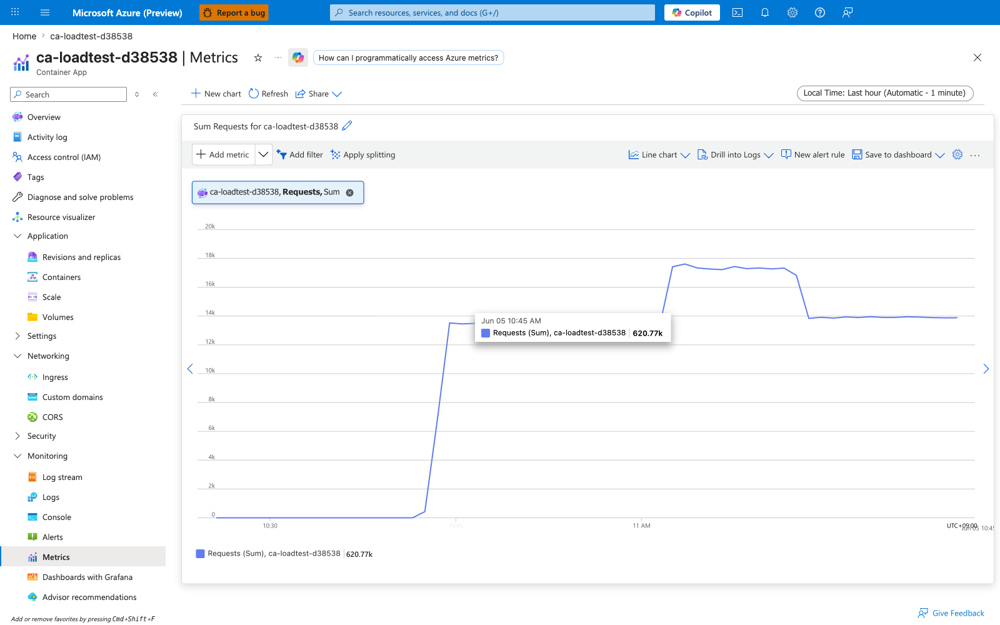

??? note "Split by `podName` (per-replica view)"
    Same metric split by `podName`. Lines should be roughly equal when load balancing is working; significant divergence is **replica load imbalance** — see the same playbook referenced under `RxBytes`. Useful during scale-out events because newly added replicas should start receiving roughly even shares of traffic within seconds.

    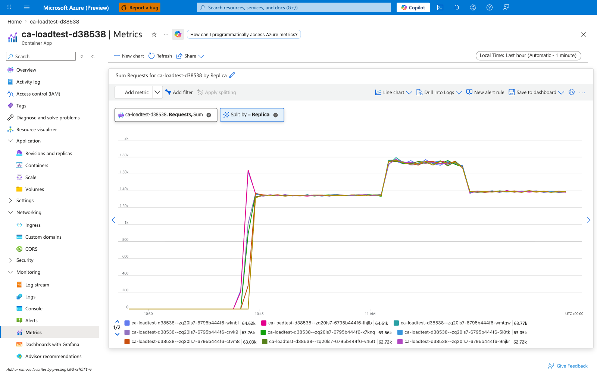

??? note "Split by `statusCodeCategory` (2xx/3xx/4xx/5xx)"
    Same metric split by `statusCodeCategory`. This is the **single most useful operational split** — it lets you see the success/error mix in one view. A sudden climb in the `5xx` line is the primary signal for an availability incident; a climb in `4xx` typically means client-side breakage (auth, malformed requests) rather than an outage. Set up alerts on the `5xx` series, not the total `Requests` count.

    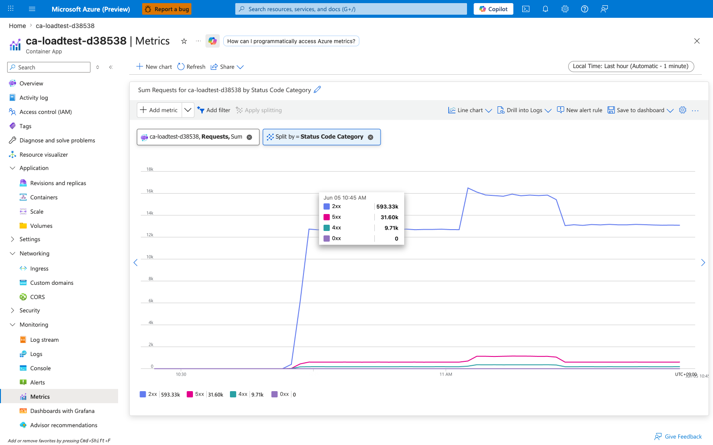

??? note "Split by `statusCode` (granular per code)"
    Same metric split by `statusCode`. Useful when `statusCodeCategory` alone is too coarse — for example, distinguishing `503 Service Unavailable` (target down) from `504 Gateway Timeout` (target slow) within the `5xx` bucket. The Portal legend will show one line per observed code.

    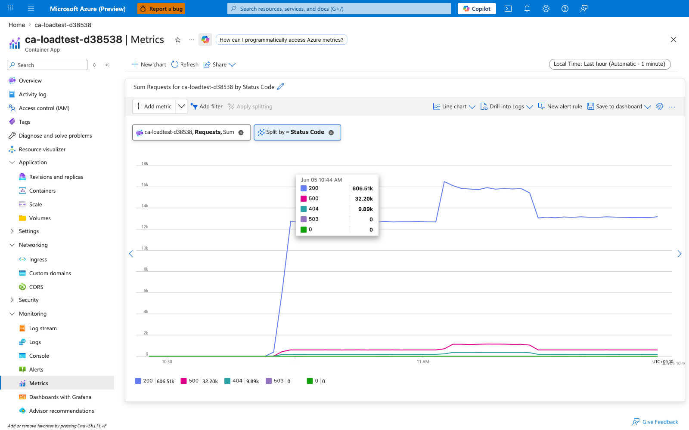

### `CoresQuotaUsed` — Reserved Cores (per revision)

Aggregate vCPU reservation for a single revision, calculated as `replicas × cpu-per-replica`. This is a *reservation*, not a *consumption* — it reflects how many cores the data plane has earmarked for the revision to satisfy its current replica count and per-replica CPU request, regardless of whether the replicas are actually doing work.

| Property | Value |
|---|---|
| Unit | Count (vCPU) |
| Recommended aggregation | `Maximum` for capacity planning |
| Useful split | `revisionName` |
| Goes up when | The revision scales out, or a new revision is provisioned with a higher CPU request |
| Stays flat when | Replica count is stable and CPU request is unchanged |
| Sample observed | **[Observed]** `CoresQuotaUsed=2.5` for `ca-loadtest-d38538` while it ran 5 replicas × 0.5 vCPU each |

#### Captures

Baseline view of `CoresQuotaUsed` on `ca-loadtest-d38538` — no split, `Maximum` aggregation. The chart steps up as the HTTP scaler adds replicas: each 0.5 vCPU replica added bumps the reservation up by 0.5, producing a visible staircase from `1.0` at the 2-replica floor (`--min-replicas 2 × --cpu 0.5`) to `5.0` at the 10-replica peak.

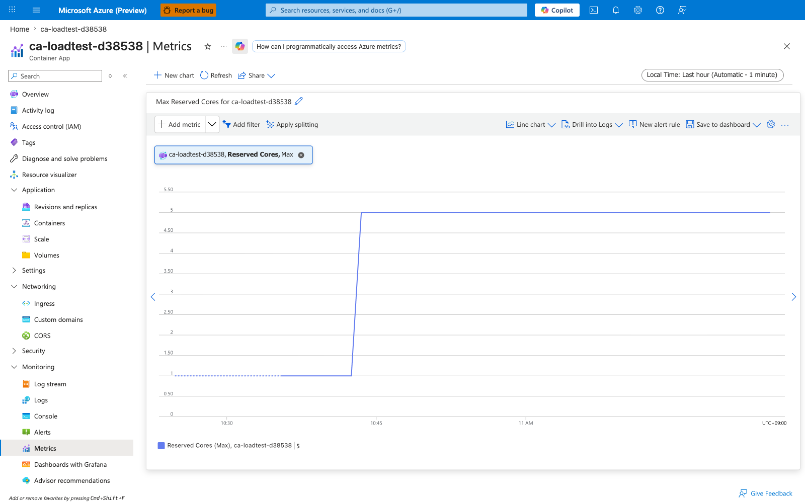

??? note "Split by `revisionName`"
    Same metric split by `revisionName`. During a traffic split or revision rollout, each revision's reservation appears as its own line — useful for confirming a new revision has provisioned at least one replica before traffic is shifted to it, and that the old revision has fully scaled in afterwards.

    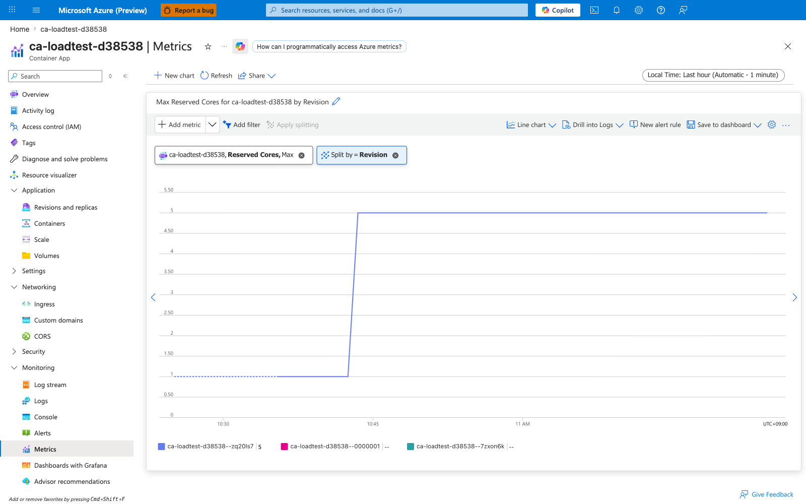

### `TotalCoresQuotaUsed` — Total Reserved Cores (per container app)

Total cores currently reserved for **this container app**, summed across all of its active revisions and replicas. Microsoft Learn defines this metric on the `Microsoft.App/containerapps` namespace as *"Total cores reserved for the container app"* — it is per-resource, not per-subscription, despite the word "Total" in the display name.

| Property | Value |
|---|---|
| Unit | Count (vCPU) |
| Recommended aggregation | `Maximum` |
| Useful split | None — this is already an aggregate for the resource |
| Goes up when | This container app scales out, or one of its revisions is updated to a higher CPU request |
| Stays flat when | The app's replica count and per-replica CPU request are both unchanged |
| Sample observed | **[Observed]** `Maximum=2.5` for `ca-loadtest-d38538` while it held 5 replicas at `cpu=0.5` each |

!!! info "This metric is not the subscription-level quota counter"
    Container Apps does not publish a subscription-wide "cores used" platform metric. To see environment-level core consumption against the per-environment quota (default 100 cores in most regions), use `az containerapp env list-usages --resource-group $RG --name $CONTAINER_ENV` — it returns the `ManagedEnvironmentConsumptionCores` and `ManagedEnvironmentGeneralPurposeCores` counters that Azure's enforcement actually compares against. See [Subscription quota exceeded playbook](../../troubleshooting/playbooks/cost-and-quota/subscription-quota-exceeded.md) for raising those quotas.

#### Captures

`TotalCoresQuotaUsed` is present in the Portal Metrics blade dropdown for any individual container app and renders as a single flat or step line — visually identical to `CoresQuotaUsed` on a single-revision app. A separate Portal screenshot adds little beyond the `CoresQuotaUsed` capture above. For programmatic use, the canonical query is:

```bash
az monitor metrics list \
    --resource "/subscriptions/$SUBSCRIPTION_ID/resourceGroups/$RG/providers/Microsoft.App/containerApps/$APP_NAME" \
    --metric TotalCoresQuotaUsed \
    --aggregation Maximum \
    --interval PT5M \
    --output table
```

| Command | Why it is used |
|---|---|
| `az monitor metrics list --metric TotalCoresQuotaUsed` | Queries the per-app total reserved cores for capacity planning. |

For per-environment consumption against quota (the number Azure's enforcement actually checks), use `az containerapp env list-usages` instead — that surface is not a platform metric.

### Resiliency metrics — overview

The six `Resiliency*` metrics are emitted by the per-app Envoy sidecar **only when a resiliency policy is attached to the receiving app and the traffic originates inside the same Container Apps Environment** (via service discovery, not the public FQDN). They are silent for external traffic because the public ingress is a separate Envoy that does not apply the per-app resiliency policy.

To populate these metrics you need:

1. A target app with an internal-only ingress (`--ingress internal`).
2. A resiliency policy attached to the target via `az containerapp resiliency create` or equivalent ARM.
3. A caller app in the *same environment* calling the target by its simple hostname on port 80 (e.g., `http://target-app/`).

See [Service-to-service connectivity failure playbook](../../troubleshooting/playbooks/ingress-and-networking/service-to-service-connectivity-failure.md) for the troubleshooting flow when these metrics stay at zero despite a policy being attached.

### `ResiliencyConnectTimeouts` — Resiliency Connection Timeouts

Number of upstream TCP connections that exceeded the resiliency policy's `timeoutPolicy.connectionTimeoutInSeconds` while trying to establish. This counts connect-phase timeouts only — request-phase hangs are counted by `ResiliencyRequestTimeouts`.

| Property | Value |
|---|---|
| Unit | Count |
| Recommended aggregation | `Total` |
| Goes up when | The upstream replica is unreachable at the TCP layer — destination port has no listening process and the SYN is silently dropped (no RST sent back), or a firewall is dropping SYN packets at the network (L3) layer before they reach the destination |
| Stays at zero when | The TCP handshake completes — either the upstream is reachable, *or* the destination has a listening socket that accepts the SYN but never reads from the connection (a slow upstream that has *accepted* the TCP connection is not a connect timeout, even if the HTTP request itself hangs) |
| Sample observed | **[Observed]** `0` across all aggregation buckets in the test environment. **[Inferred]** The test target `ca-res-blackhole` runs `socket.listen()` without `accept()`, so the kernel's SYN backlog (the queue of half-open connections the kernel itself answers before user-space `accept()` picks them up) completes the TCP handshake on its own and Envoy's connection attempt succeeds; the subsequent HTTP request hang surfaces under `ResiliencyRequestsPendingConnectionPool` and `ResiliencyRequestTimeouts` instead of as a connect-phase timeout. **[Not Proven]** Reliably reproducing a non-zero value would likely require dropping SYN packets at L3 (a firewall DROP rule on the destination port) which a Container Apps replica cannot do without the `NET_ADMIN` Linux capability; this was not attempted in this pass. |

A non-zero value in production typically means the upstream replica died and the data plane has not yet removed it from the endpoint slice — see [Service-to-service connectivity failure playbook](../../troubleshooting/playbooks/ingress-and-networking/service-to-service-connectivity-failure.md). Treat any sustained non-zero reading as a request to investigate upstream health, not as a normal background level.

#### Captures

Baseline view of `ResiliencyConnectTimeouts` on `ca-res-503` — no split, `Total` aggregation. The chart is **flat at zero** throughout the test window because the test target accepts TCP handshakes (see explanation under Sample observed). A non-zero value here would mean SYN packets are being silently dropped at L3 before reaching the destination.

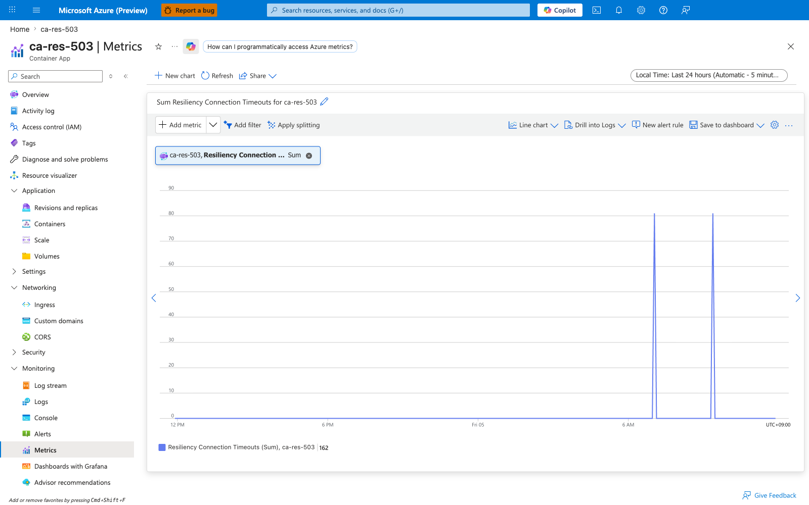

This metric has a `revisionName` split dimension, but with the value pinned at zero across all revisions the split would render an identical empty chart — omitted here.

### `ResiliencyEjectedHosts` — Resiliency Ejected Hosts

Current number of upstream replicas that the resiliency policy's outlier detection has temporarily ejected from the load-balancing pool. Ejection happens after consecutive errors from a replica exceed the policy's threshold (`circuitBreakerPolicy.consecutiveErrors`).

| Property | Value |
|---|---|
| Unit | Count |
| Recommended aggregation | `Maximum` — this is a **gauge** (a "currently true" snapshot), not a counter. `Total` is *not* meaningful on this metric: summing per-interval gauge readings produces a number that has no physical interpretation (24 buckets each reading "1 host ejected" sums to 24, which does not mean 24 hosts were ejected). Always use `Maximum` or `Average`. |
| Goes up when | A replica returns more consecutive errors than the policy allows; the policy ejects it for the `intervalInSeconds` window |
| Returns to zero when | The ejection window expires and the policy re-admits the host, or the unhealthy replica is replaced |
| Sample observed | **[Observed]** `Maximum=1` across 24 consecutive 5-minute buckets against the 2-replica `ca-res-503` target — outlier detection ejected and re-admitted the unhealthy host throughout the test window, but capped at 1 ejection at any moment because `maxEjectionPercent: 50` of 2 replicas = 1. **[Inferred]** Querying `Total` aggregation on this gauge would produce `24` (sum of 24 buckets × 1), which is misleading and does not mean "24 distinct hosts were ejected". |

This metric is the early-warning system for replica health. A persistently non-zero value means traffic is being concentrated on fewer healthy replicas than configured, raising load on the survivors.

#### Captures

Baseline view of `ResiliencyEjectedHosts` on `ca-res-503` — no split, `Maximum` aggregation. The chart sits at `Max=1` across the entire test window: outlier detection keeps ejecting and re-admitting the unhealthy replica, but `maxEjectionPercent: 50` of 2 replicas caps the simultaneous-ejection count at 1.

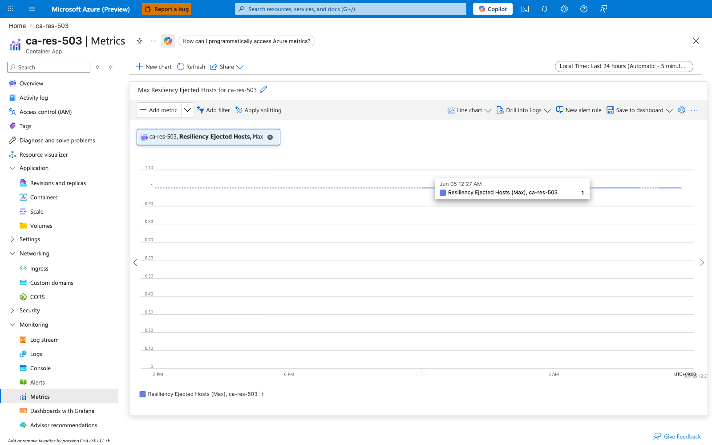

??? note "Split by `revisionName`"
    Same metric split by `revisionName`. For single-revision targets the split shows one line, but during a revision rollout this view distinguishes ejections happening against an older (still unhealthy) revision from those against the newer revision — useful for confirming that a fix deployed in the new revision actually reduces ejection activity.

    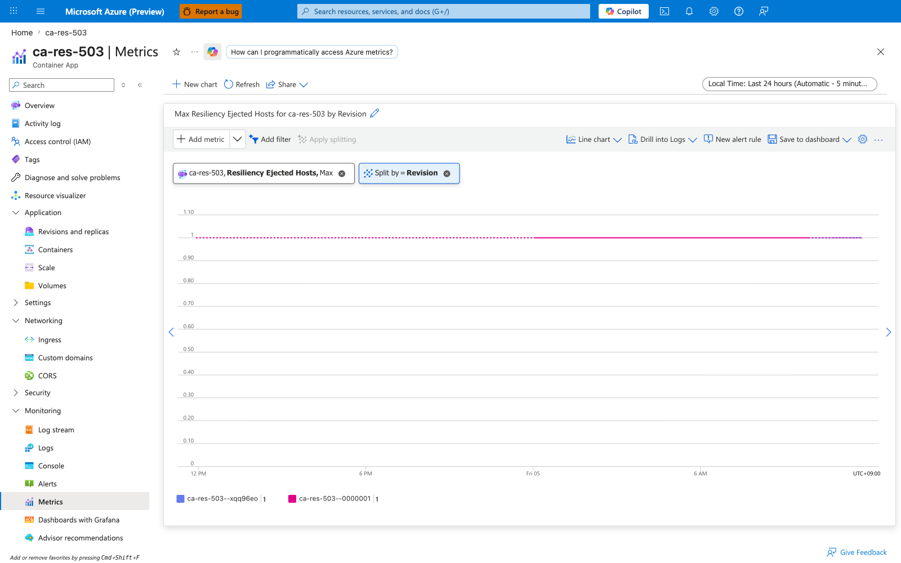

### `ResiliencyEjectionsAborted` — Resiliency Ejections Aborted

Number of times the outlier detector wanted to eject a replica but was blocked because doing so would exceed `circuitBreakerPolicy.maxEjectionPercent`. By design, the policy refuses to eject all replicas because that would leave the caller with nowhere to send traffic — a state colloquially called a **brown-out** (the upstream is mostly unhealthy but the caller cannot stop sending to it without losing all capacity).

| Property | Value |
|---|---|
| Unit | Count |
| Recommended aggregation | `Total` per interval |
| Goes up when | Multiple upstream replicas are unhealthy and the policy is hitting its safety cap (commonly `maxEjectionPercent: 50` for 2-replica targets means at most 1 can be ejected; the second attempt aborts) |
| Stays at zero when | At most one replica is unhealthy at a time, or `maxEjectionPercent` is set high enough that the cap is never reached |
| Sample observed | **[Observed]** `Total=7,329` against `ca-res-503` where both replicas were serving 503; the policy `policy-503` capped ejections at `maxEjectionPercent: 50` and aborted every additional attempt |

A high `ResiliencyEjectionsAborted` value alongside non-zero `ResiliencyEjectedHosts` is the smoking gun for the brown-out state: your upstream is mostly unhealthy and traffic is being concentrated on a small surviving subset. This is a signal to scale the upstream or shed traffic.

#### Captures

Baseline view of `ResiliencyEjectionsAborted` on `ca-res-503` — no split, `Total` aggregation. The counter climbs steadily as both replicas of `ca-res-503` serve constant 503: outlier detection tries to eject the second replica, hits the `maxEjectionPercent: 50` safety cap (max 1 of 2 replicas ejectable), and increments `EjectionsAborted` on every blocked attempt. Cumulative total reached **7,329** across the test window.

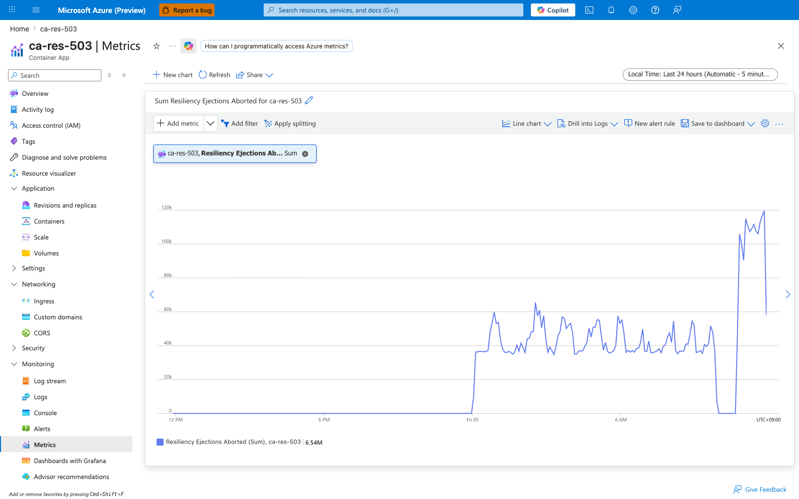

??? note "Split by `revisionName`"
    Same metric split by `revisionName`. The split reveals which revision the caller is actually hitting when ejections are being aborted — useful during a revision rollout to confirm whether the brown-out is being driven by the old unhealthy revision or whether the new revision has inherited the same failure mode.

    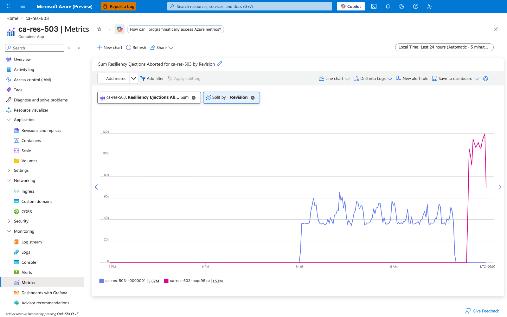

??? note "Negative example — flat at zero on `ca-res-blackhole`"
    For comparison, here is the same metric against `ca-res-blackhole` (TCP listen-without-accept target — no circuit-breaker policy configured). The chart is **flat at zero** throughout the same test window because no resiliency policy is attached, so Envoy never attempts an ejection that could be aborted. This is the negative control: a zero reading by itself does *not* mean the upstream is healthy, it can also mean the metric has no policy to populate it.

    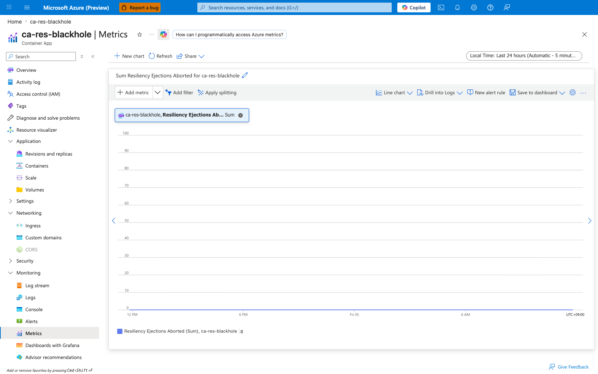

### `ResiliencyRequestRetries` — Resiliency Request Retries

Number of additional request attempts the resiliency policy has issued on top of the original request. A retry policy with `httpRetryPolicy.maxRetries: 2` can produce up to 2 additional attempts per failing original request, so a single observed external 5xx may appear as up to 3 attempts in this counter (1 original + 2 retries).

| Property | Value |
|---|---|
| Unit | Count |
| Recommended aggregation | `Total` per interval |
| Goes up when | The retry policy's `httpRetryPolicy.matches` condition matches — typically `errors: ['5xx']`, `gateway-error`, `reset`, `connect-failure`, or specific status codes via `httpStatusCodes` |
| Stays at zero when | All requests succeed on the first attempt, or no retry policy is configured |
| Sample observed | **[Observed]** `Total=9,636` retries across the 2-hour test window against `ca-res-503` (which returns constant 503), with `httpRetryPolicy.maxRetries: 2` and `httpRetryPolicy.matches.errors: ['5xx']` |

A sudden climb in `ResiliencyRequestRetries` is often the first signal that an upstream is degrading — the caller's success rate may still look fine because retries are hiding the failure, but capacity is being consumed disproportionately. Alert on rate of retries, not absolute count.

#### Captures

Baseline view of `ResiliencyRequestRetries` on `ca-res-503` — no split, `Total` aggregation. The counter climbs steadily because every original request to `ca-res-503` returns 503, which matches `httpRetryPolicy.matches.errors: ['5xx']`; each failing original triggers up to `httpRetryPolicy.maxRetries: 2` additional attempts. Cumulative total reached **9,636** retries across the 2-hour test window.


??? note "Split by `revisionName`"
    Same metric split by `revisionName`. During a rollout, this split lets you confirm whether the retry storm is concentrated on the old (unhealthy) revision or the new one — a clean fix should produce a falling line on the new revision and a rising line on the old one as traffic shifts away.

    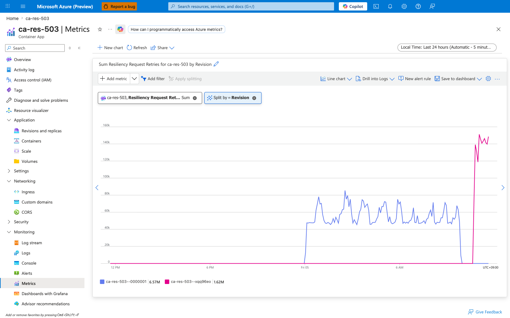

### `ResiliencyRequestTimeouts` — Resiliency Request Timeouts

Number of requests that exceeded the policy's `timeoutPolicy.responseTimeoutInSeconds` (per-request response budget) while waiting for the upstream to respond. This is the *request-phase* timeout (server slow to respond), distinct from `ResiliencyConnectTimeouts` (couldn't even open the TCP connection).

| Property | Value |
|---|---|
| Unit | Count |
| Recommended aggregation | `Total` per interval |
| Goes up when | The upstream takes longer to respond than the per-request timeout — overloaded replica, slow database call, blocked thread pool |
| Stays at zero when | All upstream responses fit within the policy's per-request budget |
| Sample observed | **[Observed]** `Total=1,100` against `ca-res-slow` configured with `timeoutPolicy.responseTimeoutInSeconds: 1` while the caller exercised `/slow?ms=4000` (intentional 4-second delay) |

#### Captures

Baseline view of `ResiliencyRequestTimeouts` on `ca-res-slow` — no split, `Total` aggregation. Every caller request to `/slow?ms=4000` blows past the policy's 1-second response budget, producing a steady climb. Cumulative total reached **1,100** timeouts across the test window.

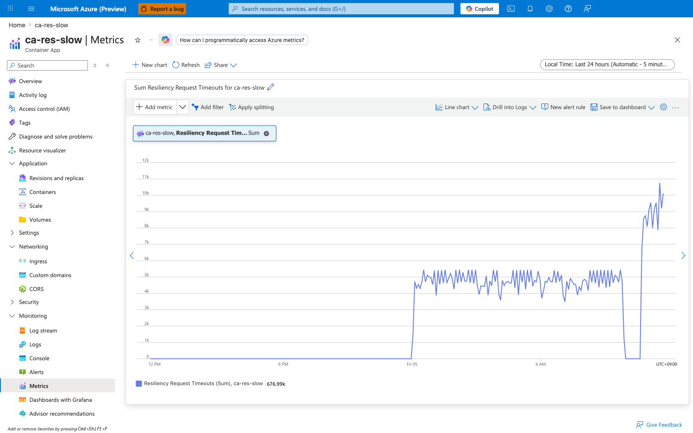

??? note "Split by `revisionName`"
    Same metric split by `revisionName`. Use this view to confirm that a fix (raising the timeout, speeding up the upstream, or rolling back to a faster revision) has actually moved the metric on the right revision. Single-revision targets render as one line; multi-revision targets show one line per revision so you can attribute timeout volume.

    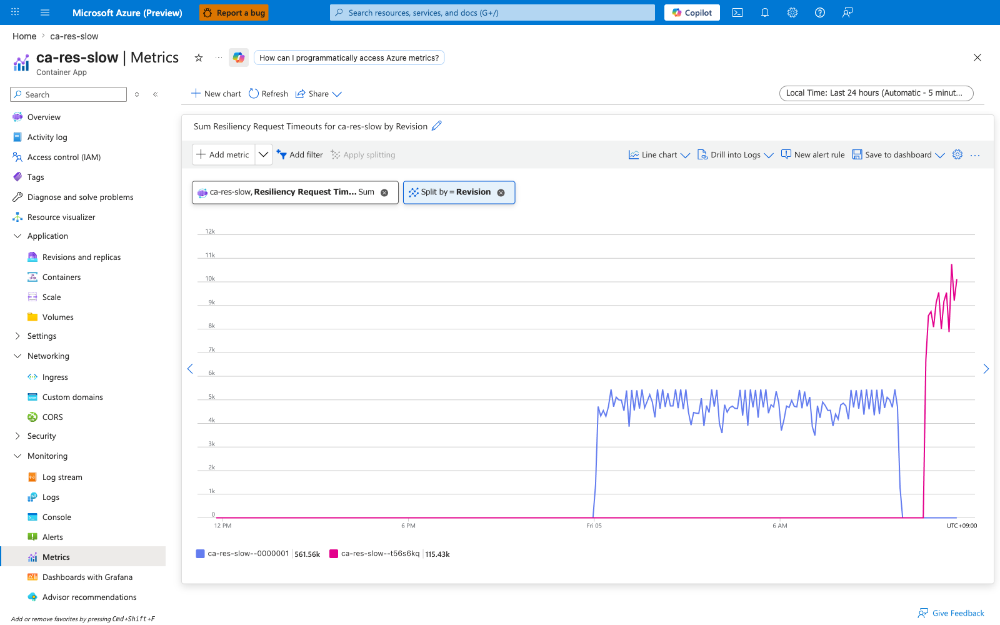

### `ResiliencyRequestsPendingConnectionPool` — Resiliency Requests Pending Connection Pool

Number of requests queued in the per-target connection pool waiting for either an existing connection to become free or a new connection to be opened (up to `tcpConnectionPool.maxConnections`). Once `httpConnectionPool.http1MaxPendingRequests` is hit, additional requests fail fast with a circuit-breaker rejection rather than queuing further.

| Property | Value |
|---|---|
| Unit | Count |
| Recommended aggregation | `Maximum` (this is a queue depth gauge) |
| Useful split | `revisionName` (this metric does not split by replica/pod — to find a caller replica that is hot, drill into the caller app's logs or use Application Insights) |
| Goes up when | The caller is sending more concurrent requests than the connection pool can drain — often because the upstream is slow or because the pool is tight relative to load |
| Stays at zero when | Pool capacity comfortably exceeds in-flight request count |
| Sample observed | **[Observed]** `Maximum=10,488` against `ca-res-pool` with a tight `httpConnectionPoolPolicy.http1MaxPendingRequests: 1` setting and ~145 RPS sustained calls from `ca-res-caller` |

A persistently non-zero value is a sign your circuit-breaker policy is being exercised. That is by design — the policy is protecting your caller from a slow upstream — but it also means user-visible latency is climbing. Pair this metric with a downstream latency SLI.

#### Captures

Baseline view of `ResiliencyRequestsPendingConnectionPool` on `ca-res-pool` — no split, `Maximum` aggregation. With `http1MaxPendingRequests: 1` and a flood of concurrent calls from `ca-res-caller`, the queue depth gauge stays near its cap throughout the test; per-bucket maximum reached **10,488** pending requests at peak.

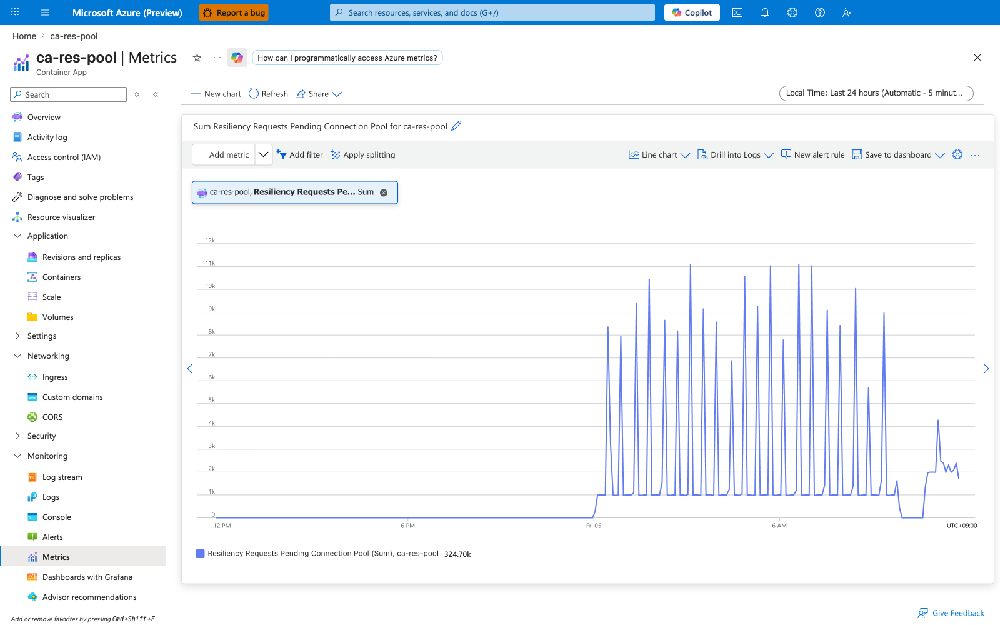

??? note "Split by `revisionName`"
    Same metric split by `revisionName`. The split helps when a connection-pool problem might be revision-specific (for example, a new revision raised the timeout or pool size). Note this metric does not split by `podName` — to find which *caller* replica is hot, drill into the caller app's logs or use Application Insights dependency tracking instead.

    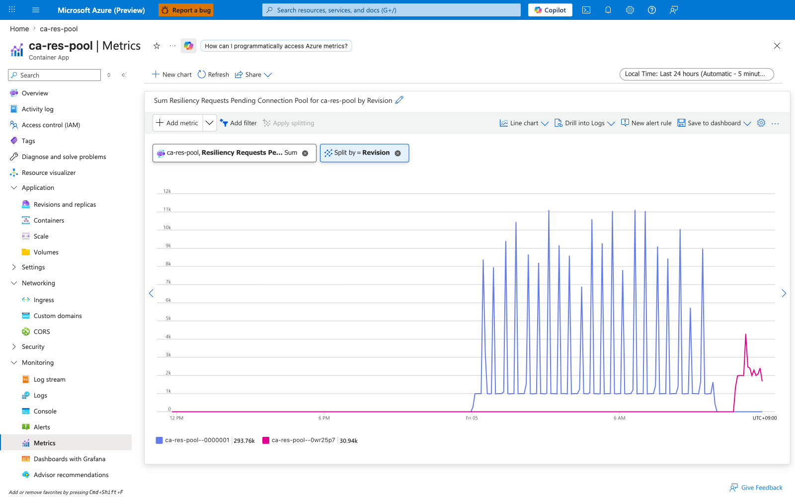

### `ResponseTime` — Average Response Time (Preview)

End-to-end latency observed at the ingress proxy, measured from "request received" to "last response byte sent". Includes time the request spent in the connection pool queue, time the upstream replica spent generating the response, and time spent serializing the response back to the client.

| Property | Value |
|---|---|
| Unit | Milliseconds |
| Recommended aggregation | `Average` for the dashboard headline, but use a percentile view in Application Insights for SLO alerting (Azure Monitor metrics do not expose percentiles for this metric) |
| Useful splits | `statusCodeCategory`, `statusCode` |
| Goes up when | Upstream replicas are slow, the connection pool is queuing requests, response payloads grow large, or thread pools are saturated |
| Sample observed | **[Observed]** `~2,000 ms` average when the load mix included a `/slow?ms=1500` endpoint at 25% of traffic; `~50 ms` average for healthy 2xx-only traffic on `ca-loadtest-d38538` |

Be aware that this is a Preview metric — Microsoft Learn flags it as not yet GA. Average is a lossy summary; a long tail of slow responses can be hidden by many fast ones. Cross-check with Application Insights `requests | summarize percentile(duration, 99) by bin(timestamp, 5m)` for percentile views.

#### Captures

Baseline view of `ResponseTime` on `ca-loadtest-d38538` — no split, `Average` aggregation. The chart shows the mixed-workload average response time during the load test, with sustained averages climbing into the seconds when the `/slow?ms=1500` endpoint contributes to the mix.

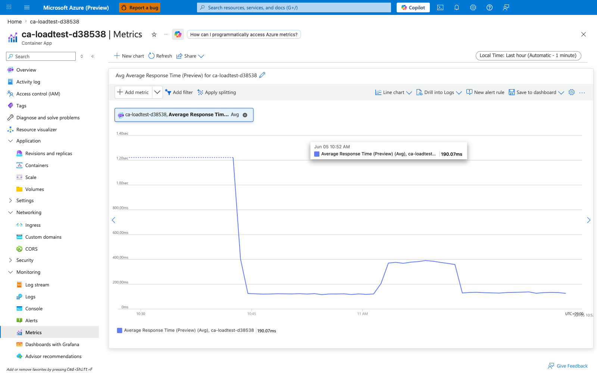

??? note "Split by `statusCodeCategory`"
    Same metric split by `statusCodeCategory`. The split reveals a frequently-misleading pattern: **`5xx` responses are often *faster* than `2xx` responses** because errors short-circuit before doing real work. If your `Average` `ResponseTime` *drops* during an incident, check the status-code split — the drop may be an artifact of error responses pulling the average down rather than performance actually improving. Alert on the `2xx`-only series for a meaningful latency SLI.

    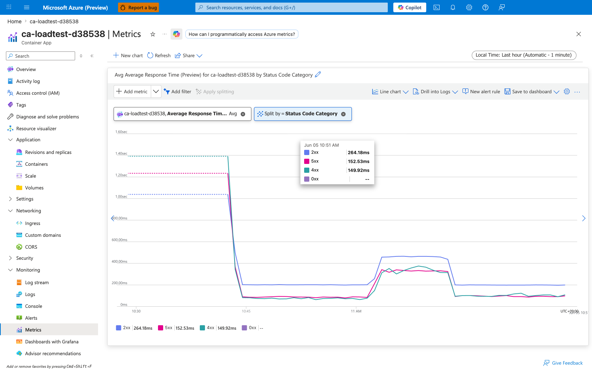

### `CpuPercentage` — CPU Usage Percentage (Preview)

`UsageNanoCores ÷ (configured CPU limit in nanocores) × 100`. The denominator is the per-replica CPU limit you set with `--cpu`, not the node's total CPU.

| Property | Value |
|---|---|
| Unit | Percent (0-100, can briefly exceed 100 due to sampling) |
| Recommended aggregation | `Average` for trend, `Maximum` for spike detection |
| Useful split | `podName` (the Portal chip shows "Replica" but the `--filter` key is `podName`) |
| Goes up when | The replica is doing CPU-bound work — request handling, GC, computation |
| Stays at 100% (suspiciously flat) when | The replica is being CPU-throttled by the kernel (CFS quota). Latency will climb but CPU never crosses 100% by design |
| Sample observed | **[Observed]** `Maximum=100.7%` (the slight overshoot is a sampling artifact) for replicas of `ca-loadtest-d38538` serving the `/cpu?ms=400` endpoint with `--cpu 0.5` |

See [CPU throttling playbook](../../troubleshooting/playbooks/scaling-and-runtime/cpu-throttling.md) for diagnosing the throttling case. Preview — do not rely on this as the sole SLO source.

#### Captures

Baseline view of `CpuPercentage` on `ca-loadtest-d38538` — no split, `Average` aggregation. Replicas serving the `/cpu?ms=400` endpoint saturate their 0.5 vCPU allotment; the aggregated per-bucket average peaks at **100.7%** (the slight overshoot above 100% is a sampling artifact, not actual over-budget execution — CFS quota caps the actual scheduler at exactly 100%).

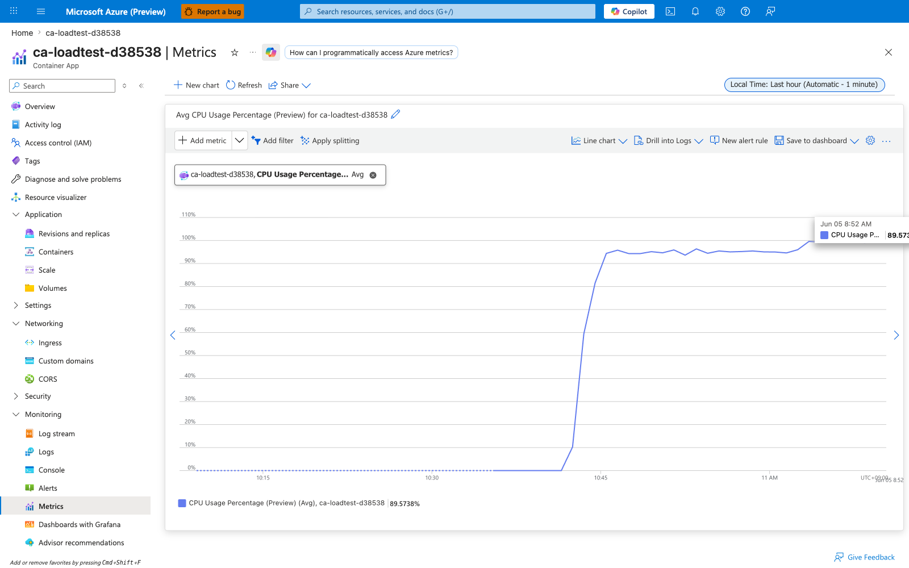

??? note "Split by `podName` (per-replica view)"
    Same metric split by `podName`. Each replica should saturate similarly during a CPU-bound load test; a single replica stuck near 100% while others sit idle is the signature of **replica load imbalance** at the CPU layer. The Portal "Replica" chip filters by what the metrics API exposes as `podName`. A flat plateau at exactly 100% across all replicas — with response latency climbing in parallel — indicates the kernel is CFS-throttling the workload, see the CPU throttling playbook above.

    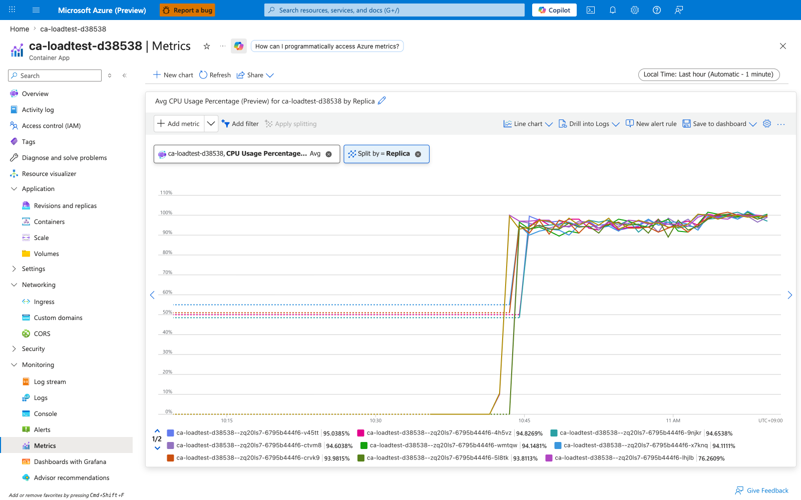

### `MemoryPercentage` — Memory Percentage (Preview)

`WorkingSetBytes ÷ (configured memory limit in bytes) × 100`. The denominator is the per-replica memory limit you set with `--memory`, not the node's total memory.

| Property | Value |
|---|---|
| Unit | Percent |
| Recommended aggregation | `Average` for baseline, `Maximum` for OOM proximity |
| Useful split | `podName` (the Portal chip shows "Replica" but the `--filter` key is `podName`) |
| Goes up when | The application allocates and retains memory |
| Hits 100% then drops to a small value | The kernel OOM-killed the process, the replica restarted, and `WorkingSetBytes` started over from baseline. Confirm with `RestartCount` |
| Sample observed | **[Observed]** `Maximum=72.5%` for replicas of `ca-loadtest-d38538` under load with `--memory 1Gi` (≈742 MiB working set against 1 GiB limit) |

This is the metric to alert on for memory headroom. As a **starting point**, page when `Average > 80%` for `15m`, escalate when `Maximum > 95%` for any window — then tune against your own baseline working set. See [Memory leak OOMKilled playbook](../../troubleshooting/playbooks/scaling-and-runtime/memory-leak-oomkilled.md).

!!! warning "Not the same as KEDA `memory` scaler utilization"
    The KEDA `memory` scaler reports its own `utilization` against the value passed to `--scale-rule-metadata value=...`. `MemoryPercentage` is independent — they share a numerator but have different denominators. See [Memory percentage vs. KEDA utilization](../../troubleshooting/playbooks/scaling-and-runtime/memory-percentage-vs-keda-utilization.md).

#### Captures

Baseline view of `MemoryPercentage` on `ca-loadtest-d38538` — no split, `Average` aggregation. Replicas under sustained load hold ~742 MiB working set against the 1 GiB memory limit, producing a per-bucket maximum of **72.5%**. The chart trends flat at this plateau because the test workload reaches steady-state allocation rather than leaking.

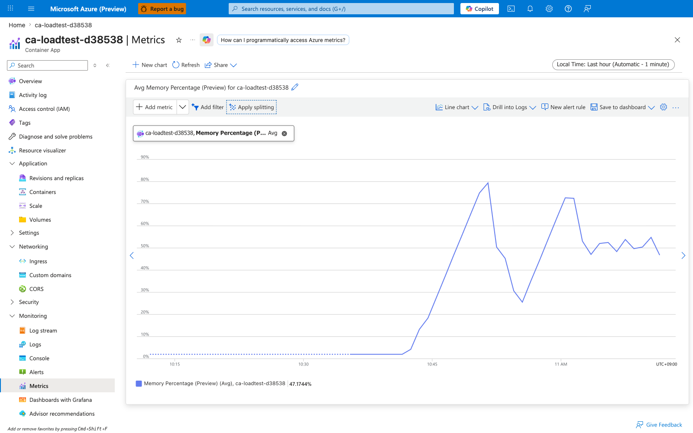

??? note "Split by `podName` (per-replica view)"
    Same metric split by `podName`. On a steady-state workload, lines should track each other within a few percentage points; a single replica's line climbing while others stay flat is the earliest visible signal of a **per-replica memory leak**. A line that hits ~100% and abruptly drops to a small value is OOM-kill — cross-check with `RestartCount` on the same replica to confirm. The Portal "Replica" chip filters by what the metrics API exposes as `podName`.

    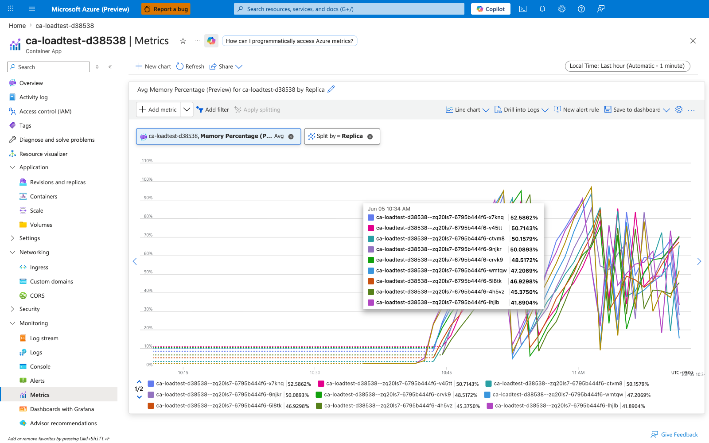

### `GpuUtilizationPercentage` — GPU Utilization Percentage (Preview)

Per-replica GPU utilization for container apps running on workload profiles that expose a GPU (currently the `Consumption-GPU-NC8as-T4`, `Consumption-GPU-NC24-A100`, `NC8as-T4`, `NC24-A100`, and similar GPU-equipped profiles). The metric is published only when the app is scheduled on a GPU-capable workload profile and the replica's CUDA driver surface has reported utilization to the data plane.

| Property | Value |
|---|---|
| Unit | Percent (0-100) |
| Recommended aggregation | `Average` for trend, `Maximum` for spike detection |
| Useful splits | `podName`, `revisionName` |
| Goes up when | The replica issues CUDA kernel launches — model inference, training steps, GPU-accelerated preprocessing |
| Stays at zero when | The container is running but performing only CPU work, or no CUDA-aware process is active in the container |
| Stays at 100% (suspiciously flat) | The GPU is fully saturated; throughput will become input-bound (batch size, input pipeline) rather than compute-bound. Add replicas or move to a higher-tier GPU profile |
| Sample observed | **[Not exercised]** This environment does not contain a GPU-equipped workload profile, so the metric was not driven against live data in this pass. The metric is documented from `az monitor metrics list-definitions` output, which confirms its presence in the `Microsoft.App/containerapps` namespace with `Replica, Revision` as the published dimensions. |

This metric is the primary saturation signal for AI inference workloads on Container Apps. Pair with `Requests` (request rate) and `ResponseTime` (latency) to distinguish "GPU is the bottleneck" from "CPU-bound preprocessing is the bottleneck" — if `Requests` rises but `GpuUtilizationPercentage` stays flat, the inference loop is not the constraint.

#### Captures

No live Portal capture is included in this pass because the test environment (`cae-wp-d38538`) was provisioned with general-purpose `D4` profiles only, not GPU profiles, so the metric reports no values. The Portal Metrics blade dropdown will still surface this metric for any container app scope, but the chart renders empty when no GPU-scheduled replica is publishing readings.

## See Also

- [Metrics Overview](index.md)
- [Container App Metrics](container-app-metrics.md)
- [Environment Metrics](managed-environment-metrics.md)
- [Percentage Metrics](percentage-metrics.md)
- [Dimensions](dimensions.md)
- [KEDA Observability](keda-observability.md)
- [Evidence and Captures](evidence-and-captures.md)

## Sources

- [Supported metrics for Microsoft.App/containerapps (Microsoft Learn)](https://learn.microsoft.com/en-us/azure/container-apps/metrics)
- [Supported metrics for Microsoft.App/managedEnvironments (Microsoft Learn)](https://learn.microsoft.com/en-us/azure/container-apps/metrics)
- [Azure Monitor metrics overview (Microsoft Learn)](https://learn.microsoft.com/en-us/azure/azure-monitor/essentials/data-platform-metrics)
