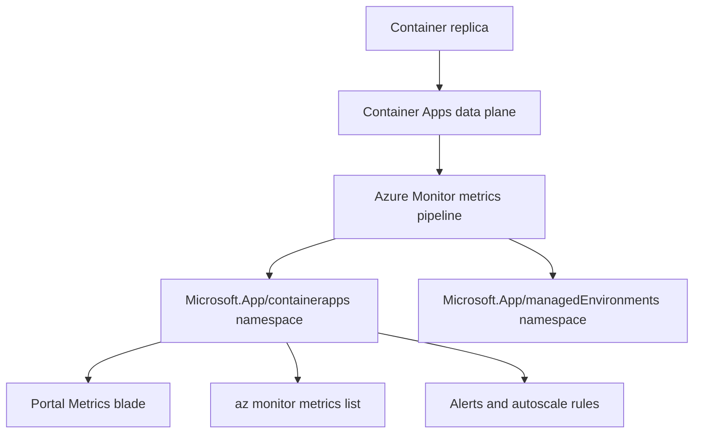

---
content_sources:
  diagrams:
    - id: metric-collection-flow
      type: flowchart
      source: mslearn-adapted
      based_on:
        - https://learn.microsoft.com/en-us/azure/container-apps/metrics
        - https://learn.microsoft.com/en-us/azure/azure-monitor/essentials/data-platform-metrics
content_validation:
  status: verified
  last_reviewed: '2026-06-05'
  reviewer: agent
  core_claims:
    - claim: Azure Container Apps publishes platform metrics under the Microsoft.App/containerapps namespace, including CPU, memory, network, replica, request, and resiliency metrics.
      source: https://learn.microsoft.com/en-us/azure/container-apps/metrics
      verified: true
    - claim: CPU Usage Percentage and Memory Percentage metrics report consumption as a percentage of the container's configured CPU and memory limits.
      source: https://learn.microsoft.com/en-us/azure/container-apps/metrics
      verified: true
    - claim: Container Apps metrics support Replica and Revision dimensions for splitting and filtering.
      source: https://learn.microsoft.com/en-us/azure/container-apps/metrics
      verified: true
    - claim: Resiliency metrics are emitted by the per-app Envoy sidecar only when a resiliency policy is attached to the receiving app and traffic originates inside the same Container Apps Environment via service discovery.
      source: https://learn.microsoft.com/en-us/azure/container-apps/service-discovery-resiliency
      verified: true
    - claim: NodeCount is published under Microsoft.App/managedEnvironments for environments that use managed workload profiles, and is split by the Workload Profile Name dimension.
      source: https://learn.microsoft.com/en-us/azure/container-apps/workload-profiles-overview
      verified: true
---
# Azure Container Apps Metrics Reference

Quick lookup for the platform metrics that Azure Container Apps publishes to Azure Monitor. Use this page when you build alerts, dashboards, autoscaling rules, or KQL queries against your Container Apps.

!!! info "Two metric namespaces"
    Container App resources publish metrics under `Microsoft.App/containerapps`. The Container Apps Environment publishes a separate small set under `Microsoft.App/managedEnvironments`. Pick the namespace that matches the resource scope you opened in Portal or the resource ID you pass to `az monitor metrics list`.

!!! tip "Percentage metrics are denominator-relative"
    `CpuPercentage` and `MemoryPercentage` are computed against the **container's configured CPU and memory limits**, not against the node or environment. A replica scoped to `cpu=0.5, memory=1Gi` reports 100% when it consumes 0.5 vCPU or 1 GiB respectively. See [Percentage metric denominators](percentage-metrics.md) for details.

## Prerequisites

- A deployed Container App with a Log Analytics workspace attached to the environment.
- Access to the Container App's resource scope in the Azure Portal, or `az monitor metrics list` permissions on the resource.
- Familiarity with revisions and replicas; see [Revisions and replicas](../../platform/revisions/index.md).

## Metric collection flow

<!-- diagram-id: metric-collection-flow -->

## Quick navigation

| Topic | Use when | Page |
|---|---|---|
| Container App metrics | app-level CPU, memory, requests, replicas, restarts | [Container App Metrics](container-app-metrics.md) |
| Environment metrics | environment-level node, ingress, quota | [Environment Metrics](managed-environment-metrics.md) |
| Percentage metrics | CpuPercentage/MemoryPercentage denominator | [Percentage Metrics](percentage-metrics.md) |
| Dimensions | Portal display name vs API filter key | [Dimensions](dimensions.md) |
| KEDA observability | scale-out troubleshooting | [KEDA Observability](keda-observability.md) |
| Evidence and captures | screenshots, lab environment, CLI queries | [Evidence](evidence-and-captures.md) |

## When to use which metric

| Question | Metric(s) | Aggregation |
|---|---|---|
| Is a replica close to its CPU limit? | `CpuPercentage` | Avg, Max |
| Is a replica close to its memory limit? | `MemoryPercentage` | Avg, Max |
| What is the absolute CPU consumption? | `UsageNanoCores` | Avg |
| What is the absolute memory working set? | `WorkingSetBytes` | Avg |
| How many replicas are running for a revision? | `Replicas` | Avg, Min, Max |
| Are replicas restarting? | `RestartCount` | Max, Total |
| What is the request rate and HTTP error split? | `Requests` | Total, with `statusCodeCategory` split |
| Are retries or ejections happening? | `ResiliencyRequestRetries`, `ResiliencyEjectedHosts`, `ResiliencyEjectionsAborted` | Total, Max |
| Am I approaching the per-app cores reservation? | `TotalCoresQuotaUsed` | Max |
| Am I approaching the environment-level cores quota? | Use `az containerapp env list-usages` (not a metric) | n/a |

## See Also

- [CLI Reference](../cli-reference.md)
- [Platform Limits](../platform-limits.md)
- [Environment Variables](../environment-variables.md)
- [Operations — Monitoring](../../operations/monitoring/index.md)
- [Platform — CPU and memory scaler](../../platform/scaling/cpu-memory-scaler.md)
- [KEDA scaler observability](keda-observability.md)
- [Troubleshooting — KEDA scaler metrics KQL pack](../../troubleshooting/kql/scaling-and-replicas/keda-scaler-metrics.md)
- [Troubleshooting — Scaling events KQL pack](../../troubleshooting/kql/scaling-and-replicas/scaling-events.md)
- [Troubleshooting — Memory percentage vs. KEDA utilization](../../troubleshooting/playbooks/scaling-and-runtime/memory-percentage-vs-keda-utilization.md)
- [Troubleshooting — HTTP scaling not triggering](../../troubleshooting/playbooks/scaling-and-runtime/http-scaling-not-triggering.md)

## Sources

- [Supported metrics for Microsoft.App/containerapps (Microsoft Learn)](https://learn.microsoft.com/en-us/azure/container-apps/metrics)
- [Supported metrics for Microsoft.App/managedEnvironments (Microsoft Learn)](https://learn.microsoft.com/en-us/azure/container-apps/metrics)
- [Azure Monitor metrics overview (Microsoft Learn)](https://learn.microsoft.com/en-us/azure/azure-monitor/essentials/data-platform-metrics)
- [Service-to-service connectivity and resiliency in Azure Container Apps (Microsoft Learn)](https://learn.microsoft.com/en-us/azure/container-apps/service-discovery-resiliency)
- [Workload profiles in Consumption + Dedicated plan structure (Microsoft Learn)](https://learn.microsoft.com/en-us/azure/container-apps/workload-profiles-overview)
- [`az monitor metrics list` reference (Microsoft Learn)](https://learn.microsoft.com/en-us/cli/azure/monitor/metrics)
