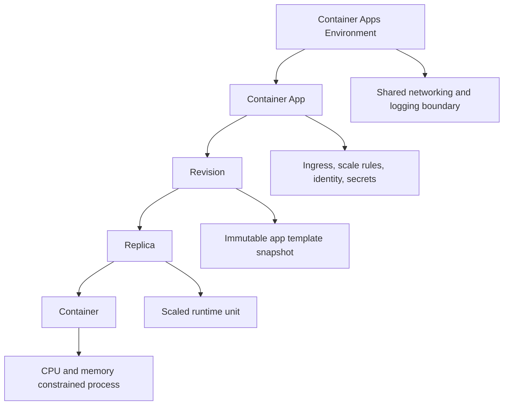

---
hide:
  - toc
content_sources:
  diagrams:
    - id: limits-hierarchy-and-blast-radius
      type: flowchart
      source: mslearn-adapted
      based_on:
        - https://learn.microsoft.com/azure/container-apps/quotas
content_validation:
  status: verified
  last_reviewed: "2026-04-12"
  reviewer: ai-agent
  core_claims:
    - claim: "Azure Container Apps has quotas and limits at the subscription, environment, and app levels."
      source: "https://learn.microsoft.com/azure/container-apps/quotas"
      verified: true
    - claim: "Some Container Apps limits are fixed platform constraints while others are adjustable quotas."
      source: "https://learn.microsoft.com/azure/container-apps/quotas"
      verified: true
---

# Azure Container Apps Platform Limits and Quotas

Use this quick reference for common design-time and runtime limits in Azure Container Apps. Values can vary by region/SKU and may change; always confirm against official documentation.

!!! warning "Differentiate hard platform limits from adjustable quotas"
    Some boundaries are fixed implementation constraints, while others are subscription or region quotas that can be increased. Treat each limit category differently during capacity planning.

!!! tip "Plan increase requests before scale events"
    If your growth forecast approaches environment or regional quotas, submit increase requests early and validate rollout plans with current quota values.

## Limits hierarchy and blast radius

<!-- diagram-id: limits-hierarchy-and-blast-radius -->


## Prerequisites

- Familiarity with Container Apps environments, revisions, and jobs
- Access to your subscription quotas and region details

## Container resource limits

| Limit | Value | Notes |
|---|---|---|
| CPU per replica | Workload profile dependent | Consumption and dedicated profiles have different allowed CPU sizes |
| Memory per replica | Workload profile dependent | Must match supported CPU/memory combinations |
| Containers per app template | Platform-defined maximum | Includes main container and sidecars |
| Ephemeral filesystem | Limited, non-persistent | Use Azure Files or external storage for persistence |

Observed deployment baseline (verified, PII scrubbed):

| Item | Observed Value |
|---|---|
| App CPU | `0.5` |
| App memory | `1Gi` |
| Min replicas | `1` |
| Max replicas | `3` |
| Ingress target port | `8000` |

## Scale limits

| Limit | Value | Notes |
|---|---|---|
| Minimum replicas | `0` (consumption) or higher | Scale-to-zero supported for eligible workloads |
| Maximum replicas | Configurable per app | Bound by environment capacity and workload profile |
| Revision mode | `Single` or `Multiple` | Multiple required for traffic splitting/canary |
| Concurrent HTTP requests | Configurable via scale rules | Affects autoscale behavior and throughput |

## Networking limits

| Limit | Value | Notes |
|---|---|---|
| Ingress target port | One primary app port | Must match your container listener (`CONTAINER_APP_PORT`) |
| External/internal ingress | Per app setting | Internal apps are not internet reachable |
| Environment subnet size | Must satisfy environment requirements | Dedicated infrastructure consumes subnet IPs |
| Private endpoint support | Available for supported dependencies | Validate service/SKU prerequisites |

## Storage limits

| Limit | Value | Notes |
|---|---|---|
| Persistent volume type | Azure Files | Blob filesystem mount is not supported |
| Volume scope | Environment registration, app mount | Storage is registered on environment then attached to apps |
| Secret storage | App configuration secrets | Prefer Key Vault references and rotation workflows |

## Environment limits

| Limit | Value | Notes |
|---|---|---|
| Apps per environment | Subscription/region quota dependent | Track growth during multi-team adoption |
| Revisions retained | Configurable with retention policy | Keep enough history for rollback without excessive sprawl |
| Log/metrics retention | Workspace policy dependent | Controlled in Log Analytics/Application Insights |

Environment snapshot from `az containerapp env show`:

```json
{
  "name": "cae-myapp",
  "location": "Korea Central",
  "provisioningState": "Succeeded",
  "defaultDomain": "<hash>.<region>.azurecontainerapps.io",
  "staticIp": "20.249.x.x",
  "zoneRedundant": false
}
```

## Job limits

| Limit | Value | Notes |
|---|---|---|
| Trigger types | Manual, Schedule, Event | Choose based on workload initiation pattern |
| Parallelism | Configurable per job | Increase cautiously with downstream rate limits |
| Replica timeout | Configurable | Ensure timeout fits batch duration profile |

Job snapshot from `az containerapp job show`:

```json
{
  "name": "job-myapp",
  "provisioningState": "Succeeded",
  "triggerType": "Manual",
  "replicaTimeout": 1800,
  "replicaRetryLimit": 2,
  "identity": {
    "type": "UserAssigned"
  }
}
```

## Request limits

| Limit | Value | Notes |
|---|---|---|
| HTTP request timeout | Platform and app server dependent | Align ingress timeout with Gunicorn/app timeout |
| Request body size | Ingress/runtime dependent | Use object storage for large uploads |
| Header size | Standard proxy/runtime constraints | Keep token/header payloads bounded |

## Design guidance

1. Validate supported CPU/memory combinations before load testing.
2. Reserve subnet capacity for growth in revisions and replicas.
3. Use canary traffic plus rollback plans when operating near limits.

## Advanced Topics

- Capture quota checks in pre-deployment validation scripts.
- Set alerts for scale saturation and throttling symptoms.
- Reconcile platform limits with SLOs and peak demand models.

!!! info "Use limits as a design input, not only an operations check"
    Include limit validation in architecture review, load test planning, and release gates so teams discover constraint issues before production incidents.

## See Also

- [CLI Reference](cli-reference.md)
- [Troubleshooting First 10 Minutes](../troubleshooting/first-10-minutes/index.md)

## Sources

- [Microsoft Learn: Azure Container Apps limits and quotas](https://learn.microsoft.com/azure/container-apps/quotas)
