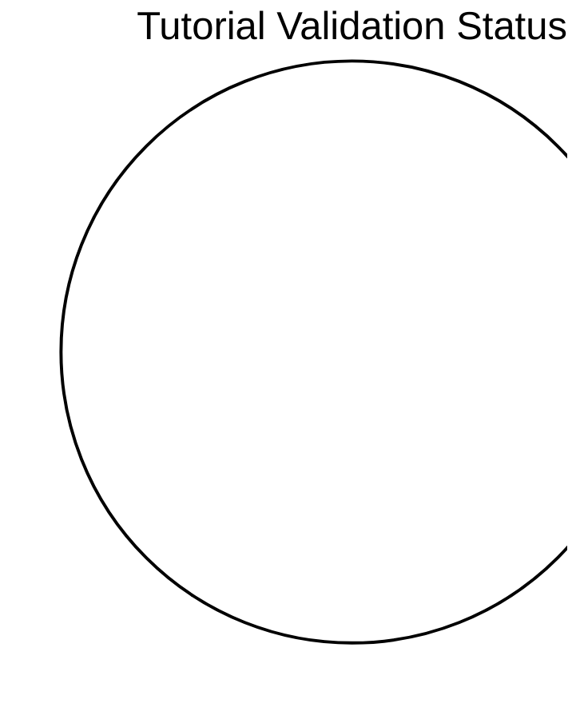

# Tutorial Validation Status

This page tracks which tutorials have been validated against real Azure deployments. Each tutorial can be tested via **az-cli** (manual CLI commands) or **Bicep** (infrastructure as code). Tutorials not tested within 90 days are marked as stale.

## Summary

*Generated: 2026-04-26*

| Metric | Count |
|---|---:|
| Total tutorials | 0 |
| ✅ Validated | 0 |
| ⚠️ Stale (>90 days) | 0 |
| ❌ Failed | 0 |
| ➖ Not tested | 0 |

<!-- diagram-id: tutorial-validation-status-pie -->


## Validation Matrix

## How to Update

To mark a tutorial as validated, add a `validation` block to its YAML frontmatter:

```yaml
---
hide:
  - toc
validation:
  az_cli:
    last_tested: 2026-04-09
    cli_version: "2.83.0"
    result: pass
  bicep:
    last_tested: null
    result: not_tested
---
```

Then regenerate this page:

```bash
python3 scripts/generate_validation_status.py
```

!!! info "Validation fields"
    - `result`: `pass`, `fail`, or `not_tested`
    - `last_tested`: ISO date (YYYY-MM-DD) or `null`
    - `cli_version`: Azure CLI version used
    - Tutorials older than 90 days are flagged as **stale**

## See Also

- [Language Guides](../language-guides/index.md)
- [CLI Reference](cli-reference.md)
- [Environment Variables](environment-variables.md)
- [Platform Limits](platform-limits.md)

