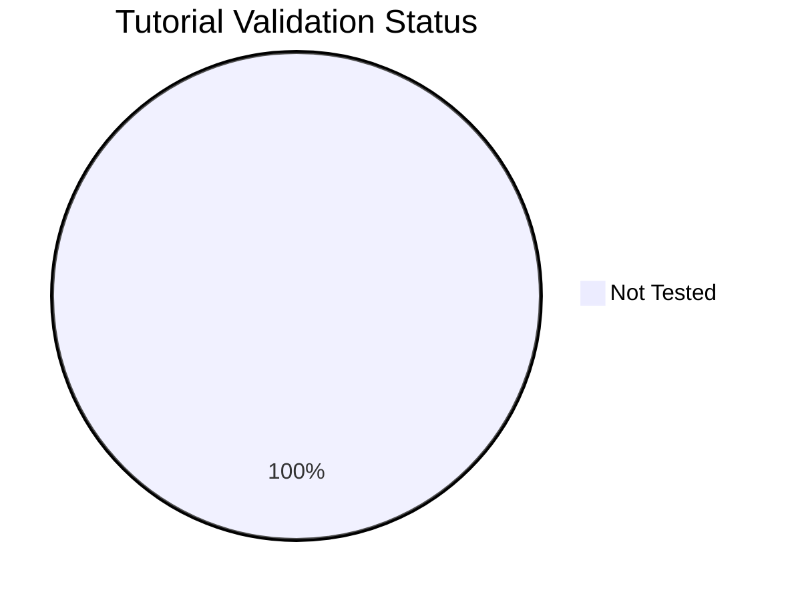

---
content_sources:
  diagrams:
    - id: generated-2026-04-09
      type: pie
      source: self-generated
      justification: "Repository validation dashboard derived from local tutorial verification metadata; Microsoft Learn links identify the Azure Container Apps tutorials being tracked."
      based_on:
        - https://learn.microsoft.com/en-us/azure/container-apps/overview
        - https://learn.microsoft.com/en-us/azure/container-apps/get-started
content_validation:
  status: verified
  last_reviewed: "2026-04-12"
  reviewer: ai-agent
  core_claims:
    - claim: "Azure Container Apps provides tutorial documentation for deploying containerized applications."
      source: "https://learn.microsoft.com/azure/container-apps/get-started"
      verified: true
    - claim: "Tutorial validation tracks deployment testing against real Azure environments."
      source: "https://learn.microsoft.com/azure/container-apps/overview"
      verified: true
---

# Tutorial Validation Status

This page tracks which tutorials have been validated against real Azure deployments. Each tutorial can be tested via **az-cli** (manual CLI commands) or **Bicep** (infrastructure as code). Tutorials not tested within 90 days are marked as stale.

## Summary

*Generated: 2026-04-09*

| Metric | Count |
|---|---:|
| Total tutorials | 28 |
| ✅ Validated | 0 |
| ⚠️ Stale (>90 days) | 0 |
| ❌ Failed | 0 |
| ➖ Not tested | 28 |

<!-- diagram-id: generated-2026-04-09 -->


## Validation Matrix

### .NET

| Tutorial | az-cli | Bicep | Last Tested | Status |
|---|---|---|---|---|
| [01 Local Development](../language-guides/dotnet/tutorial/01-local-development.md) | ➖ No Data | ➖ No Data | — | ➖ Not Tested |
| [02 First Deploy](../language-guides/dotnet/tutorial/02-first-deploy.md) | ➖ No Data | ➖ No Data | — | ➖ Not Tested |
| [03 Configuration](../language-guides/dotnet/tutorial/03-configuration.md) | ➖ No Data | ➖ No Data | — | ➖ Not Tested |
| [04 Logging Monitoring](../language-guides/dotnet/tutorial/04-logging-monitoring.md) | ➖ No Data | ➖ No Data | — | ➖ Not Tested |
| [05 Infrastructure As Code](../language-guides/dotnet/tutorial/05-infrastructure-as-code.md) | ➖ No Data | ➖ No Data | — | ➖ Not Tested |
| [06 Ci Cd](../language-guides/dotnet/tutorial/06-ci-cd.md) | ➖ No Data | ➖ No Data | — | ➖ Not Tested |
| [07 Revisions Traffic](../language-guides/dotnet/tutorial/07-revisions-traffic.md) | ➖ No Data | ➖ No Data | — | ➖ Not Tested |

### Java

| Tutorial | az-cli | Bicep | Last Tested | Status |
|---|---|---|---|---|
| [01 Local Development](../language-guides/java/tutorial/01-local-development.md) | ➖ No Data | ➖ No Data | — | ➖ Not Tested |
| [02 First Deploy](../language-guides/java/tutorial/02-first-deploy.md) | ➖ No Data | ➖ No Data | — | ➖ Not Tested |
| [03 Configuration](../language-guides/java/tutorial/03-configuration.md) | ➖ No Data | ➖ No Data | — | ➖ Not Tested |
| [04 Logging Monitoring](../language-guides/java/tutorial/04-logging-monitoring.md) | ➖ No Data | ➖ No Data | — | ➖ Not Tested |
| [05 Infrastructure As Code](../language-guides/java/tutorial/05-infrastructure-as-code.md) | ➖ No Data | ➖ No Data | — | ➖ Not Tested |
| [06 Ci Cd](../language-guides/java/tutorial/06-ci-cd.md) | ➖ No Data | ➖ No Data | — | ➖ Not Tested |
| [07 Revisions Traffic](../language-guides/java/tutorial/07-revisions-traffic.md) | ➖ No Data | ➖ No Data | — | ➖ Not Tested |

### Node.js

| Tutorial | az-cli | Bicep | Last Tested | Status |
|---|---|---|---|---|
| [01 Local Development](../language-guides/nodejs/tutorial/01-local-development.md) | ➖ No Data | ➖ No Data | — | ➖ Not Tested |
| [02 First Deploy](../language-guides/nodejs/tutorial/02-first-deploy.md) | ➖ No Data | ➖ No Data | — | ➖ Not Tested |
| [03 Configuration](../language-guides/nodejs/tutorial/03-configuration.md) | ➖ No Data | ➖ No Data | — | ➖ Not Tested |
| [04 Logging Monitoring](../language-guides/nodejs/tutorial/04-logging-monitoring.md) | ➖ No Data | ➖ No Data | — | ➖ Not Tested |
| [05 Infrastructure As Code](../language-guides/nodejs/tutorial/05-infrastructure-as-code.md) | ➖ No Data | ➖ No Data | — | ➖ Not Tested |
| [06 Ci Cd](../language-guides/nodejs/tutorial/06-ci-cd.md) | ➖ No Data | ➖ No Data | — | ➖ Not Tested |
| [07 Revisions Traffic](../language-guides/nodejs/tutorial/07-revisions-traffic.md) | ➖ No Data | ➖ No Data | — | ➖ Not Tested |

### Python

| Tutorial | az-cli | Bicep | Last Tested | Status |
|---|---|---|---|---|
| [01 Local Development](../language-guides/python/tutorial/01-local-development.md) | ➖ No Data | ➖ No Data | — | ➖ Not Tested |
| [02 First Deploy](../language-guides/python/tutorial/02-first-deploy.md) | ➖ No Data | ➖ No Data | — | ➖ Not Tested |
| [03 Configuration](../language-guides/python/tutorial/03-configuration.md) | ➖ No Data | ➖ No Data | — | ➖ Not Tested |
| [04 Logging Monitoring](../language-guides/python/tutorial/04-logging-monitoring.md) | ➖ No Data | ➖ No Data | — | ➖ Not Tested |
| [05 Infrastructure As Code](../language-guides/python/tutorial/05-infrastructure-as-code.md) | ➖ No Data | ➖ No Data | — | ➖ Not Tested |
| [06 Ci Cd](../language-guides/python/tutorial/06-ci-cd.md) | ➖ No Data | ➖ No Data | — | ➖ Not Tested |
| [07 Revisions Traffic](../language-guides/python/tutorial/07-revisions-traffic.md) | ➖ No Data | ➖ No Data | — | ➖ Not Tested |

## How to Update

To mark a tutorial as validated, add a `validation` block to its YAML frontmatter:

```yaml
---
hide:
  - toc
validation:
  az_cli:
    last_tested: 2026-04-09
    cli_version: "2.83.0"
    result: pass
  bicep:
    last_tested: null
    result: not_tested
---
```

Then regenerate this page:

```bash
python3 scripts/generate_validation_status.py
```

!!! info "Validation fields"
    - `result`: `pass`, `fail`, or `not_tested`
    - `last_tested`: ISO date (YYYY-MM-DD) or `null`
    - `cli_version`: Azure CLI version used
    - Tutorials older than 90 days are flagged as **stale**

## See Also

- [Language Guides](../language-guides/index.md)
- [CLI Reference](cli-reference.md)
- [Environment Variables](environment-variables.md)
- [Platform Limits](platform-limits.md)
