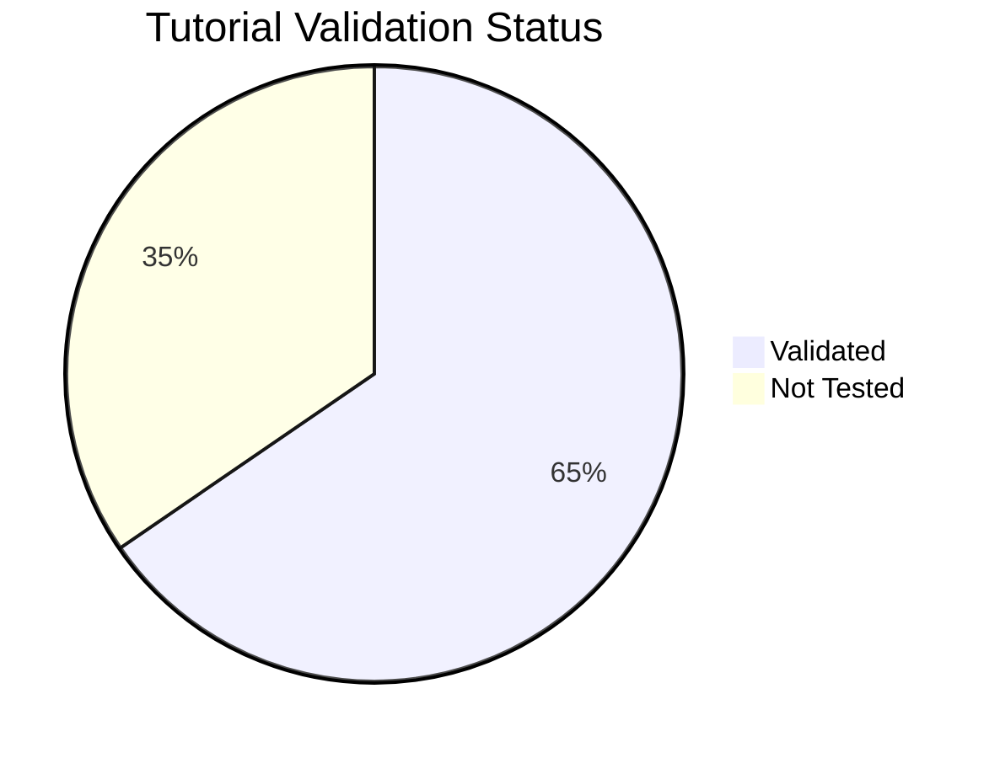

---
content_sources:
  diagrams:
    - id: tutorial-validation-status-pie
      type: pie
      source: self-generated
      justification: Auto-generated from tutorial and lab validation frontmatter in this repository.
content_validation:
  status: verified
  last_reviewed: "2026-06-21"
  reviewer: ai-agent
  core_claims:
    - claim: "The dashboard is generated from validation frontmatter in repository Markdown files."
      source: scripts/generate_validation_status.py
      verified: true
---

# Tutorial Validation Status

This page tracks which tutorials have been validated against real Azure deployments. It scans language tutorial pages and troubleshooting lab guides. Each page can be tested via **az-cli** (manual CLI commands) or **Bicep** (infrastructure as code). Tutorials not tested within 90 days are marked as stale.

## Summary

*Generated: 2026-06-21*

| Metric | Count |
|---|---:|
| Total tutorials | 81 |
| ✅ Validated | 53 |
| ⚠️ Stale (>90 days) | 0 |
| ❌ Failed | 0 |
| ➖ Not tested | 28 |

<!-- diagram-id: tutorial-validation-status-pie -->


## Validation Matrix

### .NET

| Page | az-cli | Bicep | Last Tested | Status |
|---|---|---|---|---|
| [01 Local Development](../language-guides/dotnet/tutorial/01-local-development.md) | ➖ Not Tested | ➖ Not Tested | — | ➖ Not Tested |
| [02 First Deploy](../language-guides/dotnet/tutorial/02-first-deploy.md) | ➖ Not Tested | ➖ Not Tested | — | ➖ Not Tested |
| [03 Configuration](../language-guides/dotnet/tutorial/03-configuration.md) | ➖ Not Tested | ➖ Not Tested | — | ➖ Not Tested |
| [04 Logging Monitoring](../language-guides/dotnet/tutorial/04-logging-monitoring.md) | ➖ Not Tested | ➖ Not Tested | — | ➖ Not Tested |
| [05 Infrastructure As Code](../language-guides/dotnet/tutorial/05-infrastructure-as-code.md) | ➖ Not Tested | ➖ Not Tested | — | ➖ Not Tested |
| [06 Ci Cd](../language-guides/dotnet/tutorial/06-ci-cd.md) | ➖ Not Tested | ➖ Not Tested | — | ➖ Not Tested |
| [07 Revisions Traffic](../language-guides/dotnet/tutorial/07-revisions-traffic.md) | ➖ Not Tested | ➖ Not Tested | — | ➖ Not Tested |

### Java

| Page | az-cli | Bicep | Last Tested | Status |
|---|---|---|---|---|
| [01 Local Development](../language-guides/java/tutorial/01-local-development.md) | ➖ Not Tested | ➖ Not Tested | — | ➖ Not Tested |
| [02 First Deploy](../language-guides/java/tutorial/02-first-deploy.md) | ➖ Not Tested | ➖ Not Tested | — | ➖ Not Tested |
| [03 Configuration](../language-guides/java/tutorial/03-configuration.md) | ➖ Not Tested | ➖ Not Tested | — | ➖ Not Tested |
| [04 Logging Monitoring](../language-guides/java/tutorial/04-logging-monitoring.md) | ➖ Not Tested | ➖ Not Tested | — | ➖ Not Tested |
| [05 Infrastructure As Code](../language-guides/java/tutorial/05-infrastructure-as-code.md) | ➖ Not Tested | ➖ Not Tested | — | ➖ Not Tested |
| [06 Ci Cd](../language-guides/java/tutorial/06-ci-cd.md) | ➖ Not Tested | ➖ Not Tested | — | ➖ Not Tested |
| [07 Revisions Traffic](../language-guides/java/tutorial/07-revisions-traffic.md) | ➖ Not Tested | ➖ Not Tested | — | ➖ Not Tested |

### Node.js

| Page | az-cli | Bicep | Last Tested | Status |
|---|---|---|---|---|
| [01 Local Development](../language-guides/nodejs/tutorial/01-local-development.md) | ➖ Not Tested | ➖ Not Tested | — | ➖ Not Tested |
| [02 First Deploy](../language-guides/nodejs/tutorial/02-first-deploy.md) | ➖ Not Tested | ➖ Not Tested | — | ➖ Not Tested |
| [03 Configuration](../language-guides/nodejs/tutorial/03-configuration.md) | ➖ Not Tested | ➖ Not Tested | — | ➖ Not Tested |
| [04 Logging Monitoring](../language-guides/nodejs/tutorial/04-logging-monitoring.md) | ➖ Not Tested | ➖ Not Tested | — | ➖ Not Tested |
| [05 Infrastructure As Code](../language-guides/nodejs/tutorial/05-infrastructure-as-code.md) | ➖ Not Tested | ➖ Not Tested | — | ➖ Not Tested |
| [06 Ci Cd](../language-guides/nodejs/tutorial/06-ci-cd.md) | ➖ Not Tested | ➖ Not Tested | — | ➖ Not Tested |
| [07 Revisions Traffic](../language-guides/nodejs/tutorial/07-revisions-traffic.md) | ➖ Not Tested | ➖ Not Tested | — | ➖ Not Tested |

### Python

| Page | az-cli | Bicep | Last Tested | Status |
|---|---|---|---|---|
| [01 Local Development](../language-guides/python/tutorial/01-local-development.md) | ➖ Not Tested | ➖ Not Tested | — | ➖ Not Tested |
| [02 First Deploy](../language-guides/python/tutorial/02-first-deploy.md) | ➖ Not Tested | ➖ Not Tested | — | ➖ Not Tested |
| [03 Configuration](../language-guides/python/tutorial/03-configuration.md) | ➖ Not Tested | ➖ Not Tested | — | ➖ Not Tested |
| [04 Logging Monitoring](../language-guides/python/tutorial/04-logging-monitoring.md) | ➖ Not Tested | ➖ Not Tested | — | ➖ Not Tested |
| [05 Infrastructure As Code](../language-guides/python/tutorial/05-infrastructure-as-code.md) | ➖ Not Tested | ➖ Not Tested | — | ➖ Not Tested |
| [06 Ci Cd](../language-guides/python/tutorial/06-ci-cd.md) | ➖ Not Tested | ➖ Not Tested | — | ➖ Not Tested |
| [07 Revisions Traffic](../language-guides/python/tutorial/07-revisions-traffic.md) | ➖ Not Tested | ➖ Not Tested | — | ➖ Not Tested |

### Troubleshooting Labs

| Page | az-cli | Bicep | Last Tested | Status |
|---|---|---|---|---|
| [Acr Network Path Dns Forwarder Bypass](../troubleshooting/lab-guides/acr-network-path-dns-forwarder-bypass.md) | ✅ Pass | ✅ Pass | 2026-06-05 | ✅ Pass |
| [Acr Network Path Firewall Allowlist](../troubleshooting/lab-guides/acr-network-path-firewall-allowlist.md) | ✅ Pass | ✅ Pass | 2026-06-06 | ✅ Pass |
| [Acr Network Path Pe Direct](../troubleshooting/lab-guides/acr-network-path-pe-direct.md) | ✅ Pass | ✅ Pass | 2026-06-05 | ✅ Pass |
| [Acr Network Path Pe Forced Inspection](../troubleshooting/lab-guides/acr-network-path-pe-forced-inspection.md) | ✅ Pass | ✅ Pass | 2026-06-06 | ✅ Pass |
| [Acr Network Path Record Split Brain](../troubleshooting/lab-guides/acr-network-path-record-split-brain.md) | ✅ Pass | ✅ Pass | 2026-06-06 | ✅ Pass |
| [Acr Pull Failure](../troubleshooting/lab-guides/acr-pull-failure.md) | ✅ Pass | ✅ Pass | 2026-05-01 | ✅ Pass |
| [Appinsights Connection String Missing](../troubleshooting/lab-guides/appinsights-connection-string-missing.md) | ✅ Pass | ➖ Not Tested | 2026-04-29 | ✅ Pass |
| [Azure Files Mount Failure](../troubleshooting/lab-guides/azure-files-mount-failure.md) | ✅ Pass | ➖ Not Tested | 2026-05-01 | ✅ Pass |
| [Bicep Deployment Timeout](../troubleshooting/lab-guides/bicep-deployment-timeout.md) | ✅ Pass | ➖ Not Tested | 2026-05-01 | ✅ Pass |
| [Cd Reconnect Rbac Conflict](../troubleshooting/lab-guides/cd-reconnect-rbac-conflict.md) | ✅ Pass | ✅ Pass | 2026-04-21 | ✅ Pass |
| [Cold Start Scale To Zero](../troubleshooting/lab-guides/cold-start-scale-to-zero.md) | ✅ Pass | ✅ Pass | 2026-05-01 | ✅ Pass |
| [Cpu Throttling](../troubleshooting/lab-guides/cpu-throttling.md) | ✅ Pass | ➖ Not Tested | 2026-04-29 | ✅ Pass |
| [Custom Domain Tls Renewal](../troubleshooting/lab-guides/custom-domain-tls-renewal.md) | ✅ Pass | ➖ Not Tested | 2026-04-29 | ✅ Pass |
| [Dapr Integration](../troubleshooting/lab-guides/dapr-integration.md) | ✅ Pass | ✅ Pass | 2026-06-03 | ✅ Pass |
| [Dapr Pubsub Failure](../troubleshooting/lab-guides/dapr-pubsub-failure.md) | ✅ Pass | ➖ Not Tested | 2026-04-29 | ✅ Pass |
| [Dapr State Store Failure](../troubleshooting/lab-guides/dapr-state-store-failure.md) | ✅ Pass | ➖ Not Tested | 2026-04-29 | ✅ Pass |
| [Diagnostic Settings Missing](../troubleshooting/lab-guides/diagnostic-settings-missing.md) | ✅ Pass | ➖ Not Tested | 2026-05-01 | ✅ Pass |
| [Docker Hub Rate Limit](../troubleshooting/lab-guides/docker-hub-rate-limit.md) | ✅ Pass | ➖ Not Tested | 2026-05-01 | ✅ Pass |
| [Easyauth Entra Id Failure](../troubleshooting/lab-guides/easyauth-entra-id-failure.md) | ✅ Pass | ➖ Not Tested | 2026-04-29 | ✅ Pass |
| [Egress Ip Change](../troubleshooting/lab-guides/egress-ip-change.md) | ✅ Pass | ➖ Not Tested | 2026-04-29 | ✅ Pass |
| [Emptydir Disk Full](../troubleshooting/lab-guides/emptydir-disk-full.md) | ✅ Pass | ➖ Not Tested | 2026-05-01 | ✅ Pass |
| [Event Job Storm](../troubleshooting/lab-guides/event-job-storm.md) | ✅ Pass | ➖ Not Tested | 2026-05-01 | ✅ Pass |
| [Github Actions Oidc Failure](../troubleshooting/lab-guides/github-actions-oidc-failure.md) | ✅ Pass | ➖ Not Tested | 2026-05-01 | ✅ Pass |
| [Image Size Startup Delay](../troubleshooting/lab-guides/image-size-startup-delay.md) | ✅ Pass | ➖ Not Tested | 2026-04-29 | ✅ Pass |
| [Ingress Target Port Mismatch](../troubleshooting/lab-guides/ingress-target-port-mismatch.md) | ✅ Pass | ✅ Pass | 2026-04-29 | ✅ Pass |
| [Keda No Metrics Returned](../troubleshooting/lab-guides/keda-no-metrics-returned.md) | ✅ Pass | ✅ Pass | 2026-06-20 | ✅ Pass |
| [Log Analytics Ingestion Gap](../troubleshooting/lab-guides/log-analytics-ingestion-gap.md) | ✅ Pass | ➖ Not Tested | 2026-05-01 | ✅ Pass |
| [Managed Identity Key Vault Failure](../troubleshooting/lab-guides/managed-identity-key-vault-failure.md) | ✅ Pass | ✅ Pass | 2026-06-03 | ✅ Pass |
| [Memory Leak Oomkilled](../troubleshooting/lab-guides/memory-leak-oomkilled.md) | ✅ Pass | ✅ Pass | 2026-06-20 | ✅ Pass |
| [Memory Percentage Vs Keda Utilization](../troubleshooting/lab-guides/memory-percentage-vs-keda-utilization.md) | ✅ Pass | ✅ Pass | 2026-06-02 | ✅ Pass |
| [Min Replicas Cost Surprise](../troubleshooting/lab-guides/min-replicas-cost-surprise.md) | ✅ Pass | ➖ Not Tested | 2026-05-01 | ✅ Pass |
| [Multi Arch Image Mismatch](../troubleshooting/lab-guides/multi-arch-image-mismatch.md) | ✅ Pass | ➖ Not Tested | 2026-04-29 | ✅ Pass |
| [Multi Region Failover](../troubleshooting/lab-guides/multi-region-failover.md) | ✅ Pass | ➖ Not Tested | 2026-04-29 | ✅ Pass |
| [Observability Tracing](../troubleshooting/lab-guides/observability-tracing.md) | ✅ Pass | ✅ Pass | 2026-06-03 | ✅ Pass |
| [Private Endpoint Dns Failure](../troubleshooting/lab-guides/private-endpoint-dns-failure.md) | ✅ Pass | ➖ Not Tested | 2026-04-29 | ✅ Pass |
| [Probe And Port Mismatch](../troubleshooting/lab-guides/probe-and-port-mismatch.md) | ✅ Pass | ✅ Pass | 2026-06-03 | ✅ Pass |
| [Replica Load Imbalance](../troubleshooting/lab-guides/replica-load-imbalance.md) | ✅ Pass | ➖ Not Tested | 2026-04-29 | ✅ Pass |
| [Replica Node Spread](../troubleshooting/lab-guides/replica-node-spread.md) | ✅ Pass | ✅ Pass | 2026-06-14 | ✅ Pass |
| [Revision Failover](../troubleshooting/lab-guides/revision-failover.md) | ✅ Pass | ✅ Pass | 2026-06-03 | ✅ Pass |
| [Revision History Limit](../troubleshooting/lab-guides/revision-history-limit.md) | ✅ Pass | ➖ Not Tested | 2026-05-01 | ✅ Pass |
| [Revision Provisioning Failure](../troubleshooting/lab-guides/revision-provisioning-failure.md) | ✅ Pass | ✅ Pass | 2026-06-20 | ✅ Pass |
| [Scale Rule Mismatch](../troubleshooting/lab-guides/scale-rule-mismatch.md) | ✅ Pass | ✅ Pass | 2026-05-01 | ✅ Pass |
| [Scheduled Job Missed](../troubleshooting/lab-guides/scheduled-job-missed.md) | ✅ Pass | ➖ Not Tested | 2026-04-29 | ✅ Pass |
| [Session Affinity Failure](../troubleshooting/lab-guides/session-affinity-failure.md) | ✅ Pass | ➖ Not Tested | 2026-05-01 | ✅ Pass |
| [Startup Degraded Transient Failure](../troubleshooting/lab-guides/startup-degraded-transient-failure.md) | ✅ Pass | ✅ Pass | 2026-06-13 | ✅ Pass |
| [Subnet Cidr Exhaustion](../troubleshooting/lab-guides/subnet-cidr-exhaustion.md) | ✅ Pass | ➖ Not Tested | 2026-05-01 | ✅ Pass |
| [Subscription Quota Exceeded](../troubleshooting/lab-guides/subscription-quota-exceeded.md) | ✅ Pass | ➖ Not Tested | 2026-04-29 | ✅ Pass |
| [Traffic Routing Canary](../troubleshooting/lab-guides/traffic-routing-canary.md) | ✅ Pass | ✅ Pass | 2026-06-03 | ✅ Pass |
| [Udr Nsg Egress Blocked](../troubleshooting/lab-guides/udr-nsg-egress-blocked.md) | ✅ Pass | ➖ Not Tested | 2026-05-01 | ✅ Pass |
| [Volume Permission Denied](../troubleshooting/lab-guides/volume-permission-denied.md) | ✅ Pass | ➖ Not Tested | 2026-05-01 | ✅ Pass |
| [Websocket Grpc Ingress](../troubleshooting/lab-guides/websocket-grpc-ingress.md) | ✅ Pass | ➖ Not Tested | 2026-04-29 | ✅ Pass |
| [Workload Profile Mismatch](../troubleshooting/lab-guides/workload-profile-mismatch.md) | ✅ Pass | ➖ Not Tested | 2026-05-01 | ✅ Pass |
| [Zone Redundancy Best Effort](../troubleshooting/lab-guides/zone-redundancy-best-effort.md) | ✅ Pass | ✅ Pass | 2026-06-14 | ✅ Pass |

## How to Update

To mark a tutorial as validated, add a `validation` block to its YAML frontmatter:

```yaml
---
hide:
  - toc
validation:
  az_cli:
    last_tested: 2026-04-09
    cli_version: "2.83.0"
    result: pass
  bicep:
    last_tested: null
    result: not_tested
---
```

Then regenerate this page:

```bash
python3 scripts/generate_validation_status.py
```

!!! info "Validation fields"
    - `result`: `pass`, `fail`, or `not_tested`
    - `last_tested`: ISO date (YYYY-MM-DD) or `null`
    - `cli_version`: Azure CLI version used
    - Tutorials older than 90 days are flagged as **stale**

## See Also

- [Language Guides](../language-guides/index.md)
- [CLI Reference](cli-reference.md)
- [Environment Variables](environment-variables.md)
- [Platform Limits](platform-limits.md)

