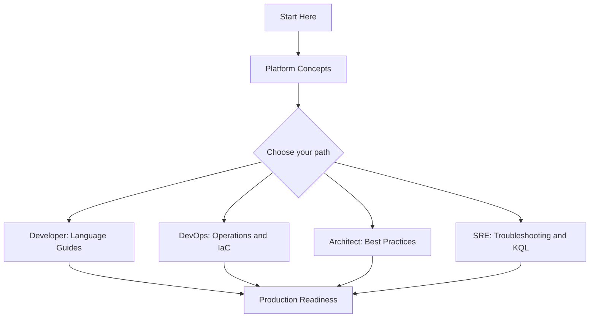

# Learning Paths

Use this page to choose a reading path based on your role and goal. Each path links to focused hubs elsewhere in this guide; use those hubs to go deep.

!!! tip "Pick one primary role first"
    If you fit multiple roles, pick the one that matches your current goal, complete that path, then read a second path opportunistically. Trying to follow every path in parallel dilutes progress.

## Choose Your Path

| Role | Goal | Start With | Then Read | Hands-on Path |
|---|---|---|---|---|
| Developer | Build and deploy a container app | [Overview](overview.md), [When to Use Container Apps](when-to-use-container-apps.md) | [Platform](../platform/index.md), [Language Guides](../language-guides/index.md) | Python / Node.js / Java / .NET tutorial |
| DevOps Engineer | Standardize deployments | [Platform: Deployment](../platform/index.md) | [Operations](../operations/index.md), CI/CD, IaC | Bicep + GitHub Actions recipes under Language Guides |
| Architect | Define platform boundaries | [Platform: Architecture](../platform/architecture/index.md), [Networking](../platform/networking/index.md), [Security](../platform/security/index.md) | [Best Practices](../best-practices/index.md) | Environment and networking design patterns |
| SRE / Operator | Reduce MTTR | [Operations: Monitoring](../operations/monitoring/index.md) | [Troubleshooting](../troubleshooting/index.md) | KQL query packs + Playbooks + Lab Guides |

## Recommended Sequence

<!-- diagram-id: aca-learning-paths-flow -->

## Tutorial Entry Points

Language-specific tutorials live under Language Guides. Pick the runtime you are building with:

| Runtime | Tutorial Index |
|---|---|
| Python | [Python Tutorial](../language-guides/python/tutorial/index.md) |
| Node.js | [Node.js Tutorial](../language-guides/nodejs/tutorial/index.md) |
| Java | [Java Tutorial](../language-guides/java/tutorial/index.md) |
| .NET | [.NET Tutorial](../language-guides/dotnet/tutorial/index.md) |

## See Also

- [Overview](overview.md)
- [When to Use Container Apps](when-to-use-container-apps.md)
- [Repository Map](repository-map.md)
- [Platform Hub](../platform/index.md)
- [Language Guides](../language-guides/index.md)
- [Operations Hub](../operations/index.md)
- [Troubleshooting Hub](../troubleshooting/index.md)

## Sources

- [Azure Container Apps overview](https://learn.microsoft.com/en-us/azure/container-apps/overview)
- [Quickstart: Deploy your first container app](https://learn.microsoft.com/en-us/azure/container-apps/get-started)
