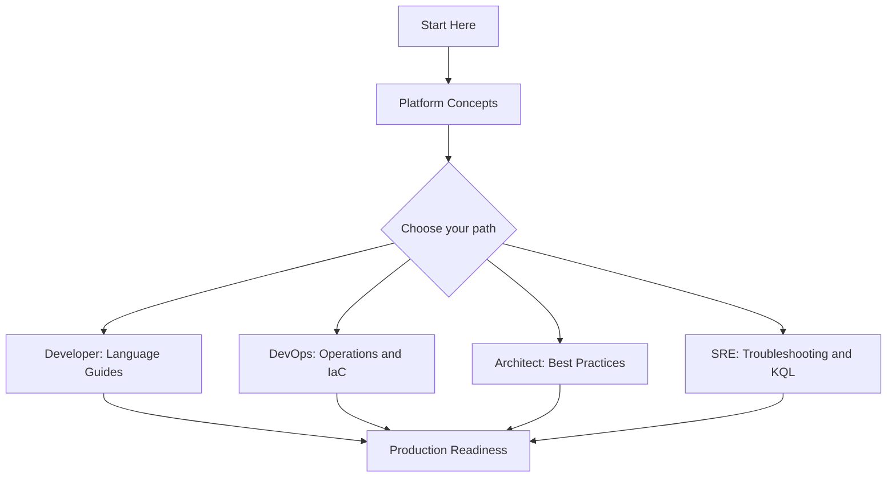
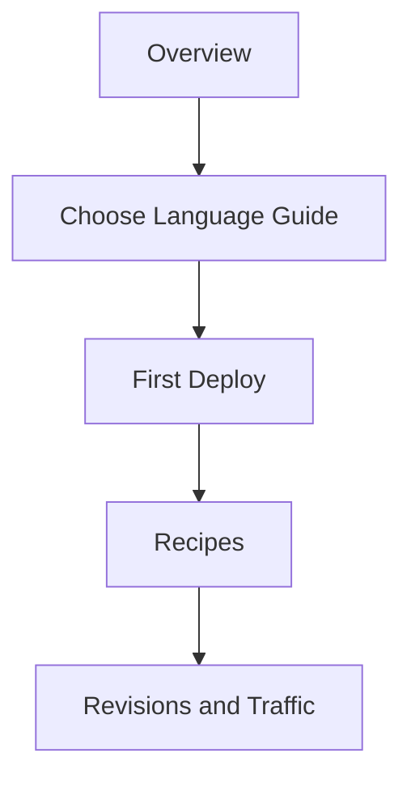
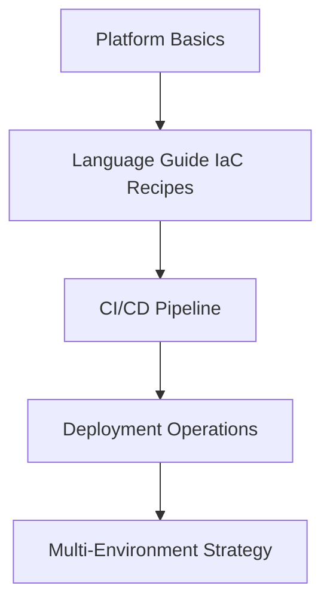
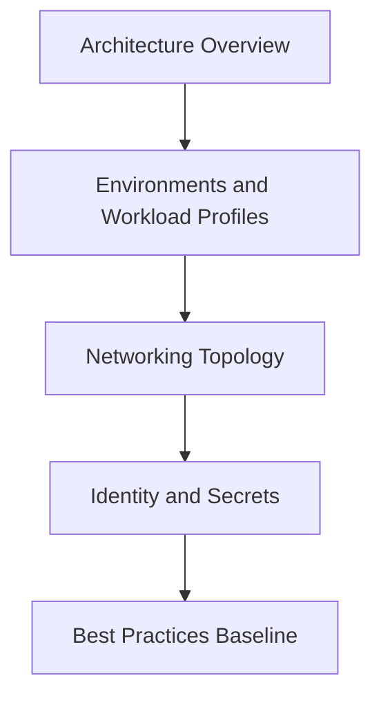
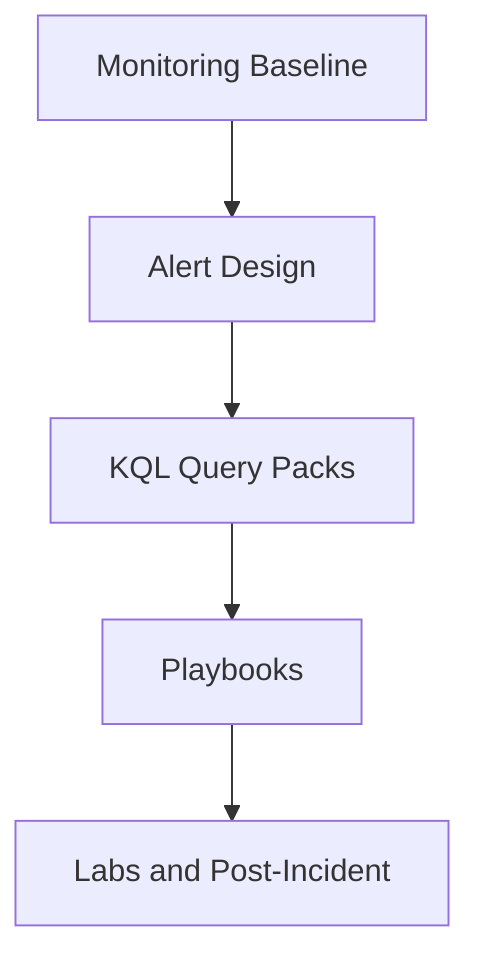

# Learning Paths

Use this page to choose a reading path based on your role and goal. Each path is numbered, so read the pages in order for the best result. Every path ends with a checklist of concrete outcomes you should be able to demonstrate.

!!! tip "Pick one primary path first"
    If you fit multiple roles, pick the one that matches your current goal, complete that path, then read a second path opportunistically. Trying to follow every path in parallel dilutes progress.

## Choose Your Path

| Role | Goal | Time Budget | Start With |
|---|---|---|---|
| **Developer** | Build and deploy a container app | 2-3 hours | [Overview](overview.md), [When to Use Container Apps](when-to-use-container-apps.md) |
| **DevOps Engineer** | Standardize deployment pipelines and IaC | 3-4 hours | [Platform Hub](../platform/index.md), [Operations Hub](../operations/index.md) |
| **Architect** | Define environment, networking, and security boundaries | 4-6 hours | [Platform: Architecture](../platform/architecture/index.md), [Networking](../platform/networking/index.md) |
| **SRE / Operator** | Reduce MTTR on incidents and stabilize scaling | 3-5 hours + on-call reference | [Operations: Monitoring](../operations/monitoring/index.md), [Troubleshooting](../troubleshooting/index.md) |

## Recommended Sequence

<!-- diagram-id: aca-learning-paths-overview -->

## Developer Path

Build and ship containerized applications on Container Apps. Focuses on runtime, code deployment, and per-language ergonomics.

**Time**: 2-3 hours

<!-- diagram-id: aca-learning-paths-developer -->

Read in order:

1. [Overview](overview.md)
2. [When to Use Container Apps](when-to-use-container-apps.md)
3. Choose one language guide:
    - [Python (Flask + Gunicorn)](../language-guides/python/tutorial/index.md)
    - [Node.js (Express)](../language-guides/nodejs/tutorial/index.md)
    - [Java (Spring Boot)](../language-guides/java/tutorial/index.md)
    - [.NET (ASP.NET Core)](../language-guides/dotnet/tutorial/index.md)
4. [Language Guides Hub](../language-guides/index.md) — recipes for CI/CD, IaC, and ingress
5. [Platform Hub](../platform/index.md) — focus on revisions and traffic splitting

### Outcomes

- You can deploy a containerized web app to a Container Apps environment.
- You can push new revisions and split traffic between them.
- You can read platform logs for your app in Log Analytics.
- You know where language-specific recipes (CI/CD, IaC, ingress) live.

### Microsoft Learn anchors

- [Deploy your first container app](https://learn.microsoft.com/en-us/azure/container-apps/get-started)
- [Container Apps overview](https://learn.microsoft.com/en-us/azure/container-apps/overview)
- [Revisions in Azure Container Apps](https://learn.microsoft.com/en-us/azure/container-apps/revisions)

## DevOps Engineer Path

Standardize how teams deploy to Container Apps: IaC, CI/CD pipelines, environments, and rollout patterns.

**Time**: 3-4 hours

<!-- diagram-id: aca-learning-paths-devops -->

Read in order:

1. [Platform Hub](../platform/index.md) — focus on environments and deployment concepts
2. [Language Guides Hub](../language-guides/index.md) — Bicep and GitHub Actions recipes for your language
3. [Operations Hub](../operations/index.md) — deployment operations, secret rotation, recovery
4. [Best Practices Hub](../best-practices/index.md) — revision strategy, blue/green patterns
5. [Reference Hub](../reference/index.md) — CLI reference for automation

### Outcomes

- You can provision a Container Apps environment with Bicep.
- You can wire a GitHub Actions or Azure Pipelines workflow to build, push, and deploy.
- You can execute a blue/green or canary rollout with traffic splitting.
- You can promote a revision from staging to production with rollback ready.

### Microsoft Learn anchors

- [Deploy with GitHub Actions](https://learn.microsoft.com/en-us/azure/container-apps/github-actions)
- [Deploy with Azure Pipelines](https://learn.microsoft.com/en-us/azure/container-apps/azure-pipelines)
- [Blue/green deployment](https://learn.microsoft.com/en-us/azure/container-apps/blue-green-deployment)

## Architect Path

Define platform boundaries, networking topology, identity model, and security posture before code ships.

**Time**: 4-6 hours

<!-- diagram-id: aca-learning-paths-architect -->

Read in order:

1. [Platform: Architecture](../platform/architecture/index.md)
2. [Platform: Networking](../platform/networking/index.md) — VNet integration, private endpoints, egress
3. [Platform: Security](../platform/security/index.md) — managed identity, secrets, RBAC
4. [Best Practices Hub](../best-practices/index.md) — production baseline patterns
5. [Reference Hub](../reference/index.md) — platform limits and quotas

### Outcomes

- You can decide between Consumption and Dedicated workload profiles for a workload.
- You can design VNet integration and DNS for private ingress and egress.
- You can define an identity model using managed identities and RBAC.
- You can document platform limits that constrain your workload design.

### Microsoft Learn anchors

- [Azure Container Apps environments](https://learn.microsoft.com/en-us/azure/container-apps/environment)
- [Networking overview](https://learn.microsoft.com/en-us/azure/container-apps/networking)
- [Managed identities in Container Apps](https://learn.microsoft.com/en-us/azure/container-apps/managed-identity)

## SRE / Operator Path

Instrument, alert, and diagnose incidents on Container Apps. Focuses on observability, alert design, and structured troubleshooting.

**Time**: 3-5 hours + on-call reference

<!-- diagram-id: aca-learning-paths-sre -->

Read in order:

1. [Operations: Monitoring](../operations/monitoring/index.md)
2. [Operations Hub](../operations/index.md) — alerts, secret rotation, recovery
3. [Troubleshooting Hub](../troubleshooting/index.md) — decision tree, first 10 minutes
4. [KQL Query Packs](../troubleshooting/kql/index.md)
5. [Troubleshooting Playbooks](../troubleshooting/playbooks/index.md) and [Lab Guides](../troubleshooting/lab-guides/index.md)

### Outcomes

- You can build a baseline monitoring workbook covering CPU, memory, replica count, and ingress errors.
- You can design an alert set that catches the top failure modes without page-storming.
- You can execute the First 10 Minutes runbook on a live incident.
- You can select the right playbook from a symptom description.

### Microsoft Learn anchors

- [Log monitoring in Container Apps](https://learn.microsoft.com/en-us/azure/container-apps/log-monitoring)
- [Observability in Container Apps](https://learn.microsoft.com/en-us/azure/container-apps/observability)
- [Health probes](https://learn.microsoft.com/en-us/azure/container-apps/health-probes)

## Track Selection Matrix

| Situation | Start with | Then continue to |
|---|---|---|
| New engineer onboarding | Developer Path | DevOps Engineer Path |
| Designing a new app | Architect Path | Developer Path |
| Preparing for launch | DevOps Engineer Path | SRE / Operator Path |
| Active incidents | SRE / Operator Path | Architect Path (hardening) |

## See Also

- [Overview](overview.md)
- [When to Use Container Apps](when-to-use-container-apps.md)
- [Repository Map](repository-map.md)
- [Platform Hub](../platform/index.md)
- [Language Guides](../language-guides/index.md)
- [Operations Hub](../operations/index.md)
- [Best Practices Hub](../best-practices/index.md)
- [Troubleshooting Hub](../troubleshooting/index.md)

## Sources

- [Azure Container Apps overview](https://learn.microsoft.com/en-us/azure/container-apps/overview)
- [Quickstart: Deploy your first container app](https://learn.microsoft.com/en-us/azure/container-apps/get-started)
- [Container Apps environments](https://learn.microsoft.com/en-us/azure/container-apps/environment)
- [Networking overview](https://learn.microsoft.com/en-us/azure/container-apps/networking)
- [Log monitoring in Container Apps](https://learn.microsoft.com/en-us/azure/container-apps/log-monitoring)
- [Blue/green deployment](https://learn.microsoft.com/en-us/azure/container-apps/blue-green-deployment)
